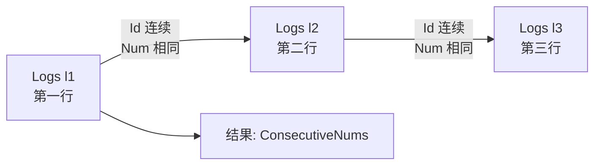
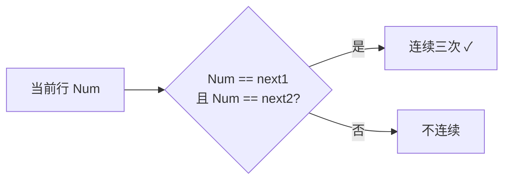

---

title: "连续出现的数字"

tags:

  - leetcode

  - sql

  - 中等

  - 自连接

  - 窗口函数

  - lead

  - lag

difficulty: 中等

created: "2026-07-21"

---

# 180. 连续出现的数字（Consecutive Numbers）

> 难度：中等 | 考点：自连接、窗口函数 LEAD/LAG

## 题目

`Logs` 表（Id, Num），找出所有至少连续出现三次的数字。

**示例**

```text

Logs 表：

| id | num |

| 1  | 1   |

| 2  | 1   |

| 3  | 1   |

| 4  | 2   |

| 5  | 1   |

| 6  | 2   |

| 7  | 2   |

输出：

| ConsecutiveNums |

| 1               |

```

---

## 思路
### 先讲个故事：排队报数

想象一群士兵排队报数。班长想知道"谁连续报了三次一样的数？"最直观的方法是：让三个人站一排（三表自连接），检查他们报的数是不是一样的。更聪明的方法是：每个人往后看两个人（LEAD 函数），如果三个人报的数一样，就记下来。

### 引导式推导：两种解法

**解法一：自连接（直观）**

把表自己连三次，分别代表"第一行"、"第二行"、"第三行"：



**解法二：窗口函数 LEAD（推荐）**

用 LEAD 函数取"下一行"和"下两行"的 Num：



### 自连接 vs LEAD

| | 自连接 | LEAD 窗口函数 |

|---|---|---|

| 时间 | O(n³) | O(n log n) |

| 依赖 Id 连续 | ✓（Id 有间隙会失效） | ✗（更健壮） |

| 推荐 | 兜底方案 | ✓ |

---

## SQL 代码
### 方法一：自连接（直观易懂）

```sql

SELECT DISTINCT l1.Num AS ConsecutiveNums

FROM Logs l1, Logs l2, Logs l3

WHERE l1.Id = l2.Id - 1

  AND l2.Id = l3.Id - 1

  AND l1.Num = l2.Num

  AND l2.Num = l3.Num;

```

### 方法二：窗口函数 LEAD（推荐）

```sql

SELECT DISTINCT Num AS ConsecutiveNums

FROM (

    SELECT

        Num,

        LEAD(Num, 1) OVER (ORDER BY Id) AS next1,

        LEAD(Num, 2) OVER (ORDER BY Id) AS next2

    FROM Logs

) t

WHERE Num = next1 AND Num = next2;

```

## 复杂度

| 方法 | 时间复杂度 | 空间复杂度 |

|------|-----------|-----------|

| 自连接（三次） | O(n³) — 笛卡尔积 | O(n²) — 中间结果 |

| LEAD 窗口函数 | O(n log n) — 排序主导 | O(n) — 子查询临时存储 |

---

## 实战考量
### 频率分析

> **出现在**：窗口函数应用题，约 25% 的同类题会考。关键在于你**LEAD/LAG 函数的理解**，以及对"连续"问题的建模能力。

### 延伸思考

**Q：自连接 vs 窗口函数哪个好？**

A：自连接更直观，但依赖 Id 连续，如果 Id 有间隙（如删过行）会失效。窗口函数不依赖 Id 连续性，更健壮，推荐。

**Q：如果 Id 不连续怎么办？**

A：用窗口函数 LEAD（见方法二），或者先用 `ROW_NUMBER() OVER (ORDER BY Id)` 生成连续行号。

**Q：如果要找连续出现 N 次？**

A：自连接需要 N 次（不优雅）。窗口函数可以扩展：`LEAD(Num, 1), LEAD(Num, 2), ..., LEAD(Num, N-1)`，然后判断所有 LEAD 值相等。

**Q：LEAD 和 LAG 的区别？**

A：LEAD 取后面的行（向前看），LAG 取前面的行（向后看）。`LEAD(col, 2)` = 取后面第 2 行的值；`LAG(col, 2)` = 取前面第 2 行的值。本题用 LEAD 和 LAG 都可以。

**Q：LEAD/LAG 的第三个参数是什么？**

A：`LEAD(Num, 1, 0)` 的第三个参数是默认值，当取不到值时（如最后一行没有下一行）返回该默认值。默认是 NULL。

### 易错点

- 忘记 DISTINCT，同一个数字被多次输出

- 自连接时 Id 条件写错（如写反方向）

- 用 `=` 连接而不是笛卡尔积 + WHERE（隐式连接）

---

## 生活类比

> **连续出现的数字 → 排队报数查重复**

>

> 班长想知道"谁连续报了三次一样的数？"最直观的方法是让三个人站一排检查。更聪明的方法是每个人往后看两个人，如果三个人报的数一样就记下来。

>

> 一句话总结：**当前行 = 下一行 = 下两行 → 连续三次相同。**

---

## 相关题目

| 题目 | 关系 |

|------|------|

| 178分数排名 | 窗口函数 DENSE_RANK |

| 184部门工资最高的员工 | 窗口函数 PARTITION BY |

---

→ 返回题单：[[LeetCode学习路线图#十六、SQL 高频]]

## 速记卡（面试闪卡）

**Q1：一句话讲清「180. 连续出现的数字（Consecutive Numbers）」到底是什么？**

A：在 Logs 表找至少连续出现三次的数字，用窗口函数 LEAD（或三次自连接），判断当前行=下一行=下两行。

**Q2：士兵报数查重复（LEAD/LAG） —— 怎么理解？**

A：类比：班长查"谁连报三次一样的数"。笨办法让三人站一排（三次自连接）比对；聪明办法每人往后看两人（LEAD 函数），三人同数就记下。就像排队点名，隔一个瞅一眼。（Look ahead）

**Q3：自连接 vs LEAD（self-join vs window） —— 怎么理解？**

A：类比：自连接：Logs 连三次，WHERE l1.Id=l2.Id-1 且 Num 相等，直观但 O(n³)。LEAD 推荐：子查询取 LEAD(Num,1)、LEAD(Num,2)，WHERE Num=next1 AND Num=next2，O(n log n) 更健壮。（Window beats join）

**Q4：复杂度与健壮性（O(n log n) vs O(n³)） —— 怎么理解？**

A：类比：自连接是笛卡尔积 O(n³)、还依赖 Id 连续（删过行就崩）；LEAD 窗口函数 O(n log n) 不依赖 Id 连续性，更稳。找连续 N 次只需多取几个 LEAD，自连接得连 N 次，丑。（Robust to gaps）

**Q5：易错与变体（DISTINCT, ROW_NUMBER） —— 怎么理解？**

A：类比：别忘了 DISTINCT，否则同数字被重复输出；Id 不连续就用 ROW_NUMBER() 先造连续行号。LEAD 第三参是取不到时的默认值（默认 NULL）。LAG 往前看、LEAD 往后看，本题都能用。（Watch defaults）

**Q6：核心速记主线有哪些？**

- 题目：找至少连续出现三次的数字

- 思路：LEAD 看后两行，三行同数即连续（window function）

- 代码：自连接直观但慢；LEAD 推荐

- 复杂度：自连接 O(n³)、LEAD O(n log n)

- 实战：记得 DISTINCT；Id 不连续用 ROW_NUMBER

**口诀**

A：连续数字藏表底，

LEAD 后看两行起；

三同记下莫重复，

窗口函数胜自比。

## 相关链接

- [[笔记/Leetcode笔记/16_SQL高频/178分数排名|分数排名]]

- [[笔记/Leetcode笔记/16_SQL高频/184部门工资最高的员工|部门工资最高的员工]]

- [[笔记/Leetcode笔记/16_SQL高频/177第N高的薪水|第N高的薪水]]

- [[笔记/Leetcode笔记/16_SQL高频/176第二高的薪水|第二高的薪水]]

- [[笔记/Leetcode笔记/16_SQL高频/175组合两个表|组合两个表]]

