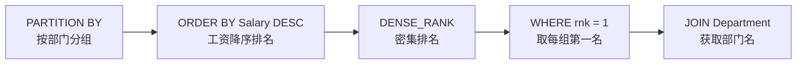
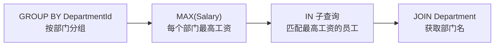

# 184. 部门工资最高的员工（Department Highest Salary）

> 难度：中等 | 考点：窗口函数 PARTITION BY、DENSE_RANK、JOIN、子查询 + 聚合

## 题目

`Employee` 表（Id, Name, Salary, DepartmentId）和 `Department` 表（Id, Name）。查询每个部门工资最高的员工。如果有并列最高，都显示。

**示例**

```text
Employee 表：
| id | name  | salary | departmentId |
| 1  | Joe   | 70000  | 1            |
| 2  | Jim   | 90000  | 1            |
| 3  | Henry | 80000  | 2            |
| 4  | Sam   | 60000  | 2            |
| 5  | Max   | 90000  | 1            |

Department 表：
| id | name  |
| 1  | IT    |
| 2  | Sales |

输出：
| Department | Employee | Salary |
| IT         | Jim      | 90000  |
| Sales      | Henry    | 80000  |
| IT         | Max      | 90000  |
```

---

## 思路

### 先讲个故事：各部门的 MVP

公司要评选每个部门的 MVP（最有价值员工）。做法是：

1. **按部门分组**（PARTITION BY）——IT 部门和 Sales 部门各自独立评选
2. **按工资排名**（ORDER BY Salary DESC）——工资最高的排第 1
3. **取第 1 名**（WHERE rnk = 1）——只保留每个部门的第一名

如果有两个人并列最高（比如 Jim 和 Max 都是 90000），两人都要显示——这就是 DENSE_RANK 的作用。

### 引导式推导：两种解法

**解法一：窗口函数 DENSE_RANK + PARTITION BY（推荐）**



**解法二：子查询 + 聚合（不用窗口函数）**



### PARTITION BY vs GROUP BY

| | PARTITION BY | GROUP BY |
|---|---|---|
| 作用 | 窗口函数分区，不压缩行数 | 聚合，压缩行数 |
| 结果行数 | 与原表相同 | 分组数（通常更少） |
| 使用场景 | 排名、累计、移动平均等 | 求和、计数、最大值等聚合 |

---

## SQL 代码

### 方法一：窗口函数 DENSE_RANK + PARTITION BY（推荐）

```sql
SELECT Department, Employee, Salary
FROM (
    SELECT
        d.Name AS Department,
        e.Name AS Employee,
        e.Salary,
        DENSE_RANK() OVER (
            PARTITION BY e.DepartmentId
            ORDER BY e.Salary DESC
        ) AS rnk
    FROM Employee e
    JOIN Department d
        ON e.DepartmentId = d.Id
) t
WHERE rnk = 1;
```

### 方法二：子查询 + 聚合（不用窗口函数）

```sql
SELECT
    d.Name AS Department,
    e.Name AS Employee,
    e.Salary
FROM Employee e
JOIN Department d
    ON e.DepartmentId = d.Id
WHERE (e.DepartmentId, e.Salary) IN (
    SELECT DepartmentId, MAX(Salary)
    FROM Employee
    GROUP BY DepartmentId
)
ORDER BY d.Name;
```

## 复杂度

| 方法 | 时间复杂度 | 空间复杂度 |
|------|-----------|-----------|
| DENSE_RANK + PARTITION BY | O(n log n) — 窗口函数内部排序 | O(n) — 临时存储排名结果 |
| 子查询 + MAX + IN | O(n) — GROUP BY 聚合 + IN 匹配 | O(k) — k 为部门数 |

> 子查询+聚合版时间复杂度更优（O(n) vs O(n log n)），但窗口函数版可读性更好、扩展性更强（如改查前三高只需改 `rnk <= 3`）。

---

## 实战考量

### 频率分析

> **出现在**：SQL 高频经典题，约 45% 的同类题会考。关键在于你**PARTITION BY 的理解**，以及能不能同时写窗口函数版和子查询版。

### 延伸思考

**Q：为什么用 DENSE_RANK 而不是 RANK？**
A：对于"取第一名"这个场景，DENSE_RANK 和 RANK 结果一样（并列第一都是 rnk=1）。但 DENSE_RANK 语义更清晰：排名连续不跳号。

**Q：为什么用 PARTITION BY？**
A：PARTITION BY 将数据按部门分成独立的分区，每个分区内独立排名。不用 PARTITION BY，DENSE_RANK 会全局排名，只有全公司第一名会被选出来。

**Q：如果不用窗口函数怎么做？**
A：用子查询 + 聚合（见方法二）。核心是先 GROUP BY 找出每个部门的最高工资，再用 IN 匹配。

**Q：如果有员工不属于任何部门（DepartmentId 为 NULL）？**
A：用 INNER JOIN 会被过滤掉。如果需要保留，改用 LEFT JOIN，但 NULL 部门的"最高工资"需要额外处理。

**Q：如果要查每个部门工资前三高的所有员工？**
A：将 `WHERE rnk = 1` 改为 `WHERE rnk <= 3`。这是 LeetCode 185 题。

### 易错点

- 忘记 PARTITION BY，变成全局排名
- 用 ROW_NUMBER 而不是 DENSE_RANK（并列最高会只取一个）
- JOIN 条件写错（如用错列名）

---

## 生活类比

> **部门最高工资 → 各部门的 MVP 评选**
>
> 按部门分组（PARTITION BY），组内按工资排名（ORDER BY DESC），取每组第一名（WHERE rnk = 1）。如果有并列最高，两人都要显示。
>
> 一句话总结：**分组 → 排名 → 取第一名。**

---

## 相关题目

| 题目 | 关系 |
|------|------|
| 178分数排名 | DENSE_RANK 基础（无 PARTITION BY） |
| 180连续出现的数字 | 窗口函数 LEAD/LAG |
| 177第N高的薪水 | 全局排名取第 N 名 |

---

→ 返回题单：[[LeetCode学习清单#十六、SQL 高频]]
