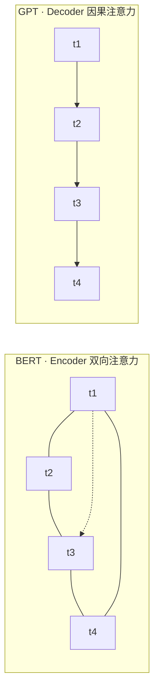

# Encoder-Only vs Decoder-Only 架构对比

> BERT 像做阅读理解——必须通读全文（左右上下文）才能填对每个空；GPT 则像写作文，只能看着已经写下的内容往下续写。一个求「懂」，一个求「写」。

## 架构类型总览

| 特性 | Encoder-Only (BERT) | Decoder-Only (GPT) | Encoder-Decoder (T5) |
| ------ | -------------------- | -------------------- | ---------------------- |
| 注意力类型 | 双向 Full Attention | 因果 Causal Attention | Encoder 双向 + Decoder 因果 |
| 掩码方式 | 只有 Padding Mask | Padding + Causal Mask | 两者都有 |
| 典型任务 | 分类、NER、匹配 | 文本生成、对话 | 翻译、摘要 Seq2Seq |
| 参数效率 | 中等 | 最高 | 需要更多参数 |
| 当前趋势 | 理解任务仍用 | **主流 LLM 均采用** | 逐渐被取代 |

## 注意力流向对比



> 实线=可关注，虚线=被掩码禁止。这正是 BERT 擅长「理解」、GPT 擅长「生成」的结构根因。

## Decoder-Only 架构详解

### 为什么 GPT 选择 Decoder-Only？

1. **简洁统一**：一个架构解决所有生成任务
2. **Scaling 友好**：decoder-only 架构在参数量增大时性能提升更稳定
3. **自回归天然适配**：语言建模本质就是预测下一个 token

### Causal Attention Mask

因果注意力掩码确保在预测第 t 个 token 时，模型只能看到前 t-1 个 token：

```text
Attention Mask 矩阵示例（4个token）：

      t1  t2  t3  t4
t1  [  1   0   0   0 ]
t2  [  1   1   0   0 ]
t3  [  1   1   1   0 ]
t4  [  1   1   1   1 ]
```

## GPT 系列演进

| 模型 | 发布时间 | 参数量 | 关键创新 |
| ------ | --------- | -------- | --------- |
| GPT-1 | 2018.6 | 117M | 首次证明生成式预训练的有效性 |
| GPT-2 | 2019.2 | 1.5B | 证明零样本学习能力 |
| GPT-3 | 2020.5 | 175B | Few-shot learning、Scaling Law |
| ChatGPT | 2022.11 | ~175B | RLHF 对齐、对话能力 |
| GPT-4 | 2023.3 | 未公开（推测 MoE） | 多模态、更强推理 |

### GPT-3 的 In-Context Learning

| 学习范式 | 所需训练样本 | 模型参数更新 |
| --------- | ------------ | ------------ |
| Zero-shot | 0 | 不更新 |
| One-shot | 1 | 不更新 |
| Few-shot | 5-100 | 不更新 |
| Fine-tuning | 数百-数万 | 更新全部参数 |

### ChatGPT 的 RLHF 训练

```text
阶段1：监督微调（SFT）
  ↓ 使用人工标注的高质量指令-回答对
阶段2：奖励模型训练（RM）
  ↓ 人类对模型多个回答进行排序，训练奖励模型
阶段3：强化学习优化（PPO）
  ↓ 使用奖励模型的打分作为 reward signal，优化策略模型
```

### Scaling Law

模型性能（loss）与以下因素呈幂律关系：
1. **模型参数量 N**：参数越多，loss 越低
2. **训练数据量 D**：数据越多，loss 越低
3. **计算量 C**：FLOPs 越多，loss 越低

## BERT 与 Encoder 架构

### BERT 预训练

**Masked Language Model（MLM）**：随机遮蔽 15% 的 token，让模型预测：
- 80% 替换为 `[MASK]`
- 10% 替换为随机 token
- 10% 保持不变

**为什么要 80/10/10？** 避免预训练和微调的输入分布不匹配。

### BERT 模型结构

| 模型 | 层数 | 隐藏维度 | 注意力头数 | 参数量 |
| ------ | ------ | --------- | ----------- | ------- |
| BERT-Base | 12 | 768 | 12 | 110M |
| BERT-Large | 24 | 1024 | 16 | 340M |

### BERT 变体

| 模型 | 参数量 | 关键技术 | 适用场景 |
| ------ | ------- | --------- | --------- |
| RoBERTa | 125M/355M | 去掉NSP、动态Mask、更多数据 | 追求最佳性能 |
| ALBERT | 12M/18M | 参数共享/分解、SOP | 资源受限场景 |
| DistilBERT | 66M | 知识蒸馏 | 边缘部署 |
| DeBERTa | 134M/350M | 解耦注意力 | 结构化理解 |

## 架构选择指南

| 场景 | 推荐架构 | 原因 |
| ------ | --------- | ------ |
| 文本分类 | Encoder (BERT) | 需要整体语义理解 |
| 命名实体识别 | Encoder (BERT) | 需要每个 token 的上下文表示 |
| 文本生成 | Decoder (GPT) | 需要自回归生成能力 |
| 问答系统 | 两者结合 | 理解用 Encoder，生成用 Decoder |
| 对话系统 | Decoder (GPT) | 需要流畅的多轮生成 |
| 信息检索 | Encoder (BERT) | 需要语义表示进行匹配 |

---

## 
> ▶ 对应实操：[[05-Chroma向量数据库安装入库检索|05-Chroma向量数据库安装入库检索]]


> ▶ 对应实操：[[02-LLM本质-API调用封装|02-LLM本质-API调用封装]]

相关链接
- [[八股文学习清单]]
- [[00-全局导航|全局导航]]

---

## 快速问答

| 问题 | 参考答案 |
| ------ | --------- |
| BERT 为什么叫"双向"编码器？ | BERT 使用 Transformer Encoder，通过 Full Attention 实现双向上下文建模。每个 token 可以同时关注左右两侧的所有 token |
| GPT 为什么选择 Decoder-Only？ | 架构更简洁，Scaling 更稳定，自回归生成天然适配语言建模任务 |
| In-Context Learning 和 Fine-tuning 的区别？ | ICL 不更新模型参数，通过注意力机制从 prompt 中的示例学习；Fine-tuning 需要梯度更新模型参数 |
| BERT 的 MLM 为什么要 80/10/10？ | 避免预训练和微调的输入分布不匹配。10% 随机替换迫使模型理解上下文 |
| Scaling Law 说明了什么？ | 模型性能与参数量、数据量、计算量呈幂律关系 |
