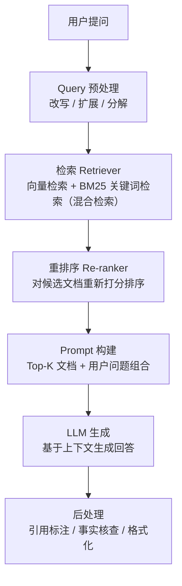
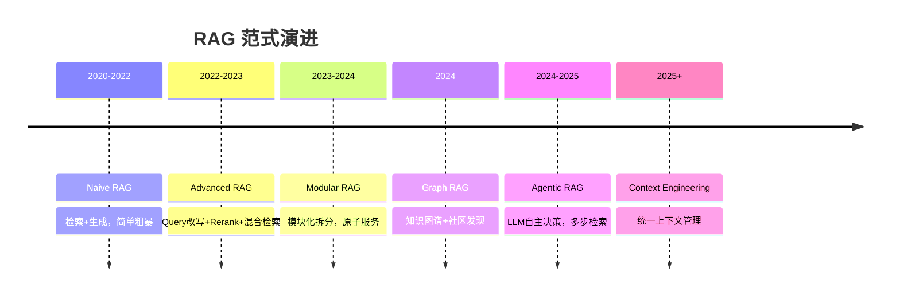
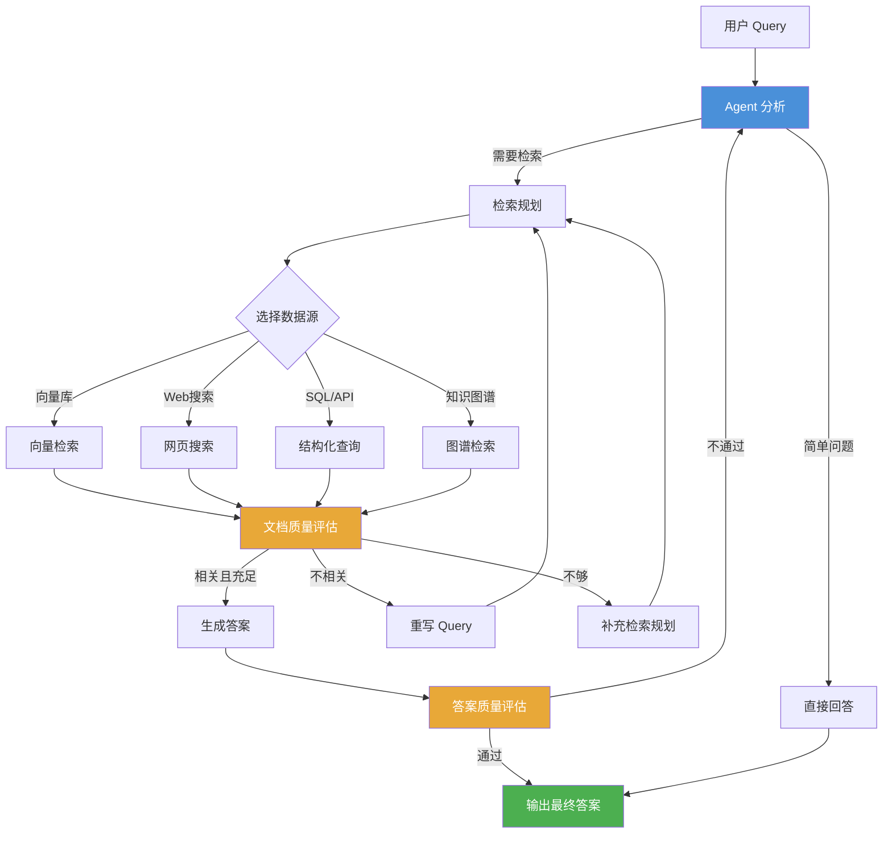
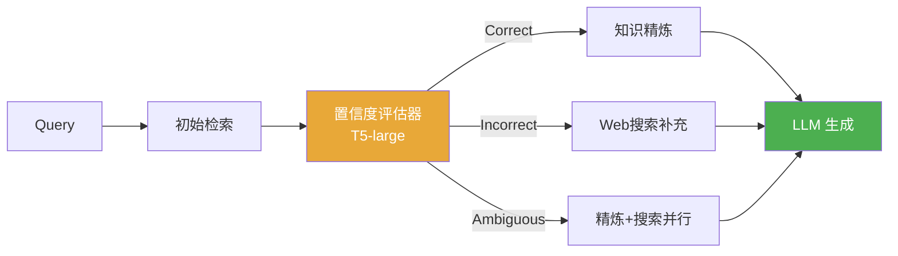
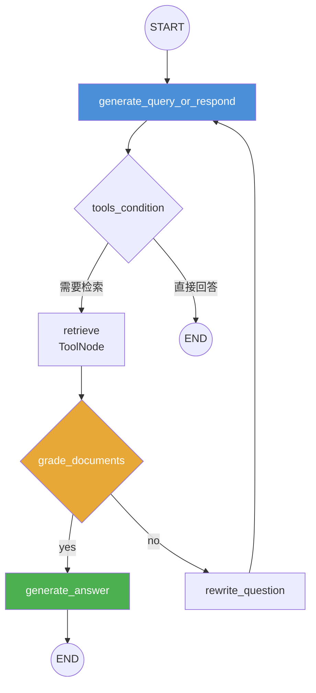
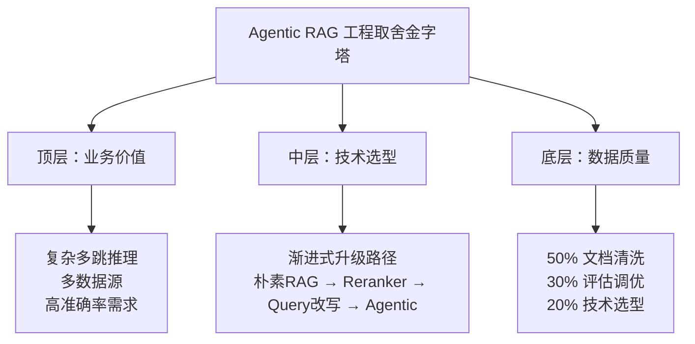

# RAG检索增强生成

> **生活化类比**：RAG 就像「开卷考试」——遇到不会的题，先翻书（检索）找到相关段落，再结合书本内容作答（生成），而不是全凭记忆力硬编。纯 LLM 则是闭卷考试，遇到生僻知识容易「张冠李戴」式幻觉。

RAG（Retrieval-Augmented Generation，检索增强生成）是将外部知识检索与 LLM（Large Language Model，大语言模型）生成相结合的技术框架，是当前企业级 AI 应用的核心架构。

## 为什么需要 RAG？

| 问题 | RAG 的解决方案 |
| ------ | --------------- |
| 知识截止日期 | 实时检索最新信息 |
| 幻觉（Hallucination） | 基于检索到的事实生成，减少编造 |
| 领域专业知识 | 检索企业私有知识库 |
| 可追溯性 | 生成结果可以溯源到具体文档 |
| 成本 | 比微调模型便宜得多 |

## RAG 整体架构



## 检索流水线详解

### 1. 文档预处理与分块 (Chunking)

分块策略直接影响检索质量：

| 策略 | 说明 | 适用场景 |
| ------ | ------ | --------- |
| 固定大小 | 按字符/token 数切分（如 512 tokens） | 通用文本 |
| 句子级 | 按句子边界切分 | 短文本检索 |
| 段落级 | 按段落/章节切分 | 结构化文档 |
| 语义分块 | 用 embedding 检测语义边界 | 高质量需求 |
| 递归分块 | 先按大结构切，再递归细分 | LangChain 默认 |
| 滑动窗口 | 带重叠的固定窗口 | 保留上下文连续性 |

**分块大小的经验值：**

| 大小 | 优点 | 缺点 |
| ------ | ------ | ------ |
| 小（128-256 tokens） | 检索精度高 | 可能丢失上下文 |
| 中（512-1024 tokens） | 平衡精度和上下文 | 通用推荐 |
| 大（1024-2048 tokens） | 上下文完整 | 检索噪声多 |

**重叠 (Overlap)：** 相邻块之间保留 10-20% 的重叠，避免切分点处信息丢失。

### 2. 向量化 (Embedding)

将文本转换为稠密向量，用于语义检索。

| 模型 | 维度 | 特点 |
| ------ | ------ | ------ |
| OpenAI text-embedding-3-small | 1536 | 商用，效果好，成本低 |
| OpenAI text-embedding-3-large | 3072 | 商用，效果最佳 |
| BGE-large-zh | 1024 | 开源，中文优化 |
| BGE-M3 | 1024 | 开源，多语言，支持稀疏+稠密 |
| E5-mistral-7b | 4096 | 开源，基于 LLM 的 Embedding |
| Cohere embed-v3 | 1024 | 商用，多语言 |

详见 [[15-Embedding向量化]]。

### 3. 混合检索 (Hybrid Search)

结合稠密检索和稀疏检索的优势：

| 检索方式 | 原理 | 优势 | 劣势 |
| --------- | ------ | ------ | ------ |
| 稠密检索 | Embedding 向量相似度 | 语义理解强 | 精确匹配弱 |
| 稀疏检索 (BM25, Best Matching 25，最佳匹配 25) | 词频统计 | 精确匹配强 | 无法理解语义 |
| 混合检索 | 两者结合 | 互补 | 需要权重调优 |

**融合策略：**
- **RRF (Reciprocal Rank Fusion)**：`score = Σ 1/(k + rank_i)`，k 通常取 60
- **加权融合**：`final_score = α × dense_score + (1-α) × sparse_score`

### 4. 重排序 (Re-ranking)

检索返回 Top-N 候选后，用更精确的模型重新排序：

```text
向量检索 Top-50 → [Re-ranker] → Top-5（最相关的）
```

| Re-ranker 模型 | 特点 |
| --------------- | ------ |
| Cohere Rerank | 商用，效果好 |
| BGE-reranker | 开源，中文优化 |
| Cross-Encoder | 基于 BERT 的精排模型 |

**为什么需要 Re-ranker？**
向量检索用的是 bi-encoder（Q 和 D 独立编码），速度快但精度有限。Re-ranker 用 cross-encoder（Q 和 D 联合编码），精度高但速度慢。两阶段架构平衡了速度和精度。

## RAG vs 微调

| 维度 | RAG | Fine-tuning |
| ------ | ----- | ------------- |
| 知识更新 | 实时更新（改文档即可） | 需要重新训练 |
| 成本 | 低（无需训练） | 高（GPU + 数据标注） |
| 可解释性 | 高（可追溯来源） | 低（黑盒） |
| 私有知识 | 天然支持 | 需要私有数据训练 |
| 推理开销 | 高（检索 + 生成） | 低（直接生成） |
| 复杂推理 | 依赖检索质量 | 可以学习推理模式 |
| 适用场景 | 知识密集型任务 | 行为/风格调整 |

**最佳实践：** 两者结合使用——用 RAG 提供知识，用微调调整模型行为。

## RAG 评估指标

| 指标 | 评估内容 | 说明 |
| ------ | --------- | ------ |
| Context Precision | 检索精度 | Top-K 中有多少是相关的 |
| Context Recall | 检索召回 | 相关文档有多少被检索到了 |
| Faithfulness | 忠实度 | 生成结果是否基于检索到的上下文 |
| Answer Relevance | 回答相关性 | 回答是否切题 |
| Noise Robustness | 噪声鲁棒性 | 检索到无关文档时是否仍能正确回答 |

详细评估框架见 [[22-RAG评估指标]]。

## 高级 RAG 模式

### Naive RAG vs Advanced RAG vs Modular RAG

| 阶段 | 特点 |
| ------ | ------ |
| Naive RAG | 简单的检索-生成，baseline |
| Advanced RAG | 优化检索（查询改写、混合检索、重排序）和生成（压缩上下文、后处理） |
| Modular RAG | 将 RAG 拆分为可组合的模块，按需组合（路由、裁剪、评估等） |

### 查询改写技巧

| 技巧 | 说明 |
| ------ | ------ |
| HyDE | 先让 LLM 生成假设性回答，用回答的 embedding 检索 |
| 多查询扩展 | 将原始问题拆分为多个子问题，分别检索后合并 |
| Step-back Prompting | 先生成更抽象的问题，扩大检索范围 |
| 查询路由 | 根据问题类型选择不同的检索策略 |

---

---

<aside>
🎯 🎯 重点掌握点：Agentic RAG 是 RAG 技术的最新演进形态，也是 2025-2026 年 AI Agent 岗位的高频考点。核心在于理解 LLM 如何从"被动接受检索结果"进化为"主动决策多次检索"。

</aside>

---

# 一、RAG 范式演进路线：从搬运工到决策者

**想象一下：你在一间巨大的图书馆里找答案。**

- **Naive RAG（2020-2022）**：你问管理员一个问题，他随手从最近的架子上拿一本书给你。对不对全靠运气。
- **Advanced RAG（2022-2023）**：管理员学会了用搜索系统，还懂得给你的问题换个说法再搜一遍（Query 改写），结果好了一些。
- **Modular RAG（2023-2024）**：图书馆拆成了多个专区（向量库、图数据库、SQL），每个区有专门的检索策略。
- **Graph RAG（2024）**：管理员不仅搜书，还理解书和书之间的关系网，能做跨文档推理。
- **Agentic RAG（2024-2025）🔥***：管理员变成了一个***聪明的研究助理**——他会判断你的问题需不需要查资料、从哪里查、查到的够不够、答案对不对，不行就自己换策略再来一轮。

---

<aside>
📊



</aside>

---

# 二、传统 RAG 的三大致命局限

<aside>
⭐ 核心金句：传统 RAG 是"一根筋"——检索一次、生成一次，中间没有任何自我纠错的机会。

</aside>

## 局限 1：检索一次，生成一次（无纠错）

传统 RAG 的流程是线性的：Query → Embedding → 向量检索 → Top-K 文档 → LLM 生成。问题来了——

- **如果检索到的文档**完全不相关？LLM 只能硬编，幻觉概率飙升
- **如果检索到的文档**只覆盖了一半？LLM 没法主动去查缺失的那一半
- **如果用户的原始问题**表述不清？系统不会帮你澄清，直接带着歧义去检索

## 局限 2：无法多步推理（单跳限制）

很多问题需要多跳推理（multi-hop reasoning），比如：

> "2024 年图灵奖获得者的博士导师是谁？他主要研究什么领域？"
> 

这需要：先查出 2024 图灵奖得主 → 再查他的导师 → 再查导师的研究领域。传统 RAG 一次检索根本搞不定，它只会把这三个问题混成一个 embedding 去搜，结果可想而知。

## 局限 3：适应性差（一刀切策略）

传统 RAG 对所有问题都用同一套流程——向量检索 + Top-K。但实际上不同类型的问题应该用不同的检索策略：

| **问题类型** | **应该用的策略** | **传统 RAG 实际用的** |
| --- | --- | --- |
| 事实型"Python GIL 是什么？" | 向量检索就够了 | 向量检索 ✓ |
| 比较型"FastAPI vs Flask" | 分别检索再对比 | 混在一起搜 ✗ |
| 实时型"今天北京天气" | Web 搜索/API | 向量库过时数据 ✗ |
| 多跳型"X的导师的研究" | 多步链式检索 | 一次检索 ✗ |
| 简单闲聊"你好" | 不需要检索 | 还是去检索了 ✗ |

---

# 三、Agentic RAG：LLM 接管决策权

<aside>
🔑 核心一句话：Agentic RAG = 在 RAG 的每个关键节点上都让 LLM 做决策，形成"决策→执行→评估→纠错"的闭环。

</aside>

## Agentic RAG 的完整工作流（12步）

1. 用户输入原始 Query
2. **Agent 分析 Query**——判断：这是简单问题（直接回答）还是复杂问题（需要检索）？
3. **检索规划**——决定从哪些数据源检索：向量库 / Web / SQL / API / 知识图谱
4. **Query 改写/分解**——把复杂问题拆成多个子问题，分别表述优化
5. **执行检索**——调用选定的检索工具
6. **文档质量评估**——判断检索到的文档是否与问题相关
7. **证据充足性检查**——判断已有信息是否足以回答问题
8. 如果不够*→ 回到步骤 2-5，重新规划/改写/检索（***核心循环**）
9. **答案生成**——基于充分的高质量上下文生成回答
10. **答案质量评估**——检查答案是否准确、完整、无幻觉
11. 如果答案不合格*→ 回到步骤 2，重新开始（***第二重循环**）
12. **输出最终答案**

---

<aside>
📊



</aside>

---

# 四、Agentic RAG vs 传统 RAG：全维度对比

| **对比维度** | **传统 RAG** | **Agentic RAG** |
| --- | --- | --- |
| 检索次数 | 固定 1 次 | 动态多次（按需） |
| 检索策略 | 统一向量检索 | 多种策略动态选择（向量/Web/API/SQL/图谱） |
| Query 处理 | 原始 Query 直接 Embedding | LLM 分析/改写/分解子问题 |
| 结果评估 | 无评估，直接用 | 文档相关性 + 证据充足性双重评估 |
| 纠错机制 | 无（错了就错了） | 双重循环：检索纠错 + 答案纠错 |
| 推理能力 | 单跳推理 | 多跳推理 + CoT |
| 响应延迟 | 低（1 次检索+1 次生成） | 高（多步决策+多次检索+多次生成） |
| Token 成本 | 低（1x） | 高（3-5x） |
| 适合场景 | 简单事实型问答 | 复杂多跳/多源/需要验证的场景 |

---

# 五、Agentic RAG 四大核心 Agentic 模式

*Agentic RAG 不是一种固定的架构，而是***四种 agentic 能力的组合运用**：

## 1. 反思模式（Reflection）

Agent 检查自己的输出质量，发现不足就自我修正。

- **文档评估：**"检索到的文档和问题相关吗？"
- **答案评估：**"我生成的答案有幻觉吗？引用准确吗？"
- **典型代表：**Self-RAG（生成中插入 reflection tokens 自主判断）

## 2. 规划模式（Planning）

Agent 把复杂问题拆解成有序的子任务，排优先级，按计划执行。

- **任务分解：**"比较 A 和 B" → 子任务 1: 检索 A 信息；子任务 2: 检索 B 信息；子任务 3: 对比分析
- **动态调整：**执行过程中发现新信息，可以修改后续计划
- **典型代表：**Plan-and-Solve / ReAct 模式

## 3. 工具使用模式（Tool Use）

Agent 根据问题动态选择最合适的工具/数据源。

| **工具/数据源** | **适用场景** | 例子 |
| --- | --- | --- |
| 向量数据库 | 语义相似度匹配 | "什么是 RAG？" |
| BM25 关键词 | 精确术语匹配 | "HTTP 502 错误码" |
| Web 搜索 | 实时/最新信息 | "今天 Python 3.13 发布了吗" |
| SQL 查询 | 结构化数据 | "上月订单金额" |
| 知识图谱 | 实体关系推理 | "X 公司的 CEO 的母校" |
| API 调用 | 特定服务 | "当前股价" |

## 4. 多智能体协作（Multi-Agent）

多个 Agent 分工合作，每个 Agent 专注自己的领域，由一个 Orchestrator 统筹协调。

- **规划 Agent**：负责分析问题、制定检索计划
- **搜索 Agent**：负责向量/文本检索
- **数据库 Agent**：负责 SQL/API 查询
- **图谱 Agent**：负责图数据库查询
- **评估 Agent**：负责文档/答案质量评估
- **澄清 Agent**：负责和用户交互澄清模糊问题

<aside>
🏭 阿里云 Agentic RAG 2.0 就是多 Agent 架构的工业级落地案例。

</aside>

---

# 六、三大变体深度解析：CRAG / Self-RAG / Adaptive-RAG

<aside>
⚠️ 常见对比题：这三个方案的训练成本、落地难度、适用场景各不相同，必须能清楚区分。

</aside>

## 6.1 CRAG（Corrective RAG）—— 纠正性检索增强

**CRAG 是目前工程落地性价比最高**的 Agentic RAG 方案。核心思想：在"检索"和"生成"之间加一道"质检 + 纠错 + 提纯"关卡。

### 三级置信度评估机制

- **Correct（高置信）**：文档高度相关 → 知识精炼（分解-过滤-重组，去粗取精）
- **Incorrect（低置信）**：文档完全无关 → 废弃 + 启动 Web 搜索补充信息
- **Ambiguous（模糊）**：不确定 → 双管齐下（精炼旧信息 + 搜索新信息）

<aside>
📊



</aside>

**评估器用的是**`微调后的 T5-large`**，轻量、推理快、算力成本低。整个 CRAG 方案**不需要微调大模型，纯工程层面就能实现。

## 6.2 Self-RAG —— 自主反思检索

**Self-RAG 的核心创新是在生成过程中插入特殊的** `*reflection tokens*`：

| **`Reflection Token`** | 作用 | 示例判断 |
| --- | --- | --- |
| `[Retrieve]` | 是否需要检索 | "这个问题我需要查资料吗？" |
| `[IsRel]` | 文档是否相关 | "这段文档和问题有关吗？" |
| `[IsSup]` | 内容是否支持 | "检索内容能支撑我的回答吗？" |
| `[IsUse]` | 是否有用 | "引用这段内容有帮助吗？" |

**Self-RAG 的优点是**精度最高**（每个 token 生成级别都在反思），但缺点是**需要微调大模型来学习这些 reflection tokens，训练成本高、推理也慢。

## 6.3 Adaptive-RAG —— 自适应路由

**Adaptive-RAG 的思路更简洁：在检索之前先用一个轻量级分类器判断问题的复杂度，然后路由到不同策略**。

- **简单问题**→ No Retrieval（直接让 LLM 回答）
- **中等问题**→ Single Retrieval（传统 RAG 流程）
- **复杂问题**→ Multi-step Retrieval（Agentic 多步检索）

**优点是**效率高（不用所有问题都走复杂流程），缺点是分类器可能误判。

## 三大变体对比总结

| **维度** | **CRAG** | **Self-RAG** | **Adaptive-RAG** |
| --- | --- | --- | --- |
| 核心逻辑 | 检索→评估→纠错→生成 | 生成中自主反思+补充检索 | 前置分类→路由不同策略 |
| 训练成本 | 低（T5 级别） | 高（需微调大模型） | 低（轻量分类器） |
| 精度 | 中高 | 最高 | 中 |
| 延迟 | 中 | 高 | 低 |
| 落地难度 | 低 | 高 | 中 |
| 推荐场景 | 大多数业务首选 | 对精度要求极高 | 问题类型差异大 |

<aside>
⭐ 核心金句：工程落地首选 CRAG（轻量、效果好、纯工程实现），对精度极致要求才考虑 Self-RAG（但成本高），问题类型差异大用 Adaptive-RAG 做路由。

</aside>

---

# 七、LangGraph 实现 Agentic RAG（手把手架构）

<aside>
🔧 LangGraph 是目前实现 Agentic RAG 最主流的框架，大概率会问架构设计。

</aside>

## 核心节点设计

| **`节点`** | **功能** | 关键操作 |
| --- | --- | --- |
| `generate_query_or_respond` | LLM 决策：检索还是直接回答 | .bind_tools([retriever_tool]) |
| `retrieve` | 执行向量检索 | ToolNode 包装 retriever_tool |
| `grade_documents` | 评估文档相关性 | 二元评分 yes/no |
| `rewrite_question` | 重写问题后重新检索 | LLM 改写 Query |
| `generate_answer` | 基于上下文生成答案 | LLM 生成 + 引用 |

## 两个核心循环

1. **检索纠错循环**：retrieve → grade_documents → 不相关 → rewrite_question → 重新检索
2. **答案纠错循环**：generate_answer → 答案评估不通过 → 回到 generate_query_or_respond 重新开始

<aside>
📊



</aside>

## 核心代码骨架

```python
from langgraph.graph import StateGraph, START, END
from langgraph.prebuilt import ToolNode, tools_condition
from typing import Annotated
from langgraph.graph.message import add_messages

# 定义状态
class MessagesState(TypedDict):
    messages: Annotated[list, add_messages]

# 构建工作流
workflow = StateGraph(MessagesState)

# 添加节点
workflow.add_node("generate_query_or_respond")
workflow.add_node("retrieve", ToolNode([retriever_tool]))
workflow.add_node("grade_documents")
workflow.add_node("rewrite_question")
workflow.add_node("generate_answer")

# 添加边
workflow.add_edge(START, "generate_query_or_respond")
workflow.add_conditional_edges(
    "generate_query_or_respond",
    tools_condition,
    {"tools": "retrieve", END: END}
)
workflow.add_conditional_edges("retrieve", grade_documents, {"yes": "generate_answer", "no": "rewrite_question"})
workflow.add_edge("rewrite_question", "generate_query_or_respond")
workflow.add_edge("generate_answer", END)

# 编译
app = workflow.compile()
```

<aside>
💡 关键理解：LangGraph 的 conditional_edges 就是实现"Agent 自主决策"的机制——LLM 的输出决定走哪条路。

</aside>

---

# 八、工程落地：现实的骨感

## Agentic RAG 的四大现实挑战

### 1. Token 成本（3-5 倍）

传统 RAG：1 次 Embedding + 1 次 LLM 生成 ≈ 低成本

**Agentic RAG：N 次 LLM 决策 + N 次检索 + N 次文档评估 + M 次答案生成 ≈** 3-5 倍成本

### 2. 响应延迟（显著增加）

每多一个循环就多一轮 LLM 调用。从用户的 200ms 等到 3-10 秒，体验差距巨大。

### 3. LLM 决策不可靠

LLM 经常做出错误判断：明明不相关的文档说相关、明明够的信息说不够。这导致不必要的额外检索，反而浪费 Token 和时间。

### 4. 调试困难

多步决策链路长，出问题时很难定位是哪一环出了问题——是评估器太严？还是改写方向错了？

## 工程师的实用建议

<aside>
🔨 ⚠️ 不是所有场景都需要 Agentic RAG！
• 简单 FAQ / 事实型问答 → 朴素 RAG + 好 chunking 就够了
• 需要多步推理 / 多数据源 / 高准确率 → Agentic RAG
• 80% 的日常场景，朴素 RAG 就够用

</aside>

- **渐进式升级路径：**朴素 RAG → 加 Reranker → 加 Query 改写 → 视场景升级 Agentic
- **简化版 Agentic：**用轻量分类器选择检索策略，而非每次都让 LLM 深度思考
- **好的 RAG = 30% 技术 + 70% 数据**（50% 文档清洗 + 30% 评估调优 + 20% 技术选型）

## 开源框架选型金字塔

| **层级** | **框架** | 特点 | 适合 |
| --- | --- | --- | --- |
| 底层（开发者） | LangGraph / LangChain / AutoGen | 灵活，学习成本高 | 需要深度定制 |
| 中层（工程师） | RAGFlow / MaxKB | 平衡易用性和可定制 | 大多数团队 |
| 顶层（业务） | Dify / Coze | 上手快，容易碰壁 | 快速验证 / MVP |

<aside>
⚠️ 血泪教训：80% 用 Dify/Coze 的团队会在 3 个月内遇到性能瓶颈，因为 RAG 优化高度依赖具体业务场景。

</aside>

---

# 九、2025-2026 前沿趋势

## 1. 长上下文 + RAG 深度融合（互补非替代）

**长上下文窗口（128K-1M tokens）能放下更多内容，但RAG 不会被替代**。正确的关系是互补：

- **RAG 做粗筛**：10 万文档 → Top-10 相关文档
- **长上下文做精读**：Top-10 文档 → 深度理解和生成

类比：RAG 是图书管理员的推荐，长上下文是你把推荐的书都翻开细读。两者缺一不可。

## 2. Context Engineering（上下文工程）

**RAG 正在演变为更广义的"Context Engineering"**——不只是检索文档片段，而是统一管理：领域知识、工具描述、交互历史、系统提示词等所有上下文信息。

## 3. 多 Agent 协作成为标配

阿里云 Agentic RAG 2.0 的多 Agent 架构（规划 Agent + Search Agent + DB Agent + Graph Agent + 澄清 Agent）正在成为工业界主流模式。

## 4. 垂直领域 RAG

通用 RAG 越来越不够用，医疗、法律、金融等垂直领域需要定制化的文档处理、评估标准和安全策略。

## 5. Anthropic Contextual Retrieval（2024.9）

- **Contextual Embedding**：用 LLM 给每个 chunk 添加文档级上下文前缀再 embedding
- **Contextual BM25**：同样添加上下文后做关键词检索

<aside>
📈 效果：检索失败率降低 49%（Anthropic 官方数据）

</aside>

---

# 十、常见问题速答

## Q1：Agentic RAG vs 传统 RAG 的核心区别？

<aside>
🎯 传统 RAG 是线性管道（检索一次→生成一次），Agentic RAG 是带反馈闭环的图结构（LLM 自主决定何时检索、从哪检索、是否需要多次检索、答案是否合格）。本质是从"信息搬运工"到"知识决策者"的质变。

</aside>

## Q2：CRAG / Self-RAG / Adaptive-RAG 怎么选？

<aside>
🎯 工程落地首选 CRAG（轻量、效果好、不需要微调大模型、纯工程实现）；对精度极致要求选 Self-RAG（但训练和推理成本高）；问题类型差异大选 Adaptive-RAG 做前置路由。

</aside>

## Q3：LangGraph 实现 Agentic RAG 的核心节点？

<aside>
🎯 五个核心节点：generate_query_or_respond（LLM 决策）、retrieve（ToolNode 执行检索）、grade_documents（文档评估）、rewrite_question（重写 Query）、generate_answer（生成答案）。两个核心循环：检索纠错循环 + 答案纠错循环。通过 conditional_edges 实现 Agent 自主路由。

</aside>

## Q4：Agentic RAG 的工程挑战？

<aside>
🎯 四大挑战：① Token 成本是传统 RAG 的 3-5 倍 ② 响应延迟显著增加 ③ LLM 决策不可靠（误判文档相关性） ④ 调试困难。建议渐进式升级、简化版 Agentic、80% 场景朴素 RAG 就够了。

</aside>

## Q5：RAG 会被长上下文替代吗？

<aside>
🎯 不会。长上下文和 RAG 是互补关系：RAG 做粗筛（10万文档→Top-10），长上下文做精读（Top-10→深度理解）。类比：RAG 是图书管理员的推荐，长上下文是翻开书细读。两者缺一不可。

</aside>

## Q6：Graph RAG vs Agentic RAG 怎么选？

<aside>
🎯 Graph RAG 擅长处理实体关系推理（"X 的供应商的 CEO"），通过社区发现做全局摘要；Agentic RAG 擅长多步多源检索和自主决策。实际项目中两者可以组合——Agentic RAG 的工具箱里可以包含图数据库查询工具。

</aside>

---

# 十一、金句 & 黄金法则

<aside>
🏆 ⭐ 背诵级金句：
1. "Agentic RAG 的本质是把 LLM 从 RAG 管道中的'执行者'提升为'决策者'。"
2. "传统 RAG 的最大问题是'一根筋'——检索一次、生成一次，中间没有自我纠错的机会。"
3. "CRAG 是工程落地的首选方案：不需要微调大模型，用轻量评估器做检索后质检，性价比最高。"
4. "好的 RAG = 30% 技术 + 70% 数据。50% 文档清洗 + 30% 评估调优 + 20% 技术选型。"
5. "Agentic RAG 的成本是传统 RAG 的 3-5 倍，80% 的日常场景朴素 RAG 就够了，不要过度设计。"
6. "长上下文和 RAG 是互补关系：RAG 做粗筛，长上下文做精读，两者缺一不可。"

</aside>

<aside>
📊



</aside>

---

# 参考资料

### 中文资料

1. [清晰解析传统 RAG 与 Agentic RAG 的区别（含源码）](https://blog.csdn.net/python123456_/article/details/144723246)
2. [万字长文，彻底讲透 Agentic RAG](https://blog.csdn.net/monesyyo/article/details/154359777)
3. [2025 年 RAG 技术发展全景：从 Native 到 Agentic](https://blog.csdn.net/m0_58378112/article/details/157432088)
4. [CRAG 论文精读：纠正性检索增强生成](https://juejin.cn/post/7613022791181565990)
5. [2025 年 RAG 已死？2026 年做 Agentic 和上下文工程](https://blog.csdn.net/Wufjsjjx/article/details/156595865)
6. [2025 第一篇 Agentic RAG 最全面的综述](https://blog.csdn.net/developeraa/article/details/147067243)
7. [Agentic RAG 系列：流程和最佳实践（完整落地实践）](https://blog.csdn.net/xuebinding/article/details/150112981)

### 英文资料

1. [Anthropic Contextual Retrieval 官方博客](https://www.anthropic.com/research/contextual-retrieval)
2. [LangGraph Agentic RAG 官方教程](https://langchain-ai.github.io/langgraph/tutorials/rag/langgraph_agentic_rag/)
3. [LangChain Deep Agents RAG Tutorial](https://python.langchain.com/docs/tutorials/qa_chat_history)

---

## 
> ▶ 对应实操：[[13-RAG 参数调优：网格搜索实验框架|13-RAG 参数调优：网格搜索实验框架]]


> ▶ 对应实操：[[06-RAG检索增强生成流程|06-RAG检索增强生成流程]]

相关链接
- [[八股文学习清单]]
- [[00-全局导航|全局导航]]

---

## 快速问答

| 问题 | 参考答案 |
| ------ | --------- |
| RAG 的核心流程是什么？ | 文档分块 → 向量化 → 存入向量数据库 → 用户查询向量化 → 相似度检索 → Top-K 文档 + 查询送入 LLM → 生成回答 |
| 为什么 RAG 比纯 LLM 更可靠？ | RAG 将生成建立在检索到的事实基础上，减少了模型"编造"内容的概率，且结果可溯源 |
| 分块大小如何选择？ | 一般 512-1024 tokens。太小丢失上下文，太大引入噪声。实际需要根据文档类型和检索效果实验调优 |
| BM25 和向量检索的区别？ | BM25 基于词频统计，擅长精确匹配；向量检索基于语义相似度，擅长理解同义词和语义关系。混合使用效果最佳 |
| 如何解决 RAG 的幻觉问题？ | ① 提高检索质量 ② 加入 Re-ranker ③ 使用 Faithfulness 指标评估 ④ Prompt 中要求"只基于提供的上下文回答" |
| RAG 和微调如何选择？ | 知识频繁更新用 RAG，调整模型行为/风格用微调，最佳实践是两者结合 |
| 如何评估 RAG 系统？ | RAGAS 框架：Context Precision/Recall + Faithfulness + Answer Relevance。详见 [[22-RAG评估指标]] |
| 什么是 HyDE？ | Hypothetical Document Embeddings：先让 LLM 生成一个假设性答案，用答案的 embedding 去检索，因为答案和文档的语义空间更接近 |
