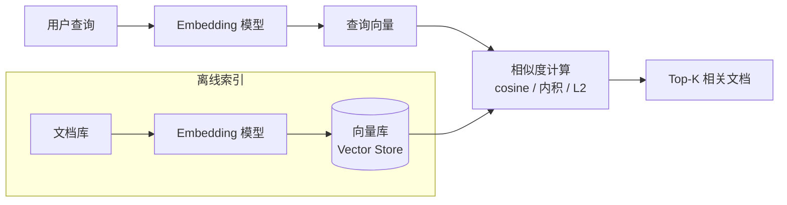
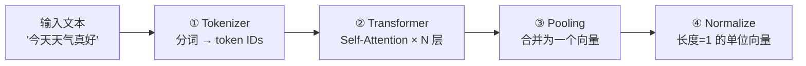
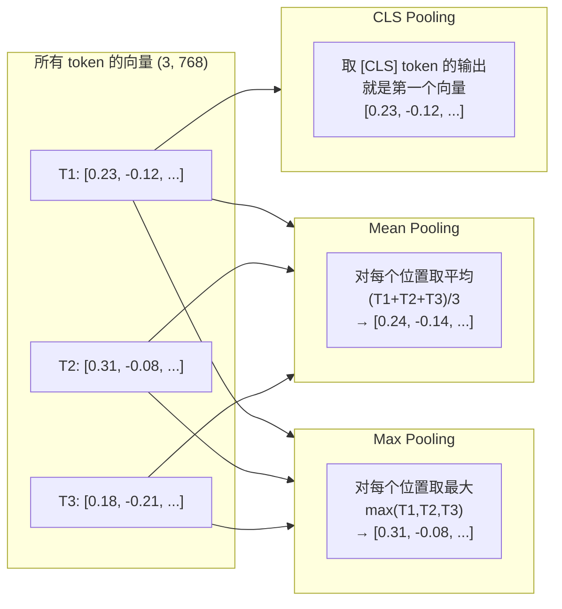
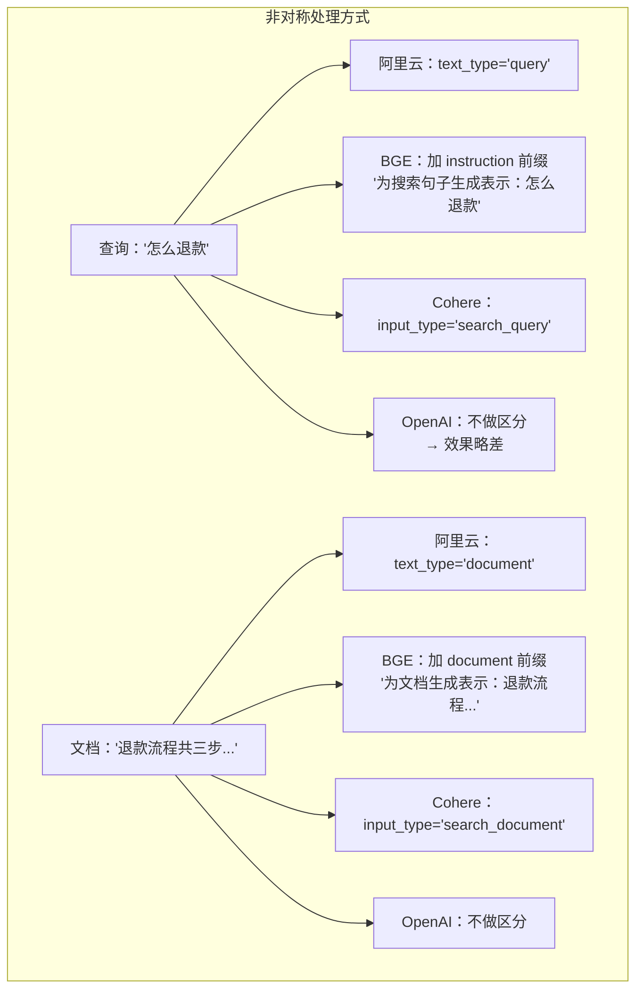
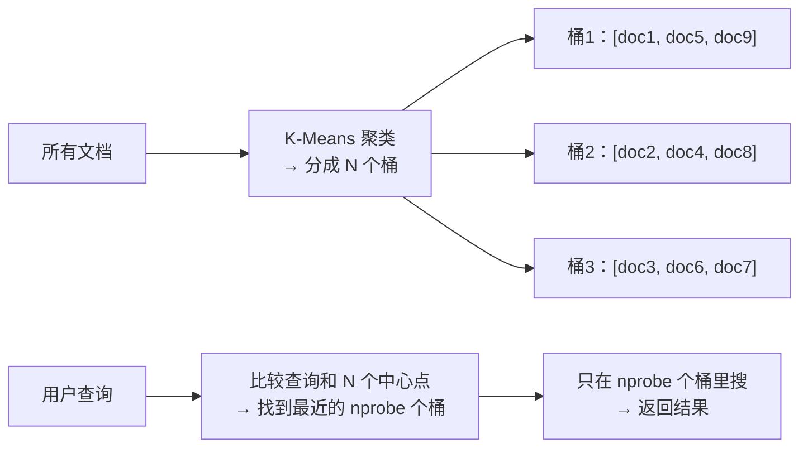
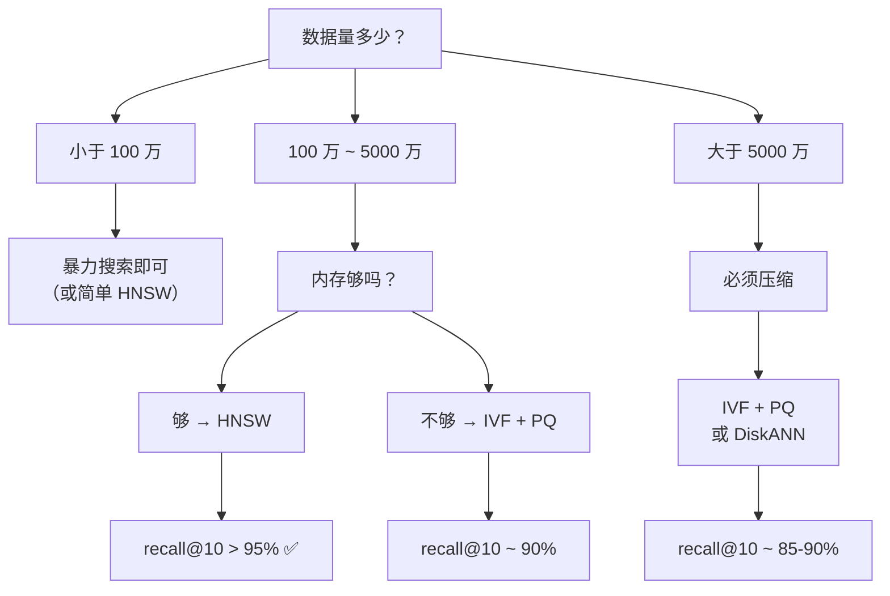
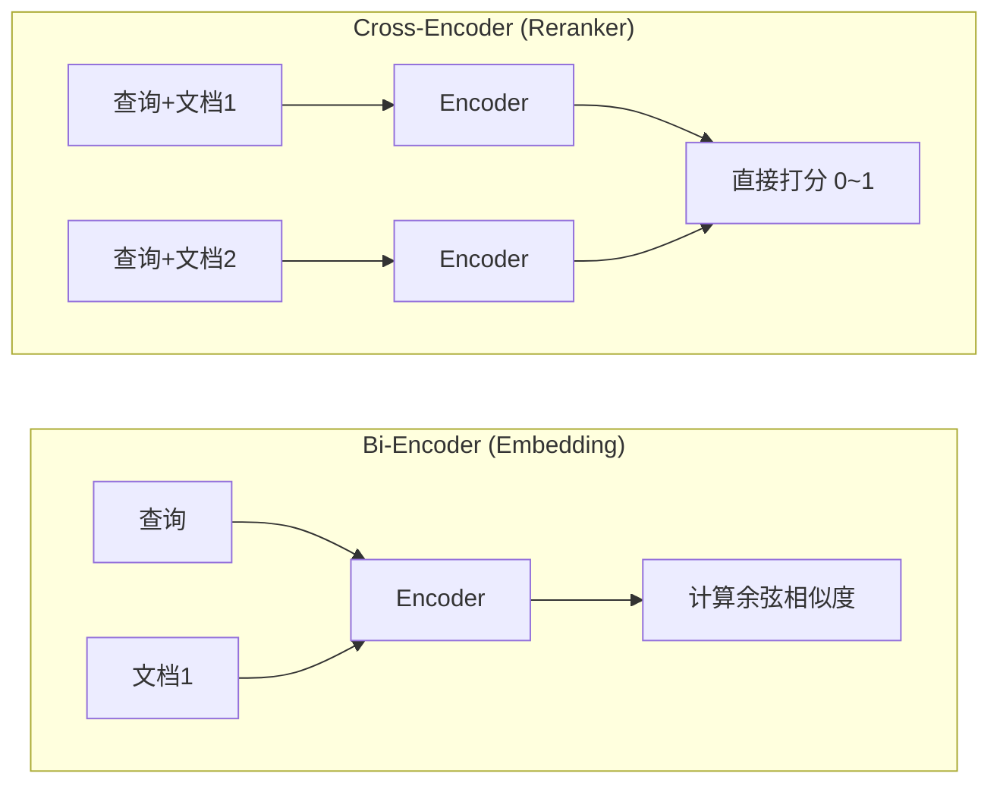
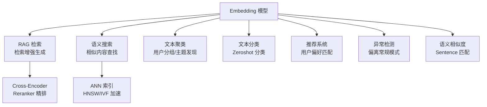

# Embedding向量化


> **生活化类比**：Embedding 就像给每句话发一张「语义坐标卡」——意思相近的话，坐标离得近；八竿子打不着的话，坐标隔得远。检索时只要比坐标距离，不必真的读懂每个字。

Embedding（嵌入 / 向量化，Embedding）是将文本转换为稠密向量的过程，是语义检索、RAG、推荐系统等应用的基础。

## 什么是 Embedding？

**核心思想：** 将高维稀疏的文本表示（如 one-hot）映射到低维稠密的向量空间，使得**语义相似的文本在向量空间中距离相近**。



```text
"猫是一种可爱的宠物" → [0.12, -0.34, 0.56, ..., 0.78]  (1024维)
"小猫咪真萌"         → [0.15, -0.31, 0.53, ..., 0.81]  (1024维)
"今天天气不错"       → [0.89, 0.23, -0.67, ..., 0.11]  (1024维)

前两个向量的余弦相似度 ≈ 0.95（语义接近）
第一个和第三个的余弦相似度 ≈ 0.2（语义无关）
```

## Embedding 模型分类

### 按架构分类

| 类型 | 代表模型 | 特点 |
| ------ | --------- | ------ |
| Bi-Encoder | BERT, BGE, E5 | Q 和 D 独立编码，速度快，适合检索 |
| Cross-Encoder | BERT-cross-encoder | Q 和 D 联合编码，精度高，适合重排序 |
| LLM-based | E5-mistral, GritLM | 基于大语言模型，效果最佳但计算成本高 |
| Late Interaction | ColBERT | 保留 token 级向量，交互延迟 |

### 主流 Embedding 模型对比

| 模型 | 维度 | 最大 Token | 中文支持 | 开源 | MTEB 排名 |
| ------ | ------ | ----------- | --------- | ------ | ----------- |
| OpenAI text-embedding-3-small | 1536 | 8191 | 是 | 否 | 高 |
| OpenAI text-embedding-3-large | 3072 | 8191 | 是 | 否 | 很高 |
| BGE-large-zh-v1.5 | 1024 | 512 | 优化 | 是 | 中文优秀 |
| BGE-M3 | 1024 | 8192 | 是 | 是 | 多语言强 |
| E5-mistral-7b-instruct | 4096 | 4096 | 是 | 是 | 综合最强 |
| GTE-Qwen2-7B-instruct | 3584 | 32768 | 优化 | 是 | 长文本 |
| Cohere embed-v3 | 1024 | 512 | 是 | 否 | 多语言强 |
| Jina-embeddings-v3 | 1024 | 8192 | 是 | 是 | 多任务 |

## 相似度度量

### 余弦相似度 (Cosine Similarity)

最常用的度量方式，衡量两个向量方向的一致性：

```text
cosine_sim(A, B) = (A · B) / (||A|| × ||B||)

值域：[-1, 1]
  1 = 完全相同方向（最相似）
  0 = 正交（无关）
 -1 = 完全相反（反义）
```

### 欧氏距离 (L2 Distance)

```text
L2(A, B) = √(Σ(a_i - b_i)²)

值域：[0, +∞)
  0 = 完全相同
  越大 = 越不相似
```

### 内积 (Dot Product)

```text
dot(A, B) = Σ(a_i × b_i)

注意：如果向量已归一化，dot product = cosine similarity
```

### 度量选择

| 度量 | 适用场景 | 注意事项 |
| ------ | --------- | --------- |
| 余弦相似度 | 通用场景，最常用 | 忽略向量长度差异 |
| 内积 | 向量已归一化时 | 效率最高 |
| L2 距离 | 低维空间 | 对向量长度敏感 |

## 维度选择

| 维度 | 适用场景 | 说明 |
| ------ | --------- | ------ |
| 384 | 轻量级应用 | 速度最快，效果尚可 |
| 768 | 通用场景 | BERT-base 维度，平衡选择 |
| 1024 | 高质量检索 | BGE-large 维度，推荐 |
| 3072 | 最高精度 | OpenAI large 维度，成本高 |

**经验法则：** 维度翻倍，精度提升有限但存储和计算成本翻倍。实际中 1024 维是较好的平衡点。

## Embedding Fine-tuning 微调

### 为什么需要微调？

通用 Embedding 模型在特定领域（医学、法律、金融）可能表现不佳，需要在领域数据上微调。

### 训练数据格式

```text
正样本对（positive pair）：
("什么是机器学习", "机器学习是AI的子领域，让计算机从数据学习")

负样本（hard negative）：
("什么是机器学习", "深度学习是机器学习的一个分支")  ← 相关但不精确
```

### 微调方法

| 方法 | 说明 | 适用场景 |
| ------ | ------ | --------- |
| 对比学习 (Contrastive) | 拉近正样本对，推远负样本 | 最常用 |
| 知识蒸馏 | 用 Cross-Encoder 的分数作为监督信号 | 提升 Bi-Encoder |
| 指令微调 | 在 Embedding 模型前加指令前缀 | 多任务场景 |

### 关键超参数

| 参数 | 推荐值 | 说明 |
| ------ | -------- | ------ |
| Batch Size | 32-256 | 越大越好，但受显存限制 |
| Learning Rate | 1e-5 ~ 5e-5 | 小学习率，避免灾难性遗忘 |
| Temperature (对比损失) | 0.01-0.1 | 控制分布锐度 |
| Epochs | 1-3 | 避免过拟合 |

## 常见问题与最佳实践

### Embedding 使用注意事项

| 问题 | 解决方案 |
| ------ | --------- |
| 文本过长 | 截断到模型最大长度，或分段后聚合 |
| 多语言 | 使用多语言模型如 BGE-M3 |
| 领域适配 | 在领域数据上微调 |
| 更新频率 | 定期重新 Embedding 所有文档 |

### 聚合策略（长文本）

当文本超过模型最大 token 限制时：

| 策略 | 说明 |
| ------ | ------ |
| 截断 | 只取前 N 个 token，简单但丢失信息 |
| 分段取平均 | 分段 Embedding 后取平均向量 |
| 分段加权 | 对不同段赋予不同权重 |
| Map-Reduce | 每段独立 Embedding，最后聚合 |

---


---

---

## 一句话理解

> Embedding 就是把"意思"变成"位置"——让语义相近的文字在高维空间里挨着，语义无关的文字离得远。

```text
"猫"   → [0.12, -0.45,  0.78,  0.33, ...]  (1024 维)
"猫咪" → [0.13, -0.43,  0.76,  0.31, ...]  ← 离"猫"很近✅
"狗"   → [0.09, -0.50,  0.22, -0.19, ...]  ← 离"猫"稍远但语义相关
"汽车" → [-0.71, 0.18, -0.55, -0.32, ...]  ← 离"猫"很远✅
```

类比：**把每个词/句看成地球上的一个地点，Embedding 就是它的经纬度坐标。** "北京"和"上海"的坐标很近，"北京"和"巴黎"的坐标远。你搜"首都"，系统找到的坐标附近就是北京——哪怕你完全没提"北京"两个字。

---

## 一、Embedding 模型的工作原理

### 1.1 结构：和 LLM 共用同一套架构

**Embedding 模型和 LLM 本质上是同一类 Transformer 网络（一种专门处理序列数据的神经网络结构，核心是 Self-Attention 机制），区别在输出层和训练目标。**

```text
LLM 架构：
  Input → Tokenizer → Transformer Layers → LM Head（预测下一个 token）
                                                         ↓
                                                    "是" "个" "好" ...

Embedding 架构：
  Input → Tokenizer → Transformer Layers → Pooling Layer → 归一化
                                                              ↓
                                                      [0.12, -0.45, ...]
```

| 对比维度 | LLM | Embedding 模型 |
|---------|-----|---------------|
| 输出 | 下一个 token 的概率分布 | 一个固定长度的向量 |
| 训练目标 | 自回归：猜下一个词 | 对比学习：让相似文本向量近，不相似文本向量远 |
| 参数量 | 7B~671B | 通常 100M~1.5B（轻量得多） |
| 推理速度 | 慢（逐个 token 生成） | 快（一次前向传播出一个向量） |
| 核心能力 | 生成/理解/推理 | 语义表征/检索/聚类 |

**关键 insight：** Embedding 模型去掉 LM Head（语言模型头，负责预测下一个 token 的那层），换上 Pooling + Normalization。同一个 BERT 结构（Bidirectional Encoder Representations from Transformers，一种经典的 Transformer Encoder 架构），输出层不同就是完全不同的产品。

### 1.2 训练：对比学习（Contrastive Learning）

Embedding 模型不学"猜词"，学的是"拉近拉远"。

#### 核心思想

```text
正样本对（意思相同/相关）：     向量距离 → 拉近
负样本对（意思无关）：           向量距离 → 推远
```

#### 经典 Loss：InfoNCE（Multiple Negatives Ranking Loss）

先解释几个概念的通俗理解（很重要，否则公式看不懂）：

> - **Loss（损失函数）**：衡量模型"错得有多离谱"的数学公式。Loss 越大→模型越蠢→要使劲调参数；Loss 接近 0→模型很聪明了
> - **Softmax**：把一堆数字（比如 [-1, 2, 5]）变成"概率分布"（加起来=1）。就像把考试成绩排名变成"小明80%概率第一，小红15%，小刚5%"
> - **exp**：自然指数函数，作用是"好的更好，差的更差"——让大的值更大，小的值更小，这样正负样本的区别更明显
> - **τ（Temperature）**：控制 softmax 分布有多"尖锐"。τ 越小→概率越集中在得分最高的那个（更自信）；τ 越大→概率分布越平缓（更温和）。和 LLM 的 temperature 是同一个概念
> - **Batch（批次）**：训练时不是一次看一条数据，而是一次看一批（比如 32 条）。好处：batch 内的数据可以互相做"陪练"

```text
InfoNCE Loss = -log( exp(sim(q, d⁺)/τ) / Σexp(sim(q, dᵢ)/τ) )
```
- `q` = 查询向量，`d⁺` = 正例文档向量，`dᵢ` = 包括正例和负例在内的所有文档
- `sim()` = 余弦相似度
- 物理意义：**让正例对的相似度在 batch 内所有文档中脱颖而出**

**用人话说：**
> 给你 1 张"猫"的图 + 99 张其他动物的图，你从 100 张里找出"猫"的那张。模型每次看 batch（比如 64 条文本对），正例（匹配的）要在所有 batch 内负例（不匹配的）前面——这就是 Contrastive Learning（对比学习）。

对比学习 = **先在 batch 里"拉郎配"，再让模型学会拆散错的、保住对的**。

#### Batch Hard Triplet Loss

> **Margin（间隔）**：要求正例必须比负例"更近"的最小差距。就像考试要求你比第二名至少多 5 分才算赢，margin=5。如果只多 2 分，虽然你确实是第一名，但"不够保险"，还要继续训练。

```python
Loss = max(0, sim(q, d⁻) - sim(q, d⁺) + margin)
```

正例和负例的相似度差距小于 margin → 还有优化空间 → Loss > 0
差距已经够大了 → Loss = 0，不再优化

#### 对比学习 vs 生成式学习

```text
对比学习（Embedding）          生成式学习（LLM）
   输入：文本对                    输入：文本序列
   输出：相似度分数                输出：下一个 token
   监督信号：配对关系              监督信号：文本本身
   训练效率：batch 内自动产生负例    训练效率：每个 token 都是监督
```

**为什么要用对比学习？** 因为 Embedding 的目标不是"理解后生成"，而是**为检索优化**——你要的不是模型能继续写下去，而是模型知道"怎么重置密码"和"密码重设流程"是同一个意思。

### 1.3 推理：从文本到向量的三步（全程图解）

> 先记住一个关键事实：**Embedding 模型不做"理解"——它做数学变换。** 输入是文本，中间是数字运算，输出是向量。和 LLM 生成时的前向传播完全一样，只是最后一步不同。



---

#### 第一步：Tokenizer——从文字变成数字

**本质：** 把人类能读的文字序列，变成模型能算的数字序列。

**举例：**

```text
输入文本：  "今天天气真好"
     ↓ 分词（按 BPE 算法）
Token 序列： ["今天", "天气", "真好"]
     ↓ 查词表（vocab.json）
Token IDs： [2345, 6789, 3456]
```

**为什么不能直接输入文字？** 计算机不认识文字，只认识数字。Transformer 做的是数学运算（矩阵乘法 × 加法 × 非线性函数），输入必须是数字矩阵。

**三种常见分词方式：**

| 方式 | 原理 | 例子："我是学生" | 词表大小 |
|------|------|----------------|---------|
| **Word-level** | 按空格/标点切 | ["我", "是", "学生"] | 10 万+（太大） |
| **Character-level** | 按单字切 | ["我", "是", "学", "生"] | 几千（但太长） |
| **BPE / WordPiece** | **最常用**，从字符开始，合并高频出现对 | ["我", "是", "学生"] | 3~5 万（平衡） |

**BPE 的工作方式（理解这个就够了）：**
1. 先把所有文本切成单字
2. 统计相邻字符对的出现频率
3. 把最高频的字符对合并成一个新 token
4. 重复直到词表达到目标大小

```text
"我爱你" "我爱她" "我爱学习"
  ↓ 初始是单字
[我, 爱, 你] [我, 爱, 她] [我, 爱, 学, 习]
  ↓ "我"+"爱" 出现 3 次，合并
[我爱, 你] [我爱, 她] [我爱, 学, 习]
  ↓ 继续合并...
```

**Tokenizer 输出的到底是什么？**

```text
输入:    "今天天气真好"
输出:    [2345, 6789, 3456]         ← token IDs（模型真正看到的）
形状:    [3]                         ← 3 个 token
```

模型收到的是 `[2345, 6789, 3456]`——一个长度为 3 的整数数组，不是文字本身。

---

#### 第二步：Transformer Encoder——让每 token "看到"上下文

**这是最核心也最难理解的一步。** 我用一个简化到极致的例子来拆解。

##### 现状

上一步得到 3 个 token ID。模型把每个 ID 查表变成一个**向量**（刚初始化的、还没经过上下文的）：

```text
Token:    "今天"      "天气"      "真好"
向量:   [0.12, ...] [0.55, ...] [0.31, ...]
形状:    (3, 768)     ← 3 个 token，每个 768 维
```

> 这里的"查表映射"叫 **Embedding Layer（嵌入层）**——不同于 Embedding 模型，这里是每个 token ID 有一个固定向量（查表就能拿到），还没经过上下文。

##### Self-Attention 的本质

```text
"今天天气真好"
   ↑    ↑    ↑
 今天要看"天气"和"真好"→ 决定"今天"在这句话里的意思
 天气要看"今天"和"真好"→ 决定"天气"在这句话里的意思
 真好要看"今天"和"天气"→ 决定"真好"在这句话里的意思
```

**类比：**

> 你和两个同事第一次合作做项目。每个人自己先想想写了啥（Query），然后问其他人"你写了什么"（Key），拿到回复后判断"你的内容和我的有多相关"（Score），最后把相关的内容融合进自己的理解（Value × Weight）。

```text
Self-Attention 公式（简化版）：
    
    Attention(Q, K, V) = softmax( Q × K^T / √d ) × V

    其中：
    Q (Query)   = "我想问什么？"
    K (Key)     = "你手里有什么信息？"
    V (Value)   = "你的实际内容是什么？"
    √d          = 缩放因子，防止 Q×K 的值太大导致 softmax 极端化
```

**具体到"今天天气真好"的 3 个 token：**

```text
Step 1：每个 token 生成 Q、K、V 三个向量
    "今天" → Q天, K天, V天     （三个不同的向量，从原始向量乘不同矩阵得到）
    "天气" → Q气, K气, V气
    "真好" → Q好, K好, V好

Step 2：计算注意力分数（谁和谁有关系）
    "今天" 看 "今天"：Q天·K天 = 0.8  （自己当然和自己最相关）
    "今天" 看 "天气"：Q天·K气 = 0.6  （"今天"和"天气"关系也不错）
    "今天" 看 "真好"：Q天·K好 = 0.2  （和"真好"关系弱一点）
    
    "天气" 看 "今天"：Q气·K天 = 0.5
    "天气" 看 "天气"：Q气·K气 = 0.9
    "天气" 看 "真好"：Q气·K好 = 0.3
    
    ...以此类推

Step 3：softmax 归一化成概率
    "今天" 的注意力分布：{ "今天": 0.55, "天气": 0.35, "真好": 0.10 }

Step 4：用注意力权重加权求和，更新每个 token 的表示
    "今天" 的新向量 = 0.55×V天 + 0.35×V气 + 0.10×V好
```

**做完一层 Self-Attention 后：**
- "今天" 的向量里混入了 "天气" 的信息（因为它们是相关的）
- "真好" 的向量里混入了 "今天"+"天气" 的信息（虽然少一点）
- 每个 token 都"知道"周围还有什么词

**叠 N 层：** 以上过程重复 N 遍（BERT-base = 12 层，BERT-large = 24 层）。每层输出都是"进一步融合上下文"后的新向量。越靠后的层，token 的表示越"全局"。

**最终输出：** 每个 token 的一个高维向量，形状 = `(token_个数, 向量维度)`

```text
输出:    [[0.23, -0.12, 0.45, ...],     ← "今天" 的 768 维向量
          [0.31, -0.08, 0.52, ...],     ← "天气" 的 768 维向量
          [0.18, -0.21, 0.39, ...]]     ← "真好" 的 768 维向量
形状:    (3, 768)
```

---

#### 第三步：Pooling——三个向量合并成一个

**问题：** 我们有了 3 个向量（每 token 一个），但语义搜索需要"整个句子一个向量"。

**方案：** 把这 3 个向量合并成 1 个。

**三种合并方式：**



##### CLS Pooling

BERT 输入的第一个 token 固定是 `[CLS]`（Classification 标记）。预训练时要求[CLS]的输出向量能代表整句话的信息，用于分类任务。

```text
输入：["[CLS]", "今天", "天气", "真好"]
Pooling 后：= "[CLS]" 位置对应的向量
形状：(768,)
```

**缺点：** 只在预训练阶段有"聚合信息"的训练目标。微调 Embedding 时如果没有用 CLS 做额外约束，这个位置的向量不一定能代表整句意思。

##### Mean Pooling（✅ 最常用）

对所有 token 的向量，每个维度分别取平均值。

```text
"今天"  → [0.23, -0.12, 0.45, ...]
"天气"  → [0.31, -0.08, 0.52, ...]
"真好"  → [0.18, -0.21, 0.39, ...]
                       ↓
每个位置取平均 →  [(0.23+0.31+0.18)/3,  (-0.12-0.08-0.21)/3,  (0.45+0.52+0.39)/3,  ...]
              =  [0.24,              -0.14,                  0.45,                  ...]
```

**为什么 Mean Pooling 最好？**
- 每个 token 都参与了最终表示，没有信息浪费
- 平均操作自然地"平滑"了单个 token 的噪声
- 对不同长度的句子，平均后的向量在数值范围上更稳定
- 微调时不需要额外设计 CLS 相关的 loss，更通用

##### Max Pooling

对每个维度取所有 token 的最大值。

```text
"今天"  → [0.23, -0.12, 0.45, ...]
"天气"  → [0.31, -0.08, 0.52, ...]
"真好"  → [0.18, -0.21, 0.39, ...]
                       ↓
每个位置取最大 →  [0.31,  -0.08,  0.52,  ...]
```

**缺点：** 只保留了"最突出"的特征，丢失了大部分信息。相当于只记住"一句话里最强的那部分"。

---

#### 第四步：Normalize——统一向量长度

##### 为什么需要归一化？

向量`[0.24, -0.14, 0.45]`有自己的长度（L2 范数 = `√(0.24² + 0.14² + 0.45²)`）。不同句子的向量长度不同——"我很好"可能长度 0.8，"我今天真的很开心所以觉得一切都很好"可能长度 2.3。

**如果不归一化：**
- 长短句的向量天然有不同长度
- 算余弦相似度时，长度已经被公式中的分母消除了 → 其实也行
- 但算**点积**时，长度会影响结果（长向量→更大值）

##### 归一化之后的好处

```text
L2 归一化公式：
    归一化向量 = 原向量 / |原向量|    （除以自己的长度）

例子：
    原向量：    [0.24, -0.14, 0.45]
    长度：      √(0.24² + 0.14² + 0.45²) = √(0.0576 + 0.0196 + 0.2025) = √0.2797 = 0.53
    归一化后：  [0.24/0.53, -0.14/0.53, 0.45/0.53] = [0.45, -0.26, 0.85]
    新长度：    √(0.45² + 0.26² + 0.85²) = √1.0 = 1.0 ✅
```

**归一化后的重要结果：** 余弦相似度 = 向量点积。

```text
余弦相似度 = A·B / (|A|×|B|)
如果 |A|=|B|=1：余弦相似度 = A·B（直接点积，一步乘法）
```

**最终输出：**

```text
形状：(768,)    ← 一个 768 维的单位向量
值：  [0.45, -0.26, 0.85, ...]
用途：存入向量数据库，等待被检索
```

---

#### 完整流程总结

```text
"今天天气真好"
    ↓ Tokenizer
[2345, 6789, 3456] (token IDs)
    ↓ Embedding Layer（查表）
[[0.12, ..., ], [0.55, ...], [0.31, ...]]  (3, 768)
    ↓ Transformer Encoder × 12 层（每层做 Self-Attention + FFN）
[[0.23, ..., ], [0.31, ...], [0.18, ...]]  (3, 768)   ← 融合了上下文
    ↓ Mean Pooling
[0.24, -0.14, 0.45, ...]   (768,)
    ↓ L2 Normalize
[0.45, -0.26, 0.85, ...]   (768,)   ← 最终 Embedding
```

**输入和输出的直观对比：**
- 输入："今天天气真好"（4 个字）
- 输出：768 个小数 → 存进数据库 → 以后和其他向量比"谁离得近"

> [!tip] **一个会问死人的题**
> 
> **问：** Embedding 模型推理时，Self-Attention 的计算量和输入长度有什么关系？
> 
> **答：** O(n²·d)——n 是 token 个数，d 是向量维度。因为每个 token 要和其他 n 个 token 算注意力分数，所以输入长度翻倍，计算量翻 4 倍。这就是为什么 Embedding 模型通常限制输入长度（512 / 8192 tokens）。
>
> **追问：** 那怎么处理长文档？
> **答：** 分块（chunking）。把 10 万字的文档切成 200 字的块，每块独立编码。检索时也是在块级别搜索。**块的大小决定了检索的"颗粒度"**。

---

## 二、相似度计算：余弦 vs 欧氏（最高频）

> **最爱问："余弦相似度和欧氏距离有什么区别？什么时候用哪个？"**

### 一句话区分的直觉

```text
余弦相似度：A 和 B 的方向是否一致？    → 只看"你是不是那类人"
欧氏距离：    A 和 B 的位置是否接近？    → 看"你离我有多远"
```

**用一个"买东西"的例子秒懂：**

```text
顾客 A：[衣服=10, 书=0]     ← 买了 10 件衣服、0 本书
顾客 B：[衣服=1,  书=0]     ← 买了 1 件衣服、0 本书
顾客 C：[衣服=10, 书=100]   ← 买了 10 件衣服、100 本书

余弦(A, B) = 1.0    ← A 和 B 方向完全一样（都是"只买衣服不买书"）
余弦(A, C) ≈ 0.08   ← A 和 C 方向几乎相反（A=衣服党，C=书党+衣服）

欧氏(A, B) = 9.0    ← A 和 B 距离远（买 10 件 vs 1 件）
欧氏(A, C) = 100    ← A 和 C 距离更远（总量差太多）
```

**关键洞察：**"A 和 B 都是衣服党" 这件事，余弦能抓住，欧氏抓不住——因为欧氏只看"绝对值差距"。

### 二维图解：一眼看懂

```mermaid
flowchart TB
    subgraph 服装书二维空间
        Origin["(0,0) 原点"] --> Axis_Cloth["衣服轴 →"]
        Origin --> Axis_Book["书轴 ↑"]
        
        PA["● A (10, 0)<br/>10件衣服，0本书"]
        PB["● B (1, 0)<br/>1件衣服，0本书"]
        PC["● C (10, 100)<br/>10件衣服，100本书"]
        
        PA -. 余弦(A,B)=1.0 .-> PB
        PA -. 欧氏(A,B)=9 .-> PB
        PA -. 余弦(A,C)≈0.08 .-> PC
        PA -. 欧氏(A,C)=100 .-> PC
    end
```

| 对比 | 余弦认为 | 欧氏认为 |
|------|---------|---------|
| A vs B | **1.0 → 同一个人**（都是衣服党） | **9 → 差距大**（买 10 件 vs 1 件） |
| A vs C | **≈0 → 完全不同**（衣服党 vs 书+衣服） | **100 → 差距更大**（数量级差太多） |

**关键洞察：** 余弦能识别"A 和 B 都是衣服党"这个模式，欧氏看不到——它只关心"绝对值差了多少"。

### 公式与直觉

| 方法 | 公式 | 取值范围 | 关注点 | 类比 |
|------|------|---------|--------|------|
| **余弦相似度** | cos(θ) = A·B / (│A││B│) | [-1, 1] | **方向是否一致** | 两条射线的夹角 |
| **欧氏距离** | d = √Σ(aᵢ-bᵢ)² | [0, +∞) | **绝对位置差** | 两点间的直线距离 |
| **点积** | A·B = Σaᵢbᵢ | (-∞, +∞) | 方向和长度的综合 | 投影的长短 |

```python
import numpy as np

def cosine_similarity(a, b):
    """余弦相似度：1=完全相同，-1=完全相反，0=无关"""
    return np.dot(a, b) / (np.linalg.norm(a) * np.linalg.norm(b))

def euclidean_distance(a, b):
    """欧氏距离：越小越相似（不是相似度！）"""
    return np.linalg.norm(a - b)

def dot_product(a, b):
    """点积：归一化后=余弦相似度，未归一化=受长度影响"""
    return np.dot(a, b)
```

### 问答参考答案

> **问：余弦相似度和欧氏距离的区别？**

**答（标准）：** 余弦相似度关注向量的方向夹角，取值范围[-1,1]，1 表示方向完全一致，适合衡量"偏好/模式是否相似"。欧氏距离关注向量在多维空间中的绝对位置差，适合衡量"数值大小是否接近"。在 Embedding 场景中，向量经过 L2 归一化后长度都为 1，此时两者的排序结果一致，但余弦相似度更常用，因为它只关心语义方向而非文本长度。

> **问：什么场景用欧氏距离而不是余弦相似度？**

**答：** 异常检测、聚类等需要关心"偏离中心多远"的场景。比如用户行为分析——某人买了 10000 件衣服，和普通用户（买 10 件）的欧氏距离很远，可能判定为异常。但余弦相似度会觉得"都是衣服党"给 1.0，漏掉异常。

### 在 Embedding 里的特殊情况 + 手算例子

**前提：** Embedding 模型输出的向量经过 L2 归一化，长度都=1。拿 2D 向量来手算验证：

```text
查询 q = [1, 0]          ← "我喜欢衣服"
文档 d1 = [0.96, 0.28]   ← "我超爱买衣服"   与 q 夹角 ~16°
文档 d2 = [0.80, 0.60]   ← "衣服和书都买"   与 q 夹角 ~37°
文档 d3 = [0.50, 0.87]   ← "我只爱看书"     与 q 夹角 ~60°

（以上都是单位向量，验算：0.96²+0.28²=1.0，0.80²+0.60²=1.0，0.50²+0.87²=1.0）
```

**手算三种度量：**

```text
余弦相似度（值越大越相似）：
  cos(q, d1) = (1×0.96 + 0×0.28) / (1×1) = 0.96
  cos(q, d2) = (1×0.80 + 0×0.60) / (1×1) = 0.80
  cos(q, d3) = (1×0.50 + 0×0.87) / (1×1) = 0.50
  排序：d1(0.96) > d2(0.80) > d3(0.50) ✅ 越接近 1 越相似

点积（值越大越相似）：
  dot(q, d1) = 1×0.96 + 0×0.28 = 0.96
  dot(q, d2) = 1×0.80 + 0×0.60 = 0.80
  dot(q, d3) = 1×0.50 + 0×0.87 = 0.50
  排序：d1(0.96) > d2(0.80) > d3(0.50) ✅ 和余弦完全一致

欧氏距离（值越小越相似！注意方向相反）：
  ed(q, d1) = √((1-0.96)² + (0-0.28)²) = √(0.0016+0.0784) = √0.08 = 0.283
  ed(q, d2) = √((1-0.80)² + (0-0.60)²) = √(0.04+0.36)   = √0.40 = 0.632
  ed(q, d3) = √((1-0.50)² + (0-0.87)²) = √(0.25+0.7569) = √1.01 = 1.003
  排序：d1(0.283) < d2(0.632) < d3(1.003) ✅ 越小越相似
```

**关系推导：**

```text
长度=1 时，欧氏距离和余弦有确定关系：
  欧氏² = (A-B)·(A-B) = A·A + B·B - 2A·B = 1 + 1 - 2×cos = 2 - 2×cos

验算 d1：欧氏 = √(2 - 2×0.96) = √(0.08) = 0.283 ✅
验算 d2：欧氏 = √(2 - 2×0.80) = √(0.40) = 0.632 ✅
验算 d3：欧氏 = √(2 - 2×0.50) = √(1.00) = 1.000 ✅
```

**结论：归一化后排序完全一致，只是尺度和方向不同。**

| 度量 | 方向 | 等价性 |
|------|------|--------|
| 余弦相似度 | ↑ 越大越相似 | 基准 |
| 点积 | ↑ 越大越相似 | = 余弦（因为分母=1） |
| 欧氏距离 | ↓ 越小越相似 | = √(2 - 2×余弦) |

> [!important] **一句话总结：**
> Embedding 向量经过 L2 归一化后，余弦相似度、点积、欧氏距离三者的**排序结果完全等价**。选余弦相似度只是因为它的值域固定[-1,1]，容易设阈值（"相似度>0.8 就算相关"）。欧氏距离虽等价但范围[0, +∞)，设阈值要猜数据分布，不够直观。

---

## 三、对称 vs 非对称 Embedding：最高频

> 这是里最容易踩坑的点。**拿这个问题区分"背过八股"和"真懂检索"。**

### 核心定义：一句话区分

| 场景      | 查询和文档的形态    | 例子                   | 典型模型做法              |
| ------- | ----------- | -------------------- | ------------------- |
| **对称**  | 查询≈文档（同形态）  | 句子相似度、文本聚类、去重        | 同一个模型，不加区分          |
| **非对称** | 查询≠文档（不同形态） | **RAG 检索**、搜索引擎、代码搜索 | 双编码器 / text_type 区分 |

### 为什么非对称更难？

**根本原因：短查询和长文档在语义空间中分布完全不同。**

```text
对称场景（STS-语义文本相似度）：
  句子A："今天天气真好"        → 向量
  句子B："今天天气不错"        → 向量
  → 两个句子结构和长度相似，向量空间分布重叠

非对称场景（RAG 检索）：
  查询：  "怎么退款"                    → 向量  (3 个 token)
  文档：  "退款流程：用户在订单页面... → 向量  (200 个 token)
  → 长度差 60 倍，一个是模糊意图，一个是详细过程
```

**语义空间差异的具体表现：**

```text
直接映射到共同空间的问题：

  短查询向量分布：  [稀疏、宽泛、模棱两可]
  长文档向量分布：  [密集、具体、信息丰富]

  如果强塞进同一空间：
    查询和文档的边界模糊 → 相似度分数不可靠
    "怎么退款"可能和"如何申请退货"挨得近（正确）
    但也可能和"怎么种花"莫名其妙近（不应该！）
```

### 训练数据的差异

**对称模型训练数据：**

```text
输入：("今天天气真好", "今天天气不错")    标签：相似度 0.9
输入：("今天天气真好", "我讨厌下雨")      标签：相似度 0.2
```

正负样本都是同长度、同形态的句子对。

**非对称模型训练数据：**

```text
输入：(query="怎么退款",   document="退款流程：用户在订单页面...")    标签：相关
输入：(query="怎么退款",   document="产品A的价格是99元，包含功能...")  标签：不相关
```

模型必须学会：**"3 个词的模糊意图 ≈ 200 个词的详细文档"**。

### 手算例子：为什么对称模型在非对称场景翻车

```text
假设对称模型输出的向量空间（2D 简化）：

查询：  "怎么退款"       → [0.6, 0.4]    ← 向量离原点近（幅值小）
正例：  "退款流程三步"   → [0.9, 0.7]    ← 向量离原点远（幅值大）
负例：  "今天天气真好"   → [0.8, 0.6]    ← 和数据无关，但幅值也和正例接近！

余弦相似度：
  sim(查询, 正例) = (0.6×0.9 + 0.4×0.7) / (│查询│×│正例│) = 0.82 / 0.83 ≈ 0.98
  sim(查询, 负例) = (0.6×0.8 + 0.4×0.6) / (│查询│×│负例│) = 0.72 / 0.76 ≈ 0.95

  问题：正例和负例的相似度太接近了（0.98 vs 0.95）！
  原因：所有文档向量都"又大又长"，彼此天然相似，淹没了查询-正例的小差距

如果用非对称模型（假设 text_type=query 会拉近相关对）：

  查询：  "怎么退款"       → [0.7, 0.3]    ← query 编码器输出不同分布
  正例：  "退款流程三步"   → [0.6, 0.2]    ← document 编码器把向量"缩"了
  负例：  "今天天气真好"   → [0.9, 0.8]    ← 这个文档其实和退款无关

  sim(查询, 正例) = 0.96
  sim(查询, 负例) = 0.78

  差距拉大了！0.96 vs 0.78 → 显著区分正负例 ✅
```

> [!warning] **核心教训：**
> 对称模型下，短查询的向量"幅值小"→长文档的向量"幅值大"→ 所有长文档彼此天然相似 → **正负例的相似度差距被压缩**。非对称模型通过 query/document 分离编码消除这个偏差。

### 各模型的实现方式对比



| 厂商 | 区分方式 | 原理 | 效果 | 价格 |
|------|---------|------|------|------|
| **阿里云百炼** | `text_type='query'/'document'` | 模型内部对不同类型用不同 Attention 权重 | 🟢 最佳 | ¥0.0005/1K |
| **BGE** | instruction 前缀 | 在文本前加固定标识，引导编码方向 | 🟢 好 | 免费（本地） |
| **Cohere** | `input_type` 显式参数 | 训练时就分开 query/doc 数据 | 🟢 好 | $0.0001/1K |
| **OpenAI** | 不做区分 | 同一模型编码两边 | 🟡 一般 | $0.00002/1K |

### 实战判断：你的场景是对称还是非对称？

```text
问自己三个问题：

① 用户查询和文档库的文本类型是否一样？
   一样（句子vs句子）→ 对称 ✅
   不一样（短问句vs长文档）→ 非对称 ✅

② 用户查询是否比文档短得多？
   是（3-10 词 vs 100-500 词）→ 非对称
   否 → 对称

③ 检索目的是一对一匹配还是一对多召回？
   一对一（找相似句子）→ 对称
   一对多（从文档库里找答案）→ 非对称
```

### 深挖 Q&A

> **Q1：非对称场景的非对称程度怎么量化？**
>
> A1：看查询和文档的**平均长度比**。如果查询平均 8 个 token、文档平均 256 个 token（32:1），就是**高度非对称**，必须用非对称模型。如果比例 < 3:1，可以用对称模型凑合。
>
> 另一个指标：查询和文档的**词汇重叠率**。如果高度重叠（比如"订单"在查询和文档中都高频出现），说明关键词匹配就够了，Embedding 本身不是瓶颈。

> **Q2：阿里云的 text_type 参数做了什么事？**
>
> A2：内部有两个独立的编码分支：
> - `text_type='query'` → 让模型将短文本映射到一个"查询友好"的子空间，与其他查询分布一致
> - `text_type='document'` → 让模型将长文本映射到"文档友好"的子空间
> 两个子空间被训练成"语义上对齐"——即同义的查询和文档在交叉空间里接近。
>
> 效果上，相当于每个模型内建了两个隐式的适配器（adapter），不需要显式双塔模型。

> **Q3：OpenAI 不做区分，为什么还很多人用？**
>
> A3：因为便宜 ($0.00002/1K) + 在某些场景差距不大。如果你的任务非对称程度不高（长度比 < 5:1），或者你的文档和查询同语种同领域（代码搜索、产品说明书），OpenAI 的通用表示够用了。但对**高度非对称的中文 RAG**，明显不如阿里云 text-embedding-v4。

> **Q4：手写一个非对称检索怎么办？**
>
> A4：没有 query/document 区分的 API 时，可以手动在查询和文档前后加标记：
> ```python
> # 模拟非对称编码
> query_text = "[QUERY] " + user_query
> doc_text  = "[DOC] " + chunk_text
> # 然后分别向量化
> q_vec = get_embedding(query_text)
> d_vec = get_embedding(doc_text)
> ```
> 虽然不如原生 text_type 好，但比裸用强 10-15% Recall。

> [!danger] **必杀题**
>
> **延伸提问：你说非对称模型效果好，那为什么还有人用对称模型做 RAG？**
>
> **解答思路：**
> 1. **历史原因**：很多模型本来就是对称训练（Sentence-BERT 那代），不是不想分，是没数据
> 2. **兼容性**：对称模型通常也兼容非对称（效果差但能用），开源社区通用
> 3. **成本**：非对称需要双塔 = 两倍参数 = 两倍推理成本。小规模项目不值得
> 4. **OpenAI 效应**：text-embedding-3-small 不做区分，但因为效果不错 + 便宜 + 生态好，大家就将就用了
>
> **现在趋势**：主流新模型（阿里云 v4、BGE-M3、Cohere v3）都开始显式支持 query/document 区分，说明业界已经确认这是正确的方向。

---

### 延伸：双塔结构（两塔各自编码，空间对齐）

**双塔 = 非对称 Embedding 的物理实现。**

```text
非对称只是一种"策略思想"，双塔是具体的"工程架构"。

双塔 = Query 塔（左塔） + Document 塔（右塔）
       各自独立编码          最后在同一个向量空间算相似度
```

#### 为什么叫"塔"？

两个 Transformer Encoder 长得像两座并排的高塔，各编各的输入类型，共享同一个输出空间。

#### 和单塔的区别

| 对比 | 单塔（对称） | 双塔（非对称） |
|------|------------|-------------|
| 参数 | 一套 θ | **两套** θq 和 θd |
| 输入 | 同形态文本 | 查询 vs 文档 |
| 输出空间 | 天然一致 | **通过训练对齐** |
| 部署 | 一个模型 | 两个模型（可合并部署） |

#### 对齐方式

有两种对齐方法，都是对比学习：

1. **双塔独立参数**：batch 里 32 对 `(q, d⁺)`，左塔编 32 个 q，右塔编 32 个 d。对每个 qᵢ，它的 d⁺ᵢ 要在 32 个 d 里得分最高，其余 31 个 d 自动成为负例。用 InfoNCE Loss 对齐两塔。

2. **共享参数 + text_type**（阿里云 v4）：同一模型内部根据 `text_type` 走不同分支——同一栋楼、两个入口。效果接近双塔但部署更轻。

#### 工业部署的关键

```text
离线阶段（一次性大批量）：
  所有文档 → Document Tower → 存进向量库（只需要右塔）

在线阶段（每次查询）：
  用户输入 → Query Tower → 出一个向量 → 去向量库 ANN 搜索（只需要左塔）
  → 左塔每次实时算，右塔结果已预存，查的时候不跑右塔
```

#### 双塔的致命缺点

> 双塔的两个塔各自编码，**查询和文档之间全程无交互**（没有 cross-attention）。这就是为什么 Embedding 只能做粗筛——后面必须接 Cross-Encoder 精排才能达到最佳效果。

```text
参考回答："双塔的优势是效率（预编码），劣势是精度（无交互）。"
```

---

## 四、Embedding 模型选型与对比（2026 年更新）

### 4.1 商用 API

| 厂商 | 模型 | 维度（可选） | 价格 | 中文质量 | 支持语言 | 特色 |
|------|------|------------|------|---------|---------|------|
| **阿里云百炼** | `text-embedding-v4` | 2048/1536/**1024**/768/512/256/128/64 | ¥0.0005/1K tokens | ⭐⭐⭐⭐⭐ | 100+ | Qwen3-Embedding 系列，支持 instruct + sparse 向量 + batch，MTEB 68.36 |
| **OpenAI** | `text-embedding-3-small` | 1536/**512** | $0.00002/1K tokens | ⭐⭐⭐ | 50+ | MRL 支持降维，性价比极高 |
| **OpenAI** | `text-embedding-3-large` | **3072**/1024/256 | $0.00013/1K tokens | ⭐⭐⭐⭐ | 50+ | 最高精度，适合重排 |
| **DeepSeek** | 无 Embedding API | - | - | - | - | 目前仅提供 Chat/Reasoner，Embedding 不可用 |
| **Cohere** | `embed-english-v3.0` | 1024 | $0.0001/1K tokens | ⭐⭐ | 英文优先 | 显式 `input_type` 参数 |

### 4.2 开源模型

| 模型 | 参数量 | 维度 | 最大长度 | MTEB | 中文 | 特点 |
|------|-------|------|---------|------|------|------|
| **BAAI/bge-large-zh-v1.5** | 326M | 1024 | 512 | 64+ | ⭐⭐⭐⭐⭐ | 中文 SOTA，需加 instruction prefix |
| **moka-ai/m3e-base** | 102M | 768 | 512 | 59 | ⭐⭐⭐⭐ | 轻量中文，适合快速部署 |
| **moka-ai/m3e-large** | 326M | 1024 | 512 | 61 | ⭐⭐⭐⭐ | 更高精度 |
| **BAAI/bge-m3** | 567M | 1024 | 8192 | 70+ | 多语言 | 支持稠密+稀疏+多向量，超长上下文 |
| **intfloat/multilingual-e5-large** | 335M | 1024 | 512 | 65+ | 多语言 | Microsoft 出品，质量稳定 |
| **jina-embeddings-v3** | 570M | 1024 | 8192 | 64+ | 100+ | 支持任务特定 LoRA 适配器 |

### 4.3 阿里云 text-embedding-v4 深度解析（Qwen3-Embedding 系列）

text-embedding-v4 是 2025-2026 年中文最强 Embedding 模型，属于 **Qwen3-Embedding** 系列。

**核心规格：**
- 支持 8 种维度：2048 / 1536 / 1024（默认）/ 768 / 512 / 256 / 128 / 64
- 批次大小 10，单批次最大 33,000 tokens
- 支持 100+ 语言
- 价格：¥0.0005/1K tokens，Batch 调用仅 ¥0.00025/1K tokens
- 免费额度：100 万 tokens（开通后 90 天内）

**MTEB 性能（关键指标）：**

| 配置 | MTEB 总体 | MTEB 检索 | CMTEB 总体 | CMTEB 检索 |
|------|----------|----------|-----------|-----------|
| v4-512dim | 64.73 | 56.34 | 68.79 | 73.33 |
| v4-1024dim | **68.36** | **59.30** | 70.14 | 73.98 |
| v4-2048dim | 71.58 | 61.97 | **71.99** | **75.01** |

**对比 v3 的升级：**

| 对比项 | text-embedding-v3 | text-embedding-v4 |
|--------|------------------|------------------|
| 基础模型 | - | Qwen3-Embedding |
| 最大维度 | 1024 | 2048 |
| MTEB 检索 (1024dim) | 55.41 | **59.30 (+3.9)** |
| 单批次最大 tokens | 8,192 | 33,000 |
| 支持语言 | 50+ | 100+ |
| 稀疏向量 | 支持 | 支持 |
| Instruct | 支持 | 支持 |

**高级功能：**
1. **切换维度**：通过 `dimensions` 参数降维，灵活性极高。2048→1024 精度下降可控（MTEB 检索 61.97→59.30），但存储减半
2. **text_type**：区分 query 和 document 编码策略，非对称搜索场景必备
3. **instruct**：添加英文任务指令提升特定场景精度，如 `Given a research paper query, retrieve relevant research paper`
4. **稠密+稀疏双向量**：同时输出 dense 和 sparse 向量，支持混合搜索

```python
# 切换维度
resp = client.embeddings.create(
    model="text-embedding-v4",
    input="你好",
    dimensions=256  # 从默认 1024 降到 256
)
```

### 4.4 OpenAI text-embedding-3 系列详解

**text-embedding-3-small**：
- 默认维度 1536，支持通过 `dimensions` 降维到 512 等
- 价格仅 $0.00002/1K tokens，性价比极高
- 支持 Matryoshka Representation Learning（MRL）

**text-embedding-3-large**：
- 默认维度 3072，支持降维到 1024/256
- 价格 $0.00013/1K tokens
- 精度最高

**MRL（Matryoshka Representation Learning）核心原理：**

> MRL 就像俄罗斯套娃——输出的 3072 维向量里，前 256 维已经是一个独立可用的 Embedding，前 512 维是更高精度的版本，直到完整的 3072 维。

```python
# OpenAI 降维使用
resp = client.embeddings.create(
    model="text-embedding-3-small",
    input="Hello world",
    dimensions=512  # 只用前 512 维，精度略降但速度×3
)
```

**MRL 的实战价值：**
- **存储-精度 Trade-off**：降维到 1/3 的维度，精度只下降 2-3 个百分点，但存储和搜索速度大幅提升
- **灵活性**：同一模型，高精度召回时用大维度，低成本快速筛选用小维度
- **训练时**：模型在多个粒度上都优化过，不像普通降维是训练后截断（信息丢失不可控）

---

## 五、稠密向量 vs 稀疏向量

### 5.1 概念对比

| 对比维度 | 稠密向量（Dense） | 稀疏向量（Sparse） |
|---------|-----------------|------------------|
| 表示方式 | 每个维度都有值（[0.12, -0.45, ...]） | 大部分维度为 0，少数有值 |
| 维度 | 128~3072 | 词汇表大小（几万到几十万） |
| 语义能力 | 理解同义词、上下文 | 关键词精确匹配 |
| 计算方式 | 余弦/点积相似度 | 交集运算（更高效） |
| 典型代表 | BGE / text-embedding-v4 | SPLADE / BM25 |

### 5.2 混合搜索：取两者之长

```text
用户搜："苹果公司的总部在哪"

纯稠密搜索（理解语义）：
  → 找到"Apple Inc. 的总部" ✅（同义词"苹果→Apple"）
  → 但可能把"苹果很好吃"也拉进来 ❌

纯稀疏搜索（关键词匹配）：
  → 找到"苹果"+"总部"的相关文档 ✅
  → 但漏掉只写"Apple Cupertino"的文档 ❌

混合搜索（稠密+稀疏融合）：
  → 两者都找到，通过 RRF 融合排序
  → 兼顾语义理解和精确匹配 ✅
```

**text-embedding-v4 支持同时输出稠密+稀疏向量**，调用一次 API 得到两种向量，然后用 RRF（Reciprocal Rank Fusion）融合排序：

```python
# text-embedding-v4 生成稠密+稀疏
resp = dashscope.TextEmbedding.call(
    model="text-embedding-v4",
    input="苹果公司总部在哪",
    output_type="dense&sparse",  # 同时输出两种向量
)
dense_vec = resp.output['embeddings'][0]['embedding']
sparse_vec = resp.output['embeddings'][0]['sparse_embedding']
```

### 5.3 RRF 融合排序

```text
RRF 得分 = Σ 1 / (k + rank_i(文档))
```

k 通常取 60。某文档在稠密搜索中排第 3，稀疏搜索中排第 10，则：
```text
RRF = 1/(60+3) + 1/(60+10) = 0.0159 + 0.0143 = 0.0302
```

> 简单说：**稠密和稀疏各搜各的，最后把排名融合。** 两个方法都排前面的文档 = 最可能正确。

---

## 六、语义搜索的全流程工程

### 6.1 离线入库


**关键点：**
- 分块策略决定检索上限（在 RAG 笔记中详讲）
- 文档向量化的 `text_type='document'`（阿里云）或加 instruction prefix（BGE）
- 入库时可以多生成一个稀疏向量（如果需要混合搜索）
- 索引类型选择影响召回速度和精度

### 6.2 在线查询


### 6.3 ANN（Approximate Nearest Neighbor）算法

#### 为什么不能暴力搜？

```text
知识库 1000 万条文档，每条 1024 维向量

暴力搜索：
  每条查询 → 和 1000 万条都算一次余弦相似度（1024 次乘法）
  = 1000 万 × 1024 ≈ 100 亿次浮点运算
  ≈ 每次查询 ~500ms（单机）→ 用户等半秒，不可接受

ANN 搜索：
  不需要和全部比，只和一小部分比
  每次查询 ~5ms（快 100 倍），精度 recall@10 ≈ 95%
```

**核心思想：牺牲一点点精度，换取大幅速度提升。**

```text
暴力搜索 = 面试 100 人，每个人都面 1 小时 → 找到最合适的，但太慢
ANN 搜索 = 先筛简历挑 10 人，面这 10 个 → 可能错过 1 个最合适的，但快了 10 倍
```

#### 三大主流 ANN 算法

---

#### ① HNSW（Hierarchical Navigable Small World）— 当前最主流

**原理：多层图结构。**

```text
想象一栋图书馆大楼：
  
  顶层（Penthouse）：  只有几十本最热门书          → 进门先看这里
  中层（二楼）：       几百本比较热门的书           → 缩小范围
  底层（一楼）：       所有书、精确定位             → 找到你要的那本
  
  你要找一本关于"量子物理"的书：
    顶层 → 热门科学书籍区域      → "物理在这片"
    中层 → 物理分类区域          → "量子物理是下一排"
    底层 → 精确定位到某书架某行  → "就这本"
```

**为什么它快？**

```text
每层是一个"导航图"：
  顶层节点很少（几十个），每个节点连接 2-3 个其他节点
  从这里快速找到"大概方向"
  然后降入下一层，找更精确的位置
  直到最底层，有全部节点，做最后确认

搜索过程 = 从顶层到逐层到底层，每层只走一小段路
          = 不是"全图搜索"，而是"顺着路标走"
```

**构建过程（理解够用）：**

```text
插入新向量时：
  1. 随机决定它的"层高"（大部分在底层，少数在高层）
  2. 从顶层开始，找到它每层的最近邻
  3. 和这些近邻建立双向连接
  4. 如果某个节点的连接数超过 M，删掉最远的连接

效果：
  底层节点密集（连接多），顶层节点稀疏（连接少）
  搜索时从顶层快速"跳"到底层
```

**关键参数：**

| 参数 | 默认值 | 调大 | 调小 |
|------|-------|------|------|
| `M`（每个节点最大连接数） | 16 | 精度更高、但更慢、更占内存 | 更快、更省、但精度下降 |
| `efConstruction`（建索引搜索范围） | 100 | 索引质量更高、建索引更慢 | 索引质量下降、建索引更快 |
| `efSearch`（搜索时搜索范围） | 50 | 搜索精度更高、更慢 | 搜索更快、精度下降 |

**调参口诀：** M 不动（默认够用），efSearch 调精度，efConstruction 调索引质量。

```text
精度不够？→ 增大 efSearch（影响查询速度）
查询太慢？→ 减小 efSearch（影响精度）或 M
内存太高？→ 减小 M（影响精度）
```

**优缺点：**

```text
✅ 优点：
  - 百万级数据搜索 < 5ms
  - recall@10 轻松 95%+
  - 参数直观，容易调优

❌ 缺点：
  - 内存占用高（每个节点存 M 个邻居）
  - 批量插入慢（插入一个要更新多个邻居的连接）
  - 数据量 > 1 亿时，建索引时间以天计
```

---

#### ② IVF（Inverted File Index）— 更省内存

**原理：分桶 + 缩小搜索范围。**

```text
把向量空间划分成若干区域（桶），每个桶有个"中心点"（质心）。
  
  文档入库时：分配给最近的中心点
  用户查询时：找到最近的 N 个中心点 → 只在这 N 个桶里搜

类比：
  不是全市找餐馆，而是"先看哪个区 → 再看区里哪条街 → 只看这条街"
```

**具体过程：**



**关键参数：**

| 参数 | 含义 | 调大 | 调小 |
|------|------|------|------|
| `nlist`（桶的数量） | 把空间分成几份 | 桶更多、精度更高、但建索引更慢 | 桶更少、更快、但精度下降 |
| `nprobe`（搜索几个桶） | 搜几个最相关的桶 | 精度更高、更慢 | 更快、精度下降 |

**和 HNSW 的对比：**

```text
IVF:   nlist=100, nprobe=10 → 只搜索 10% 的数据 → 快 10 倍，精度 ~90%
HNSW:  不出底层图 → M=16, efSearch=200 → 快 100 倍，精度 ~98%

所以追求精度选 HNSW，追求省内存/大数据量选 IVF。
```

---

#### ③ PQ（Product Quantization）— 极致压缩

不仅加速搜索，更**大幅压缩存储**。

```text
原始向量：1024 维 × 4 字节（float32） = 4KB / 每向量
1000 万条：4KB × 1000 万 = 40GB          ← 全放内存太贵了！

PQ 压缩后：1024 维 → 64 bytes             ← 压缩 64 倍
1000 万条：64 × 1000 万 = 640MB           ← 普通机器随便放
```

**原理：**

```text
1. 把 1024 维切成 8 段，每段 128 维
2. 对每段分别做 K-Means（比如聚成 256 类）
3. 每段只存聚类 ID（1 字节）→ 8 段 = 8 字节
4. 再加上 8 个聚类中心偏移量 → 总共 ~64 字节
```

**代价：** 精度下降（压缩过程有损），但**内存降低 64 倍**。

> **工业界组合拳： IVF + PQ**
> IVF 负责"快速定位到少数桶"，PQ 负责"桶内搜索时快速计算距离"——这是最经典的组合，几乎所有的向量数据库（Faiss、Milvus）默认配置都是 IVF+PQ。

---

#### 算法选型决策树



#### 不同向量数据库的默认算法

| 数据库 | 默认算法 | 其他选项 | 特点 |
|-------|---------|---------|------|
| **Chroma** | HNSW | - | 开箱即用，小项目首选 |
| **Milvus** | IVF_FLAT | HNSW、IVF_PQ、DiskANN | 企业级，支持百亿级 |
| **Faiss** | 自己选 | IVF、HNSW、PQ | 库不是数据库，只做索引 |
| **PGVector** | IVFFlat | HNSW | PostgreSQL 插件，小项目省部署 |
| **Qdrant** | HNSW | - | Rust 实现，性能好 |
| **Weaviate** | HNSW | - | 自带推理管道 |

#### 常见 Q&A

> **Q：HNSW 和 IVFFlat 哪个好？**
>
> **A：** 没有绝对的好坏。HNSW 精度更高（recall@10 95%+ vs 90%）、更快（<5ms vs 10-20ms），但内存占用更高、批量插入慢。IVF 内存友好、插入快、适合 >5000 万的大规模。**创业小项目用 HNSW，大厂百亿级用 IVF+Piggyback。**

> **Q：建索引慢怎么办？**
>
> **A：** 如果是 HNSW，降低 `efConstruction`、减小 `M`。如果还不行，换 IVF（建索引就是一次 K-Means，比 HNSW 的图构建快得多）。如果数据量 >1 亿，考虑分布式或 DiskANN（基于 SSD 的 ANN 索引）。

> **Q：向量维度对 ANN 有什么影响？**
>
> **A：** 维度越高，ANN 效果越差（维度诅咒）。1024 维下 HNSW 表现良好，3072 维（text-embedding-3-large）下可能需要加大 efSearch。**降维（如 2048→1024）在精度损失 <3% 的情况下，搜索速度可能翻倍。**

> **Q：新增数据后需要重建索引吗？**
>
> **A：** HNSW 支持增量插入，但频繁插入会导致图结构退化（精度下降），建议每 N 条插入后重建一次。IVF 的增量插入更友好——新数据直接分到最近的桶就行，不需要重建。**Chroma 和 Milvus 会自动处理增量重建，大部分场景不需要手动触发。**

---

## 七、检索 + 重排：Bi-Encoder vs Cross-Encoder

常见："Embedding 为什么不能直接代替 Reranker？"

### 7.1 架构对比



| 对比 | Bi-Encoder（Embedding） | Cross-Encoder（Reranker） |
|------|------------------------|--------------------------|
| 工作方式 | 分别编码查询和文档，再算相似度 | 查询和文档拼接在一起编码，直接输出相似度分数 |
| 文档能否预编码？ | ✅ 可以！离线建好索引 | ❌ 不能，必须在线推理 |
| 速度 | 🟢 极快（百万级 < 10ms） | 🔴 慢（每个文档都要过一遍模型） |
| 精度 | 🟡 中等（失去了查询-文档交互） | 🟢 极高（Attention 可以看到两者交互） |
| 典型应用 | 粗筛：从 100 万文档中找到 Top-100 | 精排：对 Top-100 重排序，取出 Top-5 |

### 7.2 谁能替代谁？

> **Embedding 和 Reranker 不是替代关系，是上下游关系。**
>
> Bi-Encoder 负责"快速过滤"，Cross-Encoder 负责"精确筛选"。

**为什么 Embedding 不能替代 Reranker：**
- Embedding 把查询和文档**分别压缩成一个向量**，信息有损
- 想象一下：把一整篇文档浓缩成 1024 个数字，一定丢了很多细节
- Reranker 把查询和文档**拼接在一起过 Attention**，可以看到"查询中的 A 词是否匹配文档中的 B 词"
- 结论：**Bi-Encoder 是先压缩再匹配，Cross-Encoder 是放在一起看。** 后者和人类阅读更接近，精度自然更高

**典型两阶段 pipeline：**
```text
1. Embedding 检索：所有文档 → 选出 Top-100（耗时 < 10ms）
2. Reranker 重排：Top-100 文档 → 选出 Top-5（耗时 ~500ms）
        ↓
综合效果：接近 Cross-Encoder 的精度，但有 Bi-Encoder 的速度
```

---

## 八、Embedding 的局限与陷阱

### 8.1 你不知道的五个坑

| 陷阱 | 表现 | 原因 | 解决方案 |
|------|------|------|---------|
| **领域漂移** | 通用模型在专业领域（医疗/法律）效果断崖下跌 | 预训练数据不含领域术语 | 用领域数据微调或选领域专用模型 |
| **上下文窗口限制** | 长文档的 Embedding 质量差 | 模型最大长度 512~8192 tokens | 分块后在块级别编码 |
| **信息丢失** | "苹果"=水果还是公司？ | 多义词的歧义无法区分 | 用 Cohere 多向量模型或 Cross-Encoder 精排 |
| **温度不够** | 新词/缩写不在词表中 | Tokenizer 不认识 → subword 碎片化 | 选支持大词表的模型 |
| **维度诅咒** | 高维空间的距离趋同 | 维数越高，向量间距离区别越小 | 用 MRL 降维或改用局部敏感哈希 |

### 8.2 Embedding 检索的失效场景

```text
查询："请帮我查一下 2025 年 3 月 15 日的订单，金额超过 500 元"

Embedding 可能失效的原因：
1. 精确数字匹配不是 Embedding 擅长的事（"2025-03-15"≠"2025年3月15日"）
2. "500元"和"502元"在向量空间几乎一样近
3. 这时候需要 稀疏向量 + 精确过滤 兜底

解决方案：
- 混合搜索（稠密+稀疏+精确过滤）
- 结构化元数据过滤 + Embedding 语义检索并行
```

---

## 九、实战代码：完整语义搜索 Pipeline

```python
import os
import numpy as np
from openai import OpenAI

# ========== 配置 ==========
EMBEDDING_MODEL = "text-embedding-v4"
DIMENSION = 1024

embed_client = OpenAI(
    api_key=os.environ["DASHSCOPE_API_KEY"],
    base_url="https://dashscope.aliyuncs.com/compatible-mode/v1",
)

# ========== 1. 向量化 ==========
def get_embedding(text: str, text_type: str = "document") -> list[float]:
    resp = embed_client.embeddings.create(
        model=EMBEDDING_MODEL,
        input=text,
        dimensions=DIMENSION,
        # 阿里云支持显式指定 text_type
        # extra_body={"text_type": text_type}  # OpenAI 兼容接口暂不支持
    )
    return resp.data[0].embedding

# ========== 2. 构建知识库（离线一步） ==========
documents = [
    "产品 A 的价格是 99 元，包含功能 X 和 Y，支持企业定制",
    "退款流程：在订单页点击申请退款 → 3 个工作日内审核 → 原路返回",
    "客服电话：400-123-4567，工作时间周一至周五 9:00-18:00",
    "产品 B 的价格是 199 元，额外包含功能 Z，适合高级用户",
    "VIP 会员享受 24 小时专属客服，退款优先处理",
    "大额订单（超过 2000 元）需要经理审批后方可退款",
]

# 批量向量化（text-embedding-v4 一次最多处理 10 段）
doc_vectors = []
for doc in documents:
    vec = get_embedding(doc, text_type="document")
    doc_vectors.append(vec)
doc_vectors = np.array(doc_vectors)

# ========== 3. 语义搜索 ==========
def semantic_search(query: str, top_k: int = 3) -> list[tuple[str, float]]:
    # 查询向量化（用 query 模式）
    q_vec = np.array(get_embedding(query, text_type="query"))

    # 计算余弦相似度（向量已归一化，点积 = 余弦）
    scores = doc_vectors @ q_vec

    # 取 Top-K
    top_indices = np.argsort(scores)[-top_k:][::-1]
    return [(documents[i], float(scores[i])) for i in top_indices]

# 测试
query = "怎么退款最快？"
results = semantic_search(query)
print(f"查询：{query}")
for doc, score in results:
    print(f"  [{score:.4f}] {doc}")
```

### 输出示例
```text
查询：怎么退款最快？
  [0.7234] VIP 会员享受 24 小时专属客服，退款优先处理
  [0.6912] 退款流程：在订单页点击申请退款 → 3 个工作日内审核 → 原路返回
  [0.5231] 大额订单（超过 2000 元）需要经理审批后方可退款
```

> [!note] **为什么"VIP 会员退款优先"排名第一？**
> 因为查询中有"最快"这个词，VIP 优先处理的语义和"最快"最接近。传统的关键词匹配会优先匹配"退款"+"流程"，而 Embedding 能理解"最快"≈"优先"。
> 
> 这就是 Embedding 的语义理解能力——**不是匹配关键词，而是匹配意图**。

---

## 十、Embedding 评估体系

### 10.1 MTEB（Massive Text Embedding Benchmark）

#### 一句话：Embedding 模型的"高考"

MTEB 是目前最权威的 Embedding 评测标准。**它不考单个能力，而是考 8 科、58 张卷子，最后算平均分。**

就像高考不是只考数学，而是语数英理综都考——你不能说"我的模型检索特别强，所以总分最高"。MTEB 要看模型在所有维度上的综合表现。

> **MTEB 和 CMTEB 的关系：** MTEB 是国际版（英文为主），CMTEB 是中文版（Chinese MTEB）。**如果一个模型 CMTEB 分数高，说明它中文好。** 中文场景选模型优先看 CMTEB。

#### 8 科考什么？

| 科目 | 内容 | 指标 | 通俗类比 |
|------|------|------|---------|
| **Retrieval（检索）** ⭐⭐⭐⭐ | 给你一个查询，从百万文档里找出最相关的 | **NDCG@10** | 高考数学——最重要的一科 |
| **STS（语义相似度）** | 两句话意思有多接近？"猫在垫子上" vs "猫躺在毯子上" | Spearman 相关系数 | 语文阅读理解 |
| **Classification（分类）** | 这句话是好评还是差评？ | Accuracy | 英语完形填空 |
| **Pair Classification** | 这两句话是不是同一个意思？ | Average Precision | 判断对错题 |
| **Clustering（聚类）** | 按主题把文档自动分组，分对了没？ | V-Measure | 历史题——把事件按朝代归类 |
| **Reranking（重排）** | 给一个排序结果，看排得好不好 | MAP | 给作文排名排对了没 |
| **Summarization（摘要）** | 摘要和原文意思一致吗？ | Spearman | 作文写跑题了没 |
| **Bitext Mining（双语匹配）** | 中文"猫"和英文"cat"配对了没？ | Accuracy | 中英互译配对 |

**Retrieval 为什么最重要？** 因为 Embedding 最核心的应用就是检索（RAG 的基石）。一个模型 STSs 再高、分类再准，如果检索不行，对于 RAG 场景就是废的。所以看 MTEB 时**第一眼先看 Retrieval 分**。

#### MTEB 分数怎么解读？

```text
模型 A：MTEB=68.36,  Retrieval=59.30   ← 综合不错，检索中上
模型 B：MTEB=65.00,  Retrieval=62.00   ← 综合略低，但检索更强！
                                    → 做 RAG 选 B
```

**规律：MTEB 总分和 Retrieval 分不完全正相关。** 有些模型专攻检索（牺牲分类/聚类），有些模型图个平均。**选模型要看你的任务场景。**

#### 分数段参考

| 分数段 | MTEB | CMTEB | 评价 |
|-------|------|-------|------|
| 🏆 旗舰 | 65+ | 70+ | text-embedding-v4 (2048dim)、BGE-M3 |
| 🥇 优秀 | 60-65 | 65-70 | v4(1024dim)、text-embedding-3-large |
| 🥈 中上 | 55-60 | 60-65 | bge-large-zh-v1.5、m3e-large |
| 🥉 够用 | 50-55 | 55-60 | 小模型或旧模型 |
| ❌ 不及格 | <45 | <50 | 淘汰，不要用 |

### 10.2 检索指标速查

| 指标 | 解释 | 关注点 |
|------|------|--------|
| **Recall@K** | Top-K 中命中的相关文档比例 | 有没有漏掉对的 |
| **Precision@K** | Top-K 中真正相关的文档比例 | 有没有标记错的 |
| **MRR** | 第一个正确答案的排名倒数 | 第一个回答对了吗 |
| **NDCG@K** | 考虑了排序位置和结果的相关性等级（0/1/2...） | 排序的质量，**检索最核心指标** |

### 10.3 2026 年 MTEB 排行榜趋势

| 排名 | 模型 | MTEB 检索 | CMTEB 检索 | 特点 |
|------|------|----------|-----------|------|
| 🥇 | text-embedding-v4 (2048dim) | 61.97 | 75.01 | 中文最强 |
| 🥈 | BGE-M3 | 60+ | 72+ | 多语言+超长上下文 |
| 🥉 | text-embedding-3-large | 64+ | 68+ | 英文最强中文次之 |
| 4 | jina-embeddings-v3 | 62+ | 67+ | 任务适配 |
| 5 | multilingual-e5-large | 60+ | 66+ | 稳定通用 |

> **关键趋势：**
> 1. 中文 Embedding 模型（v4/BGE）在 CMTEB 上已显著超越 OpenAI
> 2. MRL（多粒度降维）成为标配
> 3. 混合检索（Dense+Sparse）是提升检索精度的主流方向
> 4. 超长上下文（8192 tokens）解决长文档编码问题

---

## 十一、术语速查（按出现顺序）

> 把本文涉及但可能看不懂的专业词汇，用一句人话说清楚。

| 术语 | 人话解释 |
|------|---------|
| **Transformer** | 一种神经网络结构，核心是 Self-Attention。可以理解成"开会时每个人都能听到所有人的发言"——而不是像 RNN 那样只能"依次传话"。2026 年几乎所有 LLM 和 Embedding 模型都基于它 |
| **Self-Attention（自注意力）** | 句子里的每个词"看"一遍其他所有词，决定"谁更重要"。就像读一句话时，"他"前面的"小明"更有关系，"桌子"就没关系。Self-Attention 就是让模型自己学会这个"有关系"的判断 |
| **Neural Network（神经网络）** | 数学函数的"叠叠乐"——输入一些数字，经过一层层加减乘除，输出另一些数字。层数越多越能学复杂的东西。参数就是这些加减乘除里的系数 |
| **Encoder（编码器）** | 把输入（文本/图片）变成"内部表示"（向量）的模块。Embedding 模型本质上就是一个 Encoder。类比：把中文小说翻译成英文前，先理解成"意思"（内部表示），再转成英文句子 |
| **Hidden State（隐藏状态）** | 神经网络每层中间产出的向量，不是最终输出。就像做菜时半成品——还没出锅，但已经有了"这道菜的味道雏形" |
| **Tokenizer（分词器）** | 把"今天天气真好"切成 ["今天", "天气", "真好"] 并转成数字 ID 的工具。不同的分词器切的颗粒度不同：BPE 切成子词，WordPiece 切成片段，SentencePiece 直接处理原始文本 |
| **BPE（Byte Pair Encoding）** | 最流行的分词算法。从字符开始，反复合并最常见的相邻字符对，直到达到目标词表大小。"调皮"→先有"调""皮"→发现"调皮"经常一起出现→合并为"调皮" |
| **Loss Function（损失函数）** | 衡量"模型答得有多离谱"的数学公式。Loss=0 意味着完美，Loss→大意味着要调整参数。训练就是让 Loss 不断下降的过程 |
| **Softmax** | 把一堆任意大小的数（[-1, 2, 5]）变成"概率"（加起来=1）的数学操作。5→0.87（87%概率），2→0.11，-1→0.02。公式是 `e^x / Σe^x` |
| **Temperature (τ)** | 控制概率分布的"尖锐程度"。τ=1 正常，τ→0 变成"只选最大的"（确定性），τ→∞ 变成"随机选"（混乱）。Embedding 训练和 LLM 生成都用到 |
| **Batch（批次）** | 训练时一次喂给模型的数据量。比如 batch_size=32 -> 看 32 条数据 → 更新一次参数。好处：GPU 并行计算效率高 + batch 内数据可互相做对比学习 |
| **Margin（间隔）** | 要求正样本比负样本"好多少"才算赢。就像考试要求你比第二名至少高 5 分才通过 |
| **Normalize / L2 归一化** | 把向量的长度变成 1（但方向不变）。好处：向量长度统一后余弦相似度 = 点积，算得快。就像把所有尺子按比例缩放到 1 米长，然后只看方向 |
| **BERT** | Google 2018 年提出的模型，可以理解成"双向理解的 Encoder"——看一个词时同时看左边和右边的词。当前 Embedding 模型的主流起点 |
| **K-Means 聚类** | 把数据自动分成 K 组。先随便猜 K 个中心点，然后反复：①给每个点找最近的中心分配组 ②重新计算各组中心。直到中心不再变化 |
| **PCA（主成分分析）** | 把高维向量（比如 1024 维）降成低维（比如 2 维）但尽量保留信息。用于可视化或加速。就像把一个人的"身高/体重/年龄/收入/学历..."缩成"健康指数"一个值 |
| **UMAP** | 比 PCA 更高级的降维方法，能保留数据的局部结构（猫和狗分开，不同品种的狗也分开）。PCA 做不到后面的"也分开" |
| **LoRA** | 一种低成本微调方法。不修改原始大模型参数，而是加一个小"补丁"矩阵，只训练这个补丁。效果接近全量微调，但参数量少 10000 倍 |
| **Cross-Encoder** | 把查询和文档拼接在一起输入模型，让 Attention 看到两者的交互。精度高但慢（每对都要算一次）。重点掌握："为什么 Embedding 模型不能替代 Cross-Encoder？"——因为 Embedding 是分别压缩再比对（有损），Cross-Encoder 是放在一起看（无损交互） |
| **Bi-Encoder** | 查询和文档分别过编码器，各出一个向量，再算余弦相似度。快（可预建索引）但有信息损失。Embedding 模型就属于 Bi-Encoder |
| **ANN（Approximate Nearest Neighbor）** | "近似最近邻"——不保证找到绝对最近的，但保证 99% 的准确率和 100 倍的速度提升。在大规模数据（>10 万条）时几乎必须用 |
| **稀疏向量（Sparse Vector）** | 大部分位置为 0 的向量，比如 [0, 0, 0.5, 0, 0, 0.3, 0...]。每个维度对应一个词，非 0 值代表这个词的重要性。擅长精确关键词匹配 |
| **稠密向量（Dense Vector）** | 每个维度都有值（正负都有），比如 [0.12, -0.45, 0.78, ...]。维度固定（1024 维），信息"压缩"在这些数字里。擅长语义理解 |
| **SPLADE** | 一种能产生稀疏向量的模型。输入"苹果手机"，输出词汇表上的稀疏向量中 "苹果":0.8, "手机":0.7, "iPhone":0.3 等。和稠密 Embedding 互补 |
| **BM25** | 传统关键词检索算法（非 AI，纯统计学）。根据词在文档中出现的频率和在全库中出现的频率打分。重点掌握：**和 Embedding 检索的区别**——BM25 数关键词，Embedding 看意思 |
| **RRF（Reciprocal Rank Fusion）** | 把多个排序结果融合成一个的方法。公式: 得分 = Σ 1/(k + 排名)。"稠密搜索排第 3 + 稀疏搜索排第 10" 比 "稠密搜不到 + 稀疏搜不到" 得分高得多 |
| **NDCG（Normalized Discounted Cumulative Gain）** | 检索排序的核心评估指标。不只关心"第一个答对了吗"，还关心"正确的排在第几位"，并且"非常相关"比"有点相关"权重更高。满分 1.0 |
| **MRR（Mean Reciprocal Rank）** | 只看第一个正确答案的排名倒数。第一个就对→1.0，排第3才找到→1/3。适合 QA 场景 |
| **Recall@K** | Top-K 结果里有多少比例的相关文档被找到了。越高越好。漏掉=低 recall |
| **Precision@K** | Top-K 结果里有多大比例是真正相关的。越高越好。搜出垃圾=低 precision |
| **Quantization（量化）** | 把浮点数（32 位）变成整数（int8 或 binary），存储和计算更快。就像用"对、错"代替"0.87 赞成的概率"——信息有损失但便宜很多 |
| **LLM Backbone** | 用一个已经训练好的大语言模型作为基础骨架，在上面加一层 Embedding 输出头。Qwen3-Embedding 就是用 Qwen3 LLM 做 backbone |
| **BGE（BAAI General Embedding）** | 北京智源研究院（BAAI）开发的中文 Embedding 模型系列，bge-large-zh-v1.5 是中文开源 SOTA。需要加 `instruction` 前缀（如"为搜索句子生成表示："）才能发挥最佳效果 |
| **M3E（Moka Massive Multilingual Embedding）** | 马士兵教育开源的轻量中文 Embedding 模型，m3e-base 只有 102M 参数，适合快速部署和资源受限场景 |
| **Jina Embeddings** | 德国 Jina AI 开发的 Embedding 模型，支持 100+ 语言和超长上下文（8192 tokens），v3 版引入 LoRA 实现任务定制 |
| **MTEB / CMTEB** | 目前最权威的 Embedding 评测基准。MTEB=英文，CMTEB=中文。跑 58 个数据集算平均分。被问"你的模型效果怎么样"可以说"这个模型在 CMTEB 上拿了 xx 分" |

---

## 十二、Embedding 与下游任务的关系全景



| 任务 | Embedding 的角色 | 注意点 |
|------|-----------------|--------|
| **RAG** | 从知识库召回相关文档 | 配合 Reranker 效果更好 |
| **语义搜索** | 计算查询与文档的相似度 | 区分对称/非对称场景 |
| **文本聚类** | 将文本映射到向量空间后 K-Means | 先降维（如 PCA/UMAP）效果更好 |
| **文本分类** | 计算输入与各类别标签的向量相似度 | 零样本分类的基础 |
| **推荐系统** | 用户历史行为的向量平均 → 找相似物品 | 需要定期更新用户向量 |
| **异常检测** | 判断新文本向量与正常样本中心的距离 | 阈值需要根据业务数据校准 |

---

## 十三、2025-2026 Embedding 新趋势

1. **大模型驱动的 Embedding**：Qwen3-Embedding、LLM2Vec 等技术用 LLM backbone 做 Embedding，精度超越传统 BERT 类模型
2. **多模态 Embedding**：阿里 tongyi-embedding-vision-plus / qwen3-vl-embedding 支持文本+图片+视频的统一向量化
3. **超长上下文**：BGE-M3（8192 tokens）解决长文档编码瓶颈
4. **任务特定适配**：jina-embeddings-v3 用 LoRA 实现 task-specific 适配，一个模型搞定多个场景
5. **Embedding 量化**：int8 / binary 量化，精度损失 < 1% 但存储降 4-32 倍
6. **Agent 内嵌 Embedding**：MCP Server / Tool 调用中内嵌 Embedding 检索（如 OpenCode 的 memory_search）

---

## 
> ▶ 对应实操：[[15-Agent架构与工具调用|15-Agent架构与工具调用]]


> ▶ 对应实操：[[04-Embedding向量化原理+语义搜索场景|04-Embedding向量化原理+语义搜索场景]]

相关链接

- 目录：[[00-AI]]
- 上一篇：
- 下一篇：[[16-向量数据库]]
- RAG 全链路：[[13-RAG检索增强生成]]

---

→ [[八股文学习清单#Embedding 与语义搜索]]

## 相关链接
- [[八股文学习清单]]
- [[00-全局导航|全局导航]]

---

## 快速问答

| 问题 | 参考答案 |
| ------ | --------- |
| 什么是 Embedding？有什么作用？ | 将文本转换为稠密向量表示，使得语义相似的文本在向量空间中距离相近。是语义检索、RAG、推荐系统的基础 |
| Bi-Encoder 和 Cross-Encoder 的区别？ | Bi-Encoder 独立编码 Q 和 D，速度快适合检索；Cross-Encoder 联合编码，精度高适合重排序。两阶段架构平衡速度和精度 |
| 为什么余弦相似度比欧氏距离更常用？ | 余弦相似度只关注方向不关注长度，在高维文本向量中更稳定；欧氏距离受向量长度影响较大 |
| 如何选择 Embedding 模型？ | ① 是否需要中文 ② 向量维度和延迟要求 ③ 是否可以调用外部 API ④ 领域是否需要微调 ⑤ 预算 |
| Embedding 微调需要多少数据？ | 通常 1000-10000 对正负样本即可。关键是要覆盖目标领域的典型查询和文档模式 |
| BGE-M3 的三个特性是什么？ | ① 多语言支持 ② 多粒度表示（稠密+稀疏+ColBERT）③ 多任务适配（检索+重排+聚类） |
| 如何处理长文本的 Embedding？ | ① 截断到最大长度 ② 分段 Embedding 后取平均/加权 ③ 使用支持长文本的模型（如 GTE-Qwen2 支持 32K） |
| 向量维度越高越好吗？ | 不是。维度增加带来的精度提升递减，但存储和计算成本线性增长。实际中 1024 维是较好的平衡点 |
