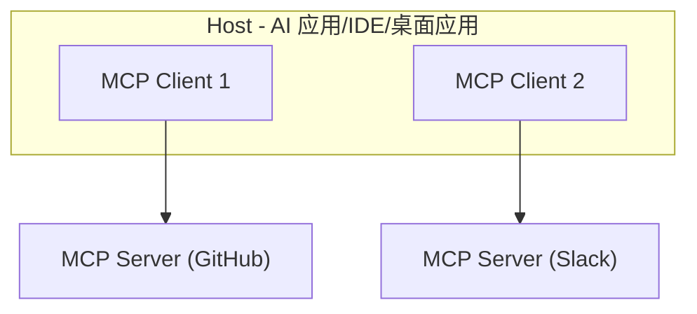
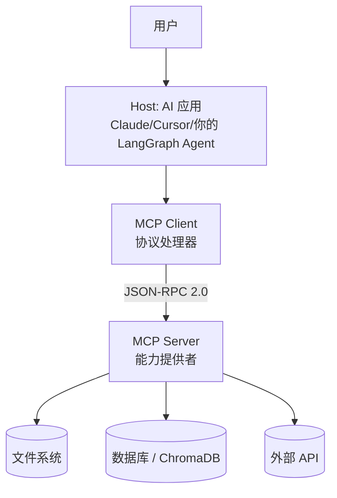
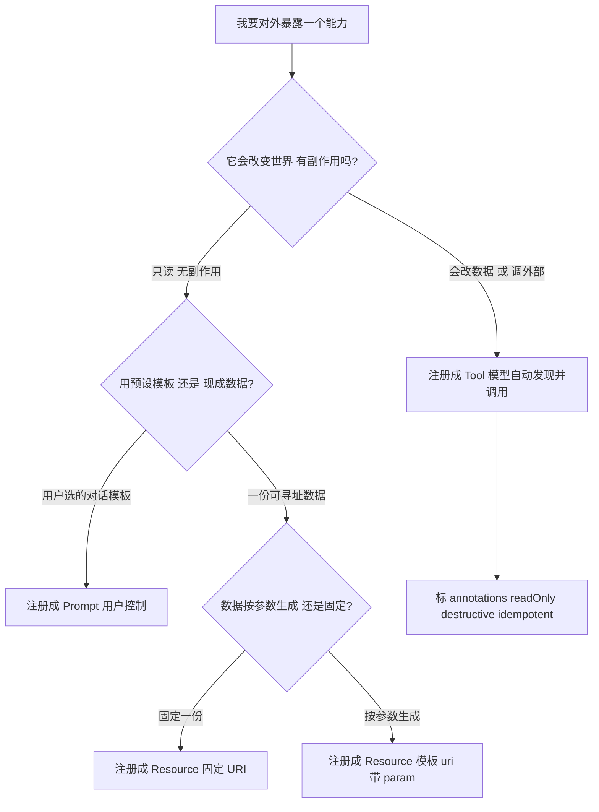
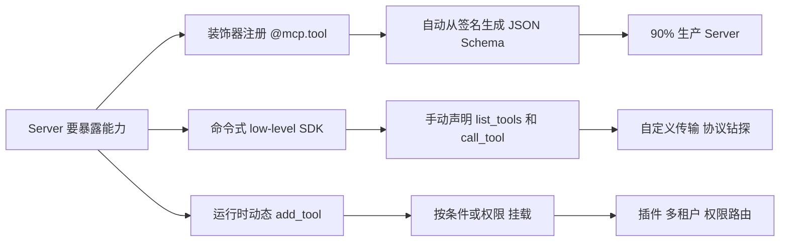

# MCP 协议核心概念

MCP（Model Context Protocol）是由 Anthropic 于 2024 年底提出的开放协议标准，旨在统一 LLM 与外部数据源和工具的连接方式。可以把它理解为 **AI 应用的 USB-C 接口**。

## 为什么需要 MCP？

### 现状：碎片化集成

每个 AI 应用需要为每个工具/数据源编写专门的集成代码：

```text
AI 应用 A → 专用集成 → GitHub
AI 应用 A → 专用集成 → Slack
AI 应用 A → 专用集成 → 数据库
AI 应用 B → 专用集成 → GitHub    (重复开发)
AI 应用 B → 专用集成 → Slack     (重复开发)
```

### MCP 的解决方案

```text
AI 应用 → MCP Client → MCP Server（GitHub）→ GitHub API
AI 应用 → MCP Client → MCP Server（Slack）→ Slack API
AI 应用 → MCP Client → MCP Server（数据库）→ DB
```

**一次开发，处处可用。** MCP Server 开发者只需实现标准协议，所有支持 MCP 的 AI 应用都能直接使用。

## MCP 架构



| 角色 | 说明 | 示例 |
| ------ | ------ | ------ |
| Host | 宿主应用，管理 MCP Client | Claude Desktop, Cursor IDE |
| Client | 与 MCP Server 保持 1:1 连接 | Host 内部组件 |
| Server | 提供工具、资源和提示 | GitHub MCP Server, 文件系统 MCP Server |

## MCP 三大核心能力

### 1. Tools 工具

类似 Function Calling，允许 LLM 调用外部函数。

```json
{
  "name": "create_issue",
  "description": "在 GitHub 仓库中创建 Issue",
  "inputSchema": {
    "type": "object",
    "properties": {
      "owner": {"type": "string", "description": "仓库所有者"},
      "repo": {"type": "string", "description": "仓库名称"},
      "title": {"type": "string", "description": "Issue 标题"},
      "body": {"type": "string", "description": "Issue 内容"}
    },
    "required": ["owner", "repo", "title"]
  }
}
```

### 2. Resources 资源

提供对数据源的**只读访问**，类似 GET 请求。

| 维度 | Resources | Tools |
| ------ | ----------- | ------- |
| 操作 | 只读 | 读写都可 |
| 类比 | REST GET | REST POST/PUT/DELETE |
| 触发方式 | 应用/用户选择 | LLM 决定调用 |
| 安全级别 | 低风险 | 需要更多控制 |

### 3. Prompts 提示模板

MCP Server 可以提供预定义的提示模板，帮助 LLM 更好地使用其工具。

## MCP vs Function Calling

| 维度 | Function Calling | MCP |
| ------ | ----------------- | ----- |
| 标准化 | 各厂商 API 不同 | 统一开放协议 |
| 发现机制 | 静态定义 | 动态发现（运行时获取工具列表） |
| 传输方式 | HTTP API | stdio / HTTP + SSE |
| 资源管理 | 无 | 内置 Resources |
| 提示管理 | 无 | 内置 Prompts |
| 生态 | 各自为政 | 统一生态 |
| 安全模型 | 各自实现 | 协议级规范 |

## 实际 MCP 示例

### 文件系统 MCP Server
- read_file: 读取文件内容
- write_file: 写入文件
- list_directory: 列出目录内容
- search_files: 搜索文件

### GitHub MCP Server
- create_issue: 创建 Issue
- list_issues: 列出 Issues
- create_pull_request: 创建 PR
- search_code: 搜索代码

---

---

> **本篇建立在哪篇之上**：④ 工具系统（MCP 本质是把「工具怎么暴露给模型」标准化）+ ③ Agent 四要素（MCP 是 Agent 调用外部能力的「接线规范」，建立在 Agent 已有 LLM + 工具 + 规划的认知上）。本篇**当场讲清**的概念：MCP 全称、Host/Client/Server 三角色、Tools/Resources/Prompts 三能力、JSON-RPC 2.0、Streamable HTTP、initialize 握手、以及和 Function Calling / A2A 的层级关系。需要的基础：知道「Agent 靠调工具办事」（③ ④），本篇把它拔高到「跨应用、跨服务的工具治理层」。  
> **目标**：零基础读者读完，能讲清 MCP 解决什么问题、它和 Function Calling 到底啥关系（不取代）、协议由哪几层组成、2026 最新演进，并在里把这道最高频题答得有层次。  
> **优先级**：🔴 高优 —— 比常规更详细，多拆原理、补演进、给边界情形。

---

## 0. 先别急着记定义，看一个生活场景

你家里电器越来越多：手机要充电、笔记本要供电、耳机要充电、剃须刀也要充电。如果每个厂家都搞自己的接口——手机的口是圆的、笔记本的口是扁的、耳机的口是三角的——那你家抽屉里得塞一抽屉不同的线，每换一个设备就翻一次。

**MCP（Model Context Protocol，模型上下文协议）** 想干的事，就相当于给 AI 世界的「工具接口」统一成 **USB-C**：不管后面是数据库、文件系统还是某个 SaaS API，只要它按 MCP 标准暴露能力，前面那个 AI 应用（Host）就能用同一套「插法」连上它，不用为每个工具单独写一套适配代码。

所以记住第一句话：**MCP 不是让模型变聪明，也不是替代 Function Calling，它是一套「接线规范」**。

---

## 1. 为什么需要 MCP：N×M 的集成噩梦

在 MCP 出现之前，让 AI 连外部工具是这样的：

- 你想让 Claude Desktop 读本地文件 → 写一套适配
- 你想让 Cursor 连同一个数据库 → 再写一套
- 你自己用 LangGraph 搭的 Agent 要查 GitHub → 又封一层

工具少的时候还能忍。工具一多、宿主（Host）一多，维护成本爆表：**参数变了要改、鉴权变了要改、宿主换了还要改**。这就是经典的 **N×M 问题**：N 个 AI 应用 × M 个工具 = N×M 套私有对接代码。

MCP 的解法：**在中间插一层标准协议**。工具团队把能力封成 MCP Server（一次开发）；AI 应用（Host）通过 MCP Client 连上来，动态发现并调用。两边从此不用每次重新商量私有接口——**让工具开发和 Agent 开发解耦**。

> 类比再升级：Function Calling 像「手机语音助手只能控制本机 App」；MCP 像「蓝牙协议，让任何手机连任何耳机」。一个是「这台机器怎么做事」，一个是「不同机器之间怎么互相连」。

---

## 2. MCP 到底是什么（先拆全称 + 角色三角）

**MCP = Model Context Protocol，中文一般叫「模型上下文协议」**。把三个词拆开看：

- **Model**：面向大模型应用；
- **Context**：把外部上下文、工具、数据源「带」给模型；
- **Protocol**：用一套标准协议把交互方式定下来。

更准确地说：MCP 是 **MCP Client 和 MCP Server 之间的通信协议**。不要把它理解成「给模型加插件」这么简单。Host 负责承载用户交互和模型调用，Client 负责和 Server 说话，Server 负责把具体能力暴露出来。

**三个核心角色（必背）**：

| 角色 | 是什么 | 例子 |
|-|-|-|
| **MCP Host（宿主）** | 运行 AI 模型的环境，用户直接面对的应用 | Claude Desktop、Cursor、VS Code AI 插件、ChatGPT 桌面端，或**你自己用 LangGraph 搭的 Agent 平台** |
| **MCP Client（客户端）** | 嵌在 Host 内部、负责和 Server 通信的那一层 | 通常**每个 Server 对应一个 Client 会话**；你看不到它，一般也不用自己写 |
| **MCP Server（服务端）** | 轻量服务，按 MCP 标准把能力（工具 / 资源 / 提示词）暴露出去 | 开发者最常接触的就是它 |

> 注意：Host **不是直接「裸连」所有工具**。它先通过 Client 连到 Server，Server 再去碰真实数据源（文件、数据库、第三方 API）。这一层抽象让边界变清楚：AI 应用只认 MCP，底层怎么查库怎么调 API 由 Server 自己处理。



---

## 3. 核心问题：MCP vs Function Calling（最高频）

> 这是最爱问、也最容易答混的一题。很多人以为「有了 MCP 就不需要 Function Calling 了」——**错**。

### 3.1 一句话总结（背这个版本）

- **Function Calling（函数调用）**：模型如何「表达我要调用哪个函数、用什么参数」（输出结构化 JSON）。
- **MCP（模型上下文协议）**：工具如何「被统一规范地暴露给模型——发现、连接、调用、管理」。

它们解决的是**不同层**的问题：

| 维度 | Function Calling | MCP |
|-|-|-|
| 本质 | 结构化的工具调用**输出格式** | 工具 / 数据源接入模型的**协议标准** |
| 解决问题 | 模型怎么表达「我要调工具」 | 工具怎么以统一方式**暴露**给模型 |
| 定位层级 | 模型输出层 / 交互层 | 平台层 / 工具治理层 |
| 作用范围 | 单个 AI 应用**内部** | 跨 AI 应用、跨语言、跨团队 |
| 工具复用 | 同一工具代码无法跨应用复用 | 工具一次开发，所有 MCP Host 都能用 |
| 部署方式 | 工具逻辑与 AI 应用**耦合**部署 | 工具作为独立 MCP Server **独立**部署维护 |
| 实现语言 | 通常与宿主应用同语言 | 任意语言均可实现 Server（Python/TS/Go…） |
| 工具发现 | 通常**写死**在代码里 | 支持**运行时动态发现**（tools/list） |
| 权限 / 认证 | 由应用自己实现 | 协议层支持更规范的模式（OAuth 2.1 / JWT） |
| 跨设备调用 | 限于本地环境 | 支持远程 / 云工具调用 |
| 生态依赖 | 深度绑定具体 LLM 平台（如 OpenAI） | 模型无关，工具方可跨平台复用 |

### 3.2 最直观的理解：通话方式 vs 标准插槽

- Function Calling 是 **LLM 调用工具的「通话方式」**（模型输出 `{name, arguments}` 这段 JSON，系统去执行）。
- MCP 是工具服务的 **「标准插槽」**（Server 按规范暴露能力，Host 插上就能用）。

关键结论：**MCP Server 内部实现工具时，仍然用到 Function Calling 的思想**。两者是上下游、互补关系，不是一个取代另一个：

```text
用户请求 → 大模型生成 Function Calling → 转换为 MCP 请求 → 调用工具 → 结果经 MCP 返回 → 模型回答
```

- Function Calling 负责「解析用户意图、产出结构化参数」；
- MCP 负责「把这次调用接到外部系统上、做发现与治理」。

### 3.3 什么时候该用哪个（选型指南）

| 场景 | 推荐 | 原因 |
|-|-|-|
| 快速验证单一模型能力 | Function Calling | 开发简单，无额外协议开销 |
| 企业级多工具集成 | MCP | 避免供应商锁定，支持未来换模型 |
| 严格权限控制的金融场景 | MCP + Function Calling | MCP 协议层做审计，Function Calling 做解析 |
| 跨平台智能硬件控制 | 纯 MCP | 设备-模型-云标准化通信 |


---

## 4. MCP 协议组成（本篇重点，逐层拆）

### 4.1 三类核心能力（Primitives）：Tools / Resources / Prompts

MCP Server 向 Host 暴露三类标准能力（常考，配生活类比记忆）：

| 能力 | 是什么 | 触发方 | 生活类比 | 例子 |
|-|-|-|-|-|
| **Tools（工具）** | 可调用函数，LLM 主动触发的**动作** | LLM 按用户意图自主决定 | **手**：去切菜、拌料、下单 | executeSQL、sendEmail、callRestAPI |
| **Resources（资源）** | 只读内容，供 LLM **获取上下文** | LLM 或 Host 按需读取 | **眼 / 食材**：冰箱里有什么 | 数据库 Schema、配置文件、日志片段 |
| **Prompts（提示词）** | 可参数化的**提示词模板**，供 Host 复用 | Host 在特定场景调用 | **词典 / 家训**：少放辣 | 代码 Review 模板、SQL 优化提示 |

要点：

- **Tools** 通常**有副作用**（写库、发邮件、调 API），是「会动外部世界」的。
- **Resources** 是**只读**上下文，类似文件，给模型「看」和推理。
- **Prompts** 把固定任务沉淀成模板，避免每次让用户重写。

> 反例警示：工具名 / description / 参数说明写错，模型就会选错工具（比如把「黄瓜」描述成「西红柿」）。生产里这就是真实 bug：工具名不清楚、参数模糊、返回结构不稳，都会让 Agent 做奇怪选择。**工具描述写得好不好，直接决定模型选得准不准**。

### 4.2 反向能力（Client 给 Server 的）：Roots / Sampling / Elicitation

除了 Server 给模型的能力，Client 侧也能反向给 Server 提供一些能力（加分）：

- **Roots（根目录）**：Host 通过 Client 告诉 Server「你只能在这些目录范围内工作」。例如只允许访问当前项目目录——这是**安全边界**。
- **Sampling（采样 / 反向 LLM 调用）**：Server 可以**反向请求 Host 侧的 LLM 做一次生成**。比如 Server 读到一段日志，借模型做摘要——这样 Server 自己**不用维护 LLM 连接和 API Key**。
- **Elicitation（询问 / 补充采集）**：Server 在执行中向用户**补充询问信息**（参数不完整、选项有歧义、执行前需确认）。由 Host 侧展示交互，扩展人机闭环。

> ⚠️ **2026-07-28 RC 提示（边界情形）：在 2026-07-28 Release Candidate 中，Roots / Sampling / Logging 被标记为 Deprecated（弃用候选）**，进入至少 12 个月的过渡期（来源：mcp.directory、blog.modelcontextprotocol.io 2026-07-28 RC 公告）。方向是：Roots 改用显式工具参数 / 资源 URI；Logging 改用 stderr 或 OpenTelemetry；Sampling 改走直接 LLM API 调用。你现在学的仍然有效（过渡期内照常工作），但做新项目要知道它们未来会迁移。

### 4.3 传输层：stdio / Streamable HTTP / SSE

MCP 底层通信是 **JSON-RPC 2.0**（见 4.4），但它不绑定某种传输方式。三种传输：

| 传输方式 | 适用场景 | 说明 |
|-|-|-|
| **stdio（标准输入输出）** | 本地 IDE / 个人使用 | Client 把 Server 当本地子进程启动，通过 stdin/stdout 通信，延迟低，不支持远程 |
| **Streamable HTTP** | 生产环境（**推荐**） | 2025-03-26 新规范，单一 `/mcp` 端点，支持 POST/GET 与 SSE 流式，可无状态部署在负载均衡后 |
| **SSE（Server-Sent Events）** | 兼容旧系统 | 早期 HTTP+SSE 两端点架构，已被 Streamable HTTP 取代，仍广泛兼容 |

> 选型口诀：**本地工具 / 文件 / 个人用 → stdio；团队服务 / 远程 API / 多用户 → Streamable HTTP**。涉及写操作和敏感数据，不管哪种传输都要额外做鉴权、限流、审计。

> stdio 易踩坑：**别往 stdout 打调试日志**。stdio 模式下 stdout 是 JSON-RPC 消息通道，随手 `print()` 一句就会污染消息流，导致 Host 解析失败、Server 断连。日志写 stderr 或文件。

### 4.4 通信格式：JSON-RPC 2.0（骨架级）

MCP 用 **JSON-RPC 2.0**（JSON Remote Procedure Call，轻量远程过程调用）做消息封装。REST 偏资源（`/users/1`），JSON-RPC 偏方法调用（`tools/call`、`resources/read`）—— 天然贴合「我要执行某个动作」。

工具调用请求骨架：

```json
{
  "jsonrpc": "2.0",
  "method": "tools/call",
  "params": { "name": "read_file", "arguments": { "path": "/path/to/file.txt" } },
  "id": 1
}
```

成功响应（走 `result`）：

```json
{
  "jsonrpc": "2.0",
  "id": 1,
  "result": { "content": [ { "type": "text", "text": "文件内容..." } ] }
}
```

失败响应（走 `error`，不要和 result 同时出现）：

```json
{ "jsonrpc": "2.0", "id": 1, "error": { "code": -32602, "message": "Invalid params" } }
```

> 小坑：成功响应里**不要同时写 `result` 和 `error: null`**。JSON-RPC 2.0 成功走 `result`、失败走 `error`，二选一。JSON-RPC 优点：轻量、纯文本、易打日志、不强绑定传输；缺点：不像 gRPC 有强 IDL 和编译期类型约束——**Server 侧仍要做严格参数校验，别指望模型自觉传对**。

### 4.5 初始化握手生命周期

正式调用工具前，Client 和 Server 会先完成**初始化握手（initialize handshake）**：

1. Client 发 `initialize` 请求，带上自己支持的协议版本和能力列表；
2. Server 返回自己支持的协议版本、能力和基础信息；
3. Client 再发 `initialized` 通知，双方进入可用状态。

这一步的意义：Client 由此知道 Server 支持哪些能力（只有 Tools？还是有 Resources 和 Prompts？），Server 也知道 Client 的限制。**很多「Server 配好了但工具没出现」的问题，排查都应先看初始化阶段有没有失败**。

> ⚠️ **2026-07-28 RC 变化（边界情形）**：在 2026-07-28 RC 中，`initialize`/`initialized` 握手和 `Mcp-Session-Id`**被移除**（来源：blog.modelcontextprotocol.io 2026-07-28 RC）。协议版本、client info、capabilities 改到每个请求的 `_meta` 里携带，新增 `server/discover` 方法做能力发现。这是**破坏性变更**，7/28 才定稿；当前（2026-07-16）主流 SDK 仍实现 2025-11-25 的握手版，学本篇以稳定版为准，落地前确认 SDK 口径。

### 4.6 Tool Annotations：让 Client 帮你做治理（边界情形）

FastMCP / 规范支持给工具打**注解（annotations）**：`readOnlyHint`（只读）、`destructiveHint`（破坏性强）、`idempotencyHint`（幂等）、`openWorldHint`（面向开放世界）。这些元数据让 Client 端**自动批准低风险操作、强制确认**危险操作——是工具治理的基础（来源：gofastmcp.com 授权文档；coles.codes《Building and securing MCP servers》）。

> 加分点：这正好衔接上一篇 ⑦——工具「该不该让人确认」不该写死在模型 Prompt 里，而该由协议层的注解驱动 Client 决策。

---

## 5. 规范演进时间线（高优补充，体现时效性）

MCP 从 2024-11 开源到 2026 成为基础设施，是软件史上最快的协议采用之一：

| 时间 | 版本 / 事件 | 影响 |
|-|-|-|
| 2024-11-25 | Anthropic 开源 MCP，首发 stdio 传输 + Python/TS SDK + 5 个参考 Server | 本地工具集成基础 |
| 2025-02 \~ 03 | Zed / Replit / Codeium 支持；**OpenAI 宣布支持**（Agents SDK + ChatGPT 桌面端） | 成为事实标准（双巨头背书） |
| 2025-03-26 | 引入 **Streamable HTTP**，取代旧 HTTP+SSE 两端点 | 远程生产部署标准化 |
| 2025-06-18 | 加入 **Elicitation**、Resource Indicators（RFC 8707，修复 token 跨服务泄露） | 企业级安全 + 人机闭环 |
| 2025-11-25 | v2025-11-25：OpenID Connect 发现、增量授权（最小权限）、URL Mode Elicitation、实验性 Tasks、双向 Sampling | 从单向调用走向协调层（**当前稳定版**） |
| 2025-12 | Anthropic 将 MCP 捐给 **Linux Foundation / Agentic AI Foundation**（与 OpenAI、Google、Microsoft 等共建） | 治理中立化 |
| 2026 Q1 | 社区注册表索引 **18,000+ MCP Server**；SDK 月下载量达数千万（Python + TS） | 生态规模化 |
| **2026-07-28（RC）** | **无状态核心**：移除 initialize 握手与 Mcp-Session-Id；新增 Mcp-Method/Mcp-Name 路由头、ttlMs/cacheScope 缓存、W3C Trace Context；Roots/Sampling/Logging 弃用；MCP Apps + Tasks 升级为扩展；授权对齐 OAuth 2.1/OIDC | **破坏性变更，7/28 定稿**，详见下节 |

> 一句话：MCP 还在快速演进，**落地前先确认你用的客户端和 SDK 版本支持的规范口径**（2025-06-18 之后新增的 Elicitation 等，旧教程不一定覆盖；2026-07-28 的破坏性改动更要注意）。

---

## 6. 2026-07-28 无状态 RC：到底改了什么（🔴 高优·演进脉络）

截至 2026-07-16，MCP 维护者已发布 **2026-07-28 Release Candidate**（最终规范将于 7/28 定稿）。这是自发布以来最大的一次修订，核心是「**协议层无状态**」（来源：blog.modelcontextprotocol.io 2026-07-28 RC 公告；mcp.directory 解读；oracore.dev 速览）。五个支柱：

1. **无状态核心（Stateless core）**：`SEP-2575` 移除 `initialize`/`initialized` 握手，`SEP-2567` 移除 `Mcp-Session-Id`。协议版本、client info、capabilities 改走每个请求的 `_meta`；新增 `server/discover` 做能力发现。结果：**任意 MCP 请求可落到任意 Server 实例**，不再需要粘性路由和共享会话存储。
2. **可运维层（Operability）**：Streamable HTTP 请求必须带 `Mcp-Method` 和 `Mcp-Name` 头（`SEP-2243`），让网关 / 限流器在**不解析 body** 的情况下路由；新增 `ttlMs` / `cacheScope`（`SEP-2549`）做 tools/list 缓存；W3C Trace Context 经 `_meta` 传播（`SEP-414`）。
3. **扩展框架（Extensions）：反向 DNS 标识的扩展，经能力协商；MCP Apps**（Server 渲染交互式 HTML，沙箱 iframe）和 **Tasks**（长任务扩展）成为首批官方扩展。
4. **授权硬化（Auth hardening）**：6 个 SEP 让 MCP 对齐 OAuth 2.1 / OpenID Connect，含按 RFC 9207 的 iss 校验。
5. **弃用策略（Deprecation policy）**：`SEP-2596` 保证弃用到移除至少 12 个月窗口。

> **对 Server 设计的影响（和你项目强相关）：无状态核心移除协议级会话，不代表应用层不能持有状态**——需要跨调用保持状态时，用「显式句柄」模式：工具返回一个 `handle_id`，模型在后续调用里把它当普通参数传回（来源：blog.modelcontextprotocol.io「Stateless protocol, stateful applications」）。这正好和你项目「JWT + contextvars 每请求携带 tenant_id」的写法天然契合——你的应用状态本来就不在协议层，而在每请求的 JWT 里。

> **边界提醒**：这是 RC，不是最终稳定版；`GET /mcp` 长连接流端点也被移除。生产项目现在仍以 2025-11-25 稳定版落地，等 7/28 定稿后按迁移清单（移除 Mcp-Session-Id 依赖、加 Mcp-Method/Mcp-Name 头、给 list 响应加 ttlMs）升级。

---

## 7. MCP vs A2A：纵向 vs 横向（高优补充，加分）

2025-04 Google 发布 **A2A（Agent-to-Agent，智能体间协议）。它和 MCP 竞争吗？不** —— 它们在不同层，是互补的双层方案：

| 维度 | MCP | A2A |
|-|-|-|
| 核心关注 | 工具 / 资源**访问**（纵向） | 智能体**间协作**（横向） |
| 通信方向 | 纵向：Agent → 资源 | 横向：Agent ↔ Agent |
| 状态模型 | 基本无状态（请求-响应） | 有状态任务生命周期（submitted→working→completed） |
| 服务发现 | `mcp://` Server URL | Agent Card（`/.well-known/agent.json`） |
| 起源 | Anthropic（2024-11） | Google（2025-04） |

> 一句话区分：**MCP 取数据，A2A 派任务**。简单查数据库用 MCP；需要另一个有独立推理能力的 Agent 处理复杂任务，用 A2A。实战里常组合：编排 Agent 用 A2A 收到委派任务，内部再用 MCP 去查数据库、调 API。A2A 官方原话：「MCP provides helpful tools and context to agents; A2A provides agent-to-agent communication.」

---

## 8. 与 Agent / Skills 的分层关系

很多人第一次学会把 MCP、Function Calling、Agent、Skills 混在一起。它们不在同一层：

- **Function Calling**：模型怎么表达「我想调工具」（输出结构化调用）。
- **MCP**：这个工具从哪来、怎么被宿主发现、怎么真正连到后端（接线规范）。
- **Agent**：再往上一层，关注「任务怎么一步步做完」—— 规划步骤、调工具、读结果、维护记忆、做循环、等人工确认。
- **Skills**：在 MCP 之上的**知识打包层**（不是新协议），把领域知识模块化（如微软 Agent Skills 框架 134+ 模块）。

> 最容易踩的坑：把 MCP 当成「模型调用工具」的全部过程。其实模型只负责生成调用意图，MCP 负责把调用接到外部系统。三者经常一起用，只是各管一段。

---

## 9. 边界情形：什么时候「不该」用 MCP / 容易踩的坑

- **不该用 MCP 的场景**：单模型快速验证、工具只在某一个应用内部用且永不跨应用——直接 Function Calling 更简单，引入 MCP 是过度设计。
- **工具描述写错**：模型按 description 选工具，描述模糊 → 选错（如把 `search_order` 当 `delete_order`）。要把工具当「给模型的 API 文档」认真写。
- **认模型参数默认可信**：读文件限目录、查 SQL 参数化、高危操作审批、返回脱敏，后端安全习惯一个不能少。
- **stdio 下随便 print**：会断连，日志走 stderr / 文件。
- **把状态塞进协议会话**：一旦未来迁移到 2026-07-28 无状态核心，依赖 Mcp-Session-Id 的状态会断裂；应用状态请用显式句柄 / JWT 携带。

---

## 10. 常见误区（避坑）

1. **「有了 MCP 就不需要 Function Calling」** —— 错。MCP Server 内部实现工具时仍用 Function Calling 思想，二者互补。
2. **「MCP 是 USB-C，什么都能统一」** —— 夸张。它先解决的是工具接入的重复适配问题，不是万能协议；单应用内部用 Function Calling 更轻。
3. **「模型传来的参数默认可信」** —— 危险。后端安全习惯（限目录 / 参数化 / 审批 / 脱敏）一个不能少。
4. **「Server 能跑就行」** —— 不够。工具描述写不清，模型就选错；要做成「模型看得懂、选得准、用得安全」的形式。
5. **「stdio 下随便 print 调试」** —— 会断连。日志写 stderr / 文件。
6. **「MCP 永远有状态会话」** —— 过时认知。2026-07-28 RC 已转向无状态核心，应用状态自己用显式句柄管。

---

## 11. 核心要点

- **一句话**：Function Calling 是模型调工具的「通话方式」，MCP 是工具接入的「标准插槽」，不同层、互补。
- **三角色**：Host（AI 应用）/ Client（协议处理器）/ Server（能力提供者）。
- **三能力**：Tools（手，有副作用）/ Resources（眼，只读）/ Prompts（词典，模板）。
- **反向三能力**：Roots（目录边界）/ Sampling（反向调 LLM）/ Elicitation（向用户追问）—— 注意 2026-07-28 RC 中三者进入弃用过渡期。
- **通信**：JSON-RPC 2.0；传输 stdio（本地）/ Streamable HTTP（生产，单 `/mcp` 端点）。
- **握手（稳定版）**：initialize → 交换版本能力 → initialized → 可用（RC 版已移除，改 `_meta` + `server/discover`）。
- **演进关键日**：2024-11-25 开源；2025-03-26 Streamable HTTP；2025-06-18 Elicitation；2025-11-25 双向能力（稳定版）；2025-12 捐 Linux 基金会；**2026-07-28 无状态 RC（破坏性，7/28 定稿）**。
- **MCP vs A2A**：纵向取数据 vs 横向派任务，互补不竞争。
- **治理**：Tool Annotations 驱动 Client 自动批准 / 确认。

---

## 12. 简历项目绑定：具体改进方向

你的简历项目 `ai-resume-analyzer`（v0.2.0）**已真实实现 MCP Server（Phase 2）**：FastMCP + JWT 中间件 + contextvars 用户上下文，Streamable HTTP 挂载 `/mcp`；5 Tool（`search_knowledge_base`/`rerank_results`/`generate_answer`/`analyze_resume`/`rewrite_query`）+ 2 Resource（`resume://list` / `qa_history://{resume_id}`）；Client 走 `httpx.AsyncClient` + JSON-RPC 2.0（JSON/SSE 双格式）+ 单例 + 降级。基于本篇协议知识，有 3 个**具体可落地的改进点**：

**改进 1：给 5 个 Tool 补 Tool Annotations（零成本治理）**

- **差距**：你的工具目前没打 `readOnlyHint` / `idempotencyHint` 注解（gofastmcp.com 已支持）。Client（如 Claude Desktop）无法据此自动批准低风险、要求确认危险操作。
- **改动**：在 `mcp_nodes.py` 的 `@mcp.tool` 上补注解——`search_knowledge_base`/`rerank_results` 标 `readOnlyHint=True`；`generate_answer`/`analyze_resume`/`rewrite_query` 标 `idempotencyHint=True`。
- **风险**：极低（纯元数据）。
- **收益**：客户端自动治理；一句话讲清「我给工具做了能力注解，低风险自动放行、高风险弹确认，和 MCP 协议治理思路对齐」。

**改进 2：让 Server 对齐 2026-07-28 无状态 RC（前瞻改造）**

- **差距**：你的 Streamable HTTP Server 若依赖协议级会话（Mcp-Session-Id）/ 在会话里存状态，等 7/28 定稿的 RC 升级会断。
- **改动**：确认 `mcp_graph.py` / FastMCP 配置里**状态不依赖协议会话**——你的 tenant_id 已通过 JWT + contextvars 每请求携带，天然契合无状态。再给 `tools/list` 响应补 `ttlMs`（如 60000）+ `cacheScope: "user"`，并规划加 `Mcp-Method`/`Mcp-Name` 兼容头（待 FastMCP 升级）。文件定位：`main.py` 的 `mount("/mcp", ...)` 周围。
- **风险**：中；需等 FastMCP 正式支持 RC 后再切，期间保持 2025-11-25 稳定版。
- **收益**：未来可跑在普通轮询负载均衡后、免粘性会话；能讲「我关注并提前对齐了 MCP 2026 无状态 RC，应用状态走 JWT 不依赖协议会话」。

**改进 3：补 Resource 的缓存元数据 + W3C Trace 透传（可观测性）**

- **差距**：2 个 Resource（`resume://list` / `qa_history://{resume_id}`）没标缓存新鲜度；你虽有 X-Request-ID，但没在 MCP `_meta` 里透传 trace。
- **改动**：给 Resource 读响应加 `ttlMs`/`cacheScope`；在 `mcp_graph.py` 的 JSON-RPC 调用里把 X-Request-ID 写进 `_meta.traceparent`，让 MCP 调用链在 OpenTelemetry 里成树。
- **风险**：低。
- **收益**：减少重复拉取、链路可观测；一句话讲清「我给 Resource 加了缓存元数据，并把 trace 透传到 MCP 调用链」。

---

## 下一篇预告

下一篇 **⑨ MCP Server 实现（FastMCP + JWT 认证中间件 + contextvars）🔴 高优**——本篇你学会了「MCP 协议长什么样、解决什么问题」。下一篇我们动手：怎么用 Python 的 **FastMCP** 几行代码把一个 MCP Server 写出来，再给它在工具之前装上 **JWT 认证中间件** 和 **contextvars 多租户隔离**——也就是你简历项目里那套真实落地的「开门上锁」机制。带着本篇的协议组成基础，下一篇的实现细节会非常好懂。

---

> **本篇建立在哪篇之上**：⑧ MCP 协议（三原语 Tool/Resource/Prompt 的概念、JSON-RPC 是什么）、⑨ MCP Server 实现（FastMCP 怎么定义工具、JWT + contextvars 多租户）、⑪ MCP Client 调用（客户端怎么 list_tools / call_tool、按 id 匹配结果）。需要的基础：知道"函数有名字、参数、返回值"即可，不懂 JSON Schema 也没关系（本篇会当场讲清）。本篇会当场讲清：三原语的控制权区别、每个字段怎么写、`@mcp.tool`/`@mcp.resource` 三种注册方式、以及版本差异红线。  
> **目标**：零基础读者读完，能说清"Tool / Resource / Prompt 到底差在哪""一个 Tool 的完整字段长啥样""三种注册模式怎么选""2025-06-18 才加的 title/outputSchema/structuredContent 红线在哪"，并能讲清 annotations 不可信。

## 0. 先讲人话：Tool、Resource、Prompt 到底都是啥

前面几篇讲了 MCP 是"统一插头标准"（⑧协议）、怎么当插座（⑨Server）、电线怎么走（⑩Transport）、怎么当接线员（⑪Client）。今天讲**插座上到底能插哪几种"插口"**——也就是 MCP Server 能对外暴露的**能力原语（Primitive，原语 = 协议规定的最基本能力单元）**。

想象你开了一家「智能厨房」（MCP Server），给顾客（Host / Agent）提供三种东西：

- **Tool（工具）= 菜谱步骤**：让顾客"做一件事"——炒菜、下单、退款。是**动作**，可能改变世界（也可能搞砸）。对应 `POST` 请求。
- **Resource（资源）= 冰箱里的食材**：给顾客"读一份现成数据"——菜品清单、配置文件、文档内容。是**名词**，只读、无副作用。对应 `GET` 请求。
- **Prompt（提示模板）= 常用话术卡片**：给顾客"一套预设的对话模板"——比如「帮我写周报」的标准开场白。是**模板**，用户按需填空。

> 一句话：Tool 是"做"，Resource 是"读"，Prompt 是"套话"。本篇重点讲 Tool / Resource 的**定义结构**与**注册模式**，Prompt 顺带对比。

## 1. 三种原语的控制权不同（关键区分，必考）

MCP 规范对三者"谁说了算"有明确定位，这是理解它们的核心：

| 原语 | 谁控制（who controls） | 本质 | 有无副作用 | 类比 |
|-|-|-|-|-|
| **Tool** | **模型控制**（Model-controlled） | 执行动作 / 函数 | 可能有（改世界） | 菜谱步骤 / `POST` |
| **Resource** | **应用控制**（Application-controlled） | 读取数据 / 上下文 | 无（只读） | 食材 / `GET` |
| **Prompt** | **用户控制**（User-controlled） | 预设指令模板 | 无 | 话术卡片 |

> 规范原文强调：Tool 是**模型自动发现并调用**的；Resource 由**应用**（Host）决定何时注入上下文；Prompt 由**用户**主动选。这个"控制权"区别决定了你该把能力注册成哪种。（来源：MCP 官方规范 Tools/Resources/Prompts 章节）



（图 1：三原语选择决策流。来源：MCP 官方规范控制权定位 + 本系列设计）

## 2. Tool 定义：一个工具长什么样（逐字段拆解）

Tool 是 Server 暴露给模型调用的"函数"。一个 Tool 的完整定义字段如下（以 2025-06-18 规范为准，版本差异见 §6）：

```json
{
  "name": "get_weather",
  "title": "天气信息提供者",
  "description": "获取某个地点的当前天气信息",
  "inputSchema": {
    "type": "object",
    "properties": { "location": { "type": "string", "description": "城市名或邮编" } },
    "required": ["location"]
  },
  "outputSchema": {
    "type": "object",
    "properties": { "temperature": { "type": "number" } }
  },
  "annotations": {
    "readOnlyHint": true,
    "destructiveHint": false,
    "idempotentHint": true,
    "openWorldHint": false
  }
}
```

逐字段解释（全称 + 通俗）：

- **name（名称）**：工具的**唯一标识符**，模型靠它路由调用（如 `tools/call` 的 `params.name`）。规范建议长度 **1–128 字符、大小写敏感**。（来源：MCP 规范 2025-11-25 draft / SEP-986 工具命名指南）
- **title（显示名，可选）：给人看的友好名（如 UI 展示）。2025-06-18 起引入**，旧版 2024-11-05 没有此字段。
- **description（描述）：人/模型可读的功能说明**——这是 LLM 决定"要不要调这个工具"的关键依据，必须写清楚。
- **inputSchema（输入模式）**：用 **JSON Schema（JSON 模式，一种描述 JSON 数据结构的规范）** 定义参数。默认按 **JSON Schema 2020-12** 解释（若未写 `$schema`）。无参数时写 `{ "type": "object" }`。
- **outputSchema（输出模式，可选）：同样用 JSON Schema 定义返回结构。2025-06-18 起引入**。有了它，Server 应返回符合该模式的结构化结果，Client 也应据此校验。
- **annotations（注解，可选）：描述工具行为的元信息（见 §4）。规范明确：客户端 MUST 视 annotations 为不可信，除非来自可信 Server。**

### 2.1 Tool 调用与结果

客户端发 `tools/call` → Server 回结果。结果可含多类型内容（文本 / 图像 / 音频 / 资源链接 / 嵌入资源），并支持**结构化输出**`structuredContent`（2025-06-18+）。`structuredContent` 是一份可预测结构的 JSON，让模型不必解析非结构化文本。（来源：腾讯云 MCP 演进史 / 掘金 2025-06-18 详解）

### 2.2 错误处理（两种，别混）

- **协议错误（Protocol Error）**：JSON-RPC 标准错误，如未知工具 `-32602 Invalid params`、未知方法 `-32601`。直接走 JSON-RPC 错误通道。
- **工具执行错误（Execution Error）**：工具本身跑起来了但业务失败（API 限流、无效输入），在结果里用 **`isError: true`** 返回，不抛协议错。

> 🔴 **高优细节（2025-11-25 SEP-1303）**：规范**明确建议把"输入校验错误"作为 Tool Execution Error（`isError: true`）返回，而不是 Protocol Error**。原因：模型能读到 `isError` 结果里的错误信息并**自我纠正**；若用协议错，模型拿不到业务上下文。所以"参数不合法"别用 `-32602` 甩锅，写成 `isError:true` 的结果更友好。（来源：MCP changelog SEP-1303）
> 
> 区分点：协议错误 = "调用姿势不对/工具不存在"；执行错误 = "工具跑了但业务挂了"。两者排查路径不同。（来源：MCP 官方规范 Tools 章节）

## 3. Resource 定义：一份只读数据长什么样

Resource 是 Server 暴露的"只读上下文"，通过 **URI（Uniform Resource Identifier，统一资源标识符，类似网址但更通用）** 寻址。

```json
{
  "uri": "file:///project/report.md",
  "name": "项目周报",
  "description": "本周项目进度报告",
  "mimeType": "text/markdown",
  "size": 1024,
  "annotations": { "audience": ["user", "assistant"], "priority": 0.7 }
}
```

逐字段：

- **uri（资源标识）：唯一键**，格式如 `scheme://path`（例：`file:///docs/report.md`、`config://app-settings`）。Server 据此定位并返回内容。
- **name / description**：同 Tool，给人/模型看的名字与说明。
- **mimeType（媒体类型）**：内容格式，如 `text/markdown`、`image/png`，决定客户端怎么渲染。
- **size（大小，可选）**：字节数。
- **annotations（注解，可选）**：与 Tool 共用同一套注解格式（含 audience / priority / lastModified 等元信息）。

### 3.1 Resource 模板（带参数的资源）

单个资源是"一份数据"，但很多数据是按参数生成的（如"读某个路径的文件"）。MCP 支持 **Resource Template（资源模板）**：URI 里用 `{param}` 占位，调用时填实参。

```python
@mcp.resource("file:///{path}")        # 模板：{path} 是参数
def read_file(path: str) -> str:
    """读取指定路径的文件内容"""
    with open(path, encoding="utf-8") as f:
        return f.read()
```

客户端用 `resources/templates/list` 发现模板，用 `resources/read` 带实参读取。（来源：FastMCP 实战 CSDN/掘金、MCP 规范 Resources 章节）

## 4. Tool Annotations（注解）：告诉主机"这工具危险吗"

这是 Tool 专属、也最容易被忽略的字段。四个 hint（提示）描述工具行为，主机（Host）据此决定"要不要弹确认框 / 能不能自动重试"：

| 注解字段 | 含义 | 主机可能的行为 |
|-|-|-|
| `readOnlyHint: true` | 只读，不改世界 | 可自动执行，无需确认 |
| `destructiveHint: true` | 破坏性、不可撤销 | **要求用户明确确认** |
| `idempotentHint: true` | 幂等，重复执行安全 | 可安全重试（呼应第 ⑥⑦⑪ 篇） |
| `openWorldHint: true` | 影响外部开放系统 | 谨慎执行 |

> 🔴 **重要安全提醒（规范原文）：客户端 MUST 把 annotations 当不可信**，除非来自可信 Server。即"工具自己说自己只读"不等于真只读——主机仍要按第 ⑦ 篇的"三道闸门"做确认与权限控制。这是常见坑：annotations 是"建议"，不是"保证"。

## 5. 注册模式：怎么把能力"挂"到 Server 上

"定义"解决了"长啥样"，"注册"解决"怎么让 Server 认领它"。常见三种模式：

### 5.1 装饰器注册（FastMCP，最常用，推荐）

```python
from fastmcp import FastMCP
mcp = FastMCP("MyServer")

@mcp.tool()                      # 注册为 Tool
def search(q: str) -> str:
    """在知识库检索"""
    ...

@mcp.resource("config://settings")   # 注册为 Resource（URI 作参数）
def get_settings() -> str:
    """返回配置"""
    ...
```

FastMCP 会**自动从函数签名 + 类型注解 + docstring 生成符合规范的 JSON Schema**（inputSchema）。支持同步 / `async def`，同步函数丢进内置线程池不阻塞事件循环。（来源：FastMCP 实战 CSDN/掘金）

### 5.2 命令式 / 底层 SDK 注册（精细控制）

不依赖装饰器，用底层 `mcp.server.low_level` 手动声明：

```python
from mcp.server.low_level import Server
server = Server("raw")

@server.list_tools()
async def list_tools(): ...
@server.call_tool()
async def call_tool(name, arguments): ...
```

适合要完全控制协议行为、写自定义传输或极特殊 Server 的场景（呼应第 ⑨ 篇"何时用 raw SDK"）。

### 5.3 运行时动态注册（按需挂载）

能力不是写死在代码里，而是运行时根据条件 `add` 上去：

```python
mcp.add_tool(search_fn)         # 运行时把函数注册成 Tool
```

适合**插件化 / 多租户 / 按权限动态暴露能力**——比如不同租户只看到自己被授权的工具（呼应第 ⑨ 篇 contextvars 多租户隔离）。

### 5.4 三种模式对比

| 模式 | 上手 | Schema 生成 | 控制粒度 | 适用 |
|-|-|-|-|-|
| 装饰器（FastMCP） | 极简 | 自动 | 中 | 90% 生产 Server |
| 命令式（low-level SDK） | 复杂 | 手动 | 细 | 自定义传输 / 协议钻探 |
| 运行时动态 | 中 | 看写法 | 动态 | 插件 / 多租户 / 权限路由 |



（图 2：三种注册模式与适用场景。来源：FastMCP 实战、第 ⑨ 篇）

## 6. 版本差异（准确性红线，务必分清）

MCP 规范演进快，字段随版本变。写代码前先确认目标版本：

| 字段 / 能力 | 2024-11-05 | 2025-06-18 | 2025-11-25 | 2026-07-28 RC |
|-|-|-|-|-|
| `name` / `description` / `inputSchema` | ✅ | ✅ | ✅ | ✅ |
| `title`（显示名） | ❌ | ✅ 新增 | ✅ | ✅ |
| `outputSchema` | ❌ | ✅ 新增 | ✅ | ✅ |
| `structuredContent`（结构化输出） | ❌ | ✅ 新增 | ✅ | ✅ |
| `annotations`（四 hint） | 部分 | ✅ | ✅ | ✅ |
| Resource 模板 `{param}` | ✅ | ✅ | ✅ | ✅ |
| JSON-RPC 批处理 | ❌ | ❌（2025-03-26 加、本版移除） | ❌ | ❌ |
| JSON Schema 默认 2020-12 | ❌ | ❌ | ✅（SEP-1613） | ✅ |
| 输入错误→`isError`（SEP-1303） | ❌ | ❌ | ✅ 建议 | ✅ |
| 工具图标 metadata（SEP-973） | ❌ | ❌ | ✅ | ✅ |
| `tools/list` 缓存 `ttlMs`/`cacheScope` | 基础分页 | 基础 | 增强 | ✅（正式） |
| Resumable SSE / `Last-Event-ID` | ✅ | ✅ | ✅ | ❌ 移除 |

> 🔴 **实战建议**：**以你依赖的 SDK / Server 实际支持版本为准**。写 `outputSchema` / `title` 时若对接旧版客户端可能不识别——先 `initialize` 协商 `protocolVersion`（见第 ⑧ 篇握手）。如不确定，标注"以官方文档为准"。2026-07-28 是 RC（最终版同日发布），生产建议先锁 2025-11-25。

## 7. 简历项目绑定：具体改进方向

基于你项目 `ai-resume-analyzer` 的真实情况（FastMCP Server，5 Tool：`search_knowledge_base`/`rerank_results`/`generate_answer`/`analyze_resume`/`rewrite_query`；2 Resource：`resume://list` / `qa_history://{resume_id}`），对照最佳实践有 4 个具体改进点：

**改进 1：给 5 个 Tool 补 `outputSchema` + `title`（2025-06-18 字段）**

- **差距**：FastMCP 自动从签名生成 `inputSchema`，但你当前 Tool 大概率**缺 `outputSchema` 和 `title`**——模型只能拿到文本结果、UI 没友好名。
- **改动**：文件 = MCP Server 的 tool 定义模块（每个 `@mcp.tool` 函数）——加 `title="知识库语义检索"` 这类展示名；用 FastMCP 的返回类型注解 / `output_schema` 参数声明 `outputSchema`（如 `generate_answer` 返回 `{answer, sources, score}`）。
- **风险**：低；需 SDK 版本支持（FastMCP 新版支持 `output_schema`）。
- **收益**：结构化输出可被客户端校验、前端好展示；一句话讲清见下。
- **一句话讲清**："我的 5 个 Tool 都用 `@mcp.tool` 装饰器，FastMCP 自动从签名生成 `inputSchema`；我还补了 `title` 做 UI 展示、补了 `outputSchema` 声明返回结构（如检索返回 `{answer, sources}`），让调用方拿到可预测的结构化结果而非纯文本。"

**改进 2：给读类 Tool 标 `annotations`（readOnlyHint / idempotentHint）**

- **差距**：5 个 Tool 都是检索/生成类（只读、可重试），但可能**没标 annotations**，客户端无法据此决定"能否自动重试 / 是否弹确认"。
- **改动**：文件 = 同上 tool 定义——`@mcp.tool(read_only_hint=True, idempotent_hint=True)`（FastMCP 参数）标在 `search_knowledge_base`/`rewrite_query`/`generate_answer` 等读操作上。
- **风险**：低；但务必**同时**在客户端/主机层保留权限闸门（annotations 不可信，见 §4）。
- **收益**：客户端可安全自动重试读操作；可讲"我按规范给只读 Tool 标了 hint，但主机层仍做三道闸门确认，因为 annotations 不可信"。

**改进 3：用 `add_tool` 运行时按租户动态挂载（呼应 ⑨ contextvars）**

- **差距**：你已用 contextvars 做多租户隔离，但工具集是**静态全量注册**，未做到"不同租户只看到自己被授权的工具"。
- **改动**：文件 = MCP Server 初始化处——不用全量 `@mcp.tool`，改为启动时按租户权限表用 `mcp.add_tool(fn, name=..., tags=[tenant])` 动态挂载；或在 `list_tools` 里按 `contextvars` 的 `user_id` 过滤返回。
- **风险**：中——需保证权限表正确，避免越权暴露。
- **收益**：真正多租户精细化管控；展示"我会运行时按租户动态注册/过滤 Tool"。

**改进 4：输入校验失败返回 `isError: true` 而非协议错（SEP-1303）**

- **差距**：你工具若参数非法，可能直接抛异常走 JSON-RPC 协议错，模型拿不到业务提示。
- **改动**：文件 = tool 函数体——捕获参数非法，返回 `CallToolResult(isError=True, content=[...业务提示])` 而非抛 `-32602`。
- **风险**：低。
- **收益**：模型能自我纠正（如换个 query 重试），提升端到端成功率；呼应第 ⑪ 篇 Client 按 `id` 匹配。

## 8. 常见误区（高频坑）

1. **"Resource 也能改数据"** ❌ —— Resource 是**只读**上下文，有副作用的动作必须注册成 Tool。
2. **"annotations 标了 readOnly 就真安全"** ❌ —— 规范明确客户端 MUST 视 annotations 不可信，仍要第 ⑦ 篇的确认/权限闸门。
3. **"description 随便写"** ❌ —— 模型**靠 description 决定调不调**，写糊了 LLM 就不会用或误用。
4. **"inputSchema 可省略"** ❌ —— 无参数也要写 `{ "type": "object" }`；省略会导致客户端无法正确构造调用。
5. **"outputSchema / title 各版本都支持"** ❌ —— 仅 2025-06-18+ 引入，旧客户端不识别（见 §6）。
6. **"Tool 和 Prompt 是一回事"** ❌ —— Tool 是模型自动调用的动作，Prompt 是用户选的模板，控制权不同（§1）。
7. **"参数非法用协议错误甩锅"** ❌ —— 2025-11-25 建议用 `isError: true` 让模型自我纠正，别用 `-32602`。

## 9. 核心要点

- **三原语控制权**：Tool = 模型控制（做/POST）；Resource = 应用控制（读/GET）；Prompt = 用户控制（模板）。
- **Tool 核心字段**：`name`（唯一、1–128、大小写敏感）+ `description`（LLM 决策依据）+ `inputSchema`（JSON Schema 2020-12）+ 可选 `title`/`outputSchema`/`annotations`。
- **Resource 核心字段**：`uri`（唯一标识）+ `mimeType` + 可选 `size`/`annotations`；支持 `{param}` 模板按需读取。
- **annotations 四件套**：`readOnlyHint` / `destructiveHint` / `idempotentHint` / `openWorldHint` —— 主机据此决定确认/重试；**不可信**。
- **错误处理两路**：协议错误（JSON-RPC 错误码）vs 执行错误（`isError: true`，输入校验也走这路，SEP-1303）。
- **注册三模式**：装饰器（FastMCP 自动 Schema，90% 场景）/ 命令式（low-level SDK，精细控制）/ 运行时动态（插件·多租户）。
- **版本红线**：`title` / `outputSchema` / `structuredContent` 仅 2025-06-18+ 有；批处理 2025-06-18 已移除；JSON Schema 2020-12 默认自 2025-11-25；2026-07-28 RC 移除 Resumable SSE。
- **简历绑定**：5 Tool 补 outputSchema+title+annotations；2 Resource（`resume://list`、`qa_history://{resume_id}` 模板）；`add_tool` 多租户动态挂载；输入错误返回 `isError`。

## 下一篇预告

**MCP 专题六连击到这里就完结了**：⑧ 协议 → ⑨ Server 实现 → ⑩ Transport → ⑪ Client → ⑫ Tool/Resource（本篇）。你已经把"MCP 从协议到落地"打通了。接下来两条路任选：

- **路线 A（回看全貌）**：回顾 **⑤ Self-RAG（自我反思 + 自纠正闭环）**——把你项目里的 Agentic RAG 和 MCP 串起来，看清"检索 → 反思 → 重检索"的完整智能闭环。
- **路线 B（动手）：动手写你自己的 MCP Server**——用 FastMCP 把任意本地能力（文件、数据库、API）封装成 Tool/Resource，挂到 `/mcp`，再用本篇的自定义 Client 调它。把你简历项目"Agentic RAG 暴露为 MCP Server"从架构图变成真能跑的代码。

> ▶ 对应实操：[[26-工具幂等性与副作用控制：防止重复执行的工程手段|26-工具幂等性与副作用控制：防止重复执行的工程手段]]


> ▶ 对应实操：[[20-MCP Server 实现：FastMCP + JWT 认证中间件 + contextvars|20-MCP Server 实现：FastMCP + JWT 认证中间件 + contextvars]]

相关链接
- [[八股文学习清单]]
- [[00-全局导航|全局导航]]

---

## 快速问答

| 问题 | 参考答案 |
| ------ | --------- |
| MCP 是什么？解决什么问题？ | MCP 是 Anthropic 提出的开放协议，统一 LLM 与外部工具/数据源的连接方式。解决了碎片化集成问题 |
| MCP 的三大核心能力？ | Tools（工具调用）、Resources（资源访问，只读）、Prompts（提示模板） |
| MCP 和 Function Calling 的关系？ | Function Calling 是 LLM 的能力，MCP 是工具集成的协议标准。MCP Server 提供的 Tools 可以通过 Function Calling 被 LLM 调用 |
