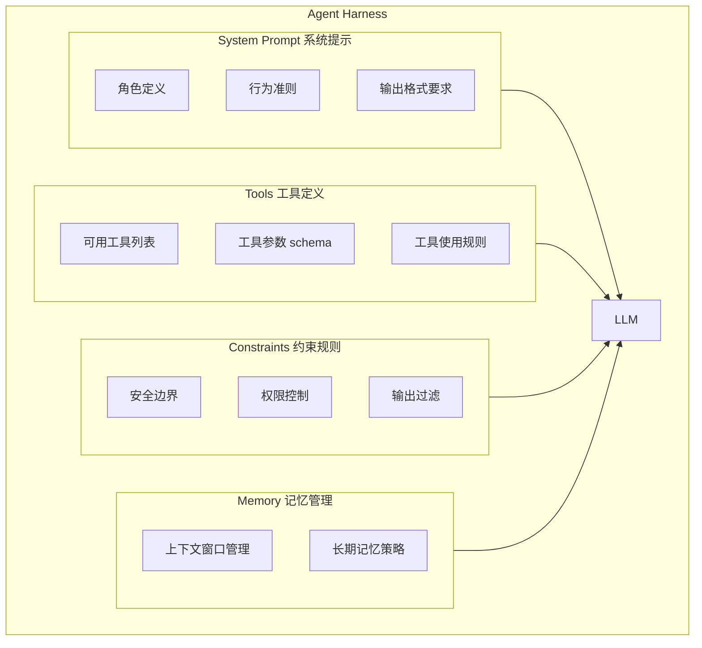
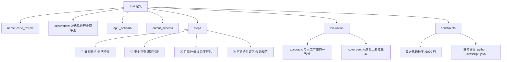
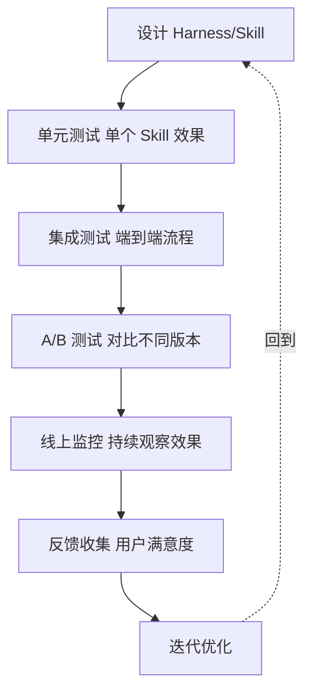

# Harness 与 Skill

如果把 LLM 比作一匹力大无穷但未经训练的野马，那么 **Harness（发音 /ˈhɑːrnɪs/，本义是"马具、挽具"）就是套在它身上、控制它何时跑、往哪跑的缰绳与鞍具**；而 **Skill（本义"技能、本领"）则是这匹马被训练好后，随时可以调用的一项项拿手本事**。Harness 和 Skill 是构建可靠 AI Agent 系统的两个核心设计概念——前者负责"框住"模型的不确定性，后者负责"封装"可复用能力。理解它们对于设计生产级 AI 应用至关重要。

## 什么是 Agent Harness？

**定义：** Harness 是包裹在 LLM 外层的"控制框架"，包含 System Prompt、工具定义、约束规则和安全护栏。



## Harness 的四大组件

### 1. System Prompt 系统提示

System Prompt 是 Harness 的核心，决定了 Agent 的"人格"和行为模式。

**组成要素：**

| 要素 | 说明 | 示例 |
| ------ | ------ | ------ |
| 角色定义 | Agent 是谁 | "你是一位资深后端工程师" |
| 任务范围 | 能做什么、不能做什么 | "只回答技术问题，拒绝政治话题" |
| 行为准则 | 如何做 | "先分析问题，再给出方案" |
| 输出格式 | 回答格式 | "用 Markdown 格式，包含代码示例" |
| 安全规则 | 红线 | "不执行危险的系统命令" |

**好的 System Prompt 示例：**

```text
你是一位专业的 Python 技术顾问，拥有 10 年后端开发经验。

核心原则：
1. 代码质量优先：始终推荐最佳实践，包括类型注解、错误处理、测试
2. 实用主义：给出可直接运行的代码，而非伪代码
3. 诚实：不确定时明确说明，不编造答案
4. 简洁：回答直接切入重点，避免冗余解释

输出格式：
- 先用 1-2 句话概括方案
- 给出完整可运行的代码
- 解释关键设计决策
- 列出可能的注意事项

禁止事项：
- 不执行 rm -rf 等危险命令
- 不修改用户的 .env 配置文件
- 不访问用户的敏感数据
```

### 2. Tools 工具定义

工具是 Agent 与外部世界交互的接口。

**设计原则：**

| 原则 | 说明 |
| ------ | ------ |
| 最小权限 | 只暴露必要的工具 |
| 清晰描述 | 工具的 description 必须准确 |
| 参数验证 | 严格的参数 schema 定义 |
| 错误处理 | 优雅处理工具调用失败 |

### 3. Constraints 约束规则

| 约束类型 | 说明 | 实现方式 |
| --------- | ------ | --------- |
| 安全约束 | 防止有害行为 | Prompt 红线 + 输出过滤 |
| 权限约束 | 限制可执行操作 | 工具白名单 |
| 格式约束 | 输出格式要求 | Prompt 指令 + 后处理验证 |
| 资源约束 | 限制 token/时间 | 运行时限制器 |

### 4. Memory 记忆管理

| 层级 | 说明 | 管理策略 |
| ------ | ------ | --------- |
| 系统记忆 | System Prompt + 工具定义 | 固定不变 |
| 会话记忆 | 当前对话历史 | 滑动窗口 / 摘要压缩 |
| 长期记忆 | 跨会话持久化 | 向量数据库 |
| 工作记忆 | 任务中间状态 | 变量管理 |

## 什么是 Skill？

**定义：** Skill 是对 Agent 可执行能力的抽象封装，包含输入/输出定义、实现逻辑和评估标准。

### Skill vs Tool 的区别

| 维度 | Tool | Skill |
| ------ | ------ | ------- |
| 复杂度 | 简单函数调用 | 可能包含多步骤流程 |
| 组合性 | 原子操作 | 可组合多个 Tool |
| 抽象层级 | 低级接口 | 高级能力封装 |
| 示例 | `search(query)` | "技术文档检索 Skill"（包含查询改写→检索→重排序→格式化） |

### Skill 的结构



### Skill 的设计模式

| 模式        | 说明           | 示例               |
| --------- | ------------ | ---------------- |
| 单步 Skill  | 一个 Tool 完成   | 翻译、格式转换          |
| 流水线 Skill | 多个 Tool 顺序执行 | RAG 问答（检索→重排→生成） |
| 条件 Skill  | 根据输入选择不同路径   | 意图识别→路由→执行       |
| 迭代 Skill  | 循环执行直到满足条件   | 代码生成→测试→修复       |

## Prompt Engineering vs Harness 设计

| 维度 | Prompt Engineering | Harness 设计 |
| ------ | ------------------- | ------------- |
| 关注点 | 单次输入输出优化 | 整体系统架构 |
| 复杂度 | 低 | 高 |
| 涉及组件 | 仅 Prompt | Prompt + Tools + Memory + Constraints |
| 调试方式 | 观察输出 | 端到端测试 |
| 可复用性 | 低 | 高（Skill 可复用） |
| 适用场景 | 简单任务 | 生产级 Agent 系统 |

**类比：**
- Prompt Engineering 像写一封好的邮件
- Harness 设计像设计一个完整的产品

## 安全护栏 (Safety Guardrails)

### 输入过滤

| 策略 | 说明 |
| ------ | ------ |
| 关键词过滤 | 检测敏感词和注入模式 |
| 分类器检测 | 用专门的模型检测恶意输入 |
| 规则引擎 | 基于规则的输入验证 |
| 双 LLM 架构 | 一个小模型专门检测 prompt injection |

### 输出过滤

| 策略 | 说明 |
| ------ | ------ |
| 格式验证 | 检查输出是否符合预期格式 |
| 内容审核 | 检测有害/不当内容 |
| 引用验证 | 验证引用的工具结果是否准确 |
| PII 检测 | 检测是否泄露个人隐私信息 |

### 运行时保护

| 策略 | 说明 |
| ------ | ------ |
| 超时控制 | 限制单次执行时间 |
| 重试限制 | 防止无限循环 |
| 资源限制 | 限制 token 消耗和 API 调用次数 |
| 沙箱执行 | 代码在隔离环境中执行 |

## 评估循环 (Evaluation Loop)



### 评估维度

| 维度 | 指标 |
| ------ | ------ |
| 效果 | 任务完成率、准确率 |
| 效率 | 延迟、token 消耗 |
| 安全 | 注入成功率、越权操作次数 |
| 用户体验 | 满意度评分、投诉率 |

---

## 快速问答

| 问题 | 参考答案 |
| ------ | --------- |
| Harness 是什么？ | Agent 的控制框架，包含 System Prompt、工具定义、约束规则和安全护栏。是 LLM 外层的"控制系统" |
| Harness 和 System Prompt 的区别？ | System Prompt 只是 Harness 的一部分。Harness 还包括工具管理、约束规则、记忆管理和安全机制 |
| Skill 和 Tool 的区别？ | Tool 是原子操作（如搜索、计算），Skill 是更高层的能力封装（如"代码审查"可能包含多个 Tool 的协作） |
| 为什么需要 Skill 抽象？ | ① 提高复用性 ② 降低 Agent 的决策复杂度 ③ 便于独立测试和优化 ④ 支持组合和编排 |
| 安全护栏有哪些层次？ | 输入过滤（防注入）、输出过滤（防有害内容）、运行时保护（超时/重试限制）、权限控制（最小权限） |
| Harness 设计的核心原则？ | ① 最小权限 ② 清晰的职责边界 ③ 可观测性 ④ 安全第一 ⑤ 可测试性 |

相关链接
- [[八股文学习清单]]
- [[00-全局导航|全局导航]]
