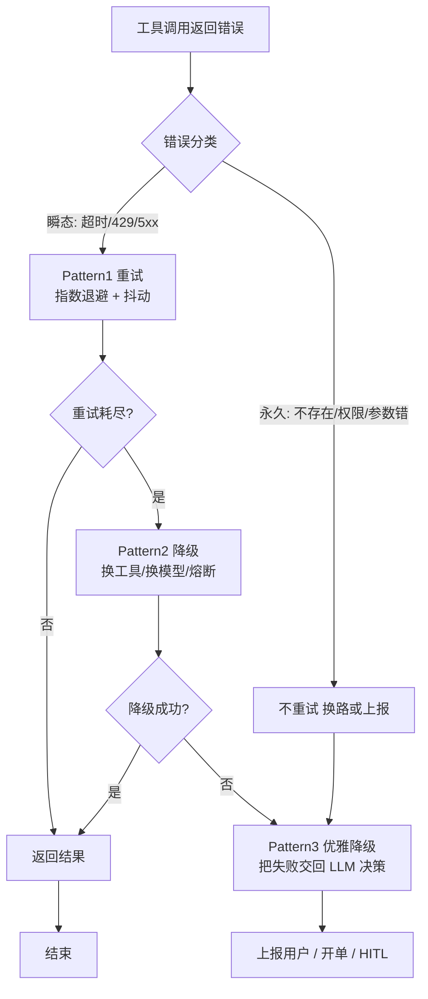
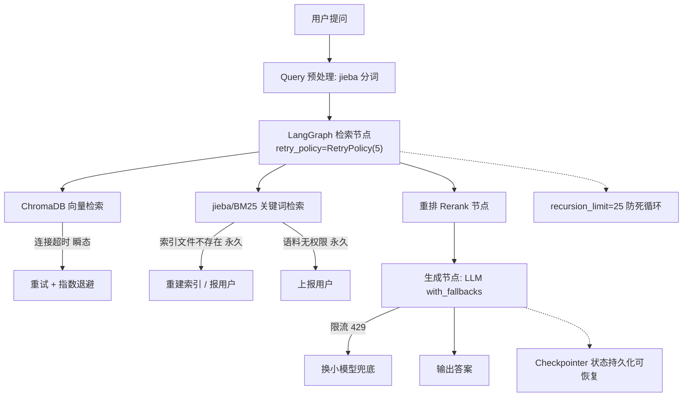

# 工具调用失败处理：文件不存在 / 超时 / 权限不足 → 恢复与重试

> **本篇建立在哪篇之上**：④ 工具系统（工具怎么注册、被发现、被调用）+ ⑤ Self-RAG（自我反思与自纠正闭环）。本篇**当场讲清**的概念：瞬态/永久错误、指数退避、熔断器、结构化错误、硬步数上限。需要的基础：知道「Agent 靠反复调用工具推进任务」（④ 已铺垫），剩下的失败分类与恢复套路本篇从头讲。  
> **目标**：零基础读者读完，能说清「超时 / 文件不存在 / 权限不足」分别该怎么办、为什么不能一刀切重试、怎么用三档恢复模式 + 护栏让 Agent 不卡死、不烧钱、不静默出错。

## 0. 先讲人话（生活化类比开篇）

你派一个实习生去档案室取份文件。结果有三件事会出岔子：

- **文件根本不存在**（你记错编号了）→ 他再跑十趟也白搭；
- **档案室临时关门 / 网络断了（超时）** → 等会儿再来，可能就开着了；
- **他没权限进保密室（权限不足）** → 不是跑得快就能进，得找你拿门禁卡。

一个**靠谱的老员工**会区分这三种情况：超时 → 稍后再试；不存在 / 没权限 → 立刻回头问你，而不是闷头重试到下班。

**LLM Agent（大语言模型智能体，就是那个能自主调工具办事的程序）调用工具，跟这个实习生一模一样。** 区别是：很多 Agent 像个愣头青，工具一报错就**用同样的参数原样重试**，报错 → 重试 → 再报错，最后跟用户说「抱歉我尽力了」——啥也没干成。

本文就讲清楚：怎么让 Agent 像老员工一样，知道**什么时候该重试、什么时候该换路、什么时候该喊你**。

## 1. 工具失败不是「意外」，是「日常」

先纠一个误区：别把工具报错当小概率边缘情况。

> "Tool failures in LLM agents are not edge cases. They are the normal operating condition."【来源：dev.to《Three Error Recovery Patterns》, 2025；2026 年多家生产复盘报告一致印证——agentmarketcap.ai《Function Calling Reliability in Production 2026》】

生产环境里：API 会挂、限流会触发、负载上来就超时、文件会被删、token 会过期。而且 Agent 的训练数据**几乎只见过「成功调用工具」的例子**，没见过失败时该咋办【来源：rapidclaw.dev《Why AI Agents Fail in Production》】。所以它默认行为很蠢：要么重试同一个失败调用（以为自己格式写错了），要么把失败当成功、自己编一个结果糊弄你。

失败处理不到位，只有三种下场：

1. **整个任务崩溃**（直接抛异常终止）；
2. **无限重试烧光 token（钱）**（一次 prompt bug → 循环 50 次 → 几十美元打水漂，zirasoftware《AI Agents in Production 2026》把「无成本预算导致单次任务烧掉 \$500」列为头号生产故障）；
3. **静默跳过**（失败了假装成功，交付一份残缺的答案，还像模像样）。

## 2. 第一步：给错误「分个类」——瞬态 vs 永久（核心直觉）

所有恢复策略的前提，是先判断错误**能不能靠重试解决**。一句话区分：

| 类型 | 含义 | 典型代表 | 该不该重试 |
|-|-|-|-|
| **瞬态 transient** | 过一会儿自己就好了 | 限流（HTTP 429）、网络超时（timeout）、服务端 5xx | ✅ 该重试（加退避） |
| **永久 permanent** | 再试一百次也白搭 | 认证失败（401）、参数错误（400）、**找不到（404 / 文件不存在）、权限不足（403）** | ❌ 别重试，换路或上报 |

把题目点名的三类对号入座：

- **超时** → 瞬态 → 重试（加退避）；
- **文件不存在** → 永久 → 不重试，换参数 / 换工具 / 追问用户；
- **权限不足** → 永久 → 不重试，上报用户或换身份。

> 类比收尾：超时像**快递爆仓**（等等就发货了）；权限不足像**没门禁卡**（再刷脸也没用）；文件不存在像**书被借走了**（换一本，或问问是不是记错编号）。

**工程落点**：别用字符串去解析报错信息猜类型（脆弱、易错、不同服务商文案还不一样）。用一个封闭的**错误枚举（ErrorKind）**来分支：

```text
# 感觉级：用枚举分类，而非解析报错字符串
classify(err) -> ErrorKind        # RATE_LIMIT / TIMEOUT / AUTH / NOT_FOUND / BAD_REQUEST ...
retry_only_on = {RATE_LIMIT, TIMEOUT, SERVER_ERROR}   # 瞬态才重试
fail_fast_on  = {AUTH, BAD_REQUEST, NOT_FOUND}         # 永久直接放弃
```

【来源：dev.to 同上；CSDN《Agent 工具调用失败重试完整容错方案》；ai-agentsplus.com《AI Agent Error Handling and Retry Strategies 2026》更把「按分类分级重试」列为生产共识】

⚠️ **2026 新共识（边界情形）**：agentmarketcap.ai 指出，除了「瞬态/永久」，还有两类最贵、最隐蔽的失败**绝不能靠重试解决**：

- **Schema 漂移（schema drift）**：工具签名悄悄变了，模型还在用旧参数调 → 重试 N 次也没用，要「把 schema 显式注入上下文后重试一次」。
- **语义空操作（semantic no-op）**：工具调用结构正确、返回 200、其实啥也没干（比如邮件因收件人校验失败被静默丢弃）。重试只会更糟，要靠**端到端验证**而非「调用成功」判断。

## 3. 三套恢复模式（阶梯式：由便宜到贵）

原则：**用能解决当前故障的最便宜那档**，别一上来就上最重的。

**Pattern 1 · Retry 重试**——只用于瞬态错误。

- 关键不是「重试几次」，是**怎么重试**：指数退避（exponential backoff，第 n 次等 2ⁿ 秒）+ 抖动（jitter，随机扰动，避免所有请求同时重撞，防止「惊群」把刚恢复的服务又打挂）。
- 社区共识配置（来源：zylos.ai《Graceful Degradation Patterns 2026》、callsphere.tech）：base_delay=1s、max_delay 上限 60s、最大尝试 4 次、jitter 取 0\~100% 均匀随机。
- 重试在**工具包装层内部**悄悄完成，Agent 主循环无感知，只拿到最终结果或一句干净的错误。

**Pattern 2 · Fallback 降级 / 备用**——主路不可用或太慢时。

- 换一个实现同样接口的「备胎」：备用服务商、缓存结果、或弱化版调用（如 LLM 限流时切到更小更便宜的模型）。
- **熔断器（circuit breaker）**：某下游失败率超阈值（如滚动窗口 >50%）就「开路」，先别再打它，冷却一段时间再半开试探。否则重试逻辑会放大下游故障（来源：neelmishra.github.io、zylos.ai）。

**Pattern 3 · Graceful Degrade 优雅降级**——重试和降级都失败时。

- 返回**部分结果**，并**明确告诉 LLM 哪步失败了、为啥**，让它自己决定下一步（追问用户？换策略？）。
- 最忌「藏错误」。模型没法帮用户从它不知道的失败里恢复。【来源：dev.to；blog.rajpoot.dev《LLM Agent Error Recovery in 2026》】

三模式对比：

| 模式 | 适用错误 | 代价 | 谁来做 | LangGraph 怎么写 |
|-|-|-|-|-|
| Retry 重试 | 瞬态（超时 / 429 / 5xx） | 低（多等几秒） | 工具包装层 | `retry_policy=RetryPolicy(max_attempts=5)` |
| Fallback 降级 | 主路挂 / 慢 | 中（结果可能弱） | 路由 / 框架 | `with_fallbacks([小模型])` + 熔断 |
| Graceful 降级 | 都失败 | 高（结果不全） | LLM 自己决策 | 把结构化错误写回 State，交还 LLM |

决策总图（错误分类 → 三模式阶梯）：



## 4. 防「死循环」的护栏（最重要，没有它前面白搭）

重试 + 自我纠正听起来美好，但 LLM 最容易**卡在循环里出不来**。三道护栏：

**① 硬步数上限（Hard Step Cap）**

最关键的单一护栏。给 Agent 设最大步数，超了就停、记录、上报。

```text
# 感觉级：LangGraph 调用时限制递归 / 循环次数
graph.invoke(input, config={"recursion_limit": 25})   # 默认 25
```

> 注意：ReAct 每调一次工具算**两步**（agent 节点 + tools 节点），按预期工具调用次数合理设值，否则容易 `GraphRecursionError`。【来源：掘金《LangGraph  100 题》；machinelearningplus.com】

**② 错误语义：给「有用」的错误，别给「没用」的**

- ✅ 有用："Order #42 没找到，用户可能打错 ID 了" / "数据库暂时不可用，稍后再试" / "你没权限看租户 7 的订单"。
- ❌ 没用："Error: 500" / "Internal server error" / "NullPointerException"。
- 没用的错误会**诱导模型进入循环**。工具设计要把错误类型、可恢复动作结构化地塞回上下文。【来源：blog.rajpoot.dev；agentmarketcap.ai 强调「schema 校验通过率」比「整体成功率」更能暴露系统性问题】

**③ 四种典型死循环（常考）**

- **缺字段循环**：工具返回 `email`，模型要 `user.email` → 它「再试一次」→ 又一样 → 死循环。修：描述性错误 / 稳定 schema。
- **陈旧缓存循环**：缓存返回旧值，模型以为错了又调 → 拿到同样的旧值 → 循环。修：强制刷新工具 / 步数上限。
- **认证循环**：API 返回 401，模型用同一个 token 重试 → 401 → 循环。修：**4xx 绝不重试**，直接上交用户。
- **幻觉工具**：模型编了个不存在的工具名（如 `searchOrder`）→ 调度器回「unknown tool」→ 它可能继续编。修：`handle_tool_errors=True` 把错误交还 LLM，让它选真实存在的工具。【来源：blog.rajpoot.dev；machinelearningplus.com】

补充护栏：**成本熔断（按美元预算封顶，防循环烧钱，zirasoftware 实测缺它单次任务烧 \$500）、状态检查点（checkpointer）**（每步持久化，worker 挂了从最后一步恢复）。

## 5. 落到我的简历项目：Agentic RAG 怎么做容错

我的项目用 **LangGraph** 编排 **Agentic RAG**：检索层是 **ChromaDB（向量检索）+ jieba/BM25（关键词检索）**，生成层是 LLM。把上面的套路直接套进去：



- **ChromaDB 连接超时** → 瞬态 → 节点 `retry_policy=RetryPolicy(5)` + 指数退避；
- **jieba 词典 / BM25 索引文件不存在** → 永久 → 不重试，重建索引或明确报错给用户（别让 Agent 空转）；
- **读本地语料权限不足** → 永久 → 上报用户换路径 / 授权，不重试；
- **LLM 生成时限流（429）** → `with_fallbacks` 切到更小更便宜的模型兜底，宁可变弱一点也别卡 5 分钟；
- **全局** → `recursion_limit` 防工具调用死循环；`checkpointer` 持久化对话状态，中途崩了能从检查点续跑。

> 一句话讲清："我的检索节点都包了重试策略，但只重试瞬态错误；文件不存在和权限类错误直接走降级和上报，避免无谓循环。图层面用 recursion_limit 兜底防死循环，checkpointer 保证可恢复。"

## 6. 生产环境额外细节（进阶亮点）

1. **LLM 调用重试 vs 工具调用重试要隔离**：大模型 API 自身网络超时是「模型层重试」，搜索 / 计算器是「工具层重试」，两套路逻辑别混。【来源：CSDN 同上】
2. **每次工具调用必须设超时**：防第三方接口阻塞把整个 Agent 线程卡死（neelmishra 实测 LLM 调用可挂 60\~120s，必须 `asyncio.wait_for(func(), timeout=30)`）。
3. **全局重试预算**：给单次对话设总重试上限，多个工具接连报错也不无限耗资源。
4. **可观测性**：结构化日志（工具名 / 入参 / 事件 / 重试次数 / 异常）+ 指标（失败率、schema 校验通过率）+ 告警。生产可直接接 Langfuse / LangSmith / Prometheus。【来源：agentmarketcap.ai 2026 监控栈】
5. **预检（pre-flight）**：调 LLM 前先用 tokenizer 估 token 数，接近上限先压缩上下文再调，避免上下文溢出类失败。【来源：zylos.ai】

## 7. 常见误区

- ❌ "所有错误都重试" → 401 / 404 重试纯浪费，还会触发认证循环。
- ❌ "catch 所有异常返回一句通用错误" → 模型无法推理通用错误，必须给错误类型。
- ❌ "静默吞掉失败" → 下游节点拿到 `None` 崩溃，且用户拿到残缺答案还以为完整。正确做法：把错误写进 State 传给后续节点，让它自行跳过。
- ❌ "靠解析报错字符串判断类型" → 脆弱；用错误枚举（ErrorKind）。
- ❌ "重试越多越稳" → 每次重试都烧 token / 钱；设预算和步数上限。
- ❌ "调用成功 = 任务成功" → 语义空操作（200 但啥也没干）比报错更危险，要端到端验证。

## 8. 核心要点

- **一句话**：工具失败是常态；先分瞬态 / 永久，瞬态重试（退避 + 抖动），永久换路或上报；三模式 Retry → Fallback → Graceful Degrade 阶梯使用。
- **三类错误对应**：超时 = 瞬态可重试；文件不存在 / 权限不足 = 永久不重试。
- **防死循环三件套**：硬步数上限（recursion_limit）、结构化有用错误、4xx 不重试。
- **2026 新坑**：schema 漂移（注入 schema 重试一次）、语义空操作（端到端验证）。
- **LangGraph 三把斧**：`RetryPolicy`（节点重试）、`with_fallbacks`（模型降级）、`recursion_limit`（防循环）、`checkpointer`（可恢复）。
- **金句**："别藏错误，模型没法从它不知道的失败里恢复。"

## 9. 简历项目绑定：具体改进方向

基于你项目 `ai-resume-analyzer` 的真实容错实现（LangGraph 检索节点 `retry_policy`、LLM `with_fallbacks`、`recursion_limit` 25、`checkpointer` 持久化），对照 2026 生产实践，有 3 个**具体可落地的改进点**：

**改进 1：把「错误分类」做成显式枚举，而非靠异常类型泄漏**

- **差距**：当前重试策略大概率按异常类型（超时 / 连接错）粗分；但 agentmarketcap.ai 指出，2026 生产头号隐性故障是 **schema 漂移**与**语义空操作**——这两类「调用看起来成功」的失败，光靠异常类型根本抓不到。
- **改动**：在检索 / 重排节点包装层加 `classify(err) -> ErrorKind`（`RATE_LIMIT/TIMEOUT/AUTH/NOT_FOUND/BAD_REQUEST`），并对 `generate_answer` 工具加「结果非空 + rerank_score 校验」的语义空操作检测。文件定位：后端 `graph.py`（直接调用路径）与 `mcp_nodes.py`（MCP 调用路径）的节点函数里。
- **风险**：低；纯新增判断分支，不影响主链路。
- **收益**：把「静静失败」变成「显性失败」，可接 Langfuse 看板；能讲「我按瞬态/永久做了错误分类，还专门防了 2026 年高发的语义空操作」。

**改进 2：给检索层加熔断器，防下游雪崩**

- **差距**：当前 ChromaDB / BM25 检索是直连，没熔断。一旦向量库抖动，重试会放大压力（zylos.ai 称无熔断的 multi-agent 是「指向自己基础设施的 DDoS 引擎」）。
- **改动**：在 `mcp_graph.py` 的检索 / 重排节点外包一层 `CircuitBreaker(failure_threshold=5, recovery_timeout=30)`；开路时返回「检索降级」结构化错误交 LLM 决定。
- **风险**：中；开路后用户暂时拿不到检索结果，需配合优雅降级文案。
- **收益**：单点故障不拖垮整个问答链路；一句话讲清「我对检索下游做了熔断 + 降级双保险」。

**改进 3：加报错预算 + 预检，防成本失控**

- **差距**：项目有 `recursion_limit` 防步数死循环，但还没「单轮 token / 成本预算」熔断（zirasoftware 实测缺它单次任务烧 \$500）。
- **改动**：在 `graph.py` 外层包一层 `max_usd_per_run` 检查，超阈值抛 `BudgetExceeded` 走优雅降级；对 `generate_answer` 调 LLM 前加 tokenizer 预检，接近上下文上限先压缩。
- **风险**：低；预算阈值需按语料调。
- **收益**：成本可预期、可告警；能答「我有步数上限 + 成本预算双层护栏」。

## 下一篇预告

下一篇 **⑦ 有副作用的工具（退款 / 改单）：确认 + 权限控制**——本篇你学会了「调用失败怎么恢复」。但还有一种情况比失败更可怕：**工具成功执行了，却动了不该动的钱 / 订单**。下一篇讲清楚：当工具会真的退款、改单时，怎么用确认 + 权限控制拦住 Agent，避免它「推理很合理、后果很严重」。带着本篇的「错误分类 + 护栏」基础，下一篇的安全设计会非常好懂。

## 
> ▶ 对应实操：[[33-上下文治理：多轮任务上下文越来越长的处理策略|33-上下文治理：多轮任务上下文越来越长的处理策略]]


> ▶ 对应实操：[[28-降级路径（Degradation）：某环节失败 → 回退到次优但可用方案|28-降级路径（Degradation）：某环节失败 → 回退到次优但可用方案]]

相关链接
- [[23-Agent架构与核心组件]]
- [[34-工具调用降级策略]]
- [[35-工具幂等性与重试策略]]
- [[36-工具调用死循环检测]]
- [[八股文学习清单]]
- [[00-全局导航|全局导航]]
