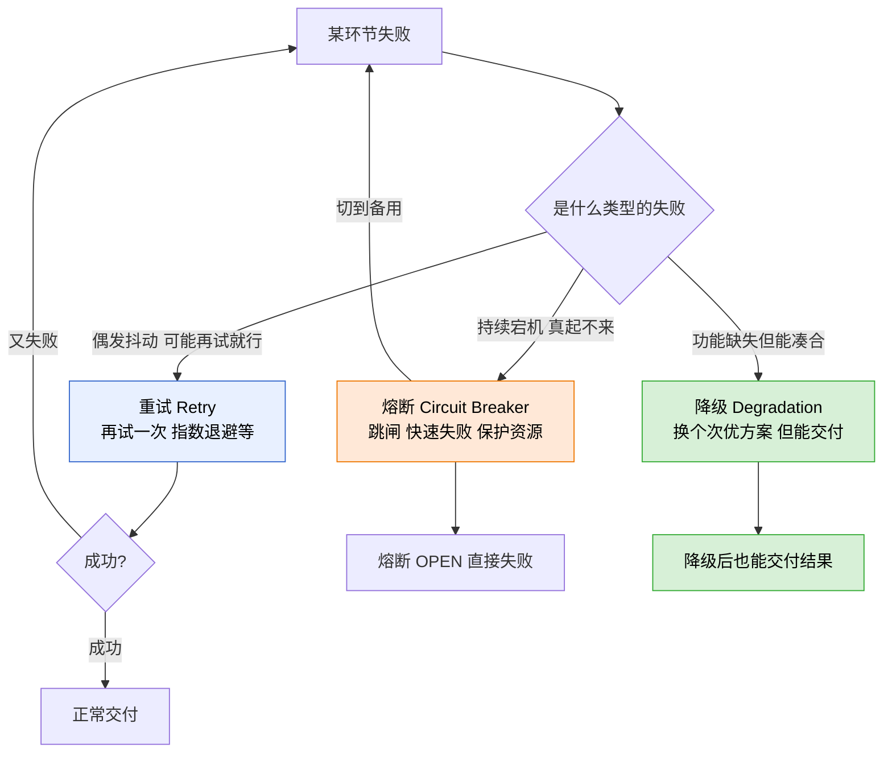
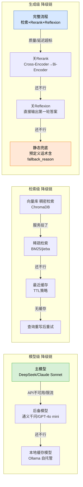
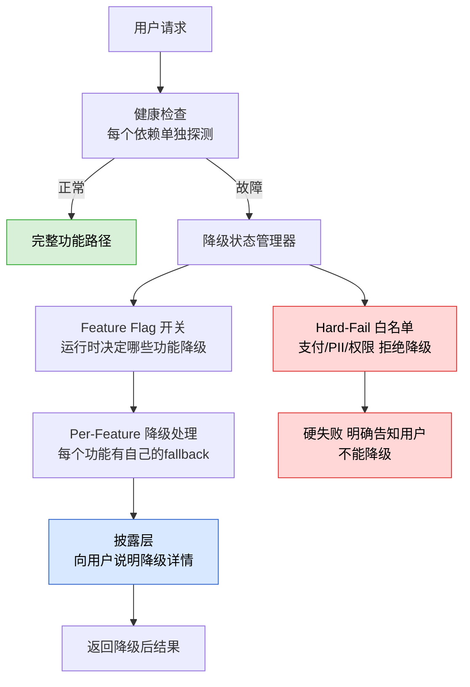
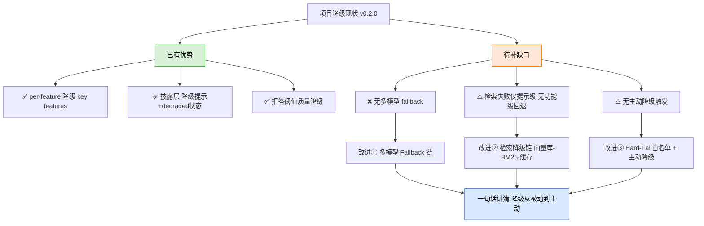

> 
**本篇定位与前置依赖：**这是「Agent 韧性工程」四层防线的**第四层（优雅降级）专项深挖**，也是面向求职的项目技术学习笔记。读前建议先有这几篇打底：
- 第20篇《Agent 韧性工程概述》——四层防线全景，本篇是第四层的展开
- 第21篇《指数退避重试》——第一层重试深挖，与第四层构成「先扛后降」的互补
- ⑱《Agent 安全防护》——权限分级（read-only/write/destructive），与降级的 hard-fail 底线直接关联
- ⑥《工具调用失败处理》——工具失败怎么办，降级是其中一种策略
零基础也能读：从「餐厅招牌菜卖光怎么办」讲起。

# 一、先讲大白话：什么是「降级」，和重试/熔断有何不同？

你开了一家餐厅，招牌菜「东坡肘子」卖光了（= 某环节失败）。你有四种选择：

- **重试（Retry）**：让后厨再翻翻冰柜（再试一次），说不定还有。
- **熔断（Circuit Breaker）**：发现今天供货商断了，直接告诉厨师「东坡肘子今天别做了，省得每次都被退单」。
- **降级（Degradation）**：换上「红烧肉」（次优但可用的替代方案），在菜单上备注「今日肘子暂无，推荐红烧肉」。这是本篇的主题。
- **硬失败（Hard Fail）**：直接跟顾客说「抱歉，不卖了」——但当菜里有安全隐患时（过敏原/PII），必须硬失败，不能降级。

> 
**降级（Degradation，读「迪格雷德申」，本意「退化、降格」）**，在工程师口中常叫 **Fallback（退路、回退方案）**，核心思想一句话：**给不出满分，就给出 80 分的答案，但要让用户知道这是 80 分版。**
典型生活类比：电梯坏了 → 走楼梯（降级）。不如电梯快，但至少能上楼。如果有人装了假电梯按钮（假的功能）骗你按而不是让你走楼梯——这叫**静默降级（Silent Degradation）**，是设计中必须避免的反模式。

用一张图看清三兄弟的区别：

# 二、为什么 Agent 特别需要「按功能降级」而非整体失败？

一个 Agent 产品的每个环节都可能出问题：

- 检索（Retrieval）工具挂了？但不妨碍 LLM 靠自己知识答
- 重排（Rerank）工具超时了？但不妨碍按原始顺序返回结果
- 视觉模型（Vision）返回 503？但不妨碍用户打字描述
- Reflexion 自纠正失败了？但不妨碍直接输出第一轮答案
- 主模型 DeepSeek 宕机了？但不妨碍换通义千问

> 
**核心设计原则（背这句）：「per-feature 降级」**（直译「按功能降级」）= 每个功能都应该有自己的降级策略，一个功能坏了不影响其他功能。一个 Search 工具挂了，不该让整个 Agent 瘫掉。这是 Agent 降级设计的第一原则。
来源：agentpatternscatalog.github.io 模式库《Graceful Degradation》，2026

# 三、多级降级链（Fallback Chain）：一张图搭建全栈

生产级的降级不是「行->不行」的二分，而是**多级链条**：主方案不行就切第一备，第一备不行再切第二备……

业界 2026 年共识的典型降级链，按**层次**排列，从上到下越来越保底：

每级降级都只有**一个方向**：从上到下跌落。恢复则反向逐级回升。不能跳过中间级从 2 直接到 4（会损失可用功能）。

## 3.1 降级触发条件（什么时候该降？）

| 触发条件 | 说明 | 典型阈值 |
|-|-|-|
| **显式失败** | 工具调用抛出异常 / 返回错误码 | 任何异常 |
| **超时** | 响应超过预期时间 | P95 延迟 + 2σ（如 >3s） |
| **质量不达标** | 返回了 200 但内容是幻觉/分数低 | rerank_score < 0.3；evaluate composite < 0.6（你项目已实现） |
| **成本/预算超限** | 某组件的 token 消耗超过预期 | token_budget > 80% |
| **高峰期保护** | 系统负载高时主动关非核心功能 | CPU > 80% |

# 四、一个概念必须讲透：降级的「披露」，比技术重要

很多团队拼命写降级代码，却忘了跟用户说一声「降级了」。这是**静默降级（Silent Degradation）**，最大的反模式。

> 
**静默降级举例：**检索挂了模型硬答（无来源标注），用户拿到一份看似完整但全是幻觉的报告，却不知道来源缺失了。下次用户问「你上次的数据从哪来的」答不出来，信任瞬间瓦解。
**正确做法（可以这么答）：**降级时必须**告知用户**。例如：「由于检索服务临时不可用，本次回答基于模型自身知识生成，信息可能不完整，请以权威来源为准。」这叫**披露（Disclosure）**——让用户知道「当前在降级模式」，ta 会相应地调整信任度。

一套专业的降级架构应该包含五大组件（来源：agentpatternscatalog）：

# 五、实战案例：业界真实的降级链（腾讯云 2026）

作为一个参考，2026 年腾讯云开发者推荐的生产级降级链（多模型 fallback）：

**Claude Sonnet（主力）→ Claude Haiku（同厂商便宜版）→ GPT-4o（不同厂商）→ 本地自托管模型（无外部依赖，最后防线）**

这不是炫技，这是架构设计的常识。不同厂商模型同时挂的概率极低。同厂商不同版本同时挂的概率也低。加上本地模型兜底，理论上「零外部依赖」可用。

类似地，检索级降级链可以设计为：

**向量库稠密检索（ChromaDB）→ BM25 稀疏检索（jieba/BM25）→ 最近合法缓存（TTL 策略）→ 查询重写后重试 → 告知 LLM「检索不可用，凭自身知识回答」**

**CSDN 2026 年数据**：某客服系统实施三级降级后，故障影响从 37% 降至 8%（基于 2 周生产 A/B 测试）。一级降级（延迟>2s→减文档数/换 bi-encoder）、二级降级（error_rate>15%→启用 TTL 缓存）、终极降级（完全不可用→预定义话术含 fallback_reason）。

# 六、结合你的简历项目：降级现状体检 + 三个改进

严格基于 `D:\Project\ai-resume-analyzer\backend` 真实代码。先给结论：**你项目的降级设计其实已经比多数同学做得好——有 per-feature 降级、有披露、有部分降级、有拒答。但最大缺口是「无多模型 fallback」和「检索失败只有提示级无功能级回退」。**

## 6.1 现状盘点（真实代码）

| 能力 | 项目真实实现 | 评价 |
|-|-|-|
| per-feature 降级 | `search.py:45` 多查询并行时部分失败不阻断；`search.py:98` rerank 失败降级为原始顺序；`rewrite.py:52` 改写失败回退直接搜索；`reflection.py:144` 反思失败兜底 JSON | ✅ 做得很扎实 |
| 披露（Disclosure） | `generate.py:56` 检索失败时注入降级说明；`state.py:28` 有 `degraded` 状态透传 API | ✅ 有披露意识，很好 |
| 拒答（质量降级） | `generate.py:77` 的 `reject_if_low_score`，rerank_score<0.3 阈值 | ✅ 有 |
| 多模型 fallback | Chat=DeepSeek V4 Pro 单一模型，`generate.py:99` 失败直接落 static 话术 | ❌ **无多模型切换** |
| 检索降级（功能级回退） | 向量库失败时 `generate.py:56` 只注入「降级提示」让 LLM 硬答，无 BM25-only/cache/查询重写回退 | ⚠️ 只有**提示级**，无**功能级回退** |
| Hard-Fail 白名单 | ⑱篇已有权限分级设计但降级层无显式硬失败规定 | ⚠️ 可补 |

> 
**改进①：增加多模型 Fallback（最大缺口，最值钱）**
· **现状**：`generate.py:99` 的 `fallback="服务暂时不可用，请稍后重试。"` 直接放弃。
· **改动**：在 `rag_service.py` / `generate.py` 的 `with_retry` 之外加一层模型级 fallback：DeepSeek V4 Pro（主）→ 百炼系 chat 模型（你已在用百炼的 embedding/rerank，协议兼容）→ 静态话术（最后保底）。
· **为什么**：一段「回答」是可互换产物。多模型 fallback 能把「0%」的可用率提升到接近正常。
· **实施难度**：低。你已经有 OpenAI 兼容客户端抽象，加一个 `fallback_model` 即可。

> 
**改进②：检索失败时「功能级回退」而非仅「提示级」**
· **现状**：`generate.py:56` 告知 LLM「检索工具失败、来源可能缺失」，完全依赖模型自身知识作答（幻觉风险）。
· **改动**：向量库不可用时，优先尝试 BM25-only 检索（你已有 jieba/BM25 代码在 `rag_service.py`）；BM25 也不行了再尝试本地缓存（你日志全链路有结构化缓存模式）；全不行了才落到「仅凭模型知识+降级提示」。形成 {@code 向量库 → BM25 → 缓存 → 仅模型知识} 检索降级链。
· **为什么**：BM25 检索相比 LLM 硬答，幻觉率低得多——BM25 直接返回文档片段，不涉及模型编造。
· **预期收益**：检索服务故障时，仍能输出有据可查的回答，而非纯模型臆测。

> 
**改进③：建立显式 Hard-Fail 白名单 + 追加主动降级触发条件**
· **现状**：权限分级（⑱篇）已设计 read-only/write/destructive。降级层目前仅响应「抛出异常」和「质量不达标」（拒答），没有主动基于「延迟超标」/「高峰保护」的降级。
· **改动**：① 在降级核心判断逻辑中加 hard-fail 白名单：`analyze_resume`（涉及用户隐私数据写入）如果熔断/降级触发，应硬失败而非降级；② 增加基于延迟阈值的主动降级（如 P95 > 3s 自动关 rerank／关 Reflexion）。
· **为什么**：① 避免权限越界降级（呼应⑱篇「默认拒绝」）；② 让降级从「被动响应」升级为「主动预防」（呼应第20篇弹性设计思维）。

# 七、核心要点

> 
**Q：降级和重试/熔断的区别是什么？**  
A：重试=再试一次（治偶发抖动）；熔断=别试了（治持续宕机）；降级=换个方案凑合（治功能缺失但能保底交付）。三者是递进关系。
**Q：什么是 per-feature 降级？**  
A：每个功能有自己的降级策略，一个坏了不影响别的。Search 挂了不影响 LLM 自己答，Rerank 超时了不影响按原始顺序返回。
**Q：降级的核心设计原则？**  
A：① 多级 fallback chain 而不是二分（主→备→本地→缓存→话术）；② 必须披露给用户不能静默降级；③ 支付/PII/权限类必须硬失败不能降级（hard-fail allowlist）。
**Q：常见的降级触发条件？**  
A：显式失败、超时、质量不达标（低分/幻觉）、成本/预算超限、高峰期主动关非核心功能。
**Q：你项目降级还能怎么加固？**  
A：项目已有 per-feature 降级 + 披露 + 拒答（不错），但缺多模型 fallback（DeepSeek 挂了直接静态话术，应切百炼备用模型）、检索失败只有提示级（应加 BM25/缓存功能级回退），以及缺少显式 hard-fail 白名单。

# 八、下一篇预告

本篇是第四层（降级）的深入，第21篇是第一层（重试）的深入。中间还差的「第二层 熔断器」—第23篇预告：**熔断器 Circuit Breaker：三态状态机、per-provider 分层熔断、与重试/降级的配合（🔴高优）**。

---

**本篇资料来源（截至 2026-07-18）：**

- CSDN DeepSeek-V4《失败降级策略：如何在 RAG 与 Agent 场景下保底》2026（三级降级 + 故障影响 37%→8% 数据 + Agent 降级特殊要求）
- 腾讯云《AI系统如何做降级预案？》2026（缓存兜底、Feature Flag、真实降级链 Sonnet→Haiku→GPT-4o→本地、五层保护）
- agentpatternscatalog.github.io《Graceful Degradation》2026（per-feature 降级 + Disclosure + Hard-Fail allowlist + 架构组件，模式标准）
- intelliparadigm.com《RAG系统全链路兜底方案设计与实践》（检索置信度评估 + 查询重写兜底 + 多活备用链路）
- kufanyun.com《智能体降级Fallback》2026（延迟控制、情感降级、预加载策略、阈值建议）
- 项目真实代码：`D:\Project\ai-resume-analyzer\backend` 的 generate.py（per-feature 降级/披露/拒答）、search.py（rerank 降级/部分降级）、reflection.py/rewrite.py（各自 fallback）、state.py（degraded 状态）、rag_service.py（BM25）

## 
> ▶ 对应实操：[[34-上下文压缩：任务摘要-文件摘要-过程笔记|34-上下文压缩：任务摘要-文件摘要-过程笔记]]

> ▶ 对应实操：[[28-降级路径（Degradation）：某环节失败 → 回退到次优但可用方案|28-降级路径（Degradation）]]

相关链接
- [[23-Agent架构与核心组件]]
- [[33-异常处理与降级策略]]
- [[35-工具幂等性与重试策略]]
- [[八股文学习清单]]
- [[00-全局导航|全局导航]]
