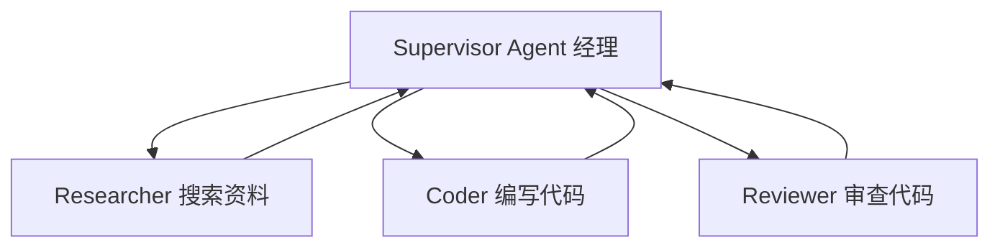
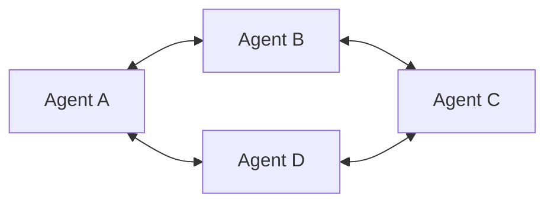
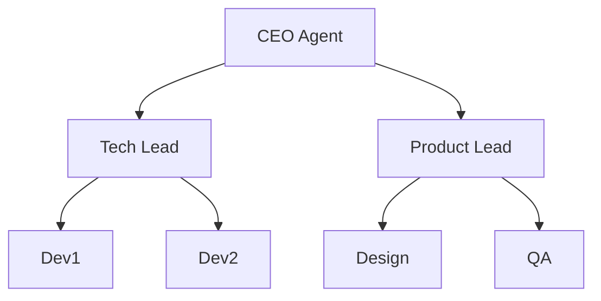
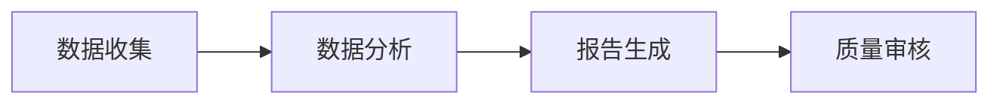

# 多 Agent 编排四种模式

> 多 Agent 系统的核心设计：谁听谁的、谁和谁通信、信息怎么流动。四种经典模式各有适用场景。

## 1. Supervisor 监督者模式

一个"经理" Agent 负责分配任务和协调，其他 Agent 执行具体工作。



**特点：**
- 清晰的层级关系
- Supervisor 负责任务分配和结果汇总
- 适合任务可明确拆分的场景

## 2. Peer-to-Peer 对等模式

所有 Agent 地位平等，通过消息传递协作。



**特点：**
- 无中心节点
- 每个 Agent 可以与其他任意 Agent 通信
- 适合需要多轮讨论达成共识的场景

## 3. Hierarchical 层级模式

多层组织结构，顶层 Agent 管理中层，中层管理底层。



**特点：**
- 适合大型复杂项目
- 层层委派，职责清晰
- 需要完善的通信协议

## 4. Debate 辩论模式

多个 Agent 对同一问题给出不同观点，通过辩论得出最佳答案。

```text
[Agent A]: 我认为方案1更好，因为...
[Agent B]: 反对，方案2在以下方面更优...
[Agent A]: 但方案2有这个缺陷...
[Judge Agent]: 综合考虑，方案1更合适
```

## 5. Pipeline 流水线模式

Agent 按固定顺序依次处理，前一个 Agent 的输出是下一个的输入。



---

## 
> ▶ 对应实操：[[43-Agent回归测试体系：基线建立-Case管理-自动化流水线|43-Agent回归测试体系：基线建立-Case管理-自动化流水线]]


> ▶ 对应实操：[[37-Multi-Agent协作模式|37-Multi-Agent协作模式]]

相关链接
- [[八股文学习清单]]
- [[00-全局导航|全局导航]]

---

## 快速问答

| 问题 | 参考答案 |
| ------ | --------- |
| Supervisor 模式和 P2P 模式的区别？ | Supervisor 有中心节点负责协调，层级清晰；P2P 所有 Agent 平等通信，更灵活但更难管理 |
| 什么时候用层级模式？ | 大型复杂项目，需要层层委派和清晰职责划分时 |
