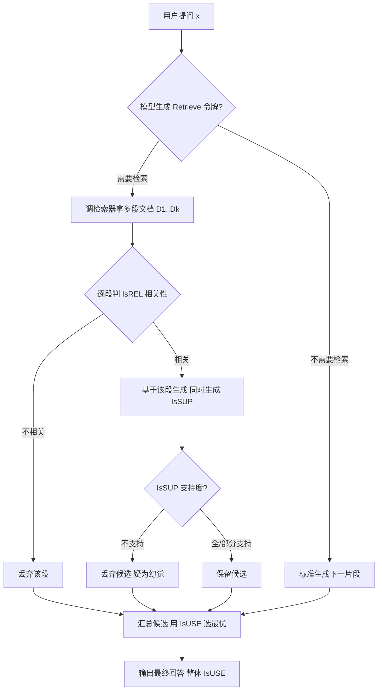
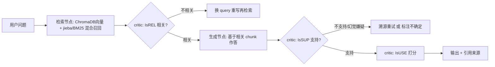

# Self-RAG：让模型学会「先怀疑自己，再开口」

> **本篇建立在哪篇之上**：① 检索基础（你懂「检索 = 捞出相关文档」）+ ② RAG vs Agent（懂 RAG 是「查完念答案」的被动模式）+ ④ 工具系统（懂「critic 本质是一次工具调用」）。本篇会把 Self-RAG 的「自我反思」拆成「在检索后/生成后各卡一道关」，而这两道关用 ④ 学的工具调用视角看最通透。前置基础：知道 RAG 流水线（检索→拼上下文→生成）即可。  
> **目标**：零基础读者读完，能说清 Self-RAG 的四个反思令牌、训练巧思（Critic 离线插令牌）、以及它和标准 RAG / Agentic RAG 的区别；并能在里讲「我把 Self-RAG 闭环搬进了自己的 Agentic RAG」。

## 0. 先讲人话（生活化类比开篇）

传统 RAG 像一位**热心但不过脑子的同事**：你问啥，他二话不说甩你一摞资料（也不管对不对症），照着念答案，念完你发现——资料里压根没这内容，他自己编的。

Self-RAG 想把这同事改造成**「会自查作业的好学生」**：

- 拿到题，先想「这题需不需要翻书？」（该查才查）
- 翻到一段，先掂量「这段跟题沾边吗？」（不相关就扔）
- 每写一句，自问「这句书里真有依据吗？」（不支持就是幻觉嫌疑）
- 写完整体复盘「这答案是个好答案吗？」（打分挑最好的）

一句话：**Self-RAG = 检索增强生成 + 模型自己给自己打分（反思令牌）的闭环**。（来源：arXiv:2310.11511，Asai et al.，ICLR 2024）

## 1. 它是什么 / 为什么需要它

### 1.1 标准 RAG 的两个老毛病

论文原话点得狠（来源 openreview ICLR 2024 原文；53ai 解读 2024）：

1. **不管需不需要都查**：固定检索 N 篇，哪怕问题根本不需要外部知识，白白引入噪音。
2. **查完从不验证**：资料相关不相关全塞进上下文，生成时也**不保证和资料一致**——模型没被训练去「遵循资料里的事实」，于是容易一本正经地幻觉。

Self-RAG 就是冲这两个毛病去的：**按需检索 + 自我验证**。

### 1.2 它谁提的（分量）

- 论文：*Self-RAG: Learning to Retrieve, Generate, and Critique through Self-Reflection*（Asai 等，2023，arXiv:2310.11511）
- 机构：University of Washington & Allen Institute for AI & IBM Research
- 荣誉：**ICLR 2024 Oral**（来源 selfrag.github.io、IBM Research）
- 开源：selfrag.github.io 提供代码与模型；LangChain / LlamaIndex 均有实现

## 2. 原理拆解：四个反思令牌

Self-RAG 精髓，是在生成过程中插入几种**特殊令牌（Reflection Tokens，反思令牌）**——像边说边在脑子里打勾。共四类（来源：memoryforagents 解读；53ai 2024）：

| 令牌 | 含义 | 模型在判断什么 |
|-|-|-|
| `[Retrieve]` | 要不要检索 | 这问题需不需要外部知识？不需要就跳过检索直接生成 |
| `[IsREL]` | 相关性 | 检索到的这段，跟问题沾边吗？ |
| `[IsSUP]` | 支持度 | 我刚说的这句，资料里「全支持 / 部分支持 / 不支持」？ |
| `[IsUSE]` | 有用性 | 整段回答，对解题是不是好答案（1–5 分）？ |

这些令牌**直接混在生成序列里一起吐出来**，不是事后单独评估。模型边生成边自评，推理时就能据此「软约束 / 硬控制」自己。（来源 openreview 原文）

> 直觉：标准 RAG「查完就念」，Self-RAG「查完先掂量、说完再对账」。

## 3. 工作流程（重点，配图）

流程三阶段（来源 hustai / 53ai 解读）：

1. **按需检索**：模型自己决定要不要查（对应 `[Retrieve]`）。
2. **并行生成**：需查时并行处理多个文档，每个先判 `[IsREL]` 再生成。
3. **批评与选择**：每段配 `[IsSUP]`，整体配 `[IsUSE]`，挑最好的输出。

## 4. 它怎么「学会」自我反思（训练巧思）

关键点：**反思令牌是离线插进去的，不是让模型现编**（来源 openreview 原文；53ai 2024）。

- 用一个 **Critic 模型**（基于 GPT-4 标注的反思令牌数据监督训练）离线给训练语料打上反思令牌，构造「文档 + 反思令牌交错」的语料；
- 生成模型在这个语料上做普通「下一个 token 预测」（只是词表扩展了这些特殊令牌）；
- 训练完成后，生成模型**推理时不再依赖 Critic**，自己就能吐反思令牌。

为什么这招妙（对比 PPO / RLHF，来源 selfrag.github.io）：

- PPO 要策略模型和奖励模型来回博弈，显存大、不稳定；
- Self-RAG 把「批判」变成「预测一个 token」，训练更省显存、更稳。
- 还能调反思令牌的奖励权重做**可控生成**：想更严谨就调高 `[IsSUP]` 权重（引用精度↑，流畅度可能↓）；想顺滑就调低。

## 5. 关键数据（能直接甩）

- 6 类任务上，Self-RAG(7B/13B) **超越 vanilla ChatGPT 与 Llama2-chat**（来源 selfrag.github.io 主页结论）。
- **引用精度（citation precision）**：长文本 ASQA 上，7B 甚至**超过 ChatGPT**（衡量「每句声明是否真被引用证据支持」）。
- **检索频率权衡实证**（来源 selfrag.github.io 图分析）：

  - PopQA（开放域问答）：强行少检索 → **相对性能掉 40%**；
  - PubHealth（事实验证）：少检索只掉 **2%**。  
  → 事实类任务高度依赖检索，验证类可少查。这点对 ② 讲的「按需检索」是硬证据。
- 荣誉：**ICLR 2024 Oral**。

## 6. 对比：Self-RAG vs 标准 RAG vs Agentic RAG

| 维度 | 标准 RAG | Self-RAG | Agentic RAG |
|-|-|-|-|
| 检索时机 | 固定次数/一次性 | 模型自适应按需 | 由 Agent 规划决定 |
| 验证检索质量 | 否 | 是（`[IsREL]`） | 视实现，常配工具校验 |
| 验证生成支持度 | 否 | 是（`[IsSUP]`） | 部分实现有自省 |
| 谁做决策 | 流程写死 | 单个模型内 self-critique | 多组件/多 Agent 协作 |
| 可控性 | 低 | 高（调令牌权重） | 中（依赖编排） |
| 典型实现 | 检索+拼上下文 | 端到端微调模型 | LangGraph 状态机 |

（来源综合：53ai 2024 / 项目 MEMORY）

> 你的简历项目是 **Agentic RAG（LangGraph 编排）**，Self-RAG 是「模型中心」思路。实践中可以说：我把 Self-RAG 的「自评闭环」思想搬进了 Agentic RAG——检索后、生成后各加一个 critic 节点做 `[IsREL]` / `[IsSUP]` 校验。

## 7. 强绑你的简历项目（落地怎么写）

把 Self-RAG 闭环用 LangGraph 状态机复刻——**不一定端到端微调模型**，用「小 critic 节点 / 工具调用」替代反思令牌即可（这正是 ④ 学的：critic 本质是一次工具调用）。

- **ChromaDB**：语义召回；**jieba/BM25**：中文关键词召回补盲（来源：你项目混合检索主干）。
- **LangGraph 条件边**：实现 `critic → 通过/重做` 的闭环，正是 Self-RAG 思想的工程化版本（来源：你项目 StateGraph 9 节点 + 3 条件边）。

## 8. 常见误区

- ❌ **「Self-RAG 一定要自己微调大模型」** → 错。原论文是端到端微调；工程落地常用「小 critic 模型 / 规则」替代反思令牌，效果近似、成本低得多。
- ❌ **「反思令牌越多 / 检索越勤越好」** → 错。论文实证少检索在 PubHealth 只掉 2%、PopQA 掉 40%——**按任务调频**，否则拖慢且冗余。
- ❌ **「Self-RAG = Agentic RAG」** → 错。Self-RAG 是「模型中心、单模型自省」；Agentic RAG 是「多组件编排」。两者可融合（见上节）。
- ❌ **「`[IsSUP]` 全支持就一定对」** → 错。它只判断「是否由给定文档支持」，文档本身可能错；仍需源头质量把控（你项目的 `rerank_score < 0.3 拒答` 就是最后一道关）。

## 9. 核心要点

- **Self-RAG 是什么**：让 LLM 生成时自己决定检索、并自评检索相关性与生成支持度的 RAG 框架，靠特殊「反思令牌」实现。
- **四个令牌**：`[Retrieve]`（查不查）/ `[IsREL]`（相关吗）/ `[IsSUP]`（有依据吗）/ `[IsUSE]`（有用吗）。
- **最大卖点**：按需检索 + 自我验证 → 事实性↑、引用精度↑、可控性↑。
- **训练巧思**：Critic 离线插令牌，比 PPO 省显存；推理时模型自吐令牌，不再依赖 Critic。
- **关键数据**：ICLR 2024 Oral；7B 在 ASQA 引用精度超 ChatGPT；PopQA 少检索掉 40%、PubHealth 只掉 2%。
- **一句对比**：标准 RAG「查完就念」，Self-RAG「查完先掂量、说完再对账」。
- **结合项目**：用 LangGraph 条件边 + ChromaDB/jieba-BM25 + critic 节点把自评闭环工程化，省去微调。

## 10. 简历项目绑定：具体改进方向

基于你项目 `ai-resume-analyzer` 真实架构（LangGraph StateGraph 9 节点 + 3 条件边 + Reflexion ≤2 轮 + 混合检索 + 拒答阈值 `rerank_score<0.3`），对照 Self-RAG，有 **2 个具体改进点**——把「Self-RAG 的自评闭环」从「只在 Reflexion 里」补成「检索后也卡一道」：

**改进 1：在检索后加 `[IsREL]` 相关性 critic 节点，实现「按需/相关性过滤」（对应 Self-RAG 的 `[Retrieve]`+`[IsREL]`）**

- **差距**：你项目目前检索是「固定全链路」（ChromaDB+jieba/BM25 → RRF → 百炼 rerank Top5），rerank 只做**排序**和**拒答阈值过滤，没有「这段跟问题到底相不相关」的显式 critic 判断**。Self-RAG 的 `[IsREL]` 能在生成前就丢掉无关段落，减少噪声注入。
- **具体改动点**：

  - 文件定位：LangGraph 图定义 `graph.py`（`mcp_graph.py` 同理），在「检索节点」和「生成节点」之间新增一个 `rel_critic` 节点；用现有 3 条件边模式 `add_conditional_edges("rel_critic", ...)` 接出：相关→进生成；不相关→`rewrite_query` 重写后回到检索（复用你已有的 `rewrite_query` MCP Tool）。
  - `rel_critic` 实现：调用 LLM 对 Top5 chunk 逐段打「相关/不相关」，或复用百炼 rerank 的 score 做阈值（如 `rerank_score < 0.3` 直接判不相关，与你拒答阈值同源）。
- **风险**：多一轮 LLM 判断增加延迟与成本；缓解：仅对 rerank 处于「灰色区间」的 chunk 跑 critic，高分段直接采信。
- **收益**：减少无关上下文污染、降低幻觉；一句话讲清：「我把 Self-RAG 的 `[IsREL]` 相关性 critic 落进 StateGraph，检索后先卡一道相关性，不相关就重写 query 重查——这正是 Self-RAG 闭环的工程化。」
- **一句话讲清**：「我的 RAG 不是无脑塞 Top5。检索后有个 critic 节点判相关性，对应 Self-RAG 的 `[IsREL]`；不相关就触发 query 重写重检，比固定召回更稳。」

**改进 2：在生成后加 `[IsSUP]` 支持度校验，与现有 Reflexion 对齐（对应 Self-RAG 的 `[IsSUP]`）**

- **差距**：你项目已有 Reflexion ≤2 轮（score<0.6 触发），但它是「LLM-as-Judge 三维度整体打分」（完整性/准确性/来源可信度），**没有「逐句声明是否被检索证据支持」的细粒度自检**——而 `[IsSUP]` 正是逐句级的支持度验证，是防幻觉更锋利的一刀。
- **具体改动点**：

  - 文件定位：Reflexion 循环所在的节点（`graph.py` 的 `reflect` 条件边 / `mcp_nodes.py`），在现有整体打分前，加一步「逐句 `[IsSUP]` 标注」：让 LLM 对答案每个声明标「全支持/部分支持/不支持」，不支持的句直接触发重试或标注「不确定」。
  - 复用你项目「来源可溯源」能力，把每句声明映射到具体 chunk 来源，做证据对齐。
- **风险**：逐句校验增加 token 消耗；缓解：仅当整体 score 处于临界（如 0.6–0.7）才启细化检。
- **收益**：幻觉定位从「整段」细化到「单句」，防幻觉能力再上一层；可讲「我把 Self-RAG 的 `[IsSUP]` 逐句支持度校验并进了 Reflexion 循环，和业界 `[IsREL]/[IsSUP]` 思想对齐」。
- **一句话讲清**：「我的 Agentic RAG 已有 Reflexion 自纠正，我进一步把 Self-RAG 的逐句 `[IsSUP]` 支持度校验加进去——每句声明都要求有检索证据支撑，不支持就标不确定或重试，这就是 Self-RAG 闭环在我项目里的落地。」

## 下一篇预告

下一篇 **⑥ 工具调用失败处理（文件不存在 / 超时 / 权限不足 → 恢复与重试）**——你已在 ④ 学了「工具是 Agent 的手脚、由代码真正执行」，但现实里工具会失败：数据库连不上、API 超时、权限不够。下一篇就讲 Agent 怎么在这些坑里「摔倒了爬起来接着干」，而不是当场崩给你看。带着 ④ 的工具视角，下一篇会非常实用。

## 
> ▶ 对应实操：[[12-Self-RAG：自我反思+自纠正闭环|12-Self-RAG：自我反思+自纠正闭环]]

相关链接
- [[13-RAG检索增强生成]]
- [[22-RAG评估指标]]
- [[23-Agent架构与核心组件]]
- [[39-记忆系统vs-RAG本质区别]]
- [[八股文学习清单]]
- [[00-全局导航|全局导航]]
