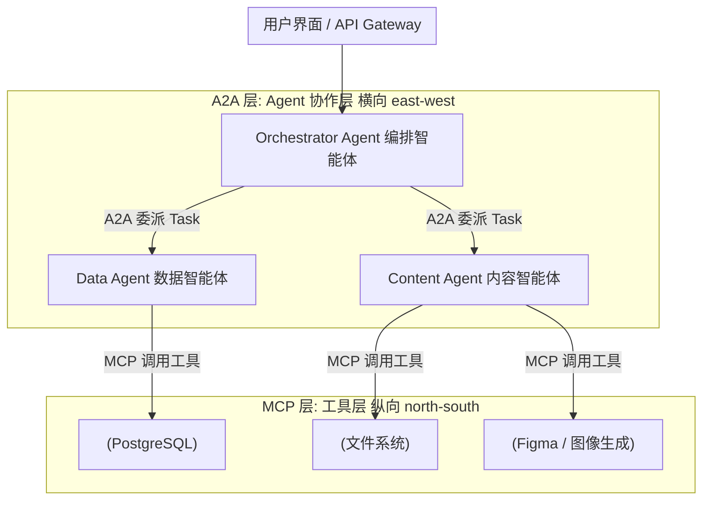
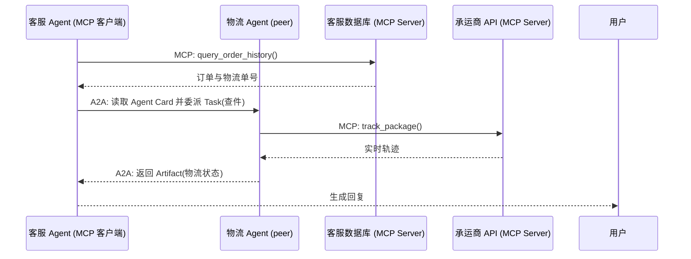
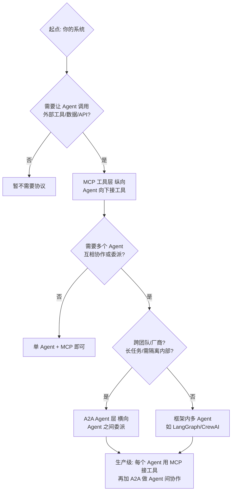
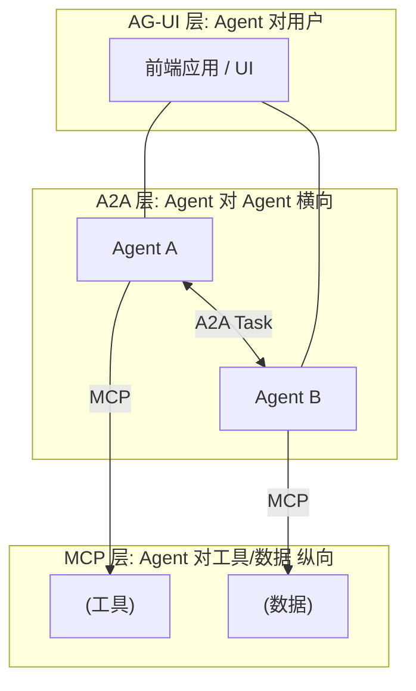
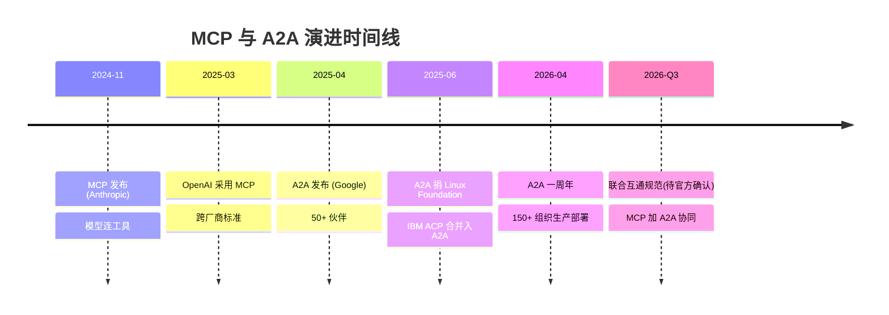

# 前置说明：本篇站在哪篇之上、需要什么基础

本篇是第 14 篇，🔴高优主题。它建立在两篇前置之上：

- **⑧ MCP 协议**——你已经知道 MCP（Model Context Protocol，模型上下文协议）是怎么把 Agent 连到工具/数据的；
- **⑬ A2A 协议**——你已经知道 A2A（Agent2Agent，智能体间协议）的 Agent Card、Task 状态机、横向通信。

本篇不再复述两者的基础概念，而是专攻一个高频题：**「MCP 和 A2A 到底有什么区别？是不是二选一？」**。结论先行——**它们不是竞争关系，是同一栋楼里不同楼层的管道：MCP 纵向（north-south，南北向）把 Agent 接到工具，A2A 横向（east-west，东西向）把 Agent 接到 Agent，两者互补、缺一不可。**

> 
读前 30 秒速览（细节回 ⑧ / ⑬）：**MCP** = Anthropic 2024-11 发布，client-server，Agent 向下调用工具/数据，比喻「USB-C 接口」。**A2A** = Google 2025-04 发布、2025-06 捐给 Linux Foundation，Agent 之间发「名片」(Agent Card) + 委派「任务」(Task)，比喻「Agent 社会的邮局」。

# 一句话核心判断

> MCP connects an agent to its tools. A2A connects an agent to other agents. Different axis, different problem.（MCP 把 Agent 连到它的工具；A2A 把 Agent 连到其他 Agent。不同轴向，不同问题。）—— 业界共识，2026

所有对比都从这句话长出来。记住这一句，被问「两者区别」你就能开口就压住场。

# 类比开场：装修一间智能厨房

把「生产级多 Agent 系统」想象成装修一间智能厨房（rhkb.cn，2026 工程实践）：

**MCP 像什么？**——统一标准的**电源插座 + 进水/排水接口**。不管你要接洗碗机、咖啡机还是食物处理器，只要符合这个接口标准，就能即插即用，不用每个电器都从墙里单独拉一根专属电线。对应到 Agent：不管底层是 MySQL、REST API 还是文件系统，MCP 把它们的「能力」统一成标准工具接口，Agent 即插即用。

**A2A 像什么？**——这些电器之间协同工作的**「通信协议」和「任务流转清单」**。咖啡机磨完豆，要告诉咖啡壶「准备接粉」；洗碗机洗完，要通知烘干柜「可以开工了」。它们各干各的，靠一套标准语言和流程交接任务。对应到 Agent：简历分析 Agent 干完自己的活，把「求职建议」这块交给另一个职业辅导 Agent，靠 A2A 的标准 Task 交接，彼此不用暴露内部实现。

所以「MCP 还是 A2A」这个提问本身就是错的——就像问「装修厨房用插座还是用通信协议」，两者根本不在一层。

# 概念拆解：什么是「纵向」与「横向」

## 先类比建立直觉

在网络架构里有个经典分法：**north-south（南北向）**指「上层应用 ↔ 底层资源」的纵向流量（比如你浏览器访问服务器）；**east-west（东西向）**指「同层服务 ↔ 同层服务」的横向流量（比如微服务 A 调微服务 B）。

把 LLM（Large Language Model，大语言模型）当成「住在顶层的大脑」，把工具/数据库当成「住底层的手脚」：

- **MCP = 南北向**：大脑向下伸手去拿工具、读数据。一个 Agent 连它自己的工具世界。
- **A2A = 东西向**：大脑和隔壁另一个大脑对话、委派活。多个 Agent 平级协作。

## 再给严格定义

**纵向连接（MCP 的轴向）**：单个 Agent 运行时，与它所需的外部能力（工具 Tool、资源 Resource、提示模板 Prompt）之间的连接。特征是**强结构化**——输入参数有 schema、返回有固定格式、操作原子化（调一次就完）。这正是 MCP 擅长的。

**横向连接（A2A 的轴向）**：两个各自拥有独立模型、记忆、工具的 Agent 之间，协商任务分配、同步进度、处理长时异步任务、串流中间结果。它更接近**人类同事协作**——需要多轮对话、状态机、超时与重试。这正是 MCP 设计范围之外、A2A 的核心能力（meta-intelligence.tech，2026）。

> 
**为什么不能用一个协议解决所有问题？** 因为「连工具」和「连 Agent」是两种不同性质的连接：前者是结构化的函数调用（像拧螺丝），后者是带状态机的异步协作（像项目管理）。硬把 A2A 的长任务状态机塞进 MCP，或硬让 MCP 去协调多个自主 Agent，都会把协议撑变形。就像 TCP/IP 管网络传输、HTTP 管应用层通信，两者不冲突且缺一不可。

# Mermaid 图 1：分层架构（MCP 在下、A2A 在上）

读图要点：**每个 Agent 内部用自己的 MCP 接工具，Agent 之间用 A2A 委派任务**。这正是「MCP 在下、A2A 在上」的分层。注意 Agent 彼此不知道对方怎么干活（黑盒），只交换 Task 和 Artifact。

# 本质区别全景对比表

| 对比维度 | MCP（Model Context Protocol） | A2A（Agent2Agent） |
|-|-|-|
| 发起方 | Anthropic（2024-11） | Google（2025-04），现 Linux Foundation |
| 核心目标 | Agent 连工具/数据/API（纵向） | Agent 连 Agent、委派任务（横向） |
| 通信方向 | 南北向：Agent ↔ 工具/数据 | 东西向：Agent ↔ Agent |
| 连接对象 | 被动执行的工具/数据源 | 有自主决策能力的远程 Agent |
| 核心概念 | Host / Client / Server / Tool / Resource / Prompt | Agent Card / Task / Message / Artifact |
| 服务发现 | tools/list、resources/list（能力清单） | Agent Card（JSON 能力名片，挂在 /.well-known/agent.json） |
| 传输 | JSON-RPC 2.0 over stdio / Streamable HTTP / SSE | HTTP + JSON-RPC 2.0 + SSE（v1.0 起可选 gRPC） |
| 状态管理 | 有状态的持久连接，无任务生命周期 | Task 状态机：submitted→working→input-required→completed/failed/canceled |
| 长任务 | 非主要设计场景（同步请求-响应） | 原生支持（SSE 串流 + 异步 + push 通知） |
| 多模态 | 以文本/结构化数据为主 | 原生支持（Part 可含文本/文件/图片/音视频） |
| 认证安全 | 客户端 guard + 人机回环（human-in-the-loop） | OAuth 2.0 / API Key / 企业 SSO，v1.0 签名 Agent Card（JWS）、mTLS |
| 生态成熟度 | 高（千级开源 MCP Server，OpenAI/微软均采用） | 快速成长（150+ 组织生产部署，2026-04 一周年） |

来源：dawiso.com、aitoolsatlas.ai、mcpserverspot.com、atlan.com、dev.to、stackone.com、meta-intelligence.tech 等多篇 2026 对比分析文综合整理。

# Mermaid 图 2：协同架构（互补最直观的例子）

读图要点（mcpserverspot.com 案例）：客服 Agent 用 **MCP** 查自己的数据库；通过 **A2A** 发现合作方物流 Agent 的「名片」并委派「查件」任务；物流 Agent 收到后，用**它自己的 MCP** 去查承运商 API，再把结果通过 A2A 交回。一句话：**MCP 管所有工具访问，A2A 管 Agent 间协调，谁也替代不了谁。**

# Mermaid 图 3：决策树（什么时候用哪个）

决策口诀：**要工具 → MCP；要协作 → A2A；企业级真实系统 → 两者都要。**极少数架构只用 A2A 而不用 MCP（Agent 不需要碰任何外部工具），但现实中几乎不存在。

# 它们如何组合：Agent 协议栈（顺带认识 AG-UI）

把视野再拉高一层，2026 年业界把 Agent 相关协议按「层」摆开（dev.to，Agent Protocol Stack）：

| 协议 | 创建方 | 连接什么 | 一句话 |
|-|-|-|-|
| **AG-UI** | CopilotKit | Agent ↔ 用户界面（UI） | 「Agent 怎么跟用户对话/流式展示」 |
| **A2A** | Google / Linux Foundation | Agent ↔ Agent | 「Agent 之间怎么协作」 |
| **MCP** | Anthropic | Agent ↔ 工具/数据 | 「Agent 怎么用工具」 |

类比：**AG-UI 像 HTML（表现层），A2A 像 HTTP（应用协作层），MCP 像 TCP/IP（底层传输/能力层）**——三者不同层、协同工作，才撑起完整 Agent 应用。AG-UI 是前瞻方向，能提一句「协议还在分层收敛中」就很加分。

# Mermaid 图 4：三层协议栈

# 常见误区（最爱追问的反面）

## 误区 1：「MCP 和 A2A 是竞争关系，得押一个」

**错。** Google 在发布 A2A 时就明确把它定位为 MCP 的**互补**协议，大量官方 demo 都是「Agent 内部用 MCP 接工具、Agent 之间用 A2A 协作」。选边站是伪命题。

## 误区 2：「我得二选一」

**错。** 单一助手用工具 → 只需 MCP；多 Agent 系统 → 基本两者都要。真实企业架构几乎都是「每 Agent 用 MCP 接工具 + A2A 做协作」。

## 误区 3：「A2A 会取代 MCP」

**错。** A2A 只定义「怎么让另一个 Agent 干一件事」，**不定义** Agent 怎么读文件、查数据库——那正是 MCP 的活。A2A 的 remote Agent 自己也得用 MCP 接底层工具（见上图 2）。

## 误区 4：「MCP 不支持多 Agent」

**错（但易混）。** MCP 本身是点对点（point-to-point）协议，但任何多 Agent 框架（LangGraph / CrewAI / OpenAI Agents SDK）都可以给**每个 Agent 配自己的 MCP 客户端**；框架负责编排，MCP 负责每个 Agent 各自的工具访问。MCP 管不了「Agent 间协调」，那才交给 A2A。

> 
**一句话去魅：**「MCP 是 Agent 的工具箱，A2A 是 Agent 的招聘启事。」给 Agent 一套工具用 MCP，让 Agent 去雇别的 Agent 用 A2A。两者描述同一个系统的不同轴向。

# 边界与治理：两者都不管的「上下文层」

一个容易被忽略的硬知识点（atlan.com，2026）：**MCP 和 A2A 都不保证「上下文质量 / 版本 / 治理」。**

- MCP Server 可以完全合规，却返回一份「过期三个月」的业务定义——**协议合规 ≠ 上下文准确**。
- A2A 能规范 Agent 间怎么交接任务，但管不了交接的内容本身对不对。
- 真正解决「数据准不准、版本对不对」的是更底层的 **context layer（上下文层）**——它是两个协议共同跑在上面的底座。

**安全共通风险：间接提示注入（indirect prompt injection）。** 两个协议都面临——MCP 里恶意工具返回里藏诱导指令，A2A 里恶意 Agent 的 Artifact 里藏诱导指令（stackone.com，2026）。防御思路都是「把不可信外部内容当数据而非指令、做来源隔离与权限最小化」。

# Mermaid 图 5：演进时间线

说明：2026-Q3「联合互通规范」为业界预测（meta-intelligence.tech），**以官方发布为准**。IBM 的 ACP（Agent Communication Protocol）已合并进 A2A，是「互补而非分裂」的又一个证据。

# 核心问答

**Q1：MCP 和 A2A 一句话区别？**  
A：MCP 纵向把 Agent 连到工具/数据，A2A 横向把 Agent 连到其他 Agent；不同轴向、互补非竞争。

**Q2：为什么说它们互补而不是竞争？**  
A：解决不同问题。MCP 管「Agent 怎么用工具」（结构化函数调用），A2A 管「Agent 怎么协作」（带状态机的异步任务委派）。生产系统通常两者都要——每个 Agent 用 MCP 接工具，Agent 间用 A2A 协作。

**Q3：能不能只用一个？**  
A：单一 Agent 用工具 → 只需 MCP。多 Agent 跨团队/长任务 → 加 A2A。几乎不存在「只用 A2A 不用 MCP」的真实系统，因为 Agent 终归要碰外部工具。

**Q4：两者怎么协同？**  
A：分层——MCP 在下（工具层），A2A 在上（Agent 协作层）。一个客服 Agent 用 MCP 查库，通过 A2A 发现物流 Agent 的 Agent Card 并委派 Task，物流 Agent 再用自己的 MCP 查承运商 API，结果经 A2A 交回。

**Q5：MCP 有什么管不了的？**  
A：不管 Agent 间协调（那是 A2A），也不保证上下文质量/版本/治理——合规的 MCP Server 也可能返回过期数据。安全上两者都面临间接提示注入。

**Q6：实际生产怎么选架构？**  
A：先 MCP 把工具标准化（垂直集成）；当出现跨团队/跨厂商的多 Agent 协作、长任务委派、需要隔离内部实现时，再加 A2A（水平集成）。「MCP 先行，A2A 渐进」是稳妥路径。

# 简历绑定：你的项目怎么补齐「横向」这一层

**差距分析（基于真实代码核查）：**你的 `D:\Project\ai-resume-analyzer` 是**单 Agent LangGraph 编排 + MCP 垂直集成**——`backend/mcp_server/server.py` 用 FastMCP 暴露 5 个工具（search_knowledge_base / rerank_results / generate_answer / analyze_resume / rewrite_query），`backend/mcp_client/client.py` 是 JSON-RPC 客户端，`backend/main.py` 把 MCP 挂到 `/mcp`。全仓**零 A2A / AgentCard / well-known 痕迹**：你只有「纵向」，没有「横向」。这恰好是被问「你项目还能怎么改进」时最该讲的点——你把 ⑧ 和 ⑭ 的理论直接落到了架构演进话术上。

## 改动点 1：在仓库显式画出「两层边界」（低成本、高话术收益）

- **加什么：**新增 `docs/protocol-layering.md` + 一张 Mermaid 分层图，写明「MCP = 工具层（已有）/ A2A = Agent 层（规划中）」。
- **为什么：**一眼就能看出你不是「会用 MCP 就行」，而是理解协议分层。这是本篇图 1 的仓库版。
- **风险：**极低，纯文档，不改运行时代码。
- **预期收益：**一句话讲清「我项目现在是纵向 MCP，横向 A2A 是我规划的下一代演进」，体现架构视野。

## 改动点 2：把现有 MCP Server 包装成 A2A Agent（复用已有工具层）

- **加什么：**新建 `backend/a2a_adapter/`：`agent_card.py` 读取 `mcp_server/server.py` 里 5 个 tool 的 schema，生成 Agent Card 挂到 `/.well-known/agent.json`；`server.py` 接收入站 A2A Task，翻译成对应的 MCP tool call（复用 `mcp_client/client.py` 的 JSON-RPC 调用）。
- **为什么：**这就是本篇图 2 的「MCP 在下、A2A 在上」——你不用重写任何工具，只是把已有的垂直工具层「横向暴露」出去，让别的 Agent 能委派给你。
- **风险：**A2A 端点需加认证（v1.0 签名 Card / OAuth），否则暴露内部能力；需处理 Task 状态机映射（MCP 同步调用 → A2A 的 working/completed）。
- **预期收益：**最强故事：「我把项目的 MCP 工具层，零改写地通过 A2A 暴露成可被其他 Agent 委派的智能体」，证明你真懂互补架构。

## 改动点 3：在 graph.py 加「横向委派」条件边（引入 peer Agent）

- **加什么：**在 `backend/services/agentic_rag/graph.py` 的 StateGraph 中新增条件边 `route_to_peer`：当意图识别为跨域（如「求职建议」而非「简历评分」）时，进入 `a2a_delegate_node`，向一个独立 peer Agent（如 `backend/peers/career_coach/`，可有自己的 MCP 工具）发 A2A Task。该 node 与 ⑬ 篇的 a2a_delegate_node 设计一致。
- **为什么：**让项目从「单 Agent 纵向」演进到「多 Agent 横向协作」，正面回应本篇图 3 决策树里「跨团队/长任务 → A2A」的分支。
- **风险：**跨 Agent 的状态/上下文传递（需把 resume 上下文安全传给 peer，避免泄露）；增加一跳网络延迟；需处理 peer 不可用时的降级（回退到本地 LLM 直答）。
- **预期收益：**从「会用 MCP」升级到「能设计 MCP+A2A 分层系统」，追问改进时有 concrete 落地路径。

> 
**追问话术储备：**「我的项目 v0.2.0 已用 MCP 完成纵向工具集成（5 个 tool + JWT + 混合检索）。下一步规划是横向层——把 MCP 工具层用 A2A Agent Card 暴露出去，并在 LangGraph 加委派条件边接入 peer Agent，形成 MCP 在下、A2A 在上的生产级分层。这正好对应业界『MCP 先行、A2A 渐进』的落地路径。」

# 下一篇预告

本篇把「纵向 vs 横向」讲透了。下一篇建议顺「协议栈」往上走一层，深入 **AG-UI 协议：Agent ↔ 用户界面交互层（流式事件 / 状态同步 / 人类介入）**——它和 MCP、A2A 共同构成 2026 Agent 协议栈，能一句话串起三层会很亮眼。如果你更想往「实战」走，也可以选 **Multi-Agent 编排框架对比：LangGraph vs CrewAI vs OpenAI Agents SDK**（直接贴你项目的 graph.py）。你定方向，我开写。

---

**资料来源（均为 2026 年公开资料，检索于 2026-07-16）：**dawiso.com《MCP vs A2A Protocol》、aitoolsatlas.ai《A2A vs MCP》、mcpserverspot.com《MCP vs Google A2A》、atlan.com《MCP vs A2A》、dev.to（rupa_tiwari / jubinsoni）Agent Protocol Stack、stackone.com《MCP vs A2A Architecture Security》、meta-intelligence.tech《A2A 与 MCP 协议整合指南》、naveeratech.com《MCP vs A2A 2026》、rhkb.cn《MCP 与 A2A 分层架构工程实践》。关键数据：A2A 2026-04 一周年 150+ 组织生产部署、IBM ACP 合并入 A2A、Linux Foundation 治理；「2026-Q3 联合互通规范」为业界预测，以官方发布为准。

## 
> ▶ 对应实操：[[37-Multi-Agent协作模式|37-Multi-Agent协作模式]]

相关链接
- [[26-MCP协议核心概念]]
- [[52-A2A协议核心概念]]
- [[54-ANP协议概念]]
- 54
- [[八股文学习清单]]
- [[00-全局导航|全局导航]]
