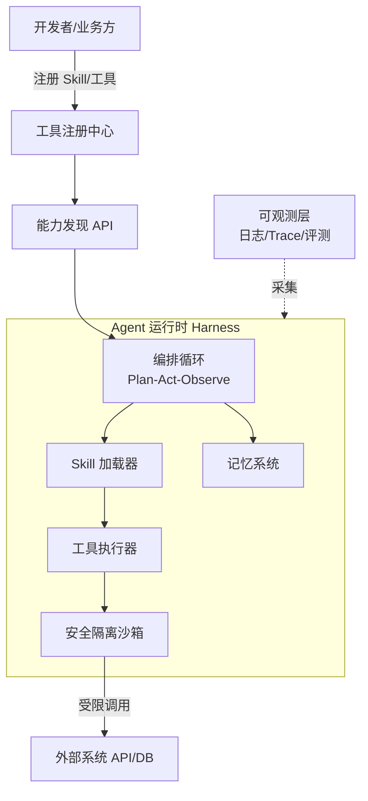

# Agent 平台设计

> 本篇聚焦**如何把零散的 Agent 能力沉淀成一个可复用、可治理、可扩展的平台**。单个 Agent 的推理机制见 [[笔记/八股文笔记/AI-LLM-RAG-Agent/23-Agent架构与核心组件|Agent架构与ReAct]]、[[笔记/八股文笔记/AI-LLM-RAG-Agent/30-Harness与Skill|Harness与Skill]]；工具调用与协议见 [[笔记/八股文笔记/AI-LLM-RAG-Agent/25-Function-Calling工具调用|Function Calling]]、[[笔记/八股文笔记/AI-LLM-RAG-Agent/26-MCP协议核心概念|MCP协议]]。

## 为什么需要 Agent 平台

当 Agent 从"一个脚本"变成"公司多个业务都在用"时，会出现重复造轮子、工具各自为政、安全无统一防线、无法统一观测等问题。平台化要解决四件事：**能力复用（Skill）、工具统一治理、安全隔离、可观测**。

## 平台总体架构

## 模块一：Harness（编排核心）
负责 Agent 的"思考-行动-观察"主循环、最大步数限制、循环检测、错误处理与降级。它是平台的稳定内核，业务方只写"技能"和"工具"，不碰编排。详见 [[笔记/八股文笔记/AI-LLM-RAG-Agent/30-Harness与Skill|Harness与Skill]]。

## 模块二：Skill 加载（插件化能力）
- 每个 Skill = 一段可复用的提示词 + 工具组合 + 输入输出契约。
- 平台按需动态加载，避免把所有能力塞进一个超长 System Prompt。
- 版本化管理 Skill，支持灰度与回滚。

## 模块三：工具注册中心（统一治理）
所有外部能力（API、DB、代码执行）**统一注册、统一发现、统一鉴权**：

| 能力 | 设计要点 |
| ------ | ------ |
| 注册 | 工具名、描述、参数 schema、所需权限 |
| 发现 | Agent 运行时按任务检索可用工具（或经 MCP 暴露） |
| 鉴权 | 每个工具绑定最小权限，调用前校验 |
| 监控 | 调用次数/耗时/成功率/错误码统一上报 |

工具描述质量直接决定 Function Calling 命中率，见 [[笔记/八股文笔记/AI-LLM-RAG-Agent/25-Function-Calling工具调用|Function Calling]]。

## 模块四：安全隔离
- **执行沙箱**：代码执行/Shell 在受限容器或沙箱中进行，禁止越权访问。
- **权限分级**：只读/读写/高危操作分级，高危操作需人工确认或二次授权。
- **资源配额**：单次调用超时、Token/费用上限，防失控。
- 更完整的攻防设计见 [[09-Agent安全防护系统设计|Agent安全防护系统设计]]。

## 关键权衡

| 问题 | 设计回答要点 |
| ------ | ------ |
| 为什么不直接用 LangChain 而自研 Harness？ | 调试困难、性能损耗、定制化差；自研 Harness 把编排、观测、降级掌握在自己手里（详见 自研Harness思路） |
| 工具和 Skill 的区别？ | Skill 是"面向任务的能力包"（提示词+工具组合），工具是"原子外部能力"（一个 API/一次执行）；Skill 组合工具 |
| 如何防止 Agent 乱调工具？ | 工具注册中心做权限分级 + 调用前鉴权 + 高危操作人工确认 + 资源配额上限 |
| 多业务共用平台如何隔离？ | 租户级 Skill/工具命名空间 + 数据权限标签 + 独立配额与日志 |

---

## 相关链接
- [[笔记/八股文笔记/AI-LLM-RAG-Agent/23-Agent架构与核心组件|Agent架构与ReAct]]
- [[笔记/八股文笔记/AI-LLM-RAG-Agent/30-Harness与Skill|Harness与Skill]]
- [[笔记/八股文笔记/AI-LLM-RAG-Agent/25-Function-Calling工具调用|Function Calling]]
- [[笔记/八股文笔记/AI-LLM-RAG-Agent/26-MCP协议核心概念|MCP协议]]
- [[笔记/八股文笔记/AI-LLM-RAG-Agent/28-Agent记忆基础与状态管理|Agent记忆与状态管理]]
- [[09-Agent安全防护系统设计|Agent安全防护系统设计]]
- [[八股文学习清单]]
- [[00-全局导航|全局导航]]

---

## 快速问答

| 问题 | 参考答案 |
| ------ | --------- |
| Agent 平台的核心组成？ | Harness（编排内核）+ Skill 加载（插件化能力）+ 工具注册中心（统一治理）+ 安全隔离（沙箱/权限）+ 可观测层。 |
| 为什么工具要"注册中心"而不是硬编码？ | 统一发现/鉴权/监控，业务解耦，避免每个 Agent 重复接一遍工具且安全各自为政。 |
| Skill 和 Prompt 模板有什么区别？ | Skill 是"任务级能力包"：自带工具组合与输入输出契约，可版本化、可组合；Prompt 模板只是文本片段。 |
| 平台如何保证安全？ | 执行沙箱 + 工具权限分级 + 高危操作人工确认 + 资源配额上限 + 全链路审计日志。 |
