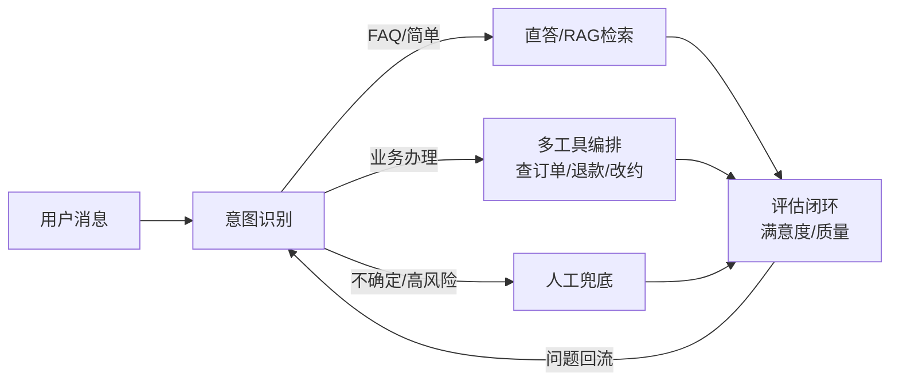

# AI 客服 Agent 设计

> 经典的端到端 AI Agent 落地场景：**意图识别 → 多工具编排 → 人工兜底 → 评估闭环**。Agent 基础见 [[笔记/八股文笔记/AI-LLM-RAG-Agent/23-Agent架构与核心组件|Agent架构与ReAct]]、多 Agent 协作见 [[笔记/八股文笔记/AI-LLM-RAG-Agent/29-多Agent协作基础与框架选型|多Agent协作Multi-Agent]]、安全见 [[笔记/八股文笔记/AI-LLM-RAG-Agent/66-大模型安全与伦理|大模型安全与伦理]]。

## 整体闭环

## 模块一：意图识别
- 先分类：闲聊 / 咨询 / 业务办理 / 投诉 / 转人工。
- 用轻量模型或分类器做路由，避免每个请求都调大模型。
- 识别"情绪/风险"信号（辱骂、资金风险），触发升级。

## 模块二：多工具编排
- 查询类工具：订单查询、物流、知识库检索（RAG）。
- 办理类工具：退款、改约、发券——**高危操作必须权限分级 + 人工确认**，见 [[09-Agent安全防护系统设计|Agent安全防护系统设计]]。
- 用 ReAct 或 Plan-and-Execute 串联多步，见 [[笔记/八股文笔记/AI-LLM-RAG-Agent/23-Agent架构与核心组件|Agent架构与ReAct]]。

## 模块三：人工兜底
- **主动转人工**触发条件：低置信度、高风险操作、用户明确要求、连续两轮未解决。
- 转人工时把**对话摘要 + 已收集信息 + 推荐方案**一并给坐席，减少重复沟通。
- 人机协同而非全替代：AI 处理 80% 高频，人处理长尾与纠纷。

## 模块四：评估闭环
- 实时：满意度评分、解决率、转人工率。
- 离线：抽检 + LLM-as-Judge 评质量，问题回流到知识库/意图体系，见 [[04-AI评测平台设计|AI评测平台设计]]。
- 安全与合规审计贯穿全程，见 [[笔记/八股文笔记/AI-LLM-RAG-Agent/66-大模型安全与伦理|大模型安全与伦理]]。

## 关键权衡

| 问题 | 设计回答要点 |
| ------ | ------ |
| 什么时候该转人工？ | 低置信度、资金/隐私高风险、用户要求、连续未解决；核心是"宁可转人工也别乱承诺" |
| 怎么避免 AI 擅自退款？ | 工具权限分级 + 高危操作需人工确认/二次授权 + 操作审计，见安全防护设计 |
| 如何持续提升客服质量？ | 评估闭环：满意度/解决率监控 + 离线质检 + 问题回流知识库与意图体系 |
| 意图识别和 RAG 怎么配合？ | 意图识别做路由（该查知识库还是办业务），RAG 负责知识问答，二者分层不耦合 |

---

## 相关链接
- [[笔记/八股文笔记/AI-LLM-RAG-Agent/23-Agent架构与核心组件|Agent架构与ReAct]]
- [[笔记/八股文笔记/AI-LLM-RAG-Agent/29-多Agent协作基础与框架选型|多Agent协作Multi-Agent]]
- [[笔记/八股文笔记/AI-LLM-RAG-Agent/66-大模型安全与伦理|大模型安全与伦理]]
- [[09-Agent安全防护系统设计|Agent安全防护系统设计]]
- [[04-AI评测平台设计|AI评测平台设计]]
- [[八股文学习清单]]
- [[00-全局导航|全局导航]]

---

## 快速问答

| 问题 | 参考答案 |
| ------ | --------- |
| AI 客服的核心闭环？ | 意图识别 → 多工具编排（查询/办理）→ 人工兜底 → 评估闭环（问题回流优化），四段循环。 |
| 为什么不能让 Agent 直接办所有业务？ | 退款/改约等高危操作有误操作与合规风险，必须权限分级 + 人工确认 + 审计。 |
| 转人工如何不丢上下文？ | 转接时附对话摘要、已收集信息、推荐方案，坐席无缝接管。 |
| 怎么衡量客服 Agent 好坏？ | 解决率、转人工率、满意度、离线质检分；用评估闭环持续回流优化。 |
