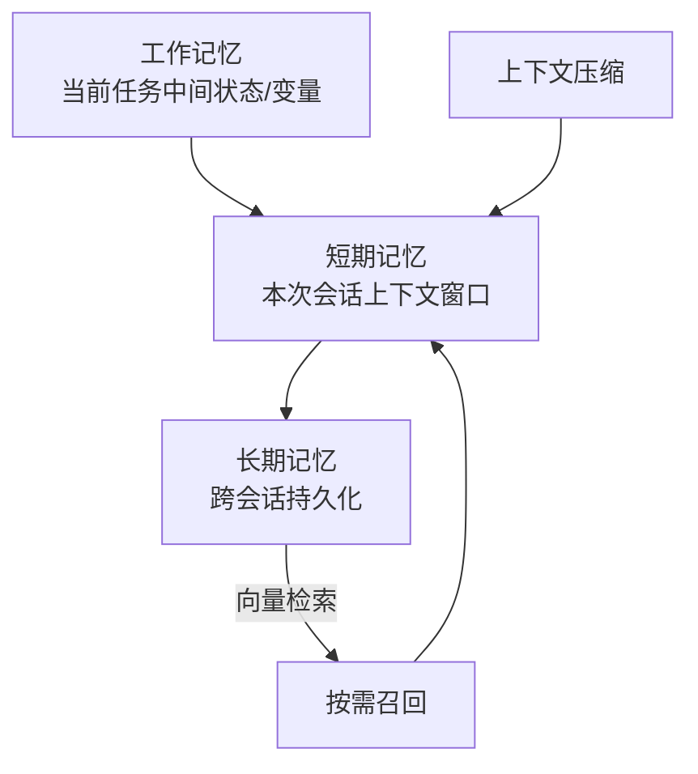

# Agent 记忆系统设计

> 本篇从**系统设计**角度谈 Agent 的记忆分层、存储选型、生命周期与上下文压缩。概念与状态管理见 [[笔记/八股文笔记/AI-LLM-RAG-Agent/28-Agent记忆基础与状态管理|Agent记忆与状态管理]]、[[笔记/八股文笔记/AI-LLM-RAG-Agent/23-Agent架构与核心组件|Agent架构与ReAct]]。

## 为什么记忆需要"系统设计"
记忆不是"把对话塞进上下文"这么简单：上下文有长度上限、跨会话要持久、长期记忆会污染、新旧冲突要解决。需要分层 + 存储 + 治理。

## 记忆分层

| 层级 | 存储 | 生命周期 | 作用 |
| ------ | ------ | ------ | ------ |
| 工作记忆 | 变量/状态对象 | 单次任务 | 中间结果、工具返回值 |
| 短期记忆 | LLM 上下文窗口 | 本次会话 | 近期对话，受 token 限制 |
| 长期记忆 | 向量库 + KV/DB | 跨会话 | 用户偏好、历史经验、知识 |

## 关键设计点
- **存储选型**：长期记忆用向量库（语义检索）+ 结构化存储（精确字段，如用户画像）。记忆系统 vs RAG 的区别见 [[39-记忆系统vs-RAG本质区别|记忆系统 vs RAG 本质区别]]。
- **生命周期管理**：记忆写入条件（什么值得存）、过期/遗忘策略、重要度加权。
- **上下文压缩三级策略**：选节点压缩 → 压缩 → 校验是否破坏关键信息，见 [[笔记/八股文笔记/AI-LLM-RAG-Agent/41-上下文压缩三级策略|上下文压缩三级策略]]。
- **记忆污染与纠错**：模型结论写进记忆后如何检测与恢复，见 [[笔记/八股文笔记/AI-LLM-RAG-Agent/42-记忆污染与纠错机制|记忆污染与纠错机制]]。
- **记忆治理**：什么值得存、何时召回、新旧冲突解决，见 [[40-记忆治理策略-存储召回与冲突解决|记忆治理策略]]。

## 关键权衡

| 问题 | 设计回答要点 |
| ------ | ------ |
| 记忆系统和 RAG 什么区别？ | 记忆是 Agent 私有经验（偏好/历史），RAG 是外部知识库；一个"我是谁"，一个"我知道什么" |
| 上下文太长怎么压缩？ | 三级策略：选压缩节点 → 摘要/裁剪 → 校验关键信息不丢；重要信息加权保留 |
| 记忆会不会越存越乱？ | 会，需治理：写入门槛、过期策略、冲突解决、污染检测与纠错 |
| 长期记忆存向量库还是数据库？ | 语义检索用向量库，精确字段（画像/状态）用结构化存储，两者配合 |

---

## 相关链接
- [[笔记/八股文笔记/AI-LLM-RAG-Agent/28-Agent记忆基础与状态管理|Agent记忆与状态管理]]
- [[笔记/八股文笔记/AI-LLM-RAG-Agent/23-Agent架构与核心组件|Agent架构与ReAct]]
- [[笔记/八股文笔记/AI-LLM-RAG-Agent/39-记忆系统vs-RAG本质区别|记忆系统 vs RAG 本质区别]]
- [[笔记/八股文笔记/AI-LLM-RAG-Agent/41-上下文压缩三级策略|上下文压缩三级策略]]
- [[笔记/八股文笔记/AI-LLM-RAG-Agent/40-记忆治理策略-存储召回与冲突解决|记忆治理策略]]
- [[八股文学习清单]]
- [[00-全局导航|全局导航]]

---

## 快速问答

| 问题 | 参考答案 |
| ------ | --------- |
| Agent 记忆分几层？ | 工作记忆（任务状态）、短期记忆（会话上下文）、长期记忆（跨会话持久化），各用不同存储。 |
| 记忆系统和 RAG 本质区别？ | 记忆是 Agent 私有经验（偏好/历史），RAG 是外部知识库；前者服务"个性化"，后者服务"知识补全"。 |
| 上下文压缩怎么不破坏关键信息？ | 三级策略：选节点 → 压缩（摘要/裁剪）→ 校验关键信息是否保留，重要信息加权优先保留。 |
| 长期记忆如何防污染？ | 写入门槛 + 过期/遗忘策略 + 冲突解决规则 + 污染检测与纠错机制。 |
