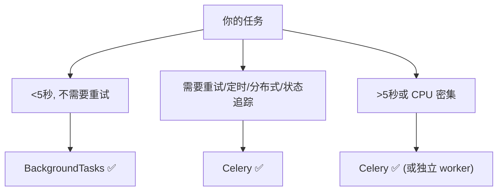

# BackgroundTasks vs Celery 对比

## 一句话总结

> **BackgroundTasks = 同一进程内、响应返回后“顺手”干件小事（<5秒、无需重试）；Celery = 独立 worker 进程、靠消息队列干大事（秒到小时、需重试/定时/分布式）。一个像顺手洗个杯子，一个像叫搬家公司。**

---

## 生活类比

- **BackgroundTasks**：你吃完饭顺手把碗放进洗碗机，然后人先撤（先回响应）。洗碗机和主线在同一屋（同一进程），洗完了事。适合“小事、立刻、不care结果”。
- **Celery**：你要搬一整栋房的家具，得专门雇搬家公司的车（独立 worker），排期、分段、出问题重搬（重试）、跨城调度（分布式）。适合“大事、慢、要可靠”。

## 核心差异

| 维度 | BackgroundTasks | Celery |
| :--- | :--- | :--- |
| **进程** | 同进程 | 独立 worker 进程 |
| **任务队列** | 无，按添加顺序执行 | Redis/RabbitMQ 消息队列 |
| **任务类型** | 轻量快速（秒级） | 重量可慢（秒到小时） |
| **失败重试** | ❌ | ✅（`autoretry_for` / `retry`） |
| **定时任务** | ❌ | ✅ Celery Beat |
| **任务编排** | ❌ | ✅ Chain / Group / Chord |
| **分布式** | ❌ 单机 | ✅ 多机多 worker |
| **结果追踪** | ❌ | ✅ Result Backend |
| **使用成本** | 🟢 零配置 | 🔴 需 Redis + worker 管理 |

## BackgroundTasks 的真相

```python
from fastapi import BackgroundTasks

@app.post("/register")
async def register(user: UserCreate, tasks: BackgroundTasks):
    db.create_user(user)
    tasks.add_task(send_email, user.email, "欢迎注册！")   # 加入队列
    return {"message": "注册成功"}   # 响应先返回
    # ⚠️ 任务在响应返回后、同一进程内顺序执行
    # 如果任务耗时 30 秒 → 占着这个 worker 进程 30 秒
```

**BackgroundTasks 不是另一个线程/进程**，只是“响应返回后顺手跑完”。如果任务慢或崩了，会影响这个进程处理后续请求，且**崩了就崩了，没有重试**。

## Celery 长什么样

```python
from celery import Celery
app = Celery("tasks", broker="redis://localhost:6379/0", backend="redis://...")

@app.task(bind=True, autoretry_for=(Exception,), retry_backoff=True, max_retries=3)
def send_email_task(self, to: str, subject: str):
    ...  # 失败自动指数退避重试
```

Celery worker 跑在**独立进程**，任务进 Redis 队列，worker 取走执行；崩了按策略重试；可定时（Beat）、可编排（Chain 串联、Group 并行、Chord 汇总）。

## 选型决策树



> **经验线**：5 秒是分水岭——以内、顺手、不要重试 → BackgroundTasks；以外、要可靠 → Celery。注意 BackgroundTasks 是**同进程阻塞式**，长时间任务会拖垮 API 进程，绝不该往里塞重活。

## 进阶替代

- **FastAPI + Celery** 是经典组合：API 收请求 → 丢任务进 Celery → 立刻回“已受理”
- **ARQ / Dramatiq / RQ**：比 Celery 轻的异步任务库，基于 Redis，适合不想上完整 Celery 的场景
- **异步后台**：纯 asyncio 的 `asyncio.create_task` 也能跑后台协程，但进程退出就丢，不如 Celery 可靠

## 延伸追问

**Q：BackgroundTasks 任务崩了会怎样？**
A：直接抛异常、没有重试，且因为同进程，可能影响该进程。只适合“失败了也无所谓”的旁路操作（日志、通知尝试）。

**Q：Celery 为什么需要 broker？**
A：broker（Redis/RabbitMQ）是任务队列，解耦“生产者（API）”和“消费者（worker）”，让任务可缓冲、可跨机、可持久化。这正是它支持分布式和可靠重试的基础。

## 记忆口诀

> **BackgroundTasks 顺手干小事，同进程不排队、不重试。**
> **Celery 独立 worker + broker 队列，能重试能定时能分布式。**
> **5 秒是分水岭：以内 BackgroundTasks，以外 Celery。**
> **重活塞 BackgroundTasks = 拖垮 API 进程。**

---

## 
> ▶ 对应实操：[[12-安全响应头中间件|12-安全响应头中间件]]


> ▶ 对应实操：[[08-后台任务与CORS|08-后台任务与CORS]]

相关链接

- [[04-中间件Middleware机制|中间件]]
- [[05-def与async-def路由选择|def vs async 路由]]
- [[13-FastAPI性能优化-连接池与uvicorn-workers|性能优化]]
- [[八股文笔记/分布式-系统设计/00-分布式-系统设计|分布式-系统设计 八股文]]
- [[00-FastAPI-Web|FastAPI-Web 索引]]
