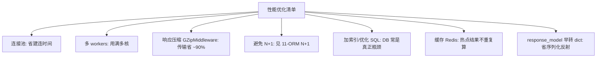

# FastAPI 性能优化：连接池 + uvicorn workers

## 一句话总结

> **连接池 = 数据库连接不每次新建而是反复用（省建连开销）；uvicorn workers = 开多个进程同时吃满多核（绕过 GIL 的 CPU 限制）。两件事搞对，QPS 从几百到几千。但别忘了：数据库才是总瓶颈，总连接数 = workers × pool_size，别把数据库压爆。**

---

## 一、连接池（Connection Pool）

每次新建数据库连接都要 TCP 握手 + 认证，开销大。连接池**预先建好一批连接反复复用**。

### 四个关键参数

| 参数 | 含义 | 建议 |
| :--- | :--- | :--- |
| `pool_size` | 平时保持的常驻连接数 | 核数×2 左右 |
| `max_overflow` | 高峰最多额外建几个 | 如 10 |
| `pool_pre_ping` | 拿连接前先探活，防拿到断连 | `True` |
| `pool_recycle` | 连接超过 N 秒强制回收重建 | 如 3600 |

```python
engine = create_async_engine(
    "postgresql+asyncpg://...",
    pool_size=20, max_overflow=10, pool_pre_ping=True, pool_recycle=3600,
)
```

### 配多大

```text
连接池大小 ≈ CPU 核数 × 2 + 1  (PostgreSQL 官方经验值)
4 核  → pool_size 8~12
8 核  → pool_size 16~24

⚠️ 总连接数 = workers × pool_size
   workers=4, pool_size=20 → 数据库要承受 80 个连接
```

> 池太小 → 请求等连接（瓶颈在池）；池太大 → 压垮数据库（DB 也有连接上限）。要按**数据库侧上限**反推。

## 二、uvicorn workers（多进程吃满多核）

FastAPI 是单进程单事件循环，受 GIL 限制只能用一个核跑 Python。开多个 worker 进程才能用满多核：

| 模式 | 命令 | 行为 |
| :--- | :--- | :--- |
| 单进程 | `uvicorn main:app` | 1 进程 1 核 |
| 多进程 | `uvicorn main:app --workers 4` | 4 进程 4 核 |

**经验值：`workers ≈ CPU 核数`**，不是越多越好（进程多→上下文切换+内存涨）。

### 生产标准：Gunicorn + UvicornWorker

```python
# gunicorn.conf.py
import multiprocessing
workers = multiprocessing.cpu_count()
worker_class = "uvicorn.workers.UvicornWorker"
bind = "0.0.0.0:8000"
```

> 用 Gunicorn 当进程管理器拉起多个 Uvicorn worker，是生产标配。详见 [[八股文笔记/分布式-系统设计/00-分布式-系统设计|分布式-系统设计 八股文]]。

## 三、更多优化清单



| 优化 | 做法 | 效果（量级） |
| :--- | :--- | :--- |
| 连接池 | 复用连接 | QPS↑ 明显 |
| 多 workers | 用满多核 | QPS↑ ~核数倍 |
| GZip 压缩 | `GZipMiddleware` | 传输省 ~90% |
| 修 N+1 | `selectinload` | DB 查询从 N+1 → 2 |
| Redis 缓存 | 热点结果缓存 | 重复请求近乎 0 延迟 |

## 四、最重要的纪律：先测量再优化

> 优化前先**压测 + profiler** 找真实瓶颈。绝大多数 FastAPI 服务的真瓶颈是**数据库查询**（慢 SQL、N+1、缺索引），不是框架本身。盲目加 workers 只是把压力更均匀地转嫁给已经过载的数据库。

## 原理：为什么需要多 workers

Python 有 GIL，同一时刻只有一个线程跑 Python 字节码。FastAPI 的异步并发靠**IO 等待期让出**实现，不占满 CPU；但当遇到 CPU 密集计算（或单纯要多核吞吐）时，单进程单核就不够了。多 worker 进程 = 多个独立 Python 进程 = 多份 GIL = 真正并行吃满多核。详见 [[八股文笔记/Python/00-Python|Python 八股文]]。

## 记忆口诀

> **连接池省建连，workers 加人手。**
> **pool_size 按核×2，workers 按核数。**
> **总连接数 = workers × pool_size，别压爆数据库。**
> **先压测找瓶颈——真瓶颈常在 DB，不在框架。**

---

## 
> ▶ 对应实操：[[01-FastAPI入门与环境搭建|01-FastAPI入门与环境搭建]]

相关链接

- [[05-def与async-def路由选择|def vs async 路由]]
- [[01-FastAPI为什么快-Starlette与Pydantic与async|FastAPI 为什么快]]
- SQLAlchemy 异步集成
- [[11-ORM关系映射与N+1查询解决|ORM N+1]]
- [[分布式-系统设计/01-Docker与docker-compose部署流程|Docker 部署]]
- [[八股文笔记/Python/00-Python|Python 八股文]]
- [[八股文笔记/MySQL/00-MySQL|MySQL 八股文]]
- [[00-FastAPI-Web|FastAPI-Web 索引]]
