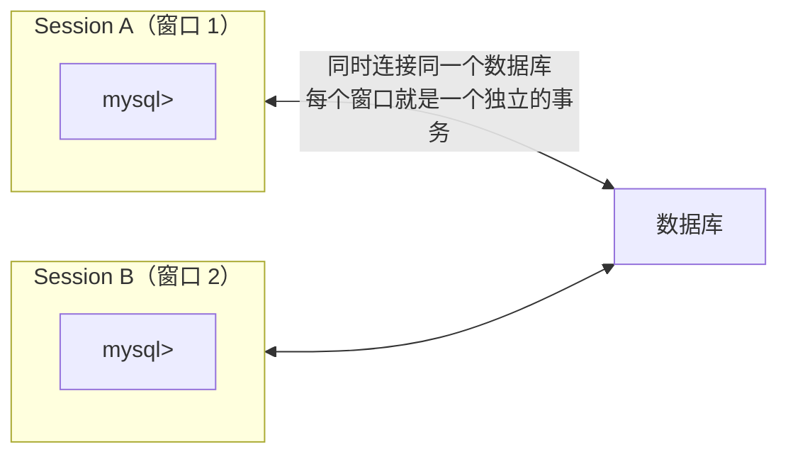

# 脏读复现与RC解决
## 实验前准备：环境 + 测试表

### 准备 1：打开两个 MySQL 会话



用命令行或 DBeaver/DataGrip 同时打开两个连接。

### 准备 2：建测试表

```sql
-- 在任意一个 Session 里执行
CREATE DATABASE IF NOT EXISTS isolation_test;
USE isolation_test;

-- 建一张简单的用户表
CREATE TABLE users (
    id INT PRIMARY KEY,
    name VARCHAR(20),
    age INT,
    city VARCHAR(20)
) ENGINE=InnoDB;

-- 插入 3 条测试数据
INSERT INTO users VALUES
    (1, '张三', 25, '北京'),
    (2, '李四', 30, '上海'),
    (3, '王五', 28, '广州');

-- 看一眼初始数据
SELECT * FROM users;
-- +----+------+-----+------+
-- | id | name | age | city |
-- +----+------+-----+------+
-- |  1 | 张三 |  25 | 北京 |
-- |  2 | 李四 |  30 | 上海 |
-- |  3 | 王五 |  28 | 广州 |
-- +----+------+-----+------+
```

### 准备 3：实验模板——每个实验都这样操作

```text
每个实验的标准操作流程：

① 两个 Session 都设置隔离级别（SET SESSION TRANSACTION ISOLATION LEVEL xxx）
② 两个 Session 都开启事务（BEGIN; 或 START TRANSACTION;）
③ Session A 执行操作 1 → Session B 执行操作 → Session A 执行操作 2
④ 观察 Session A 两次读到的结果是否一致
⑤ 两个 Session 都 ROLLBACK（恢复现场，方便下一个实验）
```

> ⚠️ **关键**：每个实验开始前，**两个 Session 都要重新设置隔离级别并开启事务**。MySQL 的隔离级别是会话级别的——上个实验的设置不会自动恢复。

---


## 相关链接

- 📋 目录：[[00-MySQL]]
- 📚 学习清单：[[八股文学习清单]]

