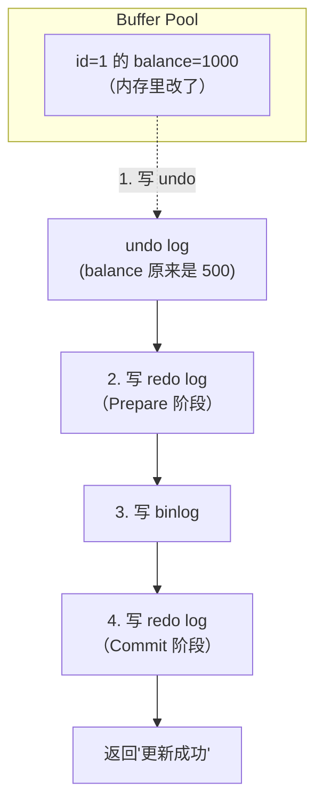

# redo log / undo log / binlog 区别

## 一句话总结

> **redo log 保"持久性"（崩溃后数据不丢），undo log 保"原子性"（失败能回滚到之前的样子），binlog 保"备份和同步"（主从复制和恢复）。三个日志分工不同，缺了谁 MySQL 都可能丢数据或崩了修不回来。**

---

## 🌰 三兄弟各司其职

你在一家银行柜台转账：

```text
你填了一张转账单：从 A 账户转 1000 到 B 账户。

银行操作：
  1. 在账本上写"准备从 A 扣 1000"  →  undo log（万一转一半崩了，改回来）
  2. 在账本上写"从 A 扣 1000"      →  redo log（已执行，崩了也能恢复）
  3. 在 A 账户上真的扣掉 1000
  4. 在账本上写"准备给 B 加 1000"  →  undo log
  5. 在账本上写"给 B 加 1000"      →  redo log
  6. 在 B 账户上真的加上 1000
  7. 在流水账本上写"今天发生了什么" →  binlog（给会计对账、复制到分店用的）
```

| 日志 | 角色 | 类比 |
| ------ | ------ | ------ |
| **undo log** | 后悔药——失败了能回退 | 操作前的备份小纸条 |
| **redo log** | 保险箱——崩了不丢数据 | 操作后的钢印记录 |
| **binlog** | 流水账——给其他人看的 | 银行的日终对账单 |

---

## 一、redo log——"我干了什么"

### 本质

**物理日志**，记录的是"对哪个数据页的哪个偏移量做了什么修改"。

```text
redo log 记录的内容（概念上）：
  把表空间 X 的页号 5 的偏移量 1024 处的值改为 1000
```

### 为什么需要 redo log？

```sql
UPDATE user SET balance = 1000 WHERE id = 1;
```

MySQL 不会直接改磁盘上的数据（太慢了）。流程是：

```text
1. 把 id=1 的数据页加载到内存（Buffer Pool）
2. 在内存里把 balance 改成 1000
3. 写 redo log（记录"页 5 偏移 1024 改成 1000"）
4. （先不写磁盘，标记为"脏页"）
5. 返回"更新成功"给客户端
6. 空闲时再把脏页刷回磁盘
```

**如果第 5 步之后、第 6 步之前停电了：**
- 内存里的数据没了（balance=1000 丢了）
- 但 redo log 在磁盘上
- 重启后 MySQL 重放 redo log → 数据恢复

**redo log 保证了 Crash Safe（崩溃安全）。只要写了 redo log 并提交了，数据就不会丢。**

### redo log 的两阶段提交

这是 MySQL 保证 redo log 和 binlog 一致性的关键机制：

```text
事务提交时：
  1. 写 redo log（Prepare 阶段）
  2. 写 binlog
  3. 写 redo log（Commit 阶段）

如果在 1-2 之间崩了 → redo log 是 Prepare 状态，binlog 没有 → 回滚
如果在 2-3 之间崩了 → redo log 是 Prepare 状态，binlog 有 → 提交（保证 binlog 和 redo 一致）
```

---

## 二、undo log——"我准备改之前是什么样"

### 本质

**逻辑日志**，记录的是"修改之前的数据是什么"，用于回滚和 MVCC。

```text
undo log 记录的内容（概念上）：
  UPDATE user SET balance = 1000 WHERE id = 1
  之前的 balance = 500
```

### 两个作用

**作用 1：事务回滚**

```sql
BEGIN;
UPDATE user SET balance = 1000 WHERE id = 1;
-- 写 undo log：记录 id=1 的 balance 原来是 500

UPDATE user SET balance = 2000 WHERE id = 2;
-- 写 undo log：记录 id=2 的 balance 原来是 1500

ROLLBACK;
-- 从 undo log 里读出旧值：balance 500 和 1500
-- 把数据改回去
```

**没有 undo log，ROLLBACK 就不知道改回什么。**

**作用 2：MVCC 多版本并发控制**

```sql
-- 事务 A（未提交）：UPDATE user SET balance = 1000 WHERE id = 1
-- 事务 B（正在查询）：SELECT balance FROM user WHERE id = 1
```

事务 B 需要看到旧值（500），新值（1000）还没提交。

**每个事务通过 undo log 构建自己"可见"的数据版本。** 这就是 MVCC 的"多版本"——不是真的存了多个副本，而是通过 undo log 可以反向计算出旧版本。

### undo log 的生命周期

```text
事务执行中：undo log 一直保留
事务提交后：undo log 不能立即删除
  └─ 还有别的事务可能通过 MVCC 在读取旧版本
  └─ 等所有需要这个版本的事务都结束了 → purge 线程清理
```

---

## 三、binlog——"整个数据库发生了什么"

### 本质

**逻辑日志**，记录的是"执行了什么 SQL"或"每一行怎么变的"。

```text
binlog 记录的内容（概念上）：
  UPDATE user SET balance = 1000 WHERE id = 1  -- STATEMENT 模式
  或
  把 id=1 的 balance 从 500 改成 1000            -- ROW 模式
```

### 和 redo log 的区别

|            | redo log          | binlog              |
| ---------- | ----------------- | ------------------- |
| **所属层级**   | InnoDB 引擎层        | MySQL Server 层      |
| **属于哪个引擎** | 只有 InnoDB 有       | 所有引擎都有（MyISAM 也有）   |
| **日志类型**   | 物理日志（改了哪个页的哪个字节）  | 逻辑日志（执行了什么 SQL/行变更） |
| **写入时机**   | 事务执行中持续写入         | 事务提交时一次性写入          |
| **存储**     | 固定大小，循环写（写满覆盖旧记录） | 追加写，可以一直保留          |
| **用途**     | 崩溃恢复 + Crash Safe | 主从复制 + 时间点恢复        |

### binlog 的主要用途

**1. 主从复制**

```text
主库写 binlog → 从库拉 binlog → 从库重放 → 数据一致
```

**2. 时间点恢复（Point-in-Time Recovery）**

```sql
-- 每天凌晨备份一次
mysqldump ...

-- 下午 3 点误删了表
-- 恢复流程：
-- 1. 导入凌晨的备份
-- 2. 重放从凌晨到下午 3 点的 binlog
-- 3. 跳过 DROP TABLE 那条 SQL
```

### binlog 的三种格式

| 格式 | 记录方式 | 优点 | 缺点 |
| ------ | --------- | ------ | ------ |
| **STATEMENT** | 记录原始 SQL | 日志量小 | 不安全（NOW 等函数在主从不一致）|
| **ROW**（推荐）| 记录每行的变更 | 最安全，精确 | 日志量大 |
| **MIXED** | MySQL 自动选 | 折中 | 偶尔有问题 |

**5.7+ 默认 ROW 模式。线上用 ROW，别纠结。**

---

## 三张日志的执行流程（一条 UPDATE 语句）

```sql
UPDATE user SET balance = 1000 WHERE id = 1;
```



---

## 三张日志对比总结

| 维度 | redo log | undo log | binlog |
| ------ | --------- | --------- | -------- |
| **一句话** | 崩了不丢数据 | 可以回滚到之前 | 给主从复制和对账用 |
| **日志类型** | 物理（哪个页哪个偏移）| 逻辑（改之前的值）| 逻辑（SQL 或行变更）|
| **所属层** | InnoDB 引擎 | InnoDB 引擎 | MySQL Server |
| **写入时机** | 执行中持续写 | 执行中持续写 | 提交时一次性写 |
| **存储方式** | 循环写，固定大小 | 事务结束后可 purge | 追加写，可长期保留 |
| **用途** | 崩溃恢复 | 回滚 + MVCC | 主从复制 + PITR |
| **关了会怎样** | 更新不持久，崩了丢数据 | 不能回滚、MVCC 挂掉 | 不能主从复制 |

---

## 记忆口诀

> **redo 保命（崩了恢复），undo 保悔（回滚+MVCC），binlog 保驾（主从+备份）。**
> **redo 和 binlog 靠两阶段提交保一致——Prepare→binlog→Commit。**
> **三条日志一条都不能少，各有各的使命，谁也替不了谁。**


## 相关链接

- 📋 目录：[[00-MySQL]]
- 📚 学习清单：[[八股文学习清单]]
