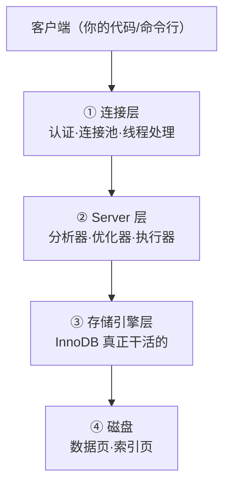
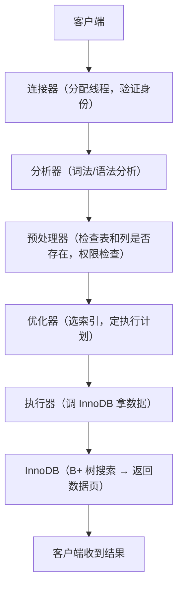
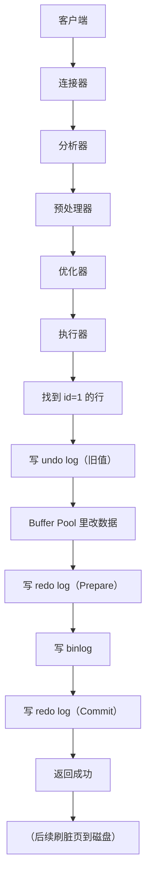

# 一条 SQL 的执行流程

## 一句话总结

> **SELECT 和 UPDATE 走的路径不同——SELECT 到存储引擎拿数据就返回，UPDATE 要额外写日志（redo/undo/binlog）。但前两步（连接层→Server 层）完全一样。**

---

## 🌰 整体路线

一条 SQL 从客户端到磁盘，经过四层：



---

## 一条 SELECT 语句的一生

```sql
SELECT * FROM user WHERE id = 1;
```

### Step 1：连接器（连接层）

```text
客户端发来 SQL → 连接器处理：

1. 检查连接池有没有可用连接
2. 验证用户名密码
3. 成功后 → 分配一个线程处理这个连接
```

### Step 2：查询缓存（MySQL 8.0 已移除）

```text
8.0 之前：
  └─ 先查缓存有没有这条 SQL 的结果
  └─ 有 → 直接返回，后面全跳过
  └─ 没有 → 继续往下

8.0 之后：
  └─ 没有这一步，直接往下（缓存已被移除）
```

**原因：缓存失效太频繁。只要表有更新，整张表的查询缓存全清掉。命中率极低，维护成本高。**

### Step 3：分析器（Parser）

```text
收到 SQL 文本 → 分析器做两件事：

1. 词法分析：拆解关键字
   └─ "SELECT" → 查询语句
   └─ "user" → 表名
   └─ "id" → 列名

2. 语法分析：检查 SQL 有没有语法错误
   └─ "SELECT" 后面跟了啥 → 合法？
   └─ "WHERE id = 1" → 合法？
   └─ 语法不对 → You have an error in your SQL syntax
```

### Step 4：预处理器

```text
1. 检查表和列是否存在
   └─ user 表存在吗？
   └─ id 列存在吗？
2. 权限检查
   └─ 当前用户有 SELECT user 表的权限吗？
   └─ 没有 → Access denied
```

### Step 5：优化器（Optimizer）

```text
这是"决定怎么查"的地方。

SQL：SELECT * FROM user WHERE id = 1;

优化器要考虑：
  └─ 走主键索引（直接 B+ 树搜 id=1）
  └─ 还是全表扫描（一行行看 id=1 在哪）

明显走主键索引快。
但如果 WHERE id > 1 AND id < 1000000 且表很大：
  └─ 走索引 vs 全表扫描 → 优化器判断哪个成本低

优化器的输出：一个"执行计划"（access path）
```

**优化器可能选错索引。**
统计信息不准时，优化器可能选了全表扫描而不是索引。这时可以用 `FORCE INDEX` 或 `USE INDEX` 强制指定。

### Step 6：执行器

```text
拿着优化器给的执行计划，真正执行：

1. 调用 InnoDB 接口："取 id=1 的那行数据"
2. InnoDB 从 B+ 树找到 id=1 的数据页
3. 返回给执行器
4. 执行器返回给客户端
```

### SELECT 全流程



---

## 一条 UPDATE 语句的一生

```sql
UPDATE user SET name = 'Alice' WHERE id = 1;
```

前 5 步（连接→分析→预处理→优化→执行）和 SELECT 完全一样。

不同从**执行器**开始：

### Step 6：执行器 → 找到行

```text
1. 执行器调 InnoDB："读取 id=1 的行"
2. InnoDB 从 B+ 树找到 id=1 的数据页，加载到 Buffer Pool
   （同时对该行加排他锁 X 锁，防止别的事务并发修改这一行）
3. 返回给执行器
```

### Step 7：写 undo log

```text
InnoDB 写 undo log：
  └─ "id=1 这一行，name 原来是 'Bob'"
  └─ 用于回滚和 MVCC
```

### Step 8：在内存里改数据

```text
在 Buffer Pool 里把 id=1 的 name 从 'Bob' 改成 'Alice'
此时数据页变成"脏页"（内存和磁盘不一致）
```

### Step 9：写 redo log（Prepare 阶段）

```text
InnoDB 写 redo log：
  └─ "表空间 X 的页号 5 的偏移量 1024 处的 name 改成 'Alice'"
  └─ 状态为 Prepare（准备阶段）
```

### Step 10：写 binlog

```text
MySQL Server 写 binlog：
  └─ "UPDATE user SET name = 'Alice' WHERE id = 1"
  └─ （ROW 模式下记录行变更）
```

### Step 11：写 redo log（Commit 阶段）

```text
InnoDB 把 redo log 状态从 Prepare 改成 Commit
至此事务才算真正提交成功

如果此时崩了：
  重启后检查 redo log：Prepare 状态 + binlog 存在 → 继续提交
```

### Step 12：返回成功

```text
MySQL 告诉客户端："更新成功"

此时磁盘上的数据可能还是旧的！
Buffer Pool 里的脏页还没刷盘。
但没关系——如果崩溃了，redo log 可以恢复。
```

### 后续：刷脏页

```text
空闲时或 Buffer Pool 满了时：
  InnoDB 把脏页刷回磁盘
  此时磁盘数据才真正变成 'Alice'
```

### UPDATE 全流程



---

## SELECT vs UPDATE 对比

| 步骤 | SELECT | UPDATE |
| ------ | -------- | -------- |
| 连接器 | ✅ | ✅ |
| 分析器 | ✅ | ✅ |
| 预处理器 | ✅ | ✅ |
| 优化器 | ✅ | ✅ |
| 执行器 | ✅ | ✅ |
| 写 undo log | ❌ | ✅ |
| Buffer Pool 改数据 | ❌（只读） | ✅（写）|
| 写 redo log | ❌ | ✅ |
| 写 binlog | ❌ | ✅ |
| 返回结果 | ✅ 数据 | ✅ 成功 |
| 刷脏页 | ❌ | ✅（后台）|

---

## 一句话讲清

```text
延伸提问："一条 SQL 在 MySQL 里是怎么执行的？"

你：
"分两种情况——SELECT 和 UPDATE。

SELECT 相对简单：
连接器（身份认证）→ 分析器（语法检查）→
预处理器（表和字段存在？权限？）→
优化器（选索引，定执行计划）→
执行器（调 InnoDB 拿数据）→ 返回。

UPDATE 多了一套日志流程：
找到行之后 → Buffer Pool 里改数据 →
写 undo log（用于回滚和 MVCC）→
写 redo log Prepare → 写 binlog →
写 redo log Commit → 返回成功。
两阶段提交保证了 redo log 和 binlog 的一致性。"
```

---

## 记忆口诀

> **SELECT 查路：连接→分析→预处理→优化→执行→返回。**
> **UPDATE 多三样：undo 保回滚，redo 保不丢，binlog 保同步。**
> **两阶段提交保一致——Prepare→binlog→Commit，这是 MySQL 不丢数据的底气。**

## 相关链接

- 📋 目录：[[00-MySQL]]
- 📚 学习清单：[[八股文学习清单]]
- 🔗 [[八股文笔记/操作系统/13-IO模型四种|IO模型]] — SQL执行涉及磁盘IO和网络IO
- 🔗 [[八股文笔记/Redis/10-RDB与AOF与混合持久化|Redis持久化]] — MySQL与Redis的持久化机制对比
