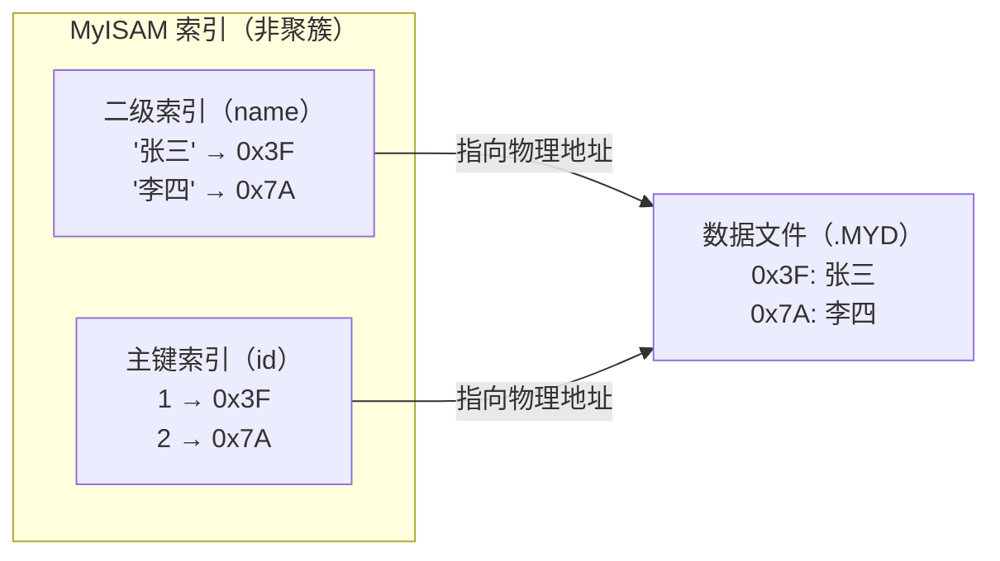

# InnoDB vs MyISAM

## 一句话总结

> **InnoDB 支持事务、行锁、崩溃恢复，适合读写频繁的 OLTP 场景；MyISAM 不支持事务、表锁、没有崩溃恢复，但全表扫描和 COUNT(*) 比 InnoDB 快。MySQL 8.0 之后系统表也换成 InnoDB 了，MyISAM 基本可以当历史了。**

---

## 🌰 场景感受

### InnoDB 的日常

```text
用户下单：
  BEGIN;
  UPDATE inventory SET stock = stock - 1 WHERE product_id = 1;
  INSERT INTO orders (user_id, product_id) VALUES (1, 1);
  COMMIT;

突然断电了 → 重启后数据完整 ✅
另一个用户也在买同一个商品 → 行锁，各不影响 ✅
```

### MyISAM 的日常

```text
用户下单：
  LOCK TABLES inventory WRITE;  -- 整张表锁住！别人都不能买
  UPDATE inventory SET stock = stock - 1 WHERE product_id = 1;
  INSERT INTO orders ... 
  UNLOCK TABLES;

突然断电了 → 重启后：表损坏，需要 REPAIR TABLE ❌
另一个用户也想查库存 → 等上面那个用户解锁 ❌
```

**这就是为什么 Web 应用几乎都用 InnoDB。MyISAM 在 2026 年唯一的用处是：读多写少的日志表、数据仓库的全表扫描场景。**

---

## 核心差异对比

| 维度 | InnoDB | MyISAM |
| ------ | -------- | -------- |
| **事务** | ✅ 支持（ACID） | ❌ 不支持 |
| **锁粒度** | 行锁（可以只锁一行）| 表锁（锁就是整张表）|
| **外键** | ✅ 支持 | ❌ 不支持 |
| **崩溃恢复** | ✅ redo log 自动恢复 | ❌ 损坏需要 REPAIR |
| **MVCC** | ✅ 支持 | ❌ 不支持 |
| **全文索引** | ✅ 5.6+ 支持 | ✅ 支持 |
| **COUNT(*)** | 慢（需要扫索引行数）| 🚀 极快（直接读行数）|
| **数据存储** | 表空间（ibd 文件）| 三个文件（frm+MYD+MYI）|
| **索引结构** | B+ 树（聚簇索引）| B+ 树（非聚簇）|
| **表空间** | 共享/独立表空间 | 每个表独立文件 |
| **磁盘占用** | 更大（有 undo/redo 日志）| 更小 |
| **内存占用** | 更大（Buffer Pool 吃内存）| 更小 |
| **MySQL 8.0 默认** | ✅ 默认引擎 | ❌ 不是 |

---

## 存储结构差异

### MyISAM：三个文件

```text
user.frm   → 表结构定义
user.MYD   → 数据文件（真正的行数据）
user.MYI   → 索引文件（B+ 树，叶子存的是指向数据文件的指针）
```

**索引和分离开：先查 .MYI 拿到数据文件位置 → 去 .MYD 读数据。**

### InnoDB：一个或两个文件

```text
user.frm        → 表结构定义（8.0 前）
user.ibd        → 数据 + 索引在一起
```

**数据和索引在一起：InnoDB 是聚簇索引，B+ 树的叶子节点直接包含整行数据。**

---

## 索引结构的根本差异

### MyISAM 索引（非聚簇）



- 主键索引和二级索引**完全一样**——都是指向数据文件的地址
- 没有"回表"的概念（因为不涉及聚簇和非聚簇的区分）
- **主键可以不唯一**（MyISAM 允许主键列有重复值？不对，主键必须有唯一性）

实际上 MyISAM 的主键索引和二级索引结构一样：B+ 树叶子节点存的是行的物理地址（或行号）。

### InnoDB 索引（聚簇）


- 主键索引的叶子节点就是整行数据
- 二级索引的叶子节点存的是主键值
- **二级索引查数据需要回表**（先找到主键值，再去聚簇索引拿整行）

---

## 锁的差异：高并发场景下的致命区别

### MyISAM 表锁

```sql
-- 事务 A 对 user 表执行 UPDATE（写锁）
UPDATE user SET name = 'A' WHERE id = 1;
-- 整张 user 表被锁住

-- 事务 B 想读 user 表的其他行（id=2）
SELECT * FROM user WHERE id = 2;
-- ❌ 等待事务 A 释放表锁
-- A 不提交，整个表谁都不能碰
```

**表锁问题：更新一行 = 整张表都不能读写。**

### InnoDB 行锁

```sql
-- 事务 A 修改 id=1
UPDATE user SET name = 'A' WHERE id = 1;
-- 只锁 id=1 这一行

-- 事务 B 可以正常读/写 id=2
SELECT * FROM user WHERE id = 2;  -- ✅ 正常
UPDATE user SET name = 'B' WHERE id = 2;  -- ✅ 正常

-- 事务 C 也修改 id=1 才会等
UPDATE user SET name = 'C' WHERE id = 1;  -- ❌ 等 A 提交
```

**行锁优点：不同行互不影响，高并发场景关键优势。**

---

## 什么时候还可能用 MyISAM？

| 场景 | 理由 | 但…… |
| ------ | ------ | ------ |
| 日志表 | 只插入不修改，很少读 | 但 8.0 后 InnoDB 也不差 |
| 数据仓库全表扫描 | MyISAM 压缩后读更快 | 但数据量大了 MyISAM 损坏风险高 |
| 统计报表 COUNT(*) | MyISAM 预存行数，秒出 | COUNT(*) 可以建二级索引绕开 |
| 只读历史数据 | 不需要事务、崩溃恢复 | 但 MyISAM 崩溃还是要修 |

**结论：新项目全部用 InnoDB。遇到 MyISAM 的老表，能迁就迁。**

---

## 一句话讲清

```text
延伸提问："InnoDB 和 MyISAM 有什么区别？"

你：
"核心区别三个维度：

1. 事务和锁：
   InnoDB 支持事务、行锁、MVCC，适合高并发写入。
   MyISAM 不支持事务，只有表锁，更新时整张表锁住。

2. 数据安全：
   InnoDB 有 redo log，崩了自动恢复。
   MyISAM 没有，崩了可能表损坏，需要手动 repair。

3. 索引结构：
   都是 B+ 树，但 InnoDB 是聚簇索引——数据和索引在一起。
   MyISAM 是非聚簇——数据和索引分开存。

MyISAM 唯一的场景优势是 COUNT(*) 极快，因为独立存了行数。
但 8.0 之后 InnoDB 各方面碾压，遇到 MyISAM 建议迁移。"
```

---

## 记忆口诀

> **InnoDB 行锁+事务，崩了自动修；MyISAM 表锁+无事务，崩了手动修。**
> **InnoDB 一条龙（数据+索引一起存），MyISAM 分两家（MYD+MYI）。**
> **MyISAM 快在 COUNT(*)，死在写操作——2026 年基本只剩历史遗留了。**


## 相关链接

- 📋 目录：[[00-MySQL]]
- 📚 学习清单：[[八股文学习清单]]
