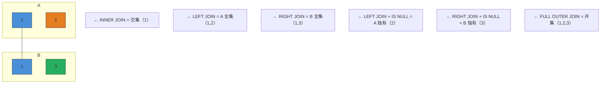
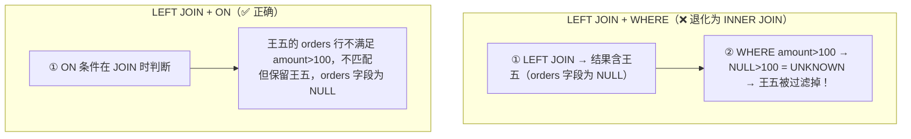

# 子查询三种类型
## 第一章：JOIN 进阶 — 多表连接不是"连上就行"

### 1.1 七种 JOIN 速览（前必过一遍）

```sql
-- 数据准备
-- employees: id=1(张三),2(李四),3(王五)    departments: id=1(技术部),2(产品部),4(人事部)

-- ① INNER JOIN — 只返回两表都匹配的行
SELECT e.name, d.dept_name                   -- 要显示的列
FROM employees e                             -- 左表（驱动表）
INNER JOIN departments d ON e.dept_id = d.id; -- 只保留两边都匹配的行
-- 结果：张三-技术部, 李四-产品部  （王五 dept_id=3 没匹配 → 不出现；人事部没人 → 不出现）

-- ② LEFT JOIN — 左表全保留，右表没匹配的填 NULL
SELECT e.name, d.dept_name                   -- 要显示的列
FROM employees e                             -- 左表（全部保留）
LEFT JOIN departments d ON e.dept_id = d.id; -- 右表匹配不上就填 NULL
-- 结果：张三-技术部, 李四-产品部, 王五-NULL  （王五保留了）

-- ③ RIGHT JOIN — 右表全保留（生产中尽量用 LEFT JOIN 替代，可读性更好）
SELECT e.name, d.dept_name                   -- 要显示的列
FROM employees e                             -- 左表（匹配不上就填 NULL）
RIGHT JOIN departments d ON e.dept_id = d.id; -- 右表全部保留
-- 结果：张三-技术部, 李四-产品部, NULL-人事部

-- ④ FULL OUTER JOIN — 两表全部保留（MySQL 不支持，用 LEFT JOIN UNION RIGHT JOIN 模拟）
SELECT e.name, d.dept_name FROM employees e LEFT JOIN departments d ON e.dept_id = d.id
UNION                                        -- UNION 自动去重，合并两个查询结果
SELECT e.name, d.dept_name FROM employees e RIGHT JOIN departments d ON e.dept_id = d.id;

-- ⑤ CROSS JOIN — 笛卡尔积（慎用！m 行 × n 行 = m*n 行）
SELECT e.name, d.dept_name FROM employees e CROSS JOIN departments d;
-- 3 × 3 = 9 行，每一行 employee 和每一行 department 都组合一次

-- ⑥ LEFT JOIN + IS NULL — 找"左表有但右表没有"的行（没下过单的客户）
SELECT e.name
FROM employees e
LEFT JOIN departments d ON e.dept_id = d.id  -- 先 LEFT JOIN，没匹配的 d.id 为 NULL
WHERE d.id IS NULL;                          -- 再过滤：只要右表为 NULL 的行 = 左表独有
-- 结果：王五（dept_id=3 在 departments 里不存在）

-- ⑦ RIGHT JOIN + IS NULL — 找"右表有但左表没有"的行
-- 同理反过来：WHERE e.id IS NULL → 人事部（没有员工被分配到该部门）
```



### 1.2 🔴 LEFT JOIN + WHERE 退化陷阱（必考题）

**这是 SQL 最常见的陷阱——90% 的候选人会踩。**

```sql
-- 场景：查询所有客户及其订单（包括没下过单的客户）
-- customers: 张三(1), 李四(2), 王五(3)
-- orders: order_1(user_id=1), order_2(user_id=1)

-- ❌ 错误写法 — LEFT JOIN 偷偷退化成 INNER JOIN
SELECT c.name, o.order_id                         -- 想要所有客户+订单
FROM customers c                                  -- 左表：客户表
LEFT JOIN orders o ON c.user_id = o.user_id       -- 左连接：保留没订单的客户
WHERE o.amount > 100;                             -- ⚠️ WHERE 在后：把 amount=NULL 的行全滤掉了！
-- 结果：只有张三（因为王五和李四的订单 amount 是 NULL，NULL > 100 = UNKNOWN → 被过滤）
-- 王五（没下过单）被漏掉了！LEFT JOIN 白写了！

-- ✅ 正确写法1 — 过滤条件写进 ON 子句
SELECT c.name, o.order_id                         -- 所有客户+符合条件的订单
FROM customers c                                  -- 左表
LEFT JOIN orders o ON c.user_id = o.user_id       -- ① 连接条件
                    AND o.amount > 100;           -- ② 过滤条件也写 ON 里——在 JOIN 时就判断
-- ON 里的条件在 JOIN 时生效——右表不满足的不匹配，但左表行保留

-- ✅ 正确写法2 — 用子查询先过滤右表
SELECT c.name, o.order_id
FROM customers c
LEFT JOIN (SELECT * FROM orders WHERE amount > 100) o  -- 先过滤 orders，再 LEFT JOIN
    ON c.user_id = o.user_id;                    -- 子查询里已过滤，外面只需连接
```



> **一句话讲清**："WHERE 过滤的是 JOIN 之后的结果集，ON 过滤的是 JOIN 过程中的匹配条件。对 LEFT JOIN 的右表做 WHERE 过滤，会把该表为 NULL 的行也过滤掉——LEFT JOIN 退化为 INNER JOIN。"

### 1.3 驱动表选择 — 小表驱动大表

```sql
-- 问："多表 JOIN 怎么优化？"

-- 核心原则：小表驱动大表
-- MySQL 的 Nested-Loop Join：外层循环（驱动表）每行 → 去内层循环（被驱动表）找匹配
-- 驱动表行数越少 → 内层循环总次数越少

-- 用小表 customers (3行) 驱动大表 orders (10万行)
SELECT c.name, o.order_id
FROM customers c                              -- ← 驱动表（3行，小表）
JOIN orders o ON c.user_id = o.user_id;       -- ← 被驱动表，JOIN 字段必须有索引
-- 循环 3 次，每次在 orders.user_id 索引上快速查找 → 快

-- ❌ 大表驱动小表
SELECT c.name, o.order_id
FROM orders o                                 -- ← 驱动表（10万行，大表）
JOIN customers c ON o.user_id = c.user_id;    -- 循环 10 万次 → 慢（虽然优化器通常会自己选对）
```

| 场景 | 驱动表选谁 | 原因 |
| ------ | :---: | ------ |
| JOIN 字段都有索引 | 行数少的表 | 减少外层循环次数 |
| 小表无索引，大表有索引 | 小表 | 小表全表扫描代价小，大表走索引快 |
| 两表都没索引 | 任意（都慢） | **先建索引**再 JOIN |

> **一句话讲清**："能用 `EXPLAIN` 看 `rows` 列——rows 最小的表通常是驱动表。如果优化器选错了，可以用 `STRAIGHT_JOIN` 强制指定。"

### 1.4 多表 JOIN 实战 — 四表联查

```sql
-- 场景：查询"张三老师教过的所有课程中，每个学生的成绩"
-- 涉及 4 张表：teacher → course → sc → student

SELECT 
    st.sname AS 学生姓名,                     -- 从 student 表取学生名
    c.cname AS 课程名称,                       -- 从 course 表取课程名
    sc.score AS 成绩,                          -- 从 sc（成绩表）取分数
    t.tname AS 教师                           -- 从 teacher 表取教师名
FROM teacher t                                -- ① 先从 teacher 入手（后面 WHERE 要过滤教师名）
JOIN course c ON t.tid = c.tid                -- ② 老师 → 课程（通过 tid 关联）
JOIN sc ON c.cid = sc.cid                     -- ③ 课程 → 成绩（通过 cid 关联）
JOIN student st ON sc.sid = st.sid            -- ④ 成绩 → 学生（通过 sid 关联）
WHERE t.tname = '张三'                        -- ⑤ 只查张三老师
ORDER BY sc.score DESC;                       -- ⑥ 按分数降序排列

-- 执行顺序分析（EXPLAIN 看到的）：
-- teacher（先过滤 tname='张三'，1 行）→ course（JOIN 走索引，2 行）
-- → sc（JOIN 走索引，50 行）→ student（JOIN 走索引，50 行）
```

---


## 相关链接

- 📋 目录：[[00-MySQL]]
- 📚 学习清单：[[八股文学习清单]]

