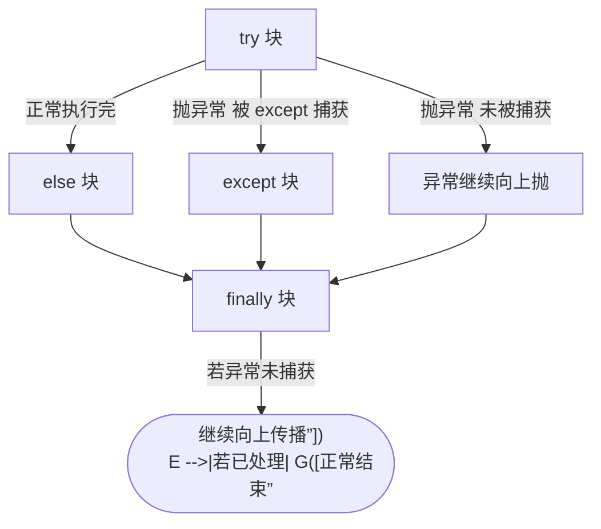

# 异常处理 try-except-else-finally

## 一、四个子句各管什么

- **`try`**：监控“可能出错”的代码块。
- **`except`**：捕获并处理指定异常（可多个、可捕获基类）。
- **`else`**：**仅当 try 没有抛异常时**才执行（正常的后续分支）。
- **`finally`**：**无论是否异常、是否 return**，都一定会执行（常用于释放资源）。

> **生活化比喻**：去 ATM 取钱——`try`=插卡取钱；`except`=钱没吐出来卡住了，处理一下（退卡/报警）；`else`=顺利取到钱，开开心心去逛街；`finally`=不管成功失败，最后把门带上、衣衫整理好再走。

## 二、执行顺序



## 三、可运行代码示例

```python
def safe_div(a, b):
    try:
        r = a / b
    except ZeroDivisionError as e:
        print("除零错误:", e)
        return None          # 注意：return 前也会先跑 finally
    else:
        print("计算成功")     # 仅当没异常
        return r
    finally:
        print("收尾：无论如何都执行")

print(safe_div(10, 2))   # 计算成功 / 收尾 / 5
print(safe_div(1, 0))    # 除零错误 / 收尾 / None
```

## 四、高频考点（全是坑）

1. **`finally` 里的 `return` 会“覆盖” try/except 的返回值**：

   ```python
   def f():
       try:
           return "try"
       finally:
           return "finally"   # 最终返回的是这个！
   print(f())                 # finally
   ```

2. **`else` 不要和 `try` 混写**：`else` 里的代码如果也可能抛异常，就不该被前面的 `except` 捕获，应放到 `try` 内或单独处理。
3. **别裸 `except:`**：`except:` 会连 `KeyboardInterrupt`、`SystemExit` 一起吞掉，导致 `Ctrl+C` 都停不了程序；应捕获具体异常或至少 `except Exception:`。
4. **自定义异常继承 `Exception`**（不要直接继承 `BaseException`）。
5. **资源用 `with` 更优雅**：`with open(...) as f` 底层就是 `try/finally` 的语法糖。

---

## 
> ▶ 对应实操：[[13-dataclass|13-dataclass]]

相关链接

- 📋 目录：[[00-Python]]
- 📚 学习清单：[[八股文学习清单]]
- 🔗 [[笔记/八股文笔记/Python/基础/04-引用计数与垃圾回收|引用计数与垃圾回收]] — 异常路径下的资源回收
- 🔗 [[笔记/八股文笔记/Python/并发/13-上下文管理器with原理|上下文管理器with原理]] — with 是 try/finally 的语法糖
- 🔗 [[八股文笔记/操作系统/00-操作系统|操作系统八股文]] — 系统调用失败与异常处理
- 🔗 [[八股文笔记/设计模式/00-设计模式|设计模式八股文]] — 错误处理与健壮设计
