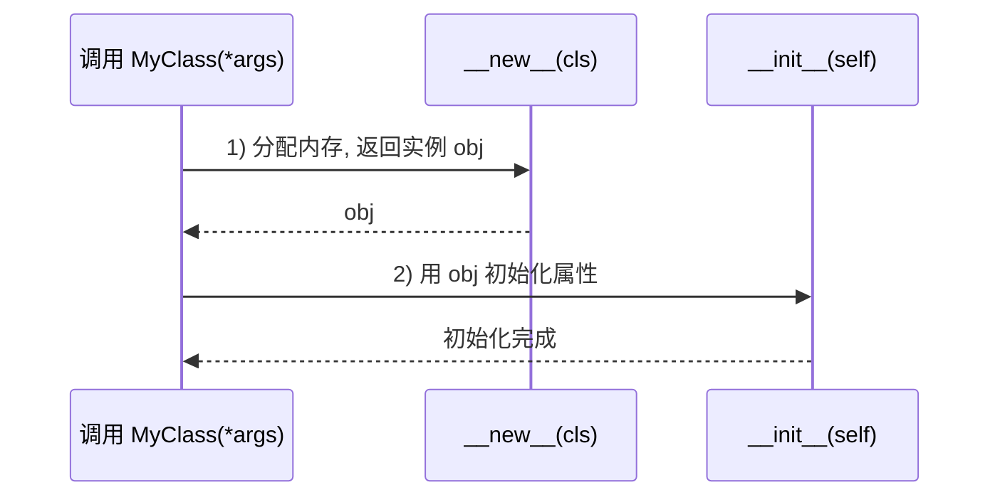

# __new__ vs __init__

## 一、分工：先建房，再装修

- **`__new__(cls, ...)`**：负责**创建**实例——分配内存、真正“造出”一个对象。它是个**静态方法**，必须 `return` 一个对象。
- **`__init__(self, ...)`**：负责**初始化**实例——给刚造好的对象设置属性。它**不返回任何值**。

> **生活化比喻**：`__new__` 是“盖房子”——打地基、搭框架，返回一个空房子；`__init__` 是“装修”——给房子配家具家电。**先有房子（__new__ 返回）才能装修（__init__）**，顺序不能反。

## 二、执行顺序（关键）



> 要点：**`__new__` 先执行并返回实例后，Python 才会调用 `__init__`**。如果 `__new__` 返回的不是一个 `cls` 的实例，`__init__` 压根不会被调用。

## 三、可运行代码示例

```python
class Foo:
    def __new__(cls, *args, **kwargs):
        print("1) __new__ 创建对象")
        obj = super().__new__(cls)     # 真正分配内存
        return obj                      # 必须返回实例

    def __init__(self, x):
        print("2) __init__ 初始化")
        self.x = x

f = Foo(10)            # 先打印 __new__，再打印 __init__
print(f.x)             # 10
```

## 四、什么时候必须碰 `__new__`

1. **继承不可变类型**（int / str / tuple）：它们的值在创建时就定死了，想“改值”只能在 `__new__` 里动手。

   ```python
   class UpperStr(str):
       def __new__(cls, s):
           return super().__new__(cls, s.upper())   # 创建时就转大写
   print(UpperStr("hello"))     # HELLO
   ```

2. **单例模式 Singleton**：控制全局只创建一个实例。

   ```python
   class Singleton:
       _inst = None
       def __new__(cls, *args, **kwargs):
           if cls._inst is None:
               cls._inst = super().__new__(cls)
           return cls._inst
   a = Singleton(); b = Singleton()
   print(a is b)        # True，永远是同一个对象
   ```

3. **对象池 / 缓存**：在 `__new__` 里拦截，复用已有实例。

## 五、核心考点

| 对比点 | `__new__` | `__init__` |
| :--- | :--- | :--- |
| 调用时机 | 创建对象时（先） | 初始化时（后） |
| 是否需 `return` | ✅ 必须返回实例 | ❌ 不返回 |
| 首个参数 | `cls` | `self` |
| 典型用途 | 不可变类型、单例、对象池 | 设置实例属性 |

1. `__new__` 是**隐式的静态方法**，定义时不用写 `@staticmethod`。
2. 绝大多数业务代码只需写 `__init__`，别滥用 `__new__`。
3. 若 `__new__` 不返回 `cls` 的实例，`__init__` 不会被调用（常见于返回其它类型时的元编程场景）。

---

## 相关链接

- 📋 目录：[[00-Python]]
- 📚 学习清单：[[八股文学习清单]]
- 🔗 [[笔记/八股文笔记/Python/基础/12-面向对象三大特性|面向对象三大特性]] — 封装与对象生命周期
- 🔗 [[笔记/八股文笔记/Python/基础/14-类方法实例方法静态方法|类方法/实例方法/静态方法]] — cls 与类方法的关系
- 🔗 [[笔记/八股文笔记/Python/基础/04-引用计数与垃圾回收|引用计数与垃圾回收]] — 对象创建/销毁与引用计数
- 🔗 [[八股文笔记/设计模式/00-设计模式|设计模式八股文]] — 单例模式的实现
- 🔗 [[八股文笔记/操作系统/00-操作系统|操作系统八股文]] — 内存分配与对象创建
