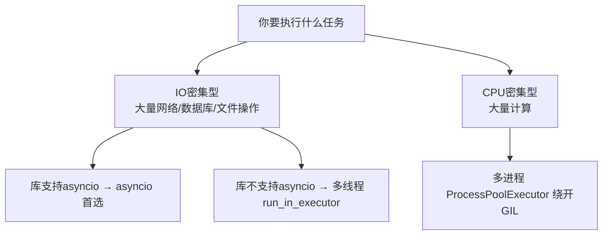

## 五、协程 vs 线程 vs 进程——选型决策树


### 5.1 核心区别——一张表


| | 协程（Coroutine） | 线程（Thread） | 进程（Process） |

| :--- | :--- | :--- | :--- |

| 调度者 | 程序自己（用户态） | 操作系统（内核态） | 操作系统（内核态） |

| 切换开销 | ~纳秒级（函数调用级别） | ~微秒级（系统调用 + 上下文切换） | ~毫秒级（地址空间切换） |

| 内存 | 共享——同一个线程 | 共享——同一个进程 | 隔离——各自独立内存空间 |

| GIL 影响 | 不受 GIL 限制 | 受 GIL 限制——同时只能一个线程跑 Python | 不受 GIL——各自有 Python 解释器 |

| 通信方式 | 直接返回值 / 共享变量 | Queue / Lock / 共享变量（需加锁） | Pipe / Queue / 共享内存 |

| 创建数量 | 成千上万无压力 | 几十到几百（多了切换开销大） | 几到几十（启动慢、内存重） |

| 适用场景 | I/O 密集型（网络、DB） | I/O 密集型（需调用不兼容 asyncio 的库） | CPU 密集型（计算、图像处理） |

| 崩溃影响 | 一个协程崩溃可能影响整个事件循环 | 一个线程崩溃可能带崩进程 | 一个进程崩溃独立隔离 |


### 5.2 为什么 Python 多线程"不行"——GIL 一句话


```python

# GIL（全局解释器锁）：

# 同一时刻，只有一个线程能执行 Python 字节码。

# 多线程并不能利用多核 CPU 做计算——只能并发等 I/O。


# ❌ 多线程算数学——和单线程一样快（甚至更慢）

import threading

results = []

def compute():

    for i in range(10_000_000):

        results.append(i * i)       # 这行需要 GIL

# 开 4 个线程跑——实际还是串行 + 多了切换开销


# ✅ 多线程等 I/O——有用（等 I/O 时会释放 GIL）

def download():

    resp = requests.get(url)        # 底层 C 代码等网络时会释放 GIL

    # 另一个线程可以趁这个空隙执行

```


> **一句话讲清**："GIL 导致 Python 多线程无法利用多核做计算。但 I/O 密集场景下，线程等在系统调用时会释放 GIL——还是有用的。asyncio 更彻底——单线程跑协程，根本就不碰 GIL。"


### 5.3 选型决策树





```python

# 实战：asyncio + 线程池混用——搞定不兼容 asyncio 的库

import asyncio

import requests   # 同步库，但不支持 asyncio


async def download_with_requests(url):

    loop = asyncio.get_running_loop()

    # 把同步函数丢到线程池执行——不阻塞事件循环

    return await loop.run_in_executor(

        None,                  # None = 默认线程池

        requests.get,          # 同步函数

        url                    # 参数

    )


# 现在可以"像异步一样"并发调用同步 requests 了

async def main():

    results = await asyncio.gather(

        download_with_requests("url1"),

        download_with_requests("url2"),

        download_with_requests("url3"),

    )

```


---


## 相关链接


- 📋 目录：[[00-Python]]

- 📚 学习清单：[[八股文学习清单]]

- 🔗 [[笔记/八股文笔记/Python/并发/01-CPU密集与IO密集的并发选型|CPU/IO密集并发选型]]

- 🔗 [[笔记/八股文笔记/Python/并发/04-协程vs线程的调度本质区别|协程vs线程调度本质]]

- 🔗 [[八股文笔记/操作系统/01-进程vs线程vs协程对比|进程vs线程vs协程]] — 操作系统视角的并发基础

- 🔗 [[八股文笔记/React-TS-JS/JavaScript/15-异步与事件循环|JS异步与事件循环]] — Python asyncio vs JS 事件循环

- 🔗 [[八股文笔记/操作系统/01-进程vs线程vs协程对比|进程vs线程vs协程]] — 操作系统视角的三者对比

