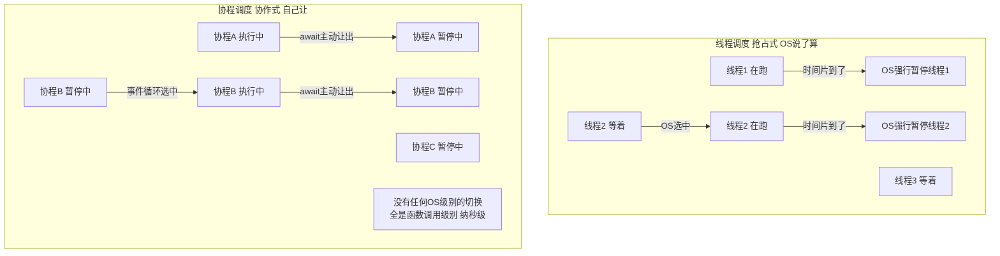
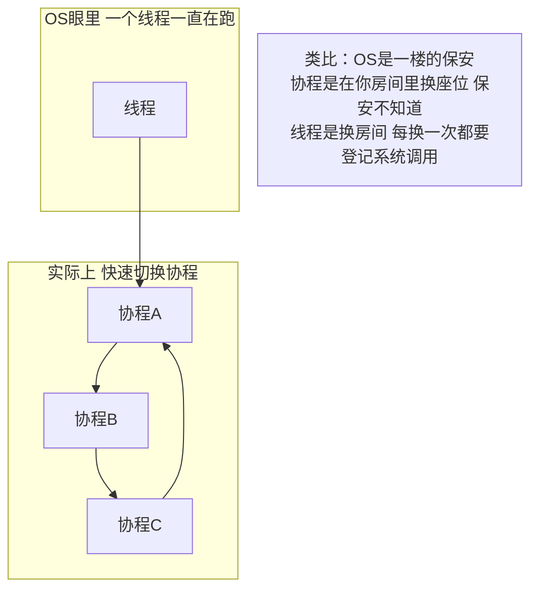

## 第三章：协程——用户态的"线程"


### 3.1 协程和线程的本质区别：谁在调度？


这是最想听到的核心区分：





### 3.2 协程切换为什么快？——技术层面


```python

# 线程切换（简化）：

# ① 时钟中断 → CPU 切换到内核态

# ② 内核保存当前线程的全部寄存器（~几十个）

# ③ 内核选择下一个线程（调度算法——O(1)或O(log n)）

# ④ 内核恢复新线程的寄存器

# ⑤ 切换回用户态

# ⑥ CPU 开始执行新线程

# 耗时：1-10 微秒（其中内核态往返本身就几百纳秒）


# 协程切换（简化）：

# ① 当前协程执行到 await → 调用事件循环的调度函数

# ② 保存少量状态（栈帧指针、局部变量位置）

# ③ 事件循环从就绪队列取下一个协程

# ④ 恢复该协程的状态

# ⑤ CPU 继续执行

# 耗时：50-100 纳秒（没有内核态切换，全是函数调用）

```





### 3.3 协程的代价——协作式调度的"暗面"


```python

# 协程的最大缺陷：一个协程不主动让，其他全等死

import asyncio


async def greedy_coroutine():

    """坏协程——一直占着 CPU 不让"""

    print("我开始算了，你们等着吧")

    total = 0

    for i in range(100_000_000):  # 纯计算，没有 await！

        total += i

    print(f"算完了: {total}")

    # 整个过程没有任何 await——其他协程全部饿死


async def polite_coroutine():

    """好协程——算一会儿就主动让"""

    print("有礼貌的协程")

    for i in range(10):

        # 每算一次就让给其他人

        await asyncio.sleep(0)  # sleep(0) = 把控制权交回事件循环，立刻重新排队

    print("礼貌的协程完成")


async def main():

    # 先启动贪婪协程——它会独占！只有 await 处才会让给 polite

    await asyncio.gather(greedy_coroutine(), polite_coroutine())


asyncio.run(main())

# 输出：

# 我开始算了，你们等着吧

# 算完了: 4999999950000000   ← 先算完

# 有礼貌的协程              ← 才有机会跑！


# ⚠️ 真实后果：FastAPI 里如果有人在 async 路由里做 CPU 密集计算，

#             整个服务器其他请求全部卡住

```


> **一句话讲清**："协程是协作式调度——优点是没有 OS 抢占开销，缺点是一个协程不主动让就堵死全部。所以 async 函数里绝对不能放 CPU 密集计算——必须丢给线程池或进程池。"


### 3.4 三种并发模型——核心对比表


| | 协程（Coroutine） | 线程（Thread） | 进程（Process） |

| :--- | :--- | :--- | :--- |

| **调度方式** | 协作式——自己让 | 抢占式——OS 打断 | 抢占式——OS 打断 |

| **调度位置** | 用户态（代码里） | 内核态（操作系统） | 内核态（操作系统） |

| **切换耗时** | **~50-100 ns** | **~1-10 µs** | **~10-100 µs** |

| **切换要走系统调用** | ❌ 不走 | ✅ 走 | ✅ 走 |

| **内存开销（单个）** | **几 KB**（协程栈） | **~8 MB**（线程栈） | **几十 MB+**（独立的 Python 解释器 + 内存空间） |

| **能创建多少** | 成千上万 | 几十到几百（多了 OOM） | 几个到几十（冷启动慢） |

| **Python 多核并行** | ❌ 不能（单线程） | ❌ 不能（GIL） | ✅ 能（各有 GIL） |

| **通信方式** | 直接 return / 共享变量（单线程无锁） | Queue / Lock / 共享变量（需加锁） | Queue / Pipe / 共享内存 |

| **通信开销** | 几乎零（函数调用） | 低（共享地址空间） | 中（序列化 + IPC） |

| **崩溃隔离** | ❌ 一个崩了事件循环可能挂 | ❌ 一个崩了进程可能挂 | ✅ 一个崩了其他不影响 |

| **适合场景** | IO 密集、高并发、全异步生态 | IO 密集、调用不支持 asyncio 的库 | CPU 密集、需要隔离 |


---


## 相关链接


- 📋 目录：[[00-Python]]

- 📚 学习清单：[[八股文学习清单]]

- 🔗 [[笔记/八股文笔记/Python/并发/02-多线程多进程协程三者对比|三者对比]]

- 🔗 [[笔记/八股文笔记/Python/并发/15-async-await本质|async/await本质]]

- 🔗 [[八股文笔记/操作系统/01-进程vs线程vs协程对比|进程vs线程vs协程]] — 操作系统视角的并发基础

- 🔗 [[八股文笔记/React-TS-JS/JavaScript/15-异步与事件循环|JS异步与事件循环]] — Python asyncio vs JS 事件循环

- 🔗 [[八股文笔记/操作系统/01-进程vs线程vs协程对比|进程vs线程vs协程]] — 协程是用户态调度，对标线程

