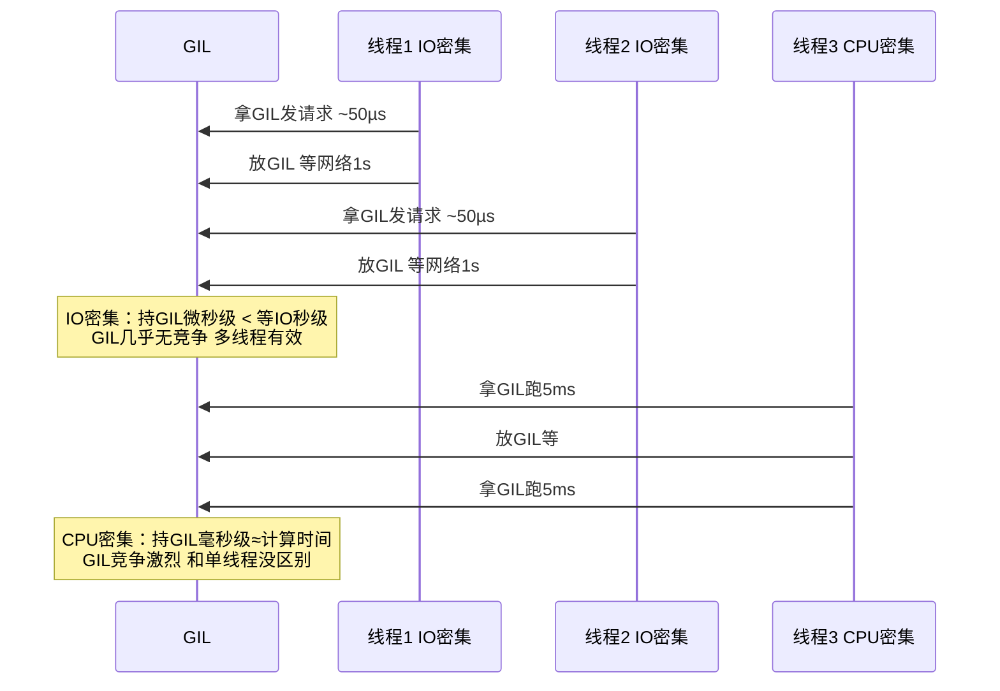

## 一、GIL 是什么？（必答基础题）


### 1.1 一句话定义


> **GIL（Global Interpreter Lock，全局解释器锁）** 是 CPython 解释器中的一把**全局互斥锁**，它保证**同一时刻只有一个线程在执行 Python 字节码**。


### 1.2 通俗比喻


> 想象一间只有一个灶台的厨房（CPU），来了4个厨师（4个线程）。

> 

> GIL 就是厨房规定：**同一时刻只允许一个厨师用灶台**。其他厨师可以在旁边洗菜、等食材（IO等待），但不能同时炒菜。一个厨师炒完一盘菜（执行完一定量字节码），才把灶台让给下一个。

> 

> 结果：4个厨师并不能同时炒菜，灶台利用率没变高。


### 1.3 关键事实


| 事实 | 说明 |

| :--- | :--- |

| **只有 CPython 有 GIL** | PyPy、Jython、IronPython 没有 |

| **GIL 锁的是字节码执行** | 不是锁整个进程，IO操作时会释放 |

| **每个进程有独立的 GIL** | 多进程可以真正并行 |

| **Python 3.13 开始可选关闭** | `python -X nogil` 实验性无 GIL 模式 |


---


### 4.2 GIL 的释放——两种机制


```python

import sys


# 机制 ①：时间片到期——被动释放

# 每 5ms（默认），当前持有 GIL 的线程检查是否有其他线程在等

# 如果有 → 释放 GIL → 发信号给等待线程 → 自己进入等待队列

print(sys.getswitchinterval())  # 0.005


# 机制 ②：I/O 操作——主动释放

# 当 Python 代码调用底层 C 函数做 I/O 时，C 代码里会主动释放 GIL

# 比如 socket.recv() 的内部实现：

#   Py_BEGIN_ALLOW_THREADS  ← 释放 GIL

#   ... 等网络数据 ...        ← 这段时间其他线程可以跑

#   Py_END_ALLOW_THREADS    ← 重新获取 GIL


# 这就是为什么 IO 密集多线程有效——线程大部分时间在等 I/O = 大部分时间不持有 GIL

```





### 4.3 GIL 的 C 源码逻辑（加分——理解就行，不要求背）


```c

// CPython 源码 ceval.c 中的简化逻辑（Python 3.2+）


// 主循环：每执行一次字节码指令检查一次

for (;;) {

    // 执行一条字节码指令

    opcode = NEXTOP();

    switch (opcode) {

        case LOAD_FAST: ...

        case STORE_FAST: ...

        // ... 100+ 种字节码指令

    }

    

    // 每执行一条指令后检查：是不是该释放 GIL 了？

    if (_Py_atomic_load_relaxed(&gil_drop_request)) {

        // 有其他线程在等 GIL → 释放给它们

        release_gil();

        acquire_gil();  // 重新排队抢 GIL

    }

    

    // 也检查时间：是不是已经跑了 >5ms 了？

    if (elapsed > switch_interval) {

        release_gil();  // 主动让给别人

        acquire_gil();

    }

}

```


> 关键洞察：**GIL 是在每条字节码指令之间检查的**，不是在 Python 代码的任意位置。这意味着即使一条 Python 语句很复杂，在字节码层面也会被切成很多条指令，每条之间都可能切换。


### 4.4 多线程真的"没用"吗？——纠正一个常见误解


```python

# ❌ 误解："Python 多线程完全没用，因为 GIL"

# ✅ 实际：看场景


# 场景 ①：IO 密集 —— 多线程有用！

import threading, time, requests


def fetch():

    requests.get("https://httpbin.org/delay/1")  # IO 等 1 秒


# 单线程串行 10 个请求：~10s

# 10 线程并发：~1s（等网络时释放 GIL）


# 场景 ②：CPU 密集 —— 多线程没用

def compute():

    sum(range(100_000_000))  # 纯计算


# 单线程串行 4 个任务：和 4 线程并发几乎一样！

# 但注意：如果用了 NumPy（底层 C 释放 GIL），多线程又有用了！


import numpy as np

a = np.random.rand(5000, 5000)

b = np.random.rand(5000, 5000)

# np.dot(a, b) —— NumPy 底层 C 代码在计算前释放 GIL

# 多线程同时调 np.dot → 可以真并行

```


> **一句话讲清**："Python 多线程的难点不是'能不能用'，而是'要知道什么时候没用'。IO 密集——有用；CPU 密集——没用，除非底层 C 库主动释放 GIL。听到后半句就知道你真的理解了。"


### 4.5 Python 3.13 和 GIL 的未来


```text

Python 3.13 (2024年10月发布) —— 实验性 nogil 模式


核心改动：把引用计数改成"偏向引用计数"（Biased Reference Counting）

  - 传统引用计数：每个线程都要修改全局引用计数 → 必须加锁

  - 偏向引用计数：把引用计数拆成"本地计数"+"全局计数"

    大多数增减只改本地计数（不用锁），只有特殊情况才合并到全局（加锁）


启动方式：python3.13 -X nogil your_script.py

        或设置环境变量 PYTHON_GIL=0


现状：仍实验性，单线程性能有轻微下降（~5-10%），

     但多线程真并行带来的加速远超这 5-10%

     生态还在适配中（C 扩展库需要更新）


一句话讲清："3.13 引入实验性 nogil 模式，基于偏向引用计数。但短期生产环境还是用多进程或 asyncio

来处理并发——生态适配还需要时间。长期来看，GIL 大概率会被移除。"

```


---


---


## 相关链接


- 📋 目录：[[00-Python]]

- 📚 学习清单：[[八股文学习清单]]

- 🔗 [[笔记/八股文笔记/Python/并发/06-GIL为什么存在|GIL为什么存在]]

- 🔗 [[笔记/八股文笔记/Python/并发/07-GIL对多线程的影响|GIL对多线程的影响]]

- 🔗 [[八股文笔记/操作系统/01-进程vs线程vs协程对比|进程vs线程vs协程]] — 操作系统视角的并发基础

- 🔗 [[八股文笔记/React-TS-JS/JavaScript/15-异步与事件循环|JS异步与事件循环]] — Python asyncio vs JS 事件循环

- 🔗 [[八股文笔记/操作系统/01-进程vs线程vs协程对比|进程vs线程vs协程]] — GIL 是 CPython 线程的特殊限制

