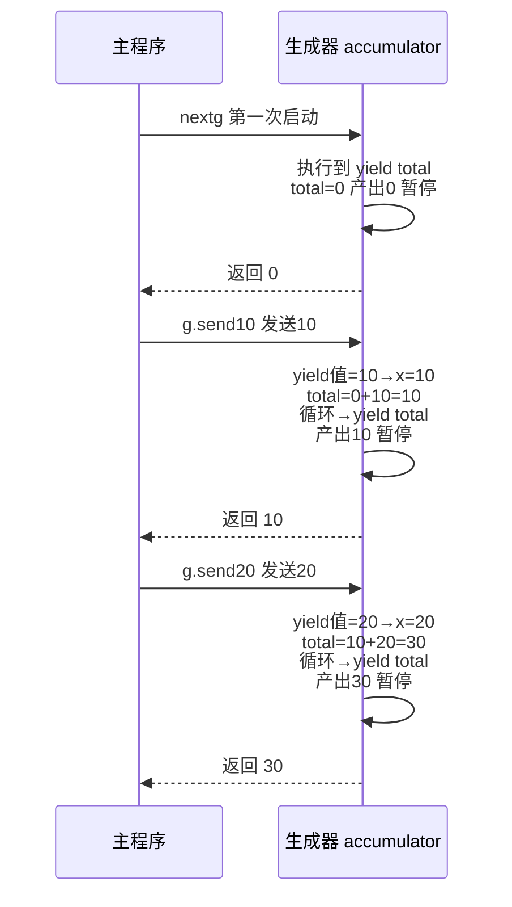
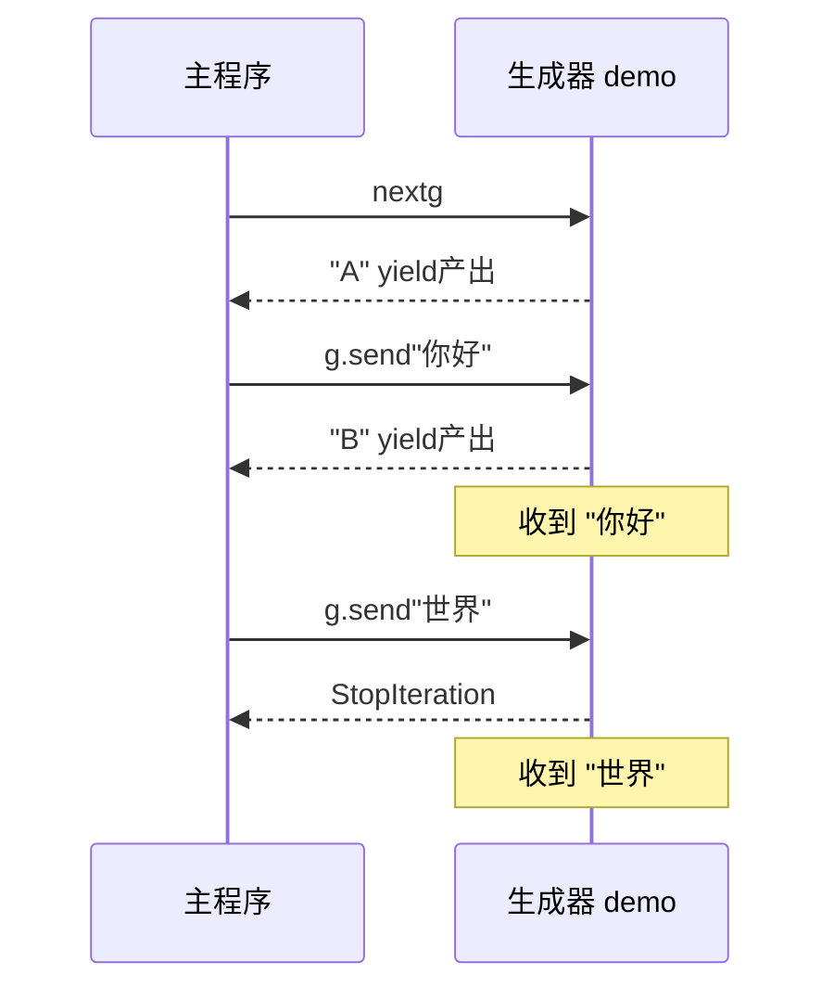

## 三、send —— 双向通信（⭐⭐重点）


### 3.1 基本用法


```python

def echo():

    """收到什么就返回什么"""

    while True:

        received = yield           # yield 既产出值，又能接收值

        print(f"收到: {received}")


g = echo()

next(g)                            # 必须先 next() 启动！

g.send("hello")                    # 发送 "hello" → yield 表达式的值 = "hello"

# 输出：收到: hello

g.send("world")

# 输出：收到: world

```


### 3.2 send 执行流程（逐行拆解）


```python

def accumulator():

    total = 0

    while True:

        x = yield total            # ① 产出 total ② 接收 x

        total += x


g = accumulator()

```





### 3.3 第一次必须 next 或 send(None)


```python

g = accumulator()

g.send(10)                 # ❌ TypeError: can't send non-None value to a just-started generator


# 原因：生成器还没启动，没有暂停在 yield 处，send 进去的值没地方放


# 正确启动方式（三选一）：

next(g)                    # 方式 1

g.send(None)               # 方式 2

g.__next__()               # 方式 3（和 next(g) 等价）

```


> **通俗比喻**：你还没开始打电话，就想说话——对方根本没在听。先 `next()` 让对方"接起电话"（执行到第一个 `yield`），然后才能 `send()` 说话。


### 3.4 send 与 yield 的值传递全景


```python

def demo():

    val = yield "A"                # ① 产出 "A"，暂停

    print(f"收到: {val}")

    val2 = yield "B"               # ② 产出 "B"，暂停

    print(f"收到: {val2}")


g = demo()

print(next(g))          # "A"      ← 启动，产出 "A"

print(g.send("你好"))   # "收到: 你好" → 产出 "B" → 返回 "B"

print(g.send("世界"))   # "收到: 世界" → 函数结束 → StopIteration

```





---


## 相关链接


- 📋 目录：[[00-Python]]

- 📚 学习清单：[[八股文学习清单]]

- 🔗 [[笔记/八股文笔记/Python/并发/10-生成器与yield原理|生成器与yield原理]]

- 🔗 [[笔记/八股文笔记/Python/并发/12-yield from委托生成器|yield from委托生成器]]

- 🔗 [[八股文笔记/操作系统/01-进程vs线程vs协程对比|进程vs线程vs协程]] — 操作系统视角的并发基础

- 🔗 [[八股文笔记/React-TS-JS/JavaScript/15-异步与事件循环|JS异步与事件循环]] — Python asyncio vs JS 事件循环

- 🔗 [[八股文笔记/React-TS-JS/React/04-为什么需要Hooks|React Hooks]] — 生成器/协程与 Hooks 的设计理念对比

