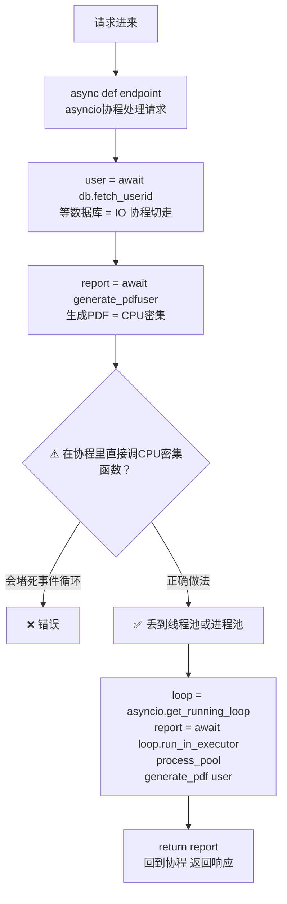
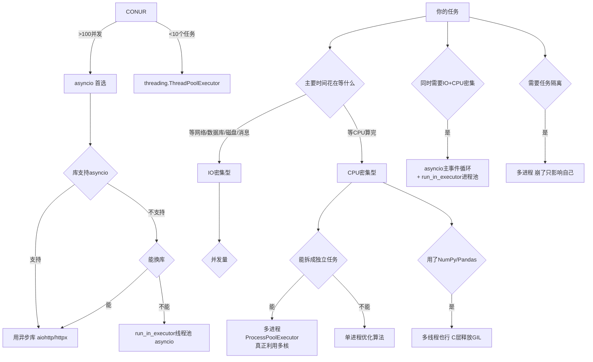

## 第六章：混合并发——实际项目怎么组合使用


### 6.1 真实场景：Web API 服务器





### 6.2 三种 run_in_executor 模式


```python

import asyncio, time

from concurrent.futures import ThreadPoolExecutor, ProcessPoolExecutor


# 准备两个专用执行器（全局复用，不要每次创建！）

thread_pool = ThreadPoolExecutor(max_workers=10)    # IO 密集任务

process_pool = ProcessPoolExecutor(max_workers=4)   # CPU 密集任务


def cpu_intensive_task(n: int) -> int:

    """纯计算——应该在进程池跑"""

    total = 0

    for i in range(n * 10_000_000):

        total += i

    return total


def blocking_io_task(url: str) -> str:

    """阻塞 IO（用了同步库 requests）——应该在线程池跑"""

    import requests

    return requests.get(url).text[:100]


async def mixed_workload():

    """同时有 IO 密集和 CPU 密集任务"""

    

    # ① IO 密集：丢线程池（线程在等网络时释放 GIL）

    io_results = await asyncio.gather(

        asyncio.get_running_loop().run_in_executor(thread_pool, blocking_io_task, "https://httpbin.org/get"),

        asyncio.get_running_loop().run_in_executor(thread_pool, blocking_io_task, "https://httpbin.org/headers"),

    )

    

    # ② CPU 密集：丢进程池（真正并行计算）

    cpu_results = await asyncio.gather(

        asyncio.get_running_loop().run_in_executor(process_pool, cpu_intensive_task, 5),

        asyncio.get_running_loop().run_in_executor(process_pool, cpu_intensive_task, 8),

    )

    

    # ③ 在协程里等结果——事件循环不会堵塞

    return {"io": io_results, "cpu": cpu_results}


# asyncio.run(mixed_workload())

```


### 6.3 选型决策树——终极版





---


## 相关链接


- 📋 目录：[[00-Python]]

- 📚 学习清单：[[八股文学习清单]]

- 🔗 [[笔记/八股文笔记/Python/并发/18-threading模块|threading模块]]

- 🔗 [[笔记/八股文笔记/Python/并发/19-multiprocessing模块|multiprocessing模块]]

- 🔗 [[八股文笔记/操作系统/01-进程vs线程vs协程对比|进程vs线程vs协程]] — 操作系统视角的并发基础

- 🔗 [[八股文笔记/React-TS-JS/JavaScript/15-异步与事件循环|JS异步与事件循环]] — Python asyncio vs JS 事件循环

- 🔗 [[八股文笔记/操作系统/01-进程vs线程vs协程对比|进程vs线程vs协程]] — Executor 封装了线程/进程池

