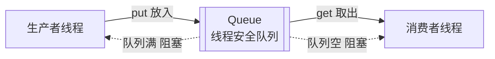

# 生产者-消费者模型

## 一、是什么

- **生产者-消费者模型 Producer-Consumer**：用**线程安全的队列 `queue.Queue`** 解耦“生产数据”的一方和“消费数据”的一方，平衡两者速度差。
- 生产者往队列 `put()`，消费者从队列 `get()`；队列**满**或**空**时自动阻塞等待。

> **生活化比喻**：工厂流水线——工人 A 把零件放到传送带（生产者），工人 B 从传送带取零件组装（消费者）。传送带就是 `Queue`：满了 A 就等，空了 B 就等，两人不用互相喊号，节奏自动匹配。

## 二、为什么需要它

1. **解耦**：生产/消费速率不同也不互相阻塞，各自忙各自的。
2. **缓冲**：突发流量先堆在队列里，消费者按自己节奏处理（背压 backpressure）。
3. **并发**：多线程/多进程可同时生产和消费，提升吞吐。

## 三、结构图



## 四、可运行代码示例

```python
import threading
import queue
import time
import random

q = queue.Queue(maxsize=5)     # 有界队列，满了 put 会阻塞

def producer():
    for i in range(5):
        time.sleep(random.random())   # 模拟生产耗时不稳定
        q.put(i)
        print(f"生产 {i}")
    q.put(None)                      # 哨兵值：通知消费者结束

def consumer():
    while True:
        item = q.get()               # 队列空则阻塞等待
        if item is None:
            q.put(None)              # 多消费者时把哨兵传下去
            break
        print(f"消费 {item}")
        q.task_done()

t1 = threading.Thread(target=producer)
t2 = threading.Thread(target=consumer)
t1.start(); t2.start()
t1.join(); t2.join()
```

## 五、核心考点

1. **`queue.Queue` 是线程安全的**：内部用了锁 + 条件变量，比手写 `list + Lock` 省心且不易出错。
2. **多消费者退出**：用**哨兵值**（如 `None`）或配合 `q.join()` + `q.task_done()` 协同；多消费者时哨兵要在每个消费者间传递。
3. **这是经典并发模式**，也是理解“阻塞队列 / 背压”的基础，分布式系统里 Kafka 等消息队列是其放大版。
4. **与 GIL 的关系**：`Queue` 在等待时释放 GIL，生产者/消费者在等队列时空出 GIL 给彼此，配合良好；真正吃满 CPU 时仍受 GIL 限制（CPU 密集请用多进程或 3.13 自由线程）。

---

## 相关链接

- 📋 目录：[[00-Python]]
- 📚 学习清单：[[八股文学习清单]]
- 🔗 [[笔记/八股文笔记/Python/并发/18-threading模块|threading模块]] — 生产者消费者依赖的线程基础
- 🔗 [[笔记/八股文笔记/Python/并发/01-CPU密集与IO密集的并发选型|CPU密集与IO密集的并发选型]] — 何时用线程而不是进程
- 🔗 [[笔记/八股文笔记/Python/并发/05-GIL是什么|GIL是什么]] — 队列等待时如何释放 GIL
- 🔗 [[八股文笔记/操作系统/00-操作系统|操作系统八股文]] — 进程/线程与 IPC 队列
- 🔗 [[八股文笔记/分布式-系统设计/00-分布式-系统设计|分布式系统设计八股文]] — 消息队列是生产者消费者的分布式版
