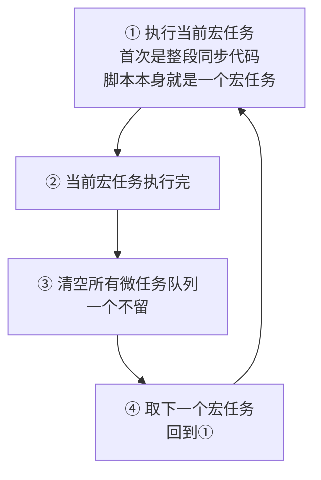
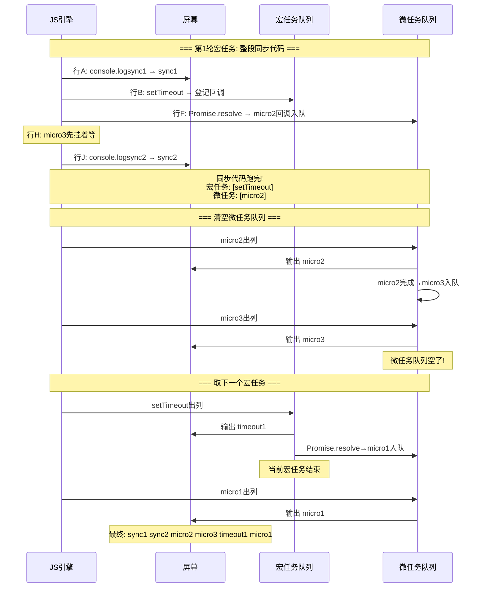
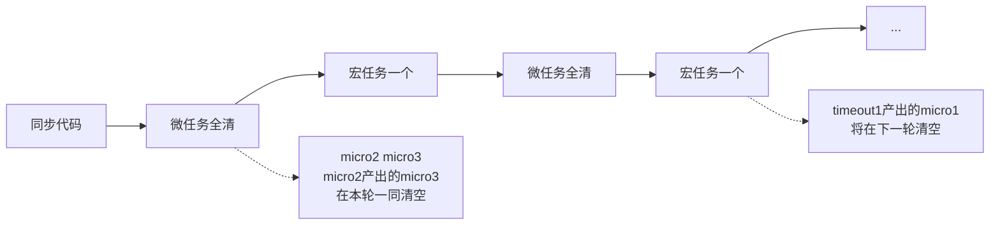
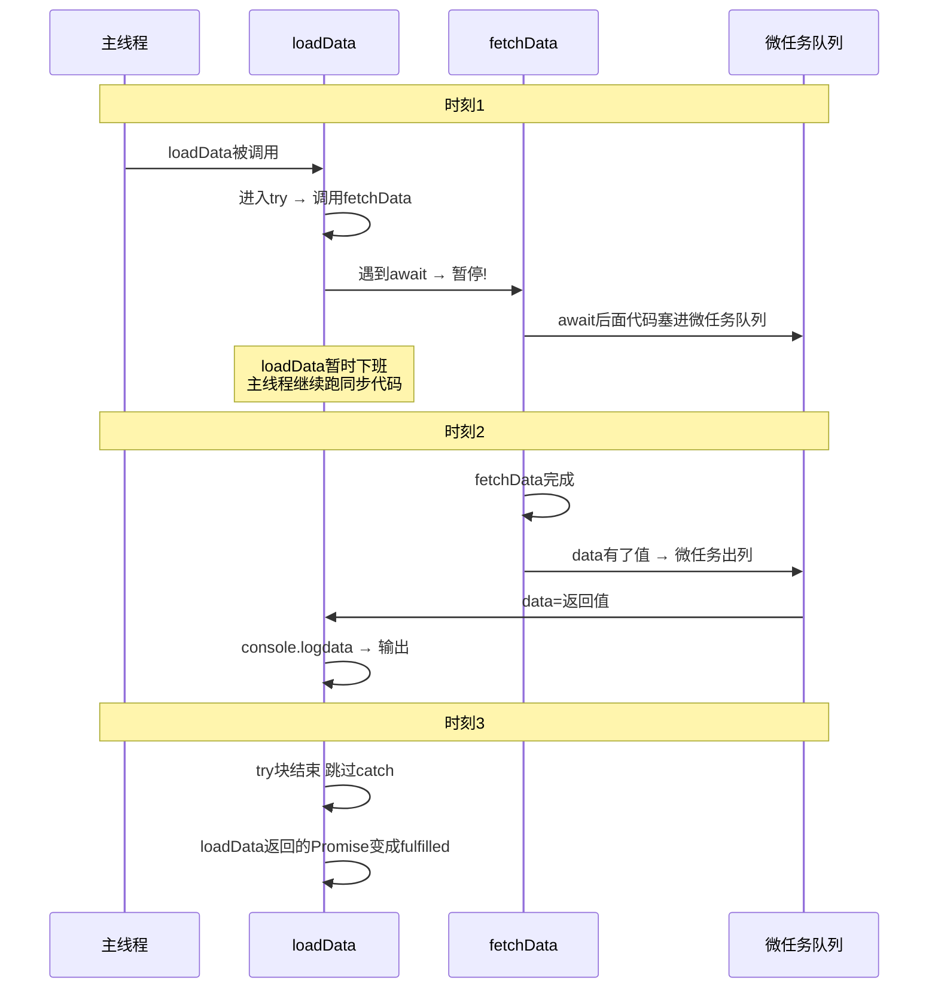
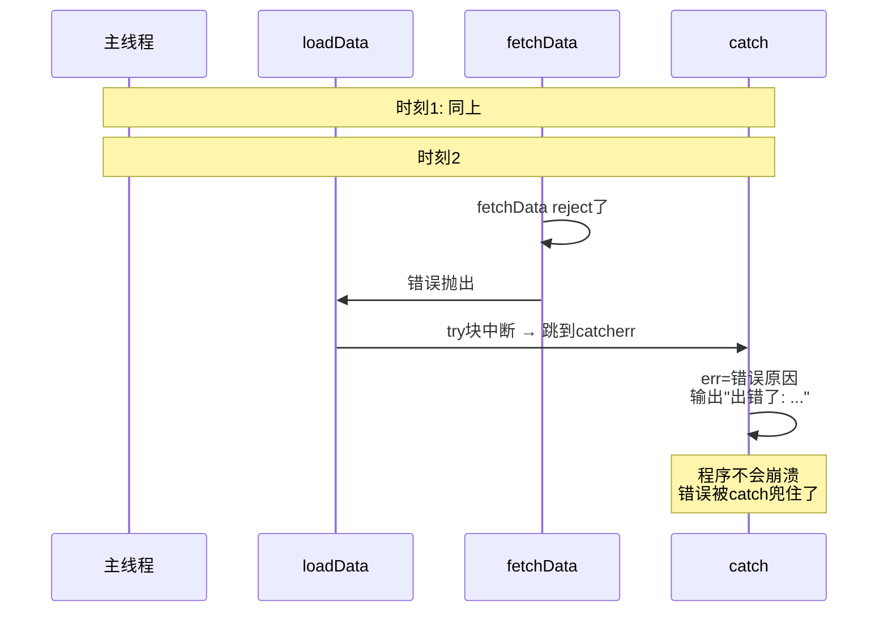

# 异步与事件循环
## 八、异步与事件循环


### 8.1 JS 是单线程的


**同一时刻只能做一件事。** 和 Python 不一样——Python 可以通过 `threading` 开多线程，JS 不行。


**为什么设计成单线程？** JS 最初为浏览器设计，用来操作 DOM。如果两个线程同时改同一个 DOM 元素（一个改文字、一个删元素），就崩了。所以单线程是 JS 的宿命。


```javascript

// 单线程的后果：死循环会冻住整个页面

while (true) {}  // 卡死！所有按钮、动画全冻住

console.log("我永远执行不到");

```


### 8.2 同步 vs 异步


**同步 = 排队买奶茶，前面的人不走，你就死等。**


```javascript

console.log("1");     // ① 执行

console.log("2");     // ② 等①完了才执行

console.log("3");     // ③ 等②完了才执行

// 输出：1 2 3 —— 一行一行，严格按顺序，谁也别想插队

```


**异步 = 点完餐拿号，叫到号才取，中间不站着干等。**


```javascript

console.log("1");                          // ① 同步，立刻执行


setTimeout(function() {                    // ② "登记：1 秒后叫我"

    console.log("2");                      // ④ 1 秒后执行

}, 1000);


console.log("3");                          // ③ 不等②，立刻执行

// 输出：1 3 2 —— 异步的 2 排到了最后

```


**为什么要异步？** 如果 JS 只能同步，发网络请求时整个页面冻住 3 秒——按钮点不动、动画卡住、什么都干不了。异步让"慢操作"不堵路，好了再回来处理。


```javascript

// ❌ 如果 JS 只能同步（假设写法，实际不行）：

const data = fetchSync("/api");  // 卡住 3 秒等响应，页面冻死


// ✅ 实际：异步

fetch("/api").then(data => {     // 发出去就不管了，继续往下跑

    console.log(data);           // 等数据到了再回来处理

});

console.log("请求已发出，继续干别的");  // 不卡，立刻输出

```


**`setTimeout(fn, 0)` 为什么也排最后？**


```javascript

console.log("1");

setTimeout(function() { console.log("2"); }, 0);  // 哪怕 0 毫秒

console.log("3");

// 输出：1 3 2


// 因为 setTimeout 的回调永远是异步的——哪怕设 0ms，也要等同步代码全部跑完才轮到它

```


### 8.3 宏任务 vs 微任务


JS 的异步任务分两个队列，微任务优先级更高。


| 宏任务（Macrotask） | 微任务（Microtask） |

| :--- | :--- |

| `setTimeout` | `Promise.then()` 的回调 |

| `setInterval` | `async/await` 的 await 后续代码 |

| I/O（文件、网络请求） | `queueMicrotask(fn)` |


**执行顺序（背下来）**：





即：**宏1（同步）→ 微全清 → 宏2 → 微全清 → 宏3 → …**


```javascript

console.log("1");                          // 同步


setTimeout(function() {

    console.log("2");                      // 宏任务

}, 0);


Promise.resolve().then(function() {

    console.log("3");                      // 微任务

});


console.log("4");                          // 同步


// 输出：1 4 3 2

// 拆解：

// 1、4 是同步 → 先输出

// 微任务 3 优先级高 → 接着输出

// 宏任务 2 → 最后输出

```


**同步 + 两个异步队列：跟着 JS 引擎大脑逐行走一遍**


```javascript

console.log("sync1");                                   // 行 A


setTimeout(function() {                                 // 行 B

    console.log("timeout1");                            // 行 C

    Promise.resolve().then(function() {                 // 行 D

        console.log("micro1");                          // 行 E

    });

}, 0);


Promise.resolve().then(function() {                     // 行 F

    console.log("micro2");                              // 行 G

}).then(function() {                                    // 行 H

    console.log("micro3");                              // 行 I

});


console.log("sync2");                                   // 行 J

```





**规律总结**：





### 8.4 Promise —— 处理异步的标准化方式


**先回答两个基本问题：**


```javascript

// ===== Promise 是对象吗？=====

// Promise 是内置类（构造函数），new Promise() 创建出的实例是对象

typeof Promise;          // "function" —— Promise 本身是构造函数

const p = new Promise(() => {});

typeof p;                // "object" —— new 出来的是对象

// 所以：p 是一个 Promise 对象/实例，上面有 .then、.catch、.finally


// ===== resolve 和 reject 是内置函数吗？=====

// 不是！它们不是全局函数，不能像 console.log 一样到处调

// 它们是 Promise 内部自动传给"执行器函数"的两个参数：


new Promise(function(resolve, reject) {

//                  ^^^^^^^  ^^^^^^

//      这两个参数是 Promise 引擎内部创建好，自动传给你的

//      你的任务只是：在合适的时机调用 resolve() 或 reject()

});


// ❌ 在外面写 resolve("xx") → 报错！resolve 不是全局函数

// ✅ 只在 new Promise(fn) 的 fn 函数体内使用

```


| 问题 | 答案 |

| :--- | :--- |

| `Promise` 是什么？ | 内置构造函数，和 `Array`、`Date` 同一级别 |

| `new Promise()` 产出什么？ | 一个 Promise 实例对象，上面有 `.then`/`.catch`/`.finally` |

| `resolve` / `reject` 是谁？ | Promise 给执行器函数的**参数**，不是全局函数 |

| `Promise.resolve()` 是什么？ | Promise 上的**静态方法**，= `new Promise(resolve => resolve("值"))` 的简写 |


```javascript

// ===== 创建 Promise =====

// new Promise(执行器函数) —— 执行器函数是同步执行的！

const p = new Promise(function(resolve, reject) {

    //   ↑ 这个函数体是同步的，new 的瞬间就执行

    const ok = true;

    if (ok) {

        resolve("成功了");     // 调 resolve → Promise 状态变 fulfilled

    } else {

        reject("失败了");      // 调 reject → Promise 状态变 rejected

    }

});

// 执行到这里时，上面的函数体已经跑完了


// ===== 三种状态 =====

// pending（进行中）→ resolve(value) → fulfilled（已完成）

// pending（进行中）→ reject(reason) → rejected（已拒绝）

// 状态一旦确定就不可逆，再调 resolve/reject 无效


// ===== 消费 Promise =====

p.then(function(value) {

    console.log("成功:", value);             // resolve 的值在这里拿到

}).catch(function(reason) {

    console.log("失败:", reason);            // reject 的值在这里拿到

}).finally(function() {

    console.log("无论成败都执行");

});


// ===== 链式调用 =====

new Promise(resolve => resolve(1))

    .then(v => v + 1)           // 返回普通值 2 → 下一个 then 拿到 2

    .then(v => v * 10)          // 返回 20 → 下一个 then 拿到 20

    .then(v => console.log(v)); // 20

// then 每次返回新 Promise，所以可以一直 .then().then().then()

```


### 8.5 ⚠️ 黄金陷阱：`new Promise(fn)` 的 fn 是同步的


```javascript

console.log("A");


new Promise(function(resolve) {

    console.log("B");          // ← 这个输出是同步的！

    resolve();

});


console.log("C");


// 输出：A B C

// B 的执行器是同步代码，跟着 new Promise 一起立刻执行

// 只有 .then() 的回调才是异步的（微任务）

```


### 8.6 `async/await` —— Promise 的语法糖


**"语法糖"什么意思？** 换个更甜的写法，底层东西完全没变。就像"拿铁"和"浓缩咖啡+牛奶"——叫法不同，喝到嘴里是同一种东西。


```javascript

// ===== "咖啡+牛奶"写法：Promise.then =====

function fetchData() {

    return fetch("/api/user").then(data => data);

}


// ===== "拿铁"写法：async/await =====

async function fetchData() {

    const data = await fetch("/api/user");   // await 等 Promise 完成

    return data;                              // async 函数永远返回 Promise

}

// ↑ 两段代码跑起来效果一模一样，async/await 只是让你读起来更像"同步代码"

```


**`loadData()` 逐行执行流程分析：**


```javascript

async function loadData() {

    try {                                        // ① 进入 try 块

        const data = await fetchData();           // ② 调用 fetchData()，返回 Promise

    //  ──────── 同步部分结束，下面变微任务 ────────

    //          ③ await 等待 fetchData() 完成

    //          ④ 成功 → data = 返回值，继续往下

        console.log(data);                       // ⑤ 输出拿到的数据

    } catch (err) {                              // ⑥ 如果②~⑤任一步失败，跳到这

        console.log("出错了:", err);              // ⑦ 输出错误

    }

}


loadData();  // async 函数调用，返回一个 Promise

```








**`await` 怎么读**：

- `await x` = "我要等 x 这个 Promise 完成，拿到它肚子里面的值"

- `await` 后面的所有代码 = `.then(() => { ... })` 里面的代码 = 微任务


```javascript

// 等价转换——上面 loadData 等于下面这个 Promise 链：

function loadData() {

    return fetchData()

        .then(data => {

            console.log(data);       // try 块里的逻辑

        })

        .catch(err => {

            console.log("出错了:", err);  // catch 块

        });

}

// async/await 版：读起来像同步代码

// Promise 链版：嵌套更多但直接暴露了"异步"本质

// 两者完全等价

```


**"返回 Promise"到底什么意思？**


```javascript

// ===== async 函数的 return 自动包一层 Promise =====

async function getData() {

    return "饭";              // 你 return 的是普通值

}

// ↑ JS 引擎悄悄把它变成：

// return Promise.resolve("饭");


const result = getData();     // result 不是 "饭"，是 Promise 对象

console.log(result);          // Promise { "饭" } —— 像外卖订单，不是饭本身


// ===== 要取里面的值，必须 .then() 或 await =====

getData().then(food => {

    console.log(food);        // "饭" —— 拆开订单

});


const food = await getData(); // "饭" —— await 就是拆订单

```


**`const food = await getData()` 拆解：**


```javascript

// 分两步理解：

const promise = getData();    // ① 调用 async 函数 → 拿到 Promise 对象（订单）

const food = await promise;   // ② await 等订单完成 → 拆开包装 → 掏出 "饭"


// 合起来一行写：

const food = await getData(); // 等价于上面两步


// 关键：await 让 Promise 变回普通值——你拿到的不再是 Promise 对象，是 "饭" 本身

console.log(food);            // "饭"

typeof food;                  // "string" —— 是字符串，不是 Promise 对象

```


> 一句话：`async` 函数是自动保鲜膜机器——你放什么进去，出来都包着 Promise。`await` 就是反操作——把保鲜膜撕掉，掏出里面的东西。


**async/await 三个规则（背下来）**：


| # | 规则 | 解释 |

| :--- | :--- | :--- |

| 1 | `async function` 永远返回 Promise | `return "值"` 会自动变成 `Promise.resolve("值")` |

| 2 | `await` 只能在 `async` 函数里用 | 普通函数里写 `await` 直接报语法错 |

| 3 | `await` 后面的代码 = 微任务 | 等价于 `.then(() => { ... })` 里的回调


---


## 相关链接


- 📋 目录：[[00-JavaScript]]

- 📚 学习清单：[[八股文学习清单]]

- 🔗 [[笔记/八股文笔记/Python/并发/14-asyncio事件循环原理|Python asyncio事件循环]] — Python和JS的事件循环对比

- 🔗 [[八股文笔记/操作系统/14-IO多路复用select_poll_epoll|IO多路复用]] — JS事件循环底层依赖IO多路复用

- 🔗 [[八股文笔记/React-TS-JS/React/11-ReactFiber架构与Scheduler|React Fiber架构]] — React Fiber与JS事件循环的配合


