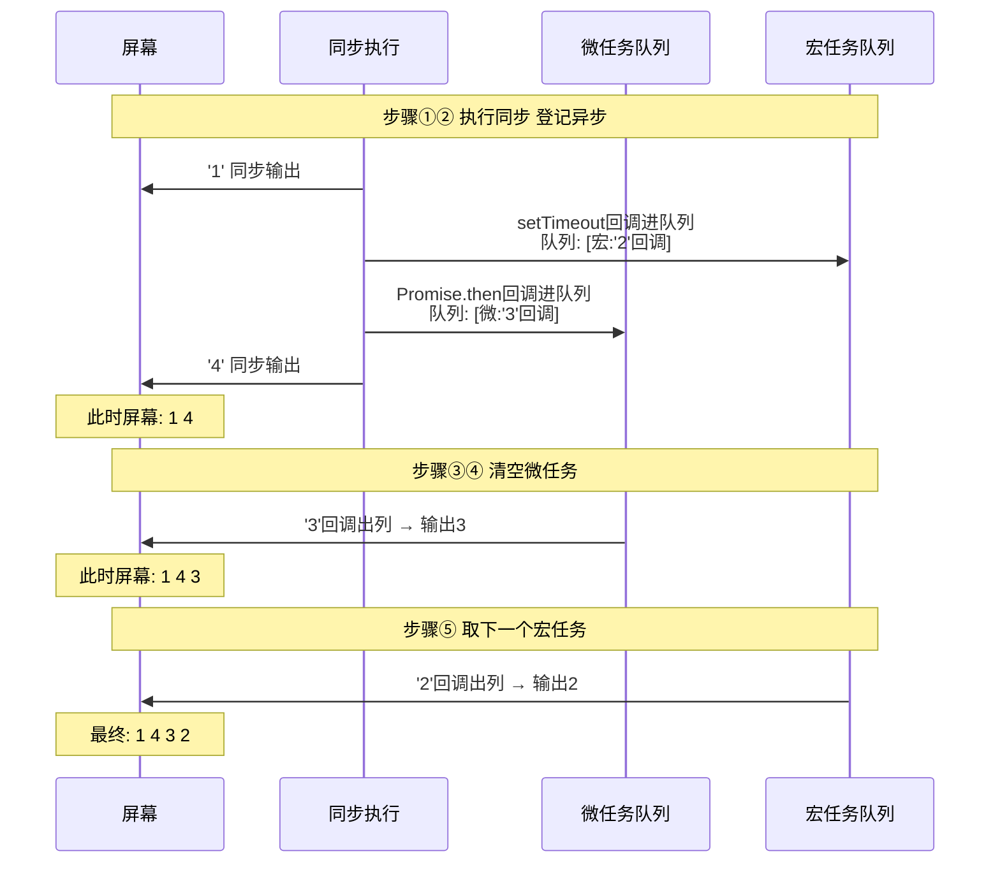
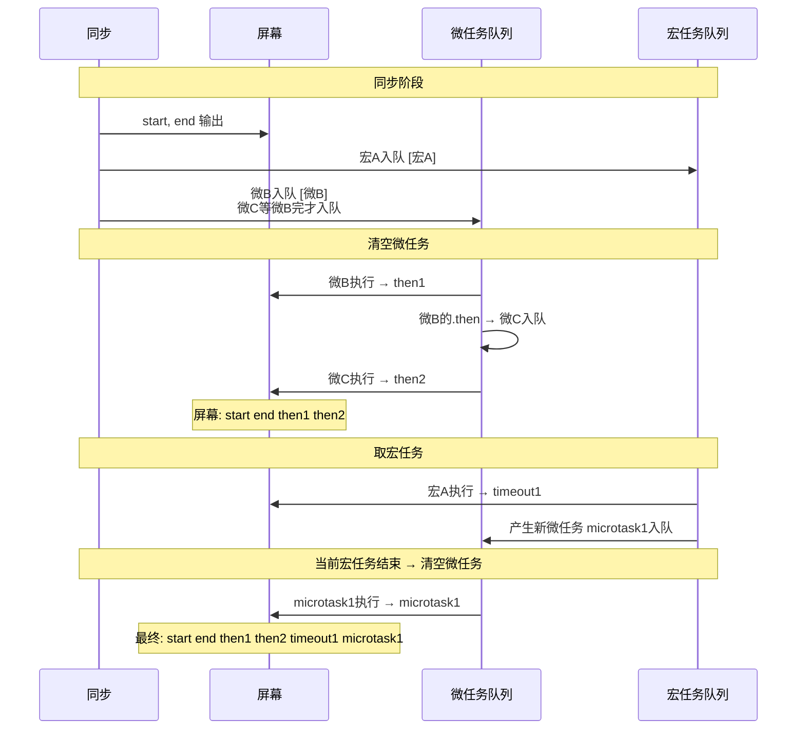
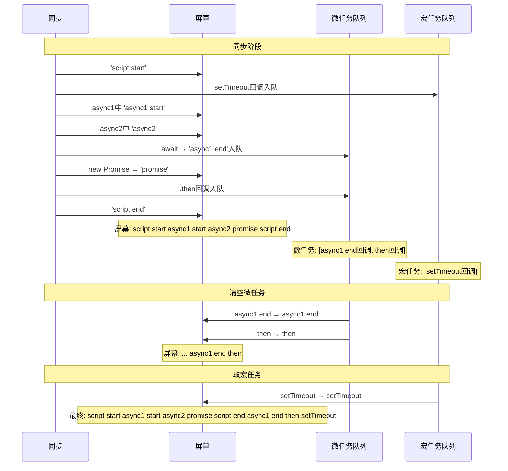
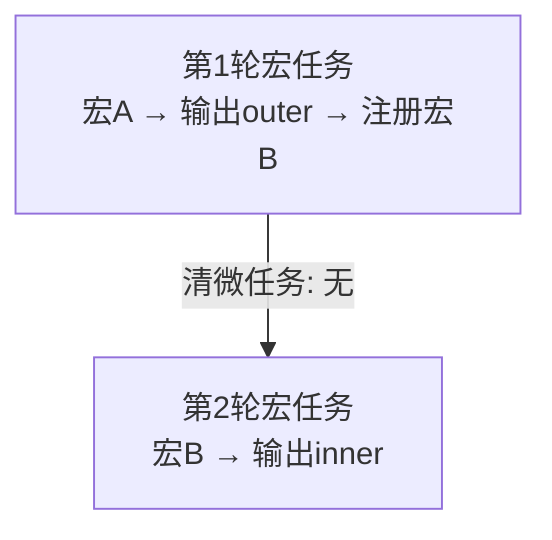

# async与await语法糖
## 六、经典输出题逐题拆解


### 题1：setTimeout + 同步


```javascript

console.log('a');

setTimeout(function() { console.log('b'); }, 0);

console.log('c');

// 输出：a c b

// 拆：a、c 同步先跑完，b 是宏任务最后才轮到

```


### 题2：引入微任务（最经典）


```javascript

console.log('1');                        // ① 同步


setTimeout(function() {

    console.log('2');                    // ⑥ 宏任务

}, 0);


Promise.resolve().then(function() {

    console.log('3');                    // ⑤ 微任务

});


console.log('4');                        // ② 同步


// 输出顺序：1 4 3 2

```


**六步法拆：**





> **结论**：微任务 3 排在宏任务 2 前面执行。这就是\"微任务优先于宏任务\"的直观体现。


### 题3：多个微任务 + 多个宏任务


```javascript

console.log('start');


setTimeout(function() {                               // 宏A

    console.log('timeout1');

    Promise.resolve().then(function() {              // 宏A中产生的微任务

        console.log('microtask1');

    });

}, 0);


Promise.resolve().then(function() {                  // 微B

    console.log('then1');

}).then(function() {                                 // 微C（链式，要等微B完成才入队）

    console.log('then2');

});


console.log('end');


// 输出：start end then1 then2 timeout1 microtask1

```


**拆解（关键在于微任务一轮全清空）：**





> **核心规律**：每一轮宏任务结束后，立刻清空所有当时积累的微任务，再取下一个宏任务。`then2` 虽然是第二层 `.then` 产生的，但它仍属于\"清空微任务\"这一轮，会赶在下一个宏任务 `timeout1` 前面执行。


### 题4：async/await 综合题


```javascript

async function async1() {

    console.log('async1 start');           // 同步（async函数体到await前都是同步）

    await async2();                        // await会暂停，后续代码变微任务

    console.log('async1 end');             // 微任务（await之后）

}


async function async2() {

    console.log('async2');                 // 同步

}


console.log('script start');               // 同步


setTimeout(function() {

    console.log('setTimeout');             // 宏任务

}, 0);


async1();                                   // 调用，见下拆解


new Promise(function(resolve) {

    console.log('promise');                // 同步（构造函数同步）

    resolve();

}).then(function() {

    console.log('then');                   // 微任务

});


console.log('script end');                 // 同步


// 输出顺序：

// script start → async1 start → async2 → promise → script end

// → async1 end → then → setTimeout

```


**完整拆解（这道题必会）：**





> **`await` 的本质**：`await x` 后面的代码，等价于放到 `x.then(...)` 里，所以是微任务。上面题里 `async1 end` 是微任务，`then` 也是微任务，两者按入队先后顺序执行（`await` 那句在 `new Promise` 之前，所以 `async1 end` 先于 `then`）。


### 题5：嵌套 setTimeout（区分轮次）


```javascript

setTimeout(function() {                    // 宏A

    console.log('outer');

    setTimeout(function() {                // 宏B（宏A中产生的）

        console.log('inner');

    }, 0);

}, 0);

// 输出：outer inner

// 但要明白：inner 属于\"下一轮\"宏任务

```





> 内层 `setTimeout` 的回调是新的一轮宏任务，不会和它所在的 `outer` 回调同轮。这点在判断\"几次渲染\"\"几次轮询\"时很关键。


---


## 相关链接


- 📋 目录：[[00-JavaScript]]

- 📚 学习清单：[[八股文学习清单]]

- 🔗 [[笔记/八股文笔记/Python/并发/15-async-await本质|Python async与await]] — Python和JS的async/await对比

- 🔗 [[八股文笔记/React-TS-JS/React/04-为什么需要Hooks|React Hooks]] — Hooks和async/await都是简化异步模式的语法糖


