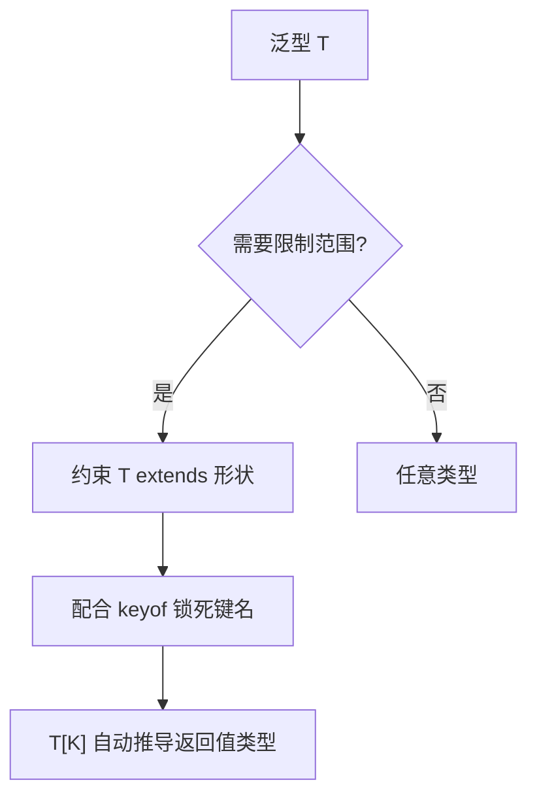

# 泛型与约束与 keyof

## 零、一句话定位

- **泛型（Generics）**：让函数 / 类 / 接口"参数化类型"，做到"类型也能当参数传"。
- **约束（constraint，`extends`）**：给泛型加"门槛"，限制它能接受的类型范围。
- **`keyof`**：取一个对象类型的**所有键名组成的联合类型（union）**。

> 英文全称：**Generics = 泛型**；**constraint = 约束**；**union type = 联合类型**；**index type = 索引类型**。

## 一、生活化类比

- 泛型像**模具**：你塞进什么材料（类型 `T`），产出的产品就是那种材料做的——不用为每种材料开一条生产线。
- 约束 `extends` 像**机器只收合格原材料**：不是啥都让进，必须符合某个规格。
- `keyof` 像**拿出对象的钥匙串**：得到"所有钥匙名（键）"的清单，用来保证"按钥匙取东西"不会拿错。

```ts
// 泛型：返回啥类型，就得到啥类型
function identity<T>(v: T): T { return v }

// 约束：T 必须有 length 属性
function logLen<T extends { length: number }>(v: T): number { return v.length }

// keyof：K 只能是 obj 的键
function getProp<T, K extends keyof T>(obj: T, key: K): T[K] {
    return obj[key];
}
```

## 二、为什么需要约束

没有约束时，`T` 是"任意类型"，你不能在它身上调用任何具体方法（TS 不知道它有没有）。`extends` 告诉 TS："放心，`T` 至少有这些东西"，于是你能安全访问 `v.length`。

## 三、keyof + 泛型 = 类型安全的取值

`K extends keyof T` 保证 `key` 一定是 `obj` 真实存在的键；返回值类型 `T[K]` 自动跟随"这个键对应的值类型"。这是 TS 里做"类型安全 getter"的标准写法。

## 四、要点图解



---

> 写给初学者：每个概念都从"为什么需要它"开始讲，配合通俗比喻和完整可运行代码。

---

## 为什么需要泛型？

```typescript
// ❌ 用 any——丢失类型信息
function identity(value: any): any {
    return value;
}
const result = identity("hello");  // result 是 any，不是 string

// ❌ 为每种类型写一个函数——重复
function identityString(value: string): string { return value; }
function identityNumber(value: number): number { return value; }

// ✅ 泛型——一个函数搞定所有类型，且保留类型信息
function identity<T>(value: T): T {
    return value;
}
const str = identity("hello");  // T = string，返回值类型是 string
const num = identity(42);       // T = number
str.toUpperCase();              // ✅ TypeScript 知道 str 是 string
num.toFixed(2);                 // ✅ TypeScript 知道 num 是 number
```

**泛型就是"类型参数"——调用时才确定是什么类型，但确定后 TypeScript 就记住了。**

> **通俗比喻**：泛型就像快递柜的"万能格口"——不管放进去的是包裹、文件还是外卖，取出来的时候系统都记得你放的是什么，给你对应的处理方式。而 `any` 就是一个"失忆格口"——放进去是啥取出来就忘了。

---

## 泛型函数

```typescript
// 返回数组的第一个元素
function getFirst<T>(arr: T[]): T | undefined {
    return arr[0];
}

const firstNum = getFirst([1, 2, 3]);        // T = number
const firstStr = getFirst(["a", "b", "c"]);  // T = string

// 手动指定类型参数（一般不需要，TS 能自动推断）
const first = getFirst<number>([1, 2, 3]);

// 多个类型参数
function makePair<K, V>(key: K, value: V): [K, V] {
    return [key, value];
}

const pair1 = makePair("name", "张三");      // K=string, V=string
const pair2 = makePair("age", 25);           // K=string, V=number
```

---

## 泛型约束（extends）

泛型默认"什么类型都行"，但有时候你需要限制：

```typescript
interface HasLength { length: number; }

function getLength<T extends HasLength>(value: T): number {
    return value.length;       // ✅ TS 知道 T 一定有 length
}

getLength("hello");            // ✅ string 有 length
getLength([1, 2, 3]);          // ✅ 数组有 length
// getLength(42);              // ❌ number 没有 length

// keyof 约束
function getProperty<T, K extends keyof T>(obj: T, key: K): T[K] {
    return obj[key];
}

const user = { name: "张三", age: 25 };
getProperty(user, "name");     // ✅ 返回 string
getProperty(user, "age");      // ✅ 返回 number
// getProperty(user, "email"); // ❌ user 没有 email 属性
```

> **通俗比喻**：泛型约束就像餐厅的着装要求——"商务休闲装"泛型约束了 T 必须是某种风格，但具体穿衬衫还是西装由你决定。

---

## 泛型接口和泛型类型

```typescript
// 泛型接口
interface ApiResponse<T> {
    code: number;
    message: string;
    data: T;
}

interface User { name: string; age: number; }

// data 是 User
const userResponse: ApiResponse<User> = {
    code: 200,
    message: "成功",
    data: { name: "张三", age: 25 },
};

// data 是 string[]
const listResponse: ApiResponse<string[]> = {
    code: 200,
    message: "成功",
    data: ["张三", "李四"],
};

// 泛型类型别名
type ApiResult<T> = {
    success: boolean;
    data: T;
    error?: string;
};
```

---

## 泛型的实际应用场景

```typescript
// 场景 1：通用的 API 分页响应
interface PaginatedResponse<T> {
    total: number;
    page: number;
    pageSize: number;
    items: T[];
}

type UserListResponse = PaginatedResponse<User>;

// 场景 2：通用的状态管理
interface State<T> {
    value: T;
    loading: boolean;
    error: string | null;
}

// 场景 3：通用的过滤函数
function myFilter<T>(arr: T[], predicate: (item: T) => boolean): T[] {
    return arr.filter(predicate);
}

const numbers = [1, 2, 3, 4, 5, 6];
const evenNumbers = myFilter(numbers, (n) => n % 2 === 0);  // [2, 4, 6]
```

---

## 速查表

| 概念 | 一句话解释 | 关键代码 |
|------|---------|---------|
| 泛型 | 类型参数，调用时才确定类型 | `function f<T>(x: T): T` |
| 泛型约束 | 限制泛型的范围 | `<T extends { length: number }>` |
| `keyof` | 获取对象所有 key 的联合类型 | `keyof User` |
| 泛型接口 | 接口带类型参数 | `interface Box<T> { value: T }` |

---

## 相关链接

- 目录：[[00-TypeScript]]
- 上一篇：[[01-interface与type区别]]
- 下一篇：[[04-函数类型与重载]]

---
→ [[技术学习清单#TypeScript 基础]]

## 相关链接

- 📋 目录：[[00-TypeScript]]
- 📚 学习清单：[[八股文学习清单#十一、React-TS-JS]]
- 🔗 [[01-interface与type区别|interface 与 type]] — 形状声明的基础
- 🔗 [[04-any与unknown与never与void|顶部类型与底部类型]] — 约束里的边界情况
