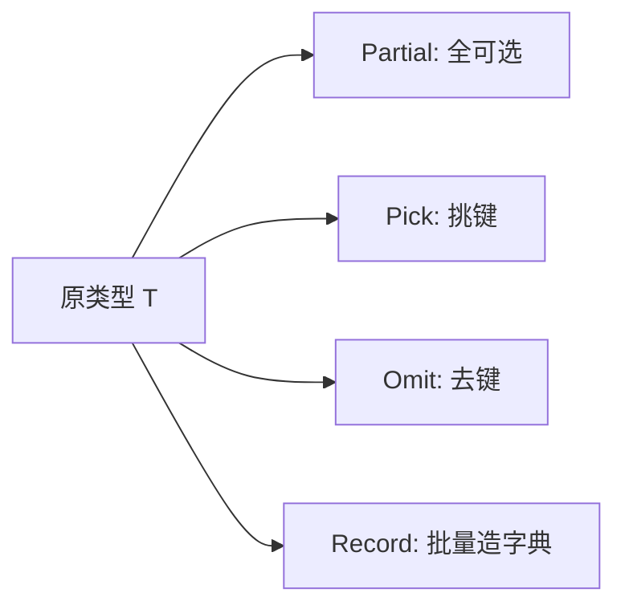

# 内置工具类型（Utility Types）

## 零、一句话定位

TS 内置了一批"基于已有类型，批量造出变体"的工具类型。它们本质都是**泛型 + 映射类型（mapped types）**的语法糖，记住高频的几个即可。

> 英文全称：**Utility Types = 工具类型**；**Mapped Types = 映射类型**；**modifier = 修饰符**（`?` 可选、`readonly` 只读）。

## 一、高频四个（最爱问）

| 工具类型 | 作用 | 类比 |
| --- | --- | --- |
| `Partial<T>` | 把 T 的所有属性变成**可选** `?` | 把"必填表"改成"选填表" |
| `Pick<T, K>` | 从 T 里**挑出**部分键 K | 从整套乐高里只挑几块 |
| `Omit<T, K>` | 从 T 里**去掉**部分键 K | 从整套乐高里拿走几块 |
| `Record<K, V>` | 构造"键为 K、值为 V"的对象类型 | 批量生成统一格式的字典 |

```ts
interface User { id: number; name: string; age: number }

type UserPatch = Partial<User>;        // { id?: number; name?: string; age?: number }
type UserPreview = Pick<User, "id" | "name">;   // { id: number; name: string }
type NoAge = Omit<User, "age">;        // { id: number; name: string }
type Dict = Record<string, number>;    // { [k: string]: number }
```

## 二、进阶常用

- `Required<T>`：所有属性变**必填**（去掉 `?`）。
- `Readonly<T>`：所有属性变**只读**。
- `ReturnType<F>`：取函数类型 F 的**返回值类型**。
- `Parameters<F>`：取函数类型 F 的**参数类型元组**。
- `Exclude<U, K>` / `Extract<U, K>`：从联合里排除 / 提取。

## 三、怎么答

先说"它们是基于映射类型造变体的语法糖"，然后举例 `Partial / Pick / Omit / Record` 四个最常用的，能现场写出 `Partial` 的简化实现加分：

```ts
type MyPartial<T> = { [K in keyof T]?: T[K] };
```

## 四、要点图解



## 相关链接

- 📋 目录：[[00-TypeScript]]
- 📚 学习清单：[[八股文学习清单#十一、React-TS-JS]]
- 🔗 [[02-泛型与约束与keyof|泛型与约束]] — 工具类型的底层机制
- 🔗 [[05-类型守卫|类型守卫]] — 运行期收窄的互补手段
