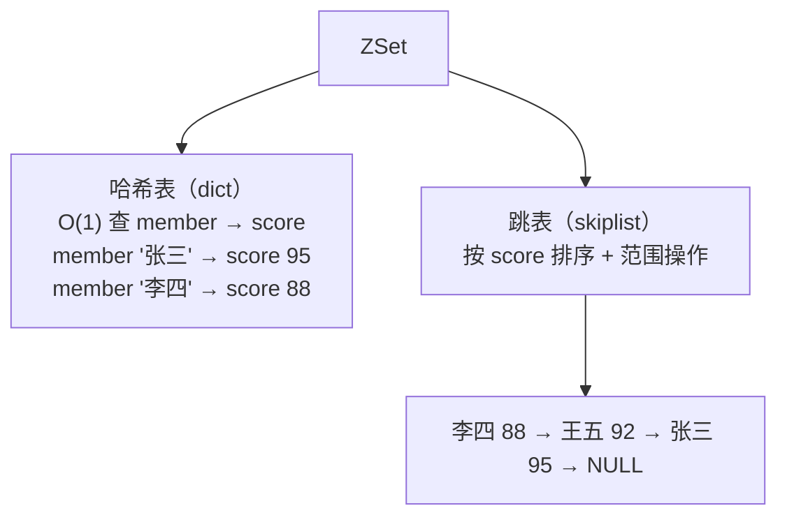
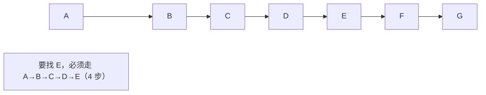
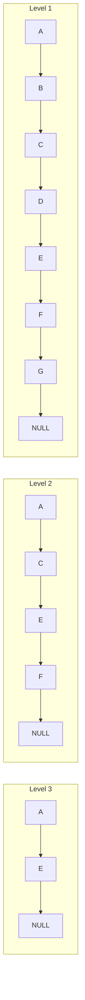
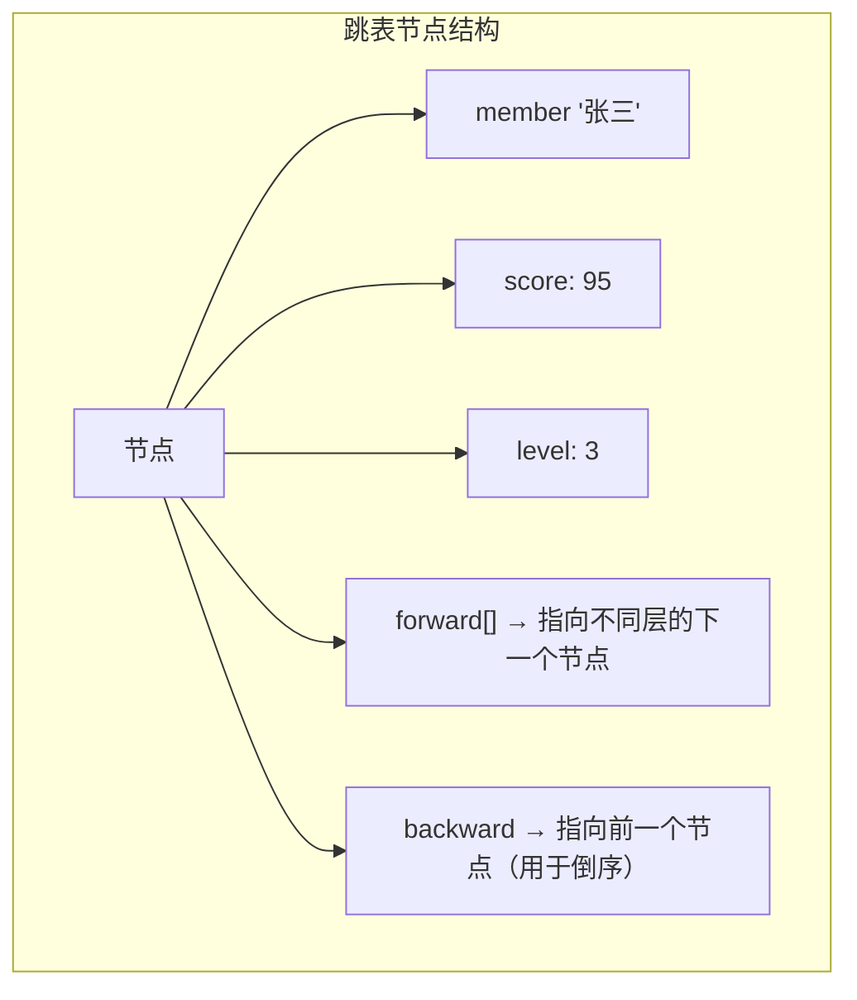

# ZSet 底层：跳表原理，为什么不用红黑树

## 一句话总结

> **ZSet 用跳表 + 哈希表双架构——跳表管排序（O(logN) 插入/范围查询），哈希表管快速查分（O(1) 取 score）。选跳表不选红黑树，因为跳表实现简单、范围遍历友好、并发好加锁。**

---

## 一、ZSet 的整体架构

ZSet 内部同时维护两个数据结构：



**为什么需要两个？**

| 操作 | 只用哈希表 | 只用跳表 |
| ------ | ----------- | --------- |
| ZSCORE key member | O(1) ✅ | O(logN) ❌ |
| ZRANGE 排名 | 哈希表无序 ❌ | O(logN) 遍历 ✅ |
| ZRANK 查排名 | 不知道排第几 ❌ | O(logN) 可以 ✅ |
| ZRANGEBYSCORE 范围查 | 不知道顺序 ❌ | O(logN) ✅ |

**两个结合起来：哈希表提供 O(1) 精确查询，跳表提供有序 + 范围查询。**

---

## 二、跳表（Skip List）原理

### 🌰 想象一个"多层地铁"

普通链表是"一条线走到底"——要找第 5 个元素，必须从第 1 个开始走。



跳表是"多层快速通道"。



**找 E 的过程：**
1. Level 3 从 A 出发："E 比我大还是小？" → 往前走 → 找到 E ✅
2. 一次跳跃，不用从 A→B→C→D→E

**如果找 D：**
1. Level 3：A → E（E 太大了，D < E，降层）
2. Level 2：从 A → C（D > C），C → E（又大了，降层）
3. Level 1：从 C → D ✅

**3 步找到，不用 4 步。**

### 跳表的核心结构



**每个节点的"层数"是随机生成的。** 这是跳表的关键特性——通过概率保证 O(logN) 的平均复杂度。

### 随机层数

```text
每个新插入的节点：
  - Level 1：100% 有
  - Level 2：50% 概率有
  - Level 3：25% 概率有
  - Level 4：12.5% 概率有
  - Level N：(1/2)^(N-1) 概率有
```

**通过概率保证：每个节点平均只有 2 层，但少量节点有高层，形成"快速通道"。**

---

## 三、为什么用跳表不用红黑树？

### 红黑树有什么问题？

| 维度 | 跳表 | 红黑树 |
| ------ | ------ | -------- |
| **实现复杂度** | 🟢 简单（几十行 C）| 🔴 复杂（左旋右旋变色，几百行）|
| **范围遍历** | 🟢 天然有序链表，直接遍历 | 🔴 中序遍历需要递归/栈 |
| **区间查询** | 🟢 找到起点后顺着 level1 走 | 🔴 需要从根节点一步步找边界 |
| **ZRANK** | 🟢 节点维护 span（跨度），直接算排名 | ❌ 需要遍历左子树统计节点数（慢）|
| **并发加锁** | 🟢 分段加锁容易（链表结构）| 🔴 树结构加锁复杂 |
| **内存占用** | 🟢 平均每个节点 2 个指针 | 🟢 也是 2-3 个指针（近似）|
| **O(logN) 复杂度** | 🟢 平均 O(logN) | 🟢 严格 O(logN) |
| **最坏情况** | ❌ 理论上 O(N)（概率极低）| 🟢 严格 O(logN) |

### 最关键的三个理由

**1. 范围查询（ZRANGE / ZRANGEBYSCORE）是跳表的天然优势**

```redis
ZRANGE leaderboard 0 9 WITHSCORES
-- 跳表：找到头节点后顺着 Level 1 走 10 步 → O(logN + M)
-- 红黑树：中序遍历的前 10 个需要递归，实现复杂
```

**跳表的 Level 1 本身就是个有序链表。找 100 条数据就是走 100 步，没有多余开销。**

**2. ZRANK 的实现——跳表的 span 技巧**

```text
ZRANK leaderboard "张三"
-- 查询张三的排名

跳表每个节点额外维护了一个 span（跨度）：
  表示当前节点在某一层到下一个节点之间"跳过了多少个节点"

从顶层开始搜索时，累加经过的 span：
  就能直接算出排名 → O(logN)
```

**红黑树要实现 ZRANK，需要在每个节点维护左子树的节点数，实现起来一样能做到 O(logN)，但维护起来更麻烦。**

**3. 实现简单，不容易出 bug**

```text
跳表核心操作（插入/删除/查找）：约 50 行 C 代码
红黑树核心操作：约 300 行 C 代码 + 大量调试

Redis 的代码质量要求极高（生产环境零 bug），
选跳表这种"简单且足够好"的方案是务实的选择。
```

**不是红黑树做不到，是跳表更简单，而简单意味着更少的 bug。**

---

## 四、跳表 vs 红黑树 vs B+ 树

| 维度 | 跳表 | 红黑树 | B+ 树 |
| ------ | ------ | -------- | ------- |
| 单点查询 | O(logN) | O(logN) | O(logN) |
| 范围查询 | 🟢 O(logN + M) | 🟡 O(logN + M) 但实现复杂 | 🟢 O(logN + M) |
| 插入 | O(logN) | O(logN) | O(logN) |
| 实现复杂度 | 🟢 简单 | 🔴 难 | 🔴 中等 |
| 磁盘友好 | ❌ 否 | ❌ 否 | 🟢 是 |
| 内存占用 | 🟢 平均 ~4 指针/节点 | 🟢 ~3 指针/节点 | 🔴 更大 |

**Redis 选跳表的原因总结：**
- Redis 数据在内存，不需要考虑磁盘（所以不用 B+ 树）
- 跳表和红黑树 O(logN) 一样，但跳表实现简单、范围查询方便、ZRANK 支持好
- 内存里跳表的指针操作比红黑树的旋转操作更容易理解

---

## 五、一个 ZADD 命令的完整流程

```redis
ZADD leaderboard 95 "张三"
```

```text
ZADD 执行时：
  │
  ├→ 1. 哈希表查 "张三" 是否存在
  │     ├→ 存在 → 更新 score（需要先删除旧的跳表节点）
  │     └→ 不存在 → 新增
  │
  ├→ 2. 生成随机层数（比如 level=3）
  │
  ├→ 3. 在跳表里找到插入位置
  │     └─ 从最高层开始找，每层记录前驱节点
  │
  ├→ 4. 创建跳表节点
  │     └─ member=张三, score=95, level=3
  │
  ├→ 5. 在跳表中插入节点
  │     └─ 更新各层的前驱/后继指针
  │
  ├→ 6. 更新各层节点的 span（排名就靠这个）
  │
  ├→ 7. 哈希表插入
  │     └─ "张三" → score=95
  │
  └→ 8. 返回 1（新增成功）
```

---

## 记忆口诀

> **ZSet 双架构：哈希表 O(1) 查分，跳表 O(logN) 排序。**
> **跳表像多层地铁——低层每站都停，高层只停大站，加速搜索。**
> **不用红黑树的原因：跳表更简单、范围遍历更方便、ZRANK 用 span 算排名。**
> **不是红黑树不好，是在内存场景里跳表简单够用——简单 = 更少的 bug。**


## 
> ▶ 对应实操：[[02-缓存穿透击穿雪崩|02-缓存穿透击穿雪崩]]

相关链接

- 📋 目录：[[00-Redis]]
- 📚 学习清单：[[八股文学习清单]]
- 🔗 [[01-五种数据结构|五种数据结构]] — ZSet 是五种基本结构之一
- 🔗 [[八股文笔记/MySQL/01-MySQL索引B+树与聚簇非聚簇|MySQL B+树索引]] — B+树 vs 跳表：两种有序数据结构的设计哲学
- 🔗 [[八股文笔记/MySQL/06-B+树数据结构演进|B+树数据结构演进]] — 从平衡树到跳表的数据结构演进
- 🔗 [[八股文笔记/设计模式/02-工厂模式与策略模式对比|策略模式]] — 跳表是"空间换时间"策略的典型应用
