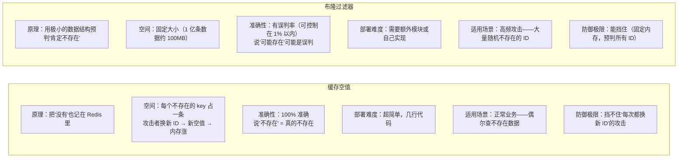

## 第一章：缓存穿透——查一个根本不存在的东西

### 1.1 场景还原：什么人会来查不存在的商品？

```text
正常用户搜"iPhone 16"→ Redis 有 → 返回。
正常用户搜"华为 Mate 80"→ Redis 没有 → 查 MySQL → MySQL 有 → 写 Redis → 返回。

攻击者写了个脚本：
  for i in range(1, 100000):
      requests.get(f"http://shop.com/product/{i}")

你只有 1000 个商品（id=1~1000）。
攻击者从 id=-1, -2, -3... 到 id=99999 全部查一遍。

每次请求的流程：
  → Redis：key 不存在（你没缓存过 id=-1 的商品）
  → MySQL：也不存在（你根本没这个商品）
  → 返回空
  → 攻击者换 id=-2 再来一遍

结果：100000 个请求 × 每次走完 Redis + MySQL = 数据库被活活打死。

更可怕的是——这是故意的。
攻击者不是为了真的买东西，就是为了搞垮你的数据库。
```

**一句话定义**：缓存穿透 = 查询一个缓存和数据库中**都不存在**的数据，每次请求都绕过缓存直接打到数据库。

### 1.2 用生活类比记一辈子

```text
你开了一家便利店，有 100 种商品。

正常人进门问："有可乐吗？" → 你去货架看一眼 → 有 → 给他。         ← 正常缓存命中
正常人进门问："有雪碧吗？" → 货架没有 → 你去仓库拿 → 拿来摆货架 → 给他。← 正常缓存未命中
恶意的人进门问："有大象吗？" → 货架没有 → 去仓库找 → 仓库也没有 → 空手回来 → "没有"。
恶意的人继续问："有鲸鱼吗？" "有坦克吗？" "有火箭吗？"……
  你每次都：跑货架看一眼 → 跑仓库看一眼 → 空手回来。
  仓库管理员（数据库）被折腾疯了——你问的都是根本不存在的玩意！

缓存穿透就是"老有人问你根本不存在的货"。
```

### 1.3 解法一：缓存空值——"没有就是没有，我记下来"

**核心思路**：查不到的东西也缓存起来。下次再来问同一个不存在的东西，Redis 直接说"没有"，不用再去数据库问了。

```text
改造后的流程：
═══════════════════════════════════════════════════════════

  请求 id=-1 → Redis：有这个 key → 值是特殊标记 "NULL"
             → 读到 NULL → 直接返回"商品不存在" ✅（不再查 MySQL！）

  关键细节：
    ① 存什么值？→ 空字符串 ""，或者特殊标记 "__NULL__"
    ② 设多长过期时间？→ 1~5 分钟（短！）
       为什么不设长？→ 因为这个"不存在"可能是暂时的——
       也许下个小时商品就上架了。设太长会导致真正的数据永远缓存不进来。
    ③ 会不会撑爆 Redis 内存？→ 不会。攻击者可能遍历几万个不存在的 ID，
       但每个空值只占几十字节 × 几万个 = 几 MB，加上短过期时间，能接受。
```

```bash
# Redis 命令演示：缓存空值
# 正常商品（id=100）
SET product:100 '{"name":"iPhone","price":6999}' EX 3600     # 缓存 1 小时

# 不存在的商品（id=99999）——也缓存，但短时间
SET product:99999 "__NULL__" EX 60                           # 只缓存 60 秒
# 下次有人查 id=99999 → Redis 返回 "__NULL__" → 直接返回"商品不存在"
# 60 秒后这个空值自动消失，万一商品后来上架了，60 秒后就能正常缓存真实数据
```

```python
# Python 代码：实现了缓存空值逻辑的查询函数
import json
import redis

r = redis.Redis(host='localhost', port=6379, decode_responses=True)

def get_product(product_id: int) -> dict | None:
    """查商品：缓存穿透保护版"""
    cache_key = f"product:{product_id}"
    
    # ① 查 Redis
    cached = r.get(cache_key)
    
    if cached == "__NULL__":
        # ② Redis 告诉我"这个商品确认不存在"→ 不用查 MySQL
        return None
    
    if cached is not None:
        # ③ Redis 有真实数据 → 返回
        return json.loads(cached)
    
    # ④ Redis 完全没这个 key → 查 MySQL
    product = db.query("SELECT * FROM products WHERE id = %s", product_id)
    
    if product is None:
        # ⑤ MySQL 也没有 → 缓存空值！下次就不查 MySQL 了
        r.setex(cache_key, 60, "__NULL__")   # 空值只存 60 秒
        return None
    
    # ⑥ MySQL 有 → 正常缓存
    r.setex(cache_key, 3600, json.dumps(product))
    return product
```

**缓存空值的优缺点**：

| 优点 | 缺点 |
| :--- | :--- |
| 实现简单——几行代码的事 | 消耗一点点 Redis 内存（但短过期 + 数据量小，通常可忽略） |
| 立即生效，不需要额外组件 | 如果攻击者**每次换一个新 ID**（id=-1, -2, -3...），缓存空值也只能挡第二次，第一次还是要查 DB |
| 适合绝大多数业务场景 | 无法防御"每次都用不同的不存在 ID"的攻击方式 |

> ⚠️ 缓存空值的致命局限性：攻击者如果聪明一点——每次生成**随机的不存在 ID**——那缓存空值就废了。因为每次都是一个新 ID，Redis 永远没缓存过它，每次都要查 MySQL。这就是为什么还需要布隆过滤器。

### 1.4 解法二：布隆过滤器——"这玩意肯定不存在，别找了"

**核心思路**：在 Redis 前面再加一道安检门。这扇门能判断：你要查的东西"**肯定不存在**"还是"**可能存在**"。如果安检门说"肯定不存在"，门都不用进——直接返回。

```text
改造后的架构：
═══════════════════════════════════════════════════════════

  请求 id=-1 → 布隆过滤器 → "这个 ID 肯定不存在！" → 直接返回 404 ✅
                                                        （Redis 和 MySQL 都没碰！）

  请求 id=100 → 布隆过滤器 → "这个 ID 可能存在……" → 正常走缓存流程


布隆过滤器的核心能力（记住这两条就够了）：

  ① 告诉你"肯定不存在" → 100% 准确，不会错
     过滤器说"不存在"→ 那真的不存在，不用再去查了。

  ② 告诉你"可能存在" → 不是 100% 准确，有概率误判
     过滤器说"可能有"→ 实际可能没有（极小概率误判），但无所谓——
     大不了多查一次 Redis/MySQL，不致命。
```

#### 1.4.1 布隆过滤器到底怎么判断"可能存在"和"肯定不存在"？

这是可能会进一步追问的。用最俗的方式讲清楚：

```text
布隆过滤器 = 一个很长的 01 数组 + 好几个哈希函数

类比——图书馆的"书名速查卡片"：

  假设图书馆有 10 万本书。你不想建一个完整的书名数据库。
  你准备了一张巨大的格子纸——10 万个格子，全部初始为 0。

  ┌───┬───┬───┬───┬───┬───┬───┬───┬───┬───┬───┬───┐
  │ 0 │ 0 │ 0 │ 0 │ 0 │ 0 │ 0 │ 0 │ 0 │ 0 │ 0 │ 0 │ ... 10万个格子
  └───┴───┴───┴───┴───┴───┴───┴───┴───┴───┴───┴───┘

  每上一本新书，你用 3 支不同颜色的荧光笔在书名上画一下，
  每支笔告诉你在格子纸的第几个格子上涂色：

    新书《Python 入门》→ 红笔说"第 42 格"、蓝笔说"第 7777 格"、绿笔说"第 89999 格"
    → 把这三个格子涂成 1

  ┌───┬───┬───┬───┬───┬───┬───┬───┬───┬───┬───┬───┐
  │ 0 │ 0 │ 1 │ 0 │ 0 │ 0 │ 0 │...│ 1 │ 0 │ 0 │ 1 │ ...  
  └───┴───┴───┴───┴───┴───┴───┴───┴───┴───┴───┴───┘
         ↑42              ↑7777          ↑89999


  有人来问"有没有《母猪的产后护理》？"
  → 你用同样的 3 支笔在这本书名上画
  → 红笔说"第 42 格"→ 格子是 1 ✅
  → 蓝笔说"第 10000 格"→ 格子是 0 ❌
  → 有一格是 0 → "这本书肯定不存在！"

  核心逻辑：如果 3 格里有任何一格是 0 → 肯定不存在（100% 准确）
           如果 3 格全是 1 → 可能存在（但可能是别的书涂的，所以只是"可能"）


为什么 3 格全是 1 也可能是误判？

  新书《Java 入门》→ 红笔说"第 42 格"、蓝笔说"第 10000 格"、绿笔说"第 50000 格"
  → 第 42 格已经被《Python 入门》的红笔涂过了
  → 第 10000 格已经被《C++ 入门》的绿笔涂过了
  → 第 50000 格已经被《Rust 入门》的蓝笔涂过了
  → 三格全是 1！但《Java 入门》根本没在图书馆！

  所以布隆过滤器说"可能存在"时——可能真的存在，也可能是别的书恰好涂满了这三格。
  但布隆过滤器说"肯定不存在"时——至少有一格是 0，说明**从没人涂过这个组合**，100% 不存在。
```

#### 1.4.2 用 Python 实现一个最简单的布隆过滤器

```python
"""
一个教学用的布隆过滤器（不要用于生产——只是为了理解原理）

布隆过滤器 = 一个 bit 数组 + 多个哈希函数
"""

import hashlib


class SimpleBloomFilter:
    """极简版布隆过滤器——帮助理解原理"""

    def __init__(self, size: int = 1000000, hash_count: int = 3):
        """
        size: bit 数组大小（越大越省内存？不——越大越精确，越小越容易误判）
        hash_count: 哈希函数个数（越多越精确，但越慢）
        """
        self.size = size
        self.hash_count = hash_count
        # 用一个 int 数组来模拟 bit 数组（Python 没有原生 bit 数组）
        # 每个 int 存 32 个 bit
        self.bit_array = [0] * ((size // 32) + 1)

    def _get_hashes(self, item: str) -> list[int]:
        """对同一个 item 算出多个不同的哈希值（模拟多支荧光笔）"""
        positions = []
        for i in range(self.hash_count):
            # 每次在 item 后面拼一个数字，让每次算出来的哈希不一样
            # 就像同一本用不同的笔在不同的角度画——出来的颜色（位置）不同
            data = f"{item}_{i}".encode('utf-8')
            hash_value = int(hashlib.md5(data).hexdigest(), 16)
            positions.append(hash_value % self.size)
        return positions

    def add(self, item: str):
        """添加一个元素——把对应的 bit 全设为 1"""
        for pos in self._get_hashes(item):
            # 找到 pos 在第几个 int 的第几个 bit
            byte_index = pos // 32
            bit_offset = pos % 32
            # 把这个 bit 设成 1（位运算）
            self.bit_array[byte_index] |= (1 << bit_offset)

    def might_contain(self, item: str) -> bool:
        """判断元素是否可能存在"""
        for pos in self._get_hashes(item):
            byte_index = pos // 32
            bit_offset = pos % 32
            # 检查这个 bit 是不是 1
            if not (self.bit_array[byte_index] & (1 << bit_offset)):
                return False  # 只要有一个 bit 是 0 → 肯定不存在
        return True  # 所有 bit 都是 1 → 可能存在


# ===== 实际使用 =====
bf = SimpleBloomFilter(size=100000, hash_count=3)

# 系统启动时：把所有存在的商品 ID 加入布隆过滤器
existing_ids = [1, 2, 3, 100, 200, 500]  # 假设数据库里有这些
for pid in existing_ids:
    bf.add(f"product:{pid}")

# 查一个存在的商品
print(bf.might_contain("product:100"))   # True（可能存在 → 放行，走正常缓存流程）

# 查一个不存在的商品
print(bf.might_contain("product:99999")) # False（肯定不存在 → 直接返回 404！）

# 查一个缓存空值都防不住的"随机不存在 ID"
print(bf.might_contain("product:-1"))    # False（布隆过滤器拦住 → 不用查 Redis 也不用查 MySQL！）
```

#### 1.4.3 布隆过滤器的四个关键参数——可能被追问

```text
布隆过滤器有四个参数，互相制约。你不需要背公式，但要知道这个关系：

  ① m = bit 数组长度（越长 → 越精确 → 越占内存）
  ② k = 哈希函数个数（越多 → 越精确 → 计算越慢）
  ③ n = 已经存了多少个元素
  ④ p = 误判率（说"可能存在"但实际不存在的概率）

  关系：
    n 越大（存的东西越多）→ p 越高（格子被涂得越满，越容易全 1）
    m 越大（数组越长）→ p 越低（格子多，不容易全被涂满）
    k 太多 → p 反而变高（每个元素涂太多格子，格子更快被涂满）
    k 太少 → p 也高（涂太少格子，容易碰巧全 1）

  最优 k ≈ 0.7 × (m / n)

  给一组具体数据感受一下：
    1 亿条数据（n = 100,000,000），目标误判率 1%（p = 0.01）
    → m ≈ 9.6 亿（bit）= 约 115MB
    → k ≈ 7 个哈希函数
    → 115MB 在 Redis 里缓存空值可能要几个 GB，布隆只要 115MB

  这就是布隆过滤器的核心优势——用极少的内存就能拦截海量不存在的数据。
```

#### 1.4.4 布隆过滤器怎么用——工程上两种方式

```text
方式一：Redis 内置的布隆过滤器模块（推荐）
─────────────────────────────────────────
  Redis 4.0+ 支持安装 RedisBloom 模块，原生支持布隆过滤器。

    # 创建一个布隆过滤器：允许 10 万条数据，误判率 1%
    BF.RESERVE product_filter 0.01 100000
    
    # 添加
    BF.ADD product_filter "product:1"
    BF.MADD product_filter "product:2" "product:3"  # 批量添加
    
    # 判断
    BF.EXISTS product_filter "product:99999"  # → 0（肯定不存在）
    BF.EXISTS product_filter "product:1"      # → 1（可能存在）

  优点：Redis 原生，高效，不需要额外服务
  缺点：需要安装 RedisBloom 模块（不是所有 Redis 都带）


方式二：自己实现布隆过滤器并定时重建（不用额外模块）
─────────────────────────────────────────
  思路：系统启动时从 MySQL 读出所有 ID → 构建布隆过滤器 → 存到 Redis 的 String 里
       定期（如每天凌晨）重建一次。

  核心细节——布隆过滤器不能删除元素：
    你删了一个商品，不能从布隆过滤器里"取消"它——因为它的格子可能和其他商品共享。
    所以只能**重建**——重新从 MySQL 读取所有现有 ID，重新构建一个新的布隆过滤器。
    
  这也是为什么布隆过滤器不适合"频繁增删"的场景——
  商品上下架太频繁 → 布隆过滤器跟不上 → 误判率会越来越高。
```

### 1.5 缓存穿透两种解法对比——直接甩表



---


## 相关链接

- 📋 目录：[[00-Redis]]
- 📚 学习清单：[[八股文学习清单]]
- 🔗 [[04-缓存与数据库双写一致性|缓存与数据库双写一致性]] — 缓存穿透是双写一致性问题的具体表现
- 🔗 [[08-缓存击穿|缓存击穿]] — 穿透vs击穿vs雪崩：三种缓存失效模式
- 🔗 [[09-缓存雪崩|缓存雪崩]] — 三者共同的防御策略
- 🔗 [[12-布隆过滤器原理与应用|布隆过滤器原理与应用]] — 布隆过滤器是防穿透的利器
- 🔗 [[八股文笔记/MySQL/36-缓存与数据库双写一致性|缓存与数据库双写一致性（MySQL视角）]] — 跨模块对照

