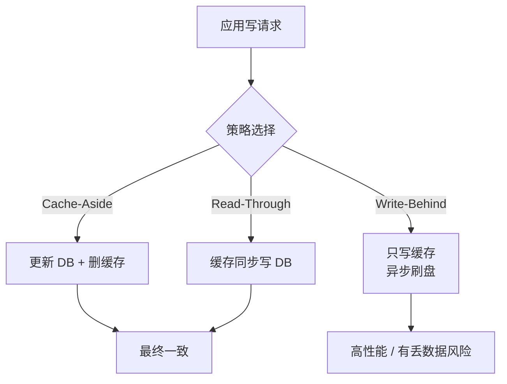
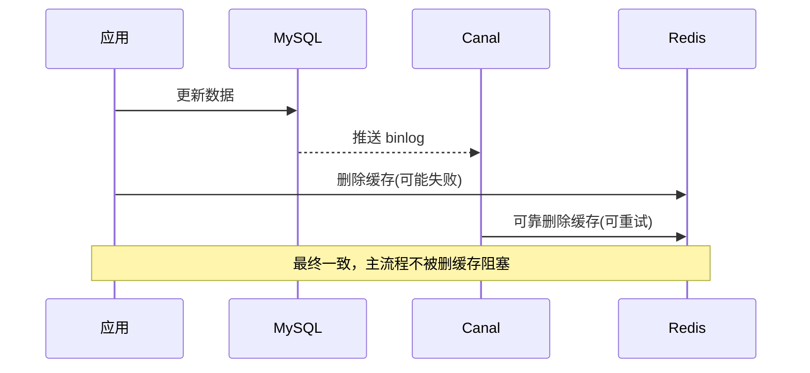

# 缓存与数据库双写一致性

## 一句话总结

> **缓存和数据库是"两份数据"，只要同时写就会发生"哪个先写、写失败了怎么办"的灵魂拷问。参考答案：先更新数据库，再删缓存（Cache-Aside + 延迟双删），实在要强一致就上 binlog 订阅（Canal）。**

---

## 一、生活化类比：便利店的"价签"和"账本"

想象你开便利店：

- **数据库 = 后台账本**：权威、慢、但绝不撒谎。
- **缓存 = 货架上的价签**：快、显眼，但和账本可能不同步。

某天可乐涨价了，你要改价：

```text
方案 A（先改价签再改账本）：
  你先把货架价签改成 5 元 → 然后去后台改账本
  突然停电了！账本没改，价签却改了
  → 顾客按 5 元买走，账本还是 3 元 → 亏到外婆家（数据不一致）

方案 B（先改账本再改价签）：
  你先去后台把账本改成 5 元 → 回来改价签
  突然停电了！价签还是 3 元，但账本是 5 元
  → 顾客按 3 元买走，账本记 5 元 → 也是错，但概率低（改价签比改账本快得多）
```

**结论**：改账本（数据库）这步慢且权威，一定要先改；改价签（缓存）这步快，放最后，最差情况也只是"价签暂时旧了"，下次刷新就好。**这就是"先更新 DB，再删除缓存"的朴素逻辑。**

---

## 二、三种经典读写策略

### 2.1 Cache-Aside（旁路缓存）—— 最常用

```text
读：
  ┌─ 查缓存 → 命中 → 返回
  └─ 未命中 → 查 DB → 写入缓存 → 返回

写：
  ┌─ 更新 DB
  └─ 删除缓存（不是更新缓存！）
```

> **为什么是"删"不是"更新"缓存？** 因为更新缓存可能算错（比如要算 `stock = stock - 1`，并发下算成脏值），而"删"最省事——下次读时再懒加载，永远以 DB 为准。

### 2.2 Read/Write Through（通读/通写）

应用只和缓存打交道，缓存自己负责同步 DB。对应用透明，但 Redis 原生不支持，要自己封装一层。

### 2.3 Write Behind（写回 / 异步写）

只写缓存，由缓存异步批量刷盘。**性能炸裂但风险高**——缓存挂了数据就丢了，一般只有特殊场景（如计数）才用。



---

## 三、先删缓存 vs 先更新数据库（经典坑）

很多人会问：能不能"先删缓存，再更新数据库"？

```text
线程1：删缓存
线程2：读缓存(空) → 读 DB(旧值) → 写回缓存(旧值)
线程1：更新 DB(新值)
结果：缓存是旧值，DB 是新值 → 永久不一致！
```

而"先更新 DB，再删缓存"的风险窗口：

```text
线程1：更新 DB(新)
线程2：读缓存(旧) → 返回旧值（此时还没删）
线程1：删缓存
结果：只有线程2这一次读到旧值，删完之后一切正常 → 影响极小
```

**结论**：先更新 DB 再删缓存，不一致窗口极小，是业界默认选择。

---

## 四、删缓存失败了怎么办？

如果"更新 DB 成功，但删缓存的网络请求挂了"，缓存又变成脏数据。两个补丁：

### 4.1 延迟双删（Delay Double Delete）

```text
更新 DB → 删缓存 → sleep(500ms) → 再删一次缓存
```

> 等"可能读到旧值并写回缓存"的并发请求都落地后，再删一次，把脏缓存清掉。简单粗暴，但 sleep 不优雅。

### 4.2 binlog 订阅（Canal）—— 生产级方案

```text
MySQL 产生 binlog → Canal 伪装成 slave 订阅 binlog
  → 解析出"哪行被改了" → 发消息 → 消费者删除对应缓存
```

> 这是大厂主流做法：**写操作和删缓存彻底解耦**，业务代码只管写 DB，缓存一致性由异步管道保证。即使删缓存失败也能重试，不阻塞主流程。



---

## 五、速答模板

| 问法 | 回答 |
| :--- | :--- |
| 怎么保证一致性？ | 默认 Cache-Aside：先更新 DB，再删缓存 |
| 为什么删不是更新？ | 避免并发写缓存算出脏值，删最安全 |
| 先删缓存行不行？ | 不行，会出现"读线程把旧值写回"的永久不一致 |
| 删缓存失败？ | 延迟双删 或 binlog 订阅(Canal) 兜底 |
| 要强一致怎么办？ | 读写都加分布式锁（牺牲性能），或干脆不缓存 |

---

## 相关链接

- 📋 目录：[[00-Redis]]
- 📚 学习清单：[[八股文学习清单]]
- 🔗 [[03-缓存穿透|缓存穿透]] — 缓存与 DB 不一致时的穿透风险
- 🔗 [[08-缓存击穿|缓存击穿]] — 热点 key 失效瞬间的双写压力
- 🔗 [[11-分布式锁SET_NX_EX与Redisson|分布式锁]] — 强一致场景下用锁串行化读写
- 🔗 [[八股文笔记/MySQL/36-缓存与数据库双写一致性|缓存与数据库双写一致性（MySQL视角）]] — 跨模块对照
- 🔗 [[八股文笔记/MySQL/23-redo_log与undo_log与binlog|MySQL日志系统]] — binlog 与 Canal 的关系
