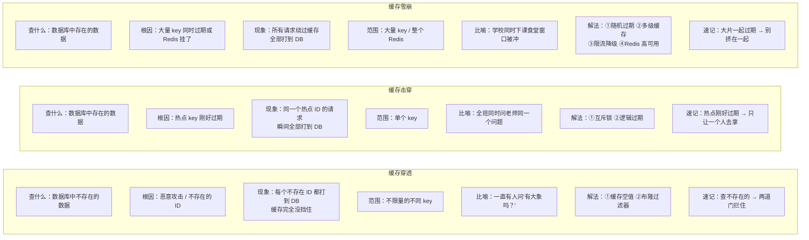

# 缓存穿透击穿雪崩终极对比
## 第四章：三兄弟终极对比 + 连环追问

### 4.1 一张表封神——画这个就够了



### 4.2 连环追问 —— 怎么从"背答案"变成"你在思考"

```text
延伸提问：说说缓存穿透怎么解决？
你：布隆过滤器 + 缓存空值。

延伸提问：布隆过滤器有什么缺点？
你：① 不能删除元素——商品下架后布隆过滤器里还在，只能重建
    ② 有误判率——说"可能存在"时可能是误判
    ③ 需要提前知道数据量——初始化时就要预估数组大小

延伸提问：误判会导致什么？
你：误判说"可能存在"→ 放行去查 Redis → Redis 也没有 → 查 MySQL → MySQL 也没有
    → 这次被穿透了。但这只是"漏网之鱼"——概率很低（1% 以内），
    比其他 99% 的流量被挡住，完全可接受。
    加一层缓存空值兜底——偶尔漏过去的也被短时间缓存住。

延伸提问：为什么布隆过滤器不能删除？
你：因为它多个元素共享 bit。一个格子被 A、B、C 三个元素涂过，
    你不能因为删了 A 就把这个格子清零——那样 B 和 C 也被"误删"了。
    所以只能整个过滤器重建。

延伸提问：缓存击穿用互斥锁有什么风险？
你：① 锁超时——查 MySQL 太慢导致锁自动释放 → 多个请求同时查 MySQL → 互斥失效
    ② 锁竞争——几千个请求同时抢锁，对 Redis 也是额外压力
    ③ 死锁——锁没设超时 + 拿到锁的请求崩了 = 锁永远不释放

延伸提问：那逻辑过期有什么风险？
你：① 数据一致性——返回给用户的可能是几秒前的旧数据
    ② 预热依赖——系统启动时必须把热点数据加载进 Redis，否则第一次还是穿透
    ③ 内存占用——热点 key 物理上永不过期，可能撑大 Redis 内存（需要监控）

延伸提问：缓存雪崩的随机过期时间真的能解决吗？
你：只能说"缓解"——把同时过期变成分散过期。但如果 Redis 本身挂了，
    随机过期也没用（Redis 都没了，谈什么过期）。所以雪崩需要多层防线——
    随机过期 + 本地缓存 + 限流降级 + 高可用集群，一层一层补。

延伸提问：那你觉得本地缓存会有什么问题？
你：① 数据不一致——多台服务器各自的本地缓存更新不同步，
      一台服务器缓存了新数据，另一台还是旧的
    ② 内存占用——每个进程各自维护一份缓存，总内存 = 单份 × 服务器数量
    ③ 冷启动——服务器重启后本地缓存是空的，需要从 Redis/MySQL 重新加载
    所以本地缓存只适合存"变更极少的热点数据"——配置项、首页 Banner 之类。
```

---


## 相关链接

- 📋 目录：[[00-Redis]]
- 📚 学习清单：[[八股文学习清单]]
- 🔗 [[03-缓存穿透|缓存穿透]] — 三兄弟之一：查不存在的数据
- 🔗 [[08-缓存击穿|缓存击穿]] — 三兄弟之二：热点 key 过期
- 🔗 [[09-缓存雪崩|缓存雪崩]] — 三兄弟之三：大量 key 同时失效
- 🔗 [[八股文笔记/分布式-系统设计/08-限流与熔断降级|限流与熔断降级]] — 雪崩防御的最后一道防线

