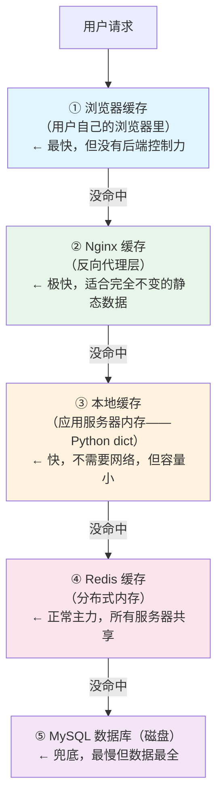

## 第三章：缓存雪崩——不是一条数据，是一片数据全塌了

### 3.1 场景还原：两种雪崩，两大惨剧

```text
═══════════════════════════════════════════════════════════════
雪崩类型一：大量缓存同时过期
═══════════════════════════════════════════════════════════════

  场景：你用定时任务，凌晨 3 点把所有 10 万件商品的缓存刷新了一遍，
       全部设了 1 小时过期。
       
  凌晨 4:00:00 整 → 10 万个 key 同时过期！
  → 凌晨 4:00:01 → 所有请求都发现缓存没了
  → 10 万个请求同时涌向 MySQL
  → 数据库：我是谁我在哪为什么这么多请求？？？
  → 数据库 CPU 100% → 执行超时 → 连锁反应 → 整站崩溃


═══════════════════════════════════════════════════════════════
雪崩类型二：Redis 本身挂了
═══════════════════════════════════════════════════════════════

  场景：Redis 进程 crash / Redis 服务器宕机 / 网络中断
  
  → 所有请求绕过 Redis 直接打向 MySQL
  → 原来 Redis 扛着的 95% 流量全部砸到 MySQL 身上
  → MySQL 平时扛 1000 QPS，现在迎面 20000 QPS
  → 瞬间被打死 → 整个应用瘫痪


类比——和你有关的生活画面：
  类型一 = 学校食堂中午 12:00 同时下课，全校 2 万人冲向 3 个窗口
  类型二 = 食堂突然停电了，所有人涌向校外唯一的小卖部
```

**一句话定义**：缓存雪崩 = 大量缓存同一时间段失效，或 Redis 本身不可用，导致海量请求直接打到数据库。

### 3.2 解法一：随机过期时间——最简单有效的"削峰"

**核心思路**：同一批缓存的过期时间不要设成一样的。在基础时间上随机加减一个偏移量，让过期时间分散开来。

```text
❌ 错误做法——同一批全部设 3600 秒：
  SETEX product:1 3600 "..."
  SETEX product:2 3600 "..."
  SETEX product:3 3600 "..."
  ...
  SETEX product:10000 3600 "..."
  
  → 3600 秒后同时过期 → 雪崩！


✅ 正确做法——每个 key 的过期时间加随机偏移：
  SETEX product:1 3650 "..."    # 3600 + random(0, 600)
  SETEX product:2 3823 "..."    # 3600 + random(0, 600)
  SETEX product:3 3489 "..."    # 3600 + random(0, 600)
  ...
  SETEX product:10000 4105 "..." # 3600 + random(0, 600)
  
  → 过期时间分散在 3600~4200 秒之间
  → 不会同时过期 → 不会同时回源 → 数据库压力被分摊


Python 实现：
═══════════════════════════════════════════════════════════════
  
  import random
  
  base_ttl = 3600           # 基础 1 小时
  random_offset = random.randint(0, 600)  # 随机 0~10 分钟
  actual_ttl = base_ttl + random_offset
  
  r.setex(f"product:{product_id}", actual_ttl, json.dumps(product))
```

> **一句话**：过期时间 = 基础时间 + 随机值。关键不是随机算法多高级，是**不要所有 key 同一秒过期**。

### 3.3 解法二：多级缓存——Redis 挂了还有本地缓存撑一会

**核心思路**：不要把所有鸡蛋放一个篮子里。在应用服务器本地也存一份热点数据，Redis 挂了至少能撑一阵。



```python
"""
多级缓存演示：本地缓存 + Redis + MySQL
"""

import json
import time
import redis

r = redis.Redis(host='localhost', port=6379, decode_responses=True)

# Python 进程内的本地缓存——最简单的 dict 实现
# 生产环境可以用 cachetools、functools.lru_cache 等
local_cache: dict[str, tuple[dict, float]] = {}  # key → (data, expire_at)


def get_product_multi_level(product_id: int) -> dict | None:
    """查商品：本地缓存 → Redis → MySQL 三级回源"""
    cache_key = f"product:{product_id}"

    # ===== 第 1 层：本地缓存（进程内存） =====
    if cache_key in local_cache:
        data, expire_at = local_cache[cache_key]
        if time.time() < expire_at:
            return data
        # 过期了 → 删掉，继续往下走
        del local_cache[cache_key]

    # ===== 第 2 层：Redis 缓存 =====
    try:
        cached = r.get(cache_key)
        if cached:
            data = json.loads(cached)
            # 同步到本地缓存（下次就不用走 Redis 了）
            local_cache[cache_key] = (data, time.time() + 60)  # 本地存 60 秒
            return data
    except redis.ConnectionError:
        # 🔴 Redis 挂了！跳过 Redis，直接查本地缓存或数据库
        pass

    # ===== 第 3 层：MySQL =====
    product = db.query("SELECT * FROM products WHERE id = %s", product_id)
    if product:
        # 写回 Redis（Redis 可能还活着）
        try:
            r.setex(cache_key, 3600, json.dumps(product))
        except redis.ConnectionError:
            pass  # Redis 挂了就不写，不能因为写 Redis 失败就报错

        # 写本地缓存
        local_cache[cache_key] = (product, time.time() + 60)

    return product


# ===== 定期清理本地缓存（防止内存泄漏） =====
def clean_local_cache():
    """删掉已过期的本地缓存条目"""
    now = time.time()
    expired_keys = [
        k for k, (_, exp) in local_cache.items() if now >= exp
    ]
    for k in expired_keys:
        del local_cache[k]
```

> 💡 **一句话讲清**："多级缓存是一种纵深防御策略。Nginx 缓存挡掉 70%，本地缓存挡掉 20%，Redis 挡掉 9%，真正打到数据库的只有 1%。任何一层挂了，前面那一层还能撑一会——给运维争取恢复时间。"

### 3.4 解法三：限流降级 + 熔断——保不住体验就先保命

```text
当雪崩已经发生——MySQL 已经被大量请求轰炸时，你需要的不是"优化缓存策略"，
而是"立刻止血"。

═══════════════════════════════════════════════════════════════
限流（Rate Limiting）
═══════════════════════════════════════════════════════════════

  数据库前面加一个限流器——每秒只放 1000 个请求过去。
  
  请求 1~1000  → 放行 → 查 MySQL
  请求 1001~10000 → 直接返回"系统繁忙，请稍后再试"（不碰 MySQL！）
  
  牺牲一部分用户体验，保住数据库不被打挂。


═══════════════════════════════════════════════════════════════
降级（Degradation）
═══════════════════════════════════════════════════════════════

  MySQL 被打得太惨 → 直接把"商品详情"接口降级。
  
  正常时：返回商品名称、价格、库存、评价、推荐……（十几条 SQL）
  降级时：只返回商品名称 + 价格（从 Redis 拿，不查 MySQL）

  关掉非核心功能，保住核心链路能跑。


═══════════════════════════════════════════════════════════════
熔断（Circuit Breaker）
═══════════════════════════════════════════════════════════════

  发现 MySQL 连续 10 次超时 → "熔断器打开"
  → 接下来 30 秒根本不请求 MySQL！
  → 所有请求直接返回兜底数据（比如 Redis 里的旧数据 / 默认数据）
  → 30 秒后，放一个请求去试探 MySQL 恢复了没
    ├── 恢复了 → 熔断器关闭，恢复正常
    └── 还是超时 → 继续熔断 30 秒

  类比——你家电闸：
    电路短路 → 跳闸（熔断）→ 保护电器不被烧
    → 过一会推上去试试 → 还短路就再跳


三者配合——最完整的防御链条：
═══════════════════════════════════════════════════════════════

  海量请求 → 限流（卡住大部分）
           → 降级（能调的接口简化）
           → 熔断（发现 MySQL 不行了就不去了）
           → 兜底数据返回（总比白屏报错强）

```

### 3.5 解法四：Redis 高可用——让 Redis 自己别挂

```text
雪崩的根本原因之一是 Redis 挂了。怎么让 Redis 不容易挂？

═══════════════════════════════════════════════════════════════
方案一：Redis 主从 + 哨兵（Sentinel）
═══════════════════════════════════════════════════════════════

  一台 Redis 主节点（负责读写）
  + 多台 Redis 从节点（只读，复制主节点的数据）
  + 哨兵进程（盯着主节点，主挂了自动选一个从节点当新主）

  主节点挂了 → 哨兵 10 秒内发现 → 自动把一台从节点升为主节点
  → 应用层几乎无感知，Redis 继续工作


═══════════════════════════════════════════════════════════════
方案二：Redis 集群（Cluster）
═══════════════════════════════════════════════════════════════

  把数据分片存到多台 Redis 上——每台只存一部分数据。
  任一台挂了，只影响那台机器上的数据，其他 5 台继续工作。
  但这属于更进阶的话题——能说清"主从+哨兵"已经够了。
```

### 3.6 雪崩五种防线——从便宜到贵的防御塔

```text
  防雪崩五层防线（作为进阶亮点了解即可）：
  
  第 1 层：随机过期时间          ← 零成本，一定要做
  第 2 层：本地缓存兜底           ← 小成本，存最热的数据
  第 3 层：限流降级熔断           ← 中成本，需要框架支持
  第 4 层：多级缓存               ← 中成本，架构层面
  第 5 层：Redis 高可用集群       ← 高成本，运维层面
  
  前两层你项目里就能做，后三层是公司级架构的事情。
```

---


## 相关链接

- 📋 目录：[[00-Redis]]
- 📚 学习清单：[[八股文学习清单]]

