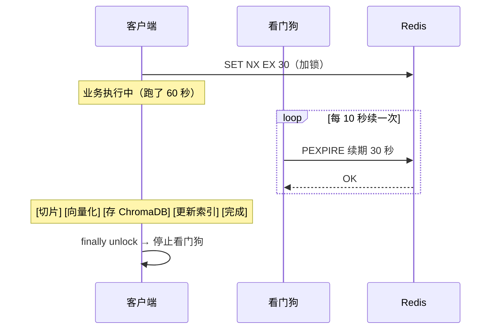

# 分布式锁：SET NX EX + 看门狗

## 一句话总结

> **分布式锁就是跨机器抢一把锁——抢到的人干活，没抢到的等着。Redis 用 `SET key value NX EX timeout` 一条原子命令搞定加锁，Python 用 `redis-py` 或 `aioredis` 实现。看门狗是后台定时续期——你业务没跑完，锁就不会过期。**

---

## 0. 这东西跟我有什么关系？

这是你作为 **Python AI Agent 后端开发者** 几乎一定会遇到的需求：

```text
场景 1：分布式定时任务
  三个 FastAPI 实例，每天凌晨执行一次"归档旧 Agent 对话记录"。
  不加锁 → 三个实例同时跑 → 归档 3 次 → 数据重复甚至错乱 ❌

场景 2：RAG 文档处理
  用户上传一个 500 页的 PDF，交给一个 Agent 切片处理。
  如果用户手滑点了两次上传 → 两个 Agent 同时处理同一个文档 → 冲突 ❌
  → 分布式锁保证：同一个 document_id 同一时间只处理一次

场景 3：API 限流 / 资源抢占
  一个 Agent 调度器管理 10 个 LLM API Key，
  任务来了需要抢一个 key 用 → 抢到锁的用 key，没抢到的排队。
```

**在你的项目里，分布式锁 ≈ 避免多实例打架。**

---

## 🌰 理解场景

你开了个奶茶店，店里有唯一一台制冰机。

```text
单店（单机）：
  你一个人做奶茶 → 不需要抢，就你一个人用
  就算 3 个人也方便 → "我先用" "好好好你先"

连锁店（分布式）：
  三家分店，共享一台制冰机：
    广州分店："我要用制冰机"
    深圳分店："我也要用"
    东莞分店："我也要"

  怎么保证同一时间只有一家在用？→ 分布式锁

例子都很土，道理就是这个道理。
```

**为什么 Python 的 `threading.Lock` 不行？**

```text
threading.Lock → 只锁同一个进程里的线程

你的 FastAPI 起了 3 个 docker 容器（3 个进程）：
  容器 1 的 threading.Lock → 锁容器 1 自己的线程
  容器 2 的 threading.Lock → 锁容器 2 自己的线程
  两个容器同时干活 → 谁也锁不住谁 ❌

分布式锁 → 锁存到 Redis → 所有容器都问 Redis → 全局一把锁 ✅
```

---

## 一、SET NX EX —— 最基础的分布式锁

### 一条命令搞定的原因

```redis
SET lock:doc:1001 "worker_A" NX EX 30
```

| 参数 | 大白话 | 作用 |
| ------ | -------- | ------ |
| `NX` | "这个 key 不存在我才设" | **互斥**——锁被抢了就不能再设 |
| `EX 30` | "30 秒后自动消失" | **防死锁**——持锁者挂了，锁自己会没 |
| `value = "worker_A"` | "写上谁拿的锁" | **身份标识**——解锁时验明正身 |

**为什么必须一条命令？（必手写常问）**

```text
❌ 错误做法 —— 两条命令：
  SETNX lock:doc:1001 "worker_A"   -- 第 1 条：加锁
  EXPIRE lock:doc:1001 30          -- 第 2 条：设过期
  → 第 1 条执行完，Redis 宕机了，EXPIRE 没设上 → 锁永远不释放 → 死锁 ❌

✅ 正确做法 —— 一条命令：
  SET lock:doc:1001 "worker_A" NX EX 30
  → Redis 保证 NX + EX 要么全成，要么全不成 → 不会死锁 ✅

道理：两条命令之间可能挂，一条命令不存在"之间"。
```

---

## 二、Python 手写实现（必手写）

### 同步版（redis-py）

```python
import redis
import uuid

r = redis.Redis(host='localhost', port=6379)

def lock_and_work(order_id):
    lock_key = f"lock:order:{order_id}"
    lock_value = str(uuid.uuid4())  # 唯一标识，防误删

    # ===== 加锁 =====
    locked = r.set(lock_key, lock_value, nx=True, ex=30)
    # nx=True 对应 NX，ex=30 对应 EX 30
    # 返回 True = 抢到锁，False = 没抢到

    if not locked:
        raise Exception("系统繁忙，请稍后重试")

    try:
        # 执行业务
        process_order(order_id)
    finally:
        # ===== 解锁（必须 Lua 脚本）=====
        # 先检查 value 是不是自己的，是才删
        # 不这样搞的话：你的锁到期了，别人抢了锁，你一把 DEL 把别人的删了
        lua_script = """
        if redis.call('get', KEYS[1]) == ARGV[1] then
            return redis.call('del', KEYS[1])
        else
            return 0
        end
        """
        r.eval(lua_script, 1, lock_key, lock_value)
```

解锁为什么不用 Python 的 if + delete？

```text
Python 写法：
  if r.get(lock_key) == lock_value:
      r.delete(lock_key)

  → GET + DEL 是两条命令
  → 刚 GET 完、还没 DEL，锁到期了，别人抢了
  → 你继续 DEL → 删了别人的锁 ❌

Lua 脚本 → 在 Redis 服务端原子执行 → 不存在"中间被人插一脚" ✅
```

### 异步版（aioredis / redis-py async）

你的 FastAPI 项目用异步，所以这个要会：

```python
import uuid
import asyncio
from redis.asyncio import Redis

async def lock_and_work(order_id: str):
    r = Redis(host='localhost', port=6379, decode_responses=True)
    lock_key = f"lock:order:{order_id}"
    lock_value = str(uuid.uuid4())

    locked = await r.set(lock_key, lock_value, nx=True, ex=30)

    if not locked:
        raise Exception("系统繁忙，请稍后重试")

    try:
        await process_order(order_id)
    finally:
        lua_script = """
        if redis.call('get', KEYS[1]) == ARGV[1] then
            return redis.call('del', KEYS[1])
        else
            return 0
        end
        """
        await r.eval(lua_script, 1, lock_key, lock_value)
```

---

## 三、基础方案的三个坑

### 坑 1：业务跑太久，锁到期了（最常见）

```text
时间线：
  T0: 你加锁成功，过期时间 30 秒
  T10: 你的 RAG 文档处理跑了一半
  T30: 锁到期自动释放
  T31: 另一个进程抢到了锁，也处理同一个文档
  T50: 第一个进程跑完了 → unlock
        → 但锁现在是别人的 → 把别人的锁删了 ❌

解法：看门狗自动续期（下面会讲）
```

### 坑 2：忘了设过期时间

```python
# ❌ 错误
r.set(lock_key, lock_value, nx=True)  # 没设 ex！

# 如果进程在 try 里面崩了（没走到 finally）
# → 锁永远不释放 → 其他所有进程永远拿不到锁 → 死锁

# ✅ 正确：永远带上 ex
r.set(lock_key, lock_value, nx=True, ex=30)
# 即使进程挂了，30 秒后锁自动释放
```

### 坑 3：解锁没检查身份

```python
# ❌ 错误
r.delete(lock_key)  # 不管谁的锁，直接删

# 你的锁到期了 → 别人抢到了 → 别人正在干活
# 你 finally 里 delete → 把别人的锁删了
# 第三个人又抢到了 → 两个人同时干活 → 数据错乱 ❌

# ✅ 正确：先检查再删（Lua 脚本）
```

---

## 四、看门狗（WatchDog）—— 自动续期

### 这是个啥

**你用 Redis SET NX EX 加锁时设了个过期时间（比如 30 秒）。但你的业务可能跑 1 分钟。到期了锁没了，别人就能进来捣乱。**

看门狗 = **一个后台任务，每过一段时间检查你的锁还在不在。在的话就给它续个期。**



### Python 没有 Redisson —— 自己搓一个

你用 Python + FastAPI，没有 Redisson（那是 Java 的）。但原理一样可以自己实现：

```python
import asyncio
import uuid
from redis.asyncio import Redis

class RedisLock:
    def __init__(self, redis: Redis, lock_key: str, timeout: int = 30):
        self.redis = redis
        self.lock_key = lock_key
        self.lock_value = str(uuid.uuid4())
        self.timeout = timeout  # 锁过期时间（秒）
        self._renew_task = None  # 看门狗任务

    async def acquire(self) -> bool:
        """加锁"""
        locked = await self.redis.set(
            self.lock_key, self.lock_value,
            nx=True, ex=self.timeout
        )
        if locked:
            self._start_watchdog()
        return locked

    def _start_watchdog(self):
        """启动看门狗：每 timeout/3 秒续一次"""
        async def _watchdog():
            while True:
                await asyncio.sleep(self.timeout / 3)  # 每 10 秒
                # 续期：把过期时间重置为 timeout
                await self.redis.pexpire(
                    self.lock_key, self.timeout * 1000
                )
        self._renew_task = asyncio.create_task(_watchdog())

    async def release(self):
        """释放锁"""
        if self._renew_task:
            self._renew_task.cancel()  # 停掉看门狗
            self._renew_task = None
        # Lua 脚本解锁（还是那套）
        lua = """
        if redis.call('get', KEYS[1]) == ARGV[1] then
            return redis.call('del', KEYS[1])
        else
            return 0
        end
        """
        await self.redis.eval(lua, 1, self.lock_key, self.lock_value)
```

用的时候：

```python
from redis.asyncio import Redis

async def process_document(doc_id: str):
    r = Redis(decode_responses=True)
    lock = RedisLock(r, f"lock:doc:{doc_id}")

    if not await lock.acquire():
        return {"error": "该文档正在处理中，请稍后"}

    try:
        # RAG 文档处理（可能要跑几十秒）
        await chunk_document(doc_id)
        await embed_chunks(doc_id)
        await store_to_chromadb(doc_id)
        return {"status": "ok"}
    finally:
        await lock.release()
```

**看门狗本质 = `asyncio.create_task` 起一个循环续期的后台协程，执行完毕就 cancel 掉。**

---

## 五、写个 FastAPI 里能直接用的看门狗锁

```python
# app/utils/lock.py

import asyncio
import uuid
from contextlib import asynccontextmanager
from redis.asyncio import Redis


@asynccontextmanager
async def distributed_lock(redis: Redis, lock_key: str, timeout: int = 30):
    """
    分布式锁上下文管理器（自带看门狗）
    用法：
        async with distributed_lock(redis, "lock:doc:123") as acquired:
            if not acquired:
                return {"error": "资源被占用"}
            # 执行业务...
    """
    lock_value = str(uuid.uuid4())

    locked = await redis.set(lock_key, lock_value, nx=True, ex=timeout)
    if not locked:
        yield False
        return

    # 启动看门狗
    watchdog_task = None
    async def watchdog():
        while True:
            await asyncio.sleep(timeout / 3)
            await redis.pexpire(lock_key, timeout * 1000)

    watchdog_task = asyncio.create_task(watchdog())

    try:
        yield True
    finally:
        if watchdog_task:
            watchdog_task.cancel()
        # Lua 解锁
        lua = """
        if redis.call('get', KEYS[1]) == ARGV[1] then
            return redis.call('del', KEYS[1])
        else
            return 0
        end
        """
        await redis.eval(lua, 1, lock_key, lock_value)
```

业务代码里用：

```python
from app.utils.lock import distributed_lock

@router.post("/documents/{doc_id}/process")
async def process_document(doc_id: str):
    async with distributed_lock(redis, f"lock:doc:{doc_id}") as acquired:
        if not acquired:
            raise HTTPException(423, "文档正在处理中")
        # ... 实际处理逻辑
        return {"status": "ok"}
```

---

## 六、Redis 主从切换 —— 锁丢了怎么办

### 先搞懂 Redis 主从是怎么工作的

```text
你有一个主库（Master）和一个从库（Slave）。

所有写操作都写 Master，Master 再把数据同步给 Slave。

  写锁 → Master    ───同步──→  Slave
        └─ "lock:doc:1001" 存在   └─ 还没收到 ❌

问题就在这里：同步是需要时间的（毫秒级）
```

---

### 丢锁到底是怎么发生的？逐步拆解

```text
第 1 步：正常的分布式锁写入
  进程 A → Redis 主库（Master）
  进程 A：SET lock:doc:1001 "uuid-A" NX EX 30
  主库：OK，锁记录已保存 ✅

第 2 步：锁还没来得及同步到从库
  主库内部：
    内存里：lock:doc:1001 = "uuid-A" ✅
    准备同步给从库：还没发出去
    从库：不知道有这把锁

第 3 步：主库宕机了
  啪！主库挂了（停电/进程崩溃/网络不通）
  主库内存里的 lock:doc:1001 丢了

第 4 步：从库升级为新的主库
  Redis Sentinel 检测到主库挂了
  把从库提升为新的主库
  问题：新主库的内存里没有 lock:doc:1001

第 5 步：另一个进程来加锁
  进程 B → 新主库
  进程 B：SET lock:doc:1001 "uuid-B" NX EX 30
  新主库：lock:doc:1001 不存在 → 可以设置 → OK ✅
  
  结果：
    进程 A 以为自己持有锁（真的在干活）
    进程 B 也以为自己持有锁（也在干活）
    → 两个进程同时处理同一个资源 → 并发冲突 ❌
```

**总结成一句话：锁写到 A 机器，还没同步到 B 机器，A 挂了。B 上位后不知道有这把锁，别人就能再抢到。**

---

### 一句话人类版本

```text
你在前台（主库）登记了"会议室 101 被 A 占了"。
前台还没把这个记录传到保安室（从库），
前台突然晕了（宕机）。
保安（从库）变成新的前台。
B 来问："会议室 101 有人用吗？"
新前台说："没人登记，你用吧。"
于是 A 和 B 同时进了同一间会议室。
```

---

### 这问题严重吗？—— 看场景

```text
场景 A：扣钱 / 转账 / 库存扣减
  A 和 B 同时减库存 → 库存变成负数 → 超卖 ❌
  → 主从丢锁很严重

场景 B：RAG 文档处理
  A 在处理一个文档切片，B 也在处理同一个文档
  最多重复存两份一样的切片向量数据
  → 丢几条重复数据，不影响大局 🟡
  
场景 C：定时任务调度
  凌晨 3 点的归档任务，A 在跑，B 也在跑
  归档两次 → 多花一倍时间，结果一样 ✅
  → 基本没影响
```

**所以：主从丢锁的问题严重程度 = 业务的容错程度。**

---

### 解法有哪几种

#### 解法 1：RedLock —— 多个 Redis 实例同时加锁

```text
不用 1 个 Redis，用 5 个互相独立的 Redis（不存在主从关系）。

加锁流程：
  进程 A 同时向 5 个 Redis 发 SET NX EX
  只要超过半数（>=3 个）返回了 OK → 加锁成功

优点：
  其中一两个 Redis 挂了也不影响，别的还有锁记录
缺点：
  需要部署 5 个独立的 Redis 实例，成本高
  加锁要请求 5 次，慢
  Python 里实现起来比较麻烦
  业界有争议（DDIA 作者专门写文章怼过）
```

#### 解法 2：WAIT 命令确认从库同步完成

```text
sleep 的问题是"赌"，WAIT 是"等确认"。

Redis 有个 WAIT 命令：
  WAIT <副本数> <超时毫秒>

加锁后调用 WAIT，阻塞到从库确认收到数据才继续：

  await redis.set(lock_key, uuid, nx=True, ex=30)
  replicas = await redis.wait(1, 5000)
  # 等待至少 1 个从库确认，最多等 5 秒
  # 返回实际确认的从库数量
  if replicas < 1:
      # 没有从库确认 → 保险起见，删锁，放弃
      await redis.delete(lock_key)
      raise Exception("主从同步失败，无法保证锁的可靠性")

  try:
      await do_work()
  finally:
      await unlock()

优点：
  └─ 真的能保证从库有锁记录了，不是赌
缺点：
  └─ 从库慢的话要等，加锁延迟变大
  └─ 如果只有一个 Redis 节点（没从库），WAIT 直接返回 0
```

#### 解法 3：换成 ZooKeeper / etcd

```text
ZooKeeper 用的是 ZAB 协议（强一致性）：
  写请求必须多数节点确认后才算成功
  不存在"写了主库但还没同步"的情况
  主挂了，选举出来的新节点数据是完整的

优点：锁不会丢，保证互斥
缺点：ZK 部署比 Redis 复杂，性能也差一些
      如果项目没有 ZK，为了一个锁专门部署 ZK 太夸张
```

---

### 实际生产中最常见的做法

**不是追求"锁一定不丢"，而是让业务能容忍"锁丢了"：**

```text
让业务支持幂等（idempotent）。
幂等 = 同一个操作执行 1 次和执行 N 次，结果一样。

生成订单 -> 不是幂等的（下两次单就多两个订单）
查询订单 -> 是幂等的（查多少次都是同一个结果）
...

怎么让操作变成幂等的？
  每个请求带一个唯一 ID（request_id/idempotent_key）
  处理之前先查这个 ID 有没有处理过
  处理过就直接返回结果，不再重复执行

例子：
  POST /api/orders
  Header: Idempotency-Key: uuid-xxxx
  
  服务端处理：
    查 Redis（或 DB）：这个 key 处理过吗？
      处理过 → 返回之前的结果 ✅
      没处理过 → 执行下单，保存结果到 Redis
  
  就算分布式锁丢了，两个请求同时进来，
  因为都有相同的 Idempotency-Key，
  只有第一个真正处理，第二个直接返回缓存结果。
```

**锁防并发，幂等防重复。锁可能失效，幂等是最后一道防线。**

---

### 一句话讲清

```text
延伸提问："Redis 主从切换会导致锁丢失吗？"

你：
"会的。在极端情况下会丢锁——
锁写到主库，还没同步到从库，主库挂了，
从库上位后没有这把锁的记录，
别的进程就能加锁成功。

但我们项目对这个问题做了权衡：
一般业务场景用看门狗续期 + 业务幂等就够了。
像 RAG 文档处理这种场景，
两个进程同时处理同一个文档，最多多存一份向量数据，
对用户没影响，并不需要为了完美的一致性
去上 RedLock 或 ZK 那么复杂的方案。

如果是扣库存、扣钱这种场景，
那就需要用 Idempotency-Key 做幂等兜底，
或者直接用分布式事务框架了。"
```

---

## 七、话术（针对你方向的改编版）

```text
延伸提问："分布式锁怎么实现？"

你：
"我项目里用的是 Redis 分布式锁。

最基础的是 SET key value NX EX 一条命令：
  NX 保证互斥（key 不存在才设），EX 保证防死锁（自动过期）。

value 必须用 UUID 标识持有者。
解锁用 Lua 脚本对比 value 再 DEL，防止误删别人的锁。
两条命令之间有间隙，必须用 Lua 原子执行。

这个是 Python 实现的核心代码（理解即可，能口述更好）：

  locked = redis.set(key, uuid, nx=True, ex=30)
  if locked:
      try:
          process()
      finally:
          redis.eval(lua_script, 1, key, uuid)

延伸提问："如果业务执行超过 30 秒呢？"

你：
"所以我加了看门狗机制——本质是一个后台协程，
每隔 timeout/3 秒给锁续一次期。
业务没跑完，锁就不会到期。
执行完 finally 里 unlock 时，顺手 cancel 掉看门狗。

实际项目里我把它封装成了 async with 上下文管理器，
用起来就一行。"
```

---

## 记忆口诀

> **SET NX EX 一条命令——原子加锁+过期，防死锁。**
> **UUID 标身份，Lua 验身再删——防误删别人的锁。**
> **看门狗=后台协程每 10 秒续一次——业务不结束，锁不释放。**
> **主从切换可能丢锁——业务幂等比锁的绝对可靠更实用。**


## 相关链接

- 📋 目录：[[00-Redis]]
- 📚 学习清单：[[八股文学习清单]]
- 🔗 [[八股文笔记/分布式-系统设计/02-微服务架构|微服务架构]] — 分布式锁是微服务架构的基础设施
- 🔗 [[笔记/八股文笔记/Python/并发/02-多线程多进程协程三者对比|多线程多进程协程三者对比]] — Python中分布式锁的异步实现
- 🔗 [[八股文笔记/操作系统/05-死锁四条件与银行家算法|死锁四条件与银行家算法]] — 锁与死锁的经典问题
