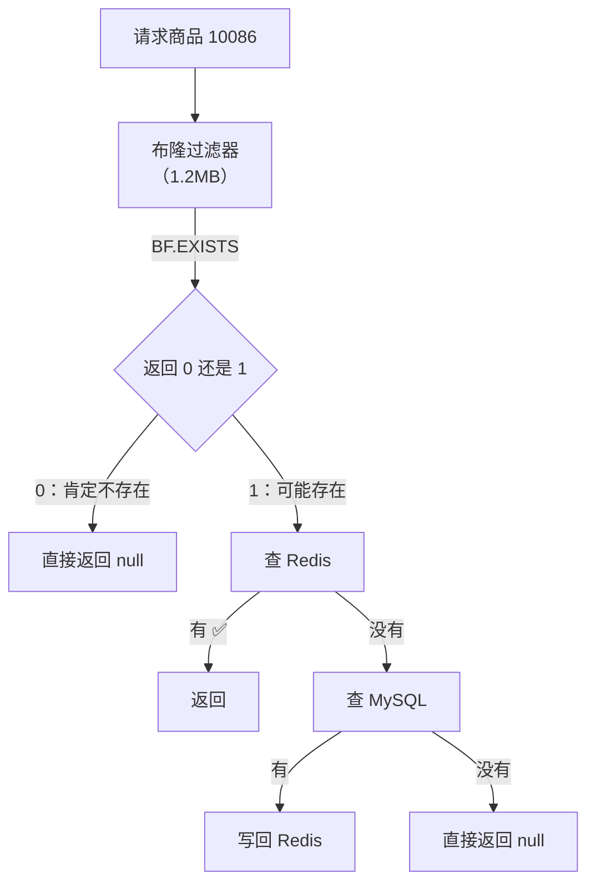

# 布隆过滤器原理与应用

## 一句话总结

> **布隆过滤器是一个"节省到变态"的判空神器——它用位数组 + 多个哈希函数来回答一个问题："这个东西肯定不存在？还是可能存在？"说不在就是不在，说在可能不在（误判）。用极小的内存挡住绝大多数无效查询，专门对付"缓存穿透"。**

---

## 🌰 先搞懂它解决什么问题

### 场景：缓存穿透

```text
你的系统查一个商品详情：

  请求来 → 查 Redis → 有就返回 ✅
                    → 没有就查 MySQL → 有就写回 Redis
                                       → 没有就返回 null

正常情况：
  100 个请求查商品 1001 → Redis 没有 → 查 MySQL → 没有 → 返回 null
  ↓
  也就一次 MySQL 查询，能接受

恶意攻击（缓存穿透）：
  攻击者写了个脚本，每秒发 10000 个请求
  每个请求的商品 ID 都是随机的（10001, 10002, 10003...）
  
  Redis：没有
  MySQL 扛不住了 → 每秒 10000 次查询 → 数据库被打死 ❌
  
  问题在哪？
    查一个不存在的商品，每次都要穿透到数据库。
    明明不存在，但你要去数据库证实"不存在"。
```

**布隆过滤器要解决的就是：用一个超省内存的方式，提前告诉你"别查了，这个肯定不存在"。**

### 另一个类比：机场安检

```text
正常流程：
  每个旅客都要过安检（查数据库）
  10000 个旅客，查 10000 次

布隆过滤器 = 在安检入口放一个"黑名单"小黑板：
  张三 → 航空黑名单 → 标记过
  李四 → 不在上面  → 可以进安检
  
  如果名字在黑名单上 → 绝对不放行
  如果名字不在上面 → 放行（但可能看走眼，极小概率）
  
  关键在于：这个黑名单只需要很小的黑板就记下了几万人。
```

---

## 布隆过滤器的工作原理

### 核心结构：一个位数组 + 三个哈希函数

```text
假设我们有一个 16 位的数组，全部初始化为 0：

  位数组:  0  0  0  0  0  0  0  0  0  0  0  0  0  0  0  0
           ↑
           第 0 位到第 15 位

有三个哈希函数（hash1, hash2, hash3）：
  分别把一个输入映射到 0~15 之间的位置。
```

### 第一步：添加元素

```text
添加 "apple" 到布隆过滤器：

  hash1("apple")  = 3
  hash2("apple")  = 7
  hash3("apple")  = 11

  把位数组的第 3、7、11 位设为 1：

  位置:  0  1  2  3  4  5  6  7  8  9  10 11 12 13 14 15
         ↓  ↓  ↓  ↓  ↓  ↓  ↓  ↓  ↓  ↓  ↓  ↓  ↓  ↓  ↓  ↓
         0  0  0  **1**  0  0  0  **1**  0  0  0  **1**  0  0  0  0

再添加 "banana"：

  hash1("banana") = 7
  hash2("banana") = 12
  hash3("banana") = 2

  位置 7 已经是 1（apple 设的），不动它
  位置 12 设为 1
  位置 2 设为 1

  结果：
  位置:  0  1  2  3  4  5  6  7  8  9  10 11 12 13 14 15
         ↓  ↓  ↓  ↓  ↓  ↓  ↓  ↓  ↓  ↓  ↓  ↓  ↓  ↓  ↓  ↓
         0  0  **1**  **1**  0  0  0  **1**  0  0  0  **1**  **1**  0  0  0
```

### 第二步：查询元素

```text
查询 "apple" 是否存在：

  hash1("apple") = 3  → 位数组[3] = 1 ✅
  hash2("apple") = 7  → 位数组[7] = 1 ✅
  hash3("apple") = 11 → 位数组[11] = 1 ✅
  
  所有位置都是 1 → "apple 可能存在" ✅

查询 "grape"（没添加过）：

  hash1("grape") = 5  → 位数组[5] = 0 ❌
  
  有一个位置是 0 → "grape 肯定不存在" ✅

再查询 "watermelon"（没添加过）：

  hash1("watermelon") = 3  → 位数组[3] = 1
  hash2("watermelon") = 11 → 位数组[11] = 1
  hash3("watermelon") = 2  → 位数组[2] = 1
  
  三个位置都是 1 → "watermelon 可能存在"
  但 watermelon 确实没添加过！→ 误判 ❌

为什么误判？
  位置 3、11、2 被 apple、banana 和其他元素"凑巧"全部设成了 1。
  虽然 watermelon 没来过，但它的哈希位置被其他元素占满了。
```

---

## 三个关键结论（直接背）

```text
结论 1：说"不在"就是 100% 不在
  只要有一个哈希位置是 0 → 元素绝对没出现过
  因为如果它来过，那几个位置一定都是 1

结论 2：说"在"可能是误判（假阳性）
  可能这 3 个位置是被其他元素"碰巧"全部设成 1 的

结论 3：布隆过滤器永远不说"不在"但实际在（无假阴性）
  如果它说不在，那就是真的不在
  这刚好是缓存穿透场景需要的特性！
```

---

## 三个核心参数

```text
布隆过滤器的表现取决于三个参数：

1. n = 预期要存的元素数量（比如 100 万条数据）
2. p = 你能接受的误判率（比如 1%）
3. m = 位数组的长度（越多越省误判）
4. k = 哈希函数的个数

公式：
  位数组长度 m = - n * ln(p) / (ln2)^2
  哈希函数数量 k = m/n * ln2

实际意义：
  100 万个元素，1% 误判率
  → 位数组需要约 119 万字节 ≈ 1.19 MB
  → 需要的哈希函数 ≈ 7 个

用 1.2MB 的内存，就能挡住 100 万条不存在的查询穿透到数据库。
```

---

## Redis 布隆过滤器怎么用

```text
Redis 4.0+ 提供了布隆过滤器插件（redisbloom）。

命令只有三个：

  1. BF.ADD filter_name key
     添加一个元素到布隆过滤器

  2. BF.EXISTS filter_name key
     判断 key 是否存在（返回 0 或 1）

  3. BF.RESERVE filter_name error_rate capacity
     提前初始化，指定误判率和容量
     不设的话默认 1% 误判率

例子：
  BF.RESERVE product_cache 0.01 1000000
  → 创建一个布隆过滤器，存 100 万商品，1% 误判率

  BF.ADD product_cache 1001
  BF.ADD product_cache 1002

  BF.EXISTS product_cache 1001  → 1（可能存在）
  BF.EXISTS product_cache 9999  → 0（肯定不存在）
```

---

## 布隆过滤器防缓存穿透完整流程



```text
改造后的流程：

用户请求商品 10086

① 查布隆过滤器（BF.EXISTS）
   → 0（肯定不在）→ 直接返回"商品不存在"
     ↓
   → 1（可能存在）→ 继续

② 查 Redis
   → 有 → 返回
   → 没有 → 继续

③ 查 MySQL
   → 有 → 写回 Redis → 返回
   → 没有 → 返回 null

好处：
  99.99% 的不存在请求在第一步就被拦住了
  几十万条恶意请求 → 布隆过滤器几十微秒搞定
  数据库完全不受影响 ✅
```

---

## 布隆过滤器在别的地方也用

```text
不止 Redis，布隆过滤器在很多地方都有应用：

① Chrome 浏览器
  用户访问一个 URL → 查布隆过滤器
  判断这个 URL 是不是恶意网站
  几十亿恶意 URL 的数据库 → 只要几 MB 内存

② 数据库（Cassandra / HBase）
  查询一行数据之前，先查布隆过滤器
  "这一行存在吗？"
  如果说不存在 → 不用去磁盘找了
  减少 90% 以上的无效磁盘读取

③ 推荐系统
  给用户推荐内容时
  先查布隆过滤器："这个内容用户看过了吗？"
  看过了就不再推荐

④ 爬虫去重
  爬过的 URL 存布隆过滤器
  来一个新的 URL → 先问布隆过滤器爬过没
  说爬过（可能误判）→ 跳过
  说没爬过 → 肯定没爬过 → 爬它
```

---

## 布隆过滤器的局限

```text
① 不能删除元素
  假设我们把 "apple" 的三个 1 改回 0
  但位置 7 也是 "banana" 的哈希位
  把位置 7 清 0 → "banana" 也被删了 → 下次查 banana 说不在 ❌

  解法：用布谷鸟过滤器（Cuckoo Filter）支持删除

② 误判率会随着数据增多而变高
  存 100 万时误判率 1%
  你硬塞了 1000 万 → 位数组大量位置被设为 1
  误判率飙升到 20% 以上

  解法：提前估算好容量，超了就重建

③ 不能知道元素存了多少
  你知道位数组里很多位置是 1
  但不知道这 1 是哪个元素留下的
  布隆过滤器没有"遍历"功能
```

---

## 一句话讲清

```text
延伸提问："布隆过滤器是什么？"

你：
"布隆过滤器是一个概率型数据结构。
用一个位数组 + 多个哈希函数来判空。

核心特性：
  说不在 → 100% 不在（无假阴性）
  说在 → 可能在，也可能误判（有假阳性）
  误判率可控制，一般在 1% 以内。

原理就是：
  添加时用 k 个哈希函数算出 k 个位置，全部标 1。
  查询时算 k 个位置，只要有一个是 0 → 肯定不在。
  全 1 → 可能在（可能被其他元素碰巧填满了）。

最常用在缓存穿透场景：
  请求来的时候先查布隆过滤器。
  它说不在 → 直接返回，数据库都不用碰。

延伸提问："误判率怎么控制？"

你：
"通过调整三个参数：预期元素数量 n、位数组长度 m、哈希函数数量 k。
比如 100 万数据、1% 误判率，大概需要 1.2MB 位数组和 7 个哈希函数。

要记住的是：布隆过滤器不能删除元素。
因为多个元素共用的哈希位，你删一个会把别的也删了。
要支持删除用布谷鸟过滤器。"
```

---

## 记忆口诀

> **位数组 + k 个哈希函数，存在标 1，查询看位。**
> **说不在 → 绝对不在，说在 → 可能在（无假阴性，有假阳性）。**
> **极省内存——100 万数据只要 1.2MB，挡住 99.99% 无效查询。**
> **不能删——哈希位是共用的，删一个会误伤另一个。**
> **最常用防缓存穿透：先问布隆再查 DB，不存在直接返回。**


## 相关链接

- 📋 目录：[[00-Redis]]
- 📚 学习清单：[[八股文学习清单]]
- 🔗 [[八股文笔记/Redis/03-缓存穿透|缓存穿透]] — 布隆过滤器是防缓存穿透的利器
- 🔗 [[八股文笔记/MySQL/04-索引失效5大场景|索引失效5大场景]] — 布隆过滤器与B+树索引的适用场景对比
- 🔗 [[八股文笔记/AI-LLM-RAG-Agent/16-向量数据库|向量数据库]] — 布隆过滤器与向量索引的数据结构对比
