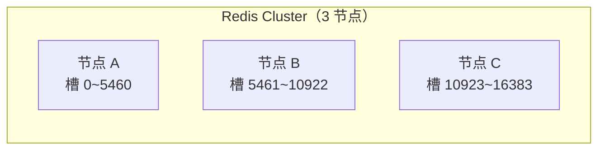

# Cluster 集群：哈希槽 16384 + 数据分片

## 一句话总结

> **单机 Redis 存不下就分片——Cluster 把数据分成 16384 个槽，每个节点负责一部分槽。客户端算好 key 属于哪个槽，直接找对应的节点要数据。节点挂了，槽自动移到其他节点，不停机。**

---

## 🌰 理解为什么需要集群

你是一家店老板，生意越做越大，问题来了：

```text
单机 Redis 的瓶颈：
  1. 内存有限 → 100GB 数据存不下了
  2. CPU 有限 → 每秒 10 万请求扛不住了
  3. 单点故障 → 这台 Redis 挂了，全部服务瘫痪

怎么办？→ 多加几台 Redis，把数据分到不同的机器上。
```

**这就是 Cluster 做的事：多台 Redis 一起干活，每台只存一部分数据。**

---

## 核心概念：哈希槽（Hash Slot）

### 16384 个槽是怎么来的？

```text
Cluster 把整个数据空间分成 16384 个槽（0 到 16383）。

每个 key 属于哪个槽？
  slot = CRC16(key) % 16384
  
  └─ CRC16 是一种哈希算法，把 key 算成一个数字
  └─ 对 16384 取模 → 得到 0~16383 之间的一个槽号
```

### 槽怎么分给节点？



**每个节点只存一部分数据，合起来就是全部。**

### 为什么是 16384？（加分点）

```text
CRC16 算出来的值范围是 0~65535（16 位）。
为什么 Cluster 不用 65535 个槽，而是 16384？

Redis 作者的回答：
  16384 个槽的信息只需要 2KB（16384/8 = 2048 字节）
  65535 个槽需要 8KB（65535/8 = 8192 字节）

Cluster 的每个节点要广播自己的槽信息（心跳包）。
包越小 → 网络开销越小。

16384 对于最多 1000 个节点的集群来说已经够分了。
2KB 的心跳包比 8KB 小 4 倍，网络压力小得多。
```

---

## 数据读写流程

```text
客户端要 GET key "username"

Step 1：客户端算槽号
  slot = CRC16("username") % 16384 = 12345

Step 2：客户端查"槽 12345 在哪个节点"
  客户端维护了一个"槽映射表"（slots mapping）
  槽 12345 → 节点 B

Step 3：客户端直接连节点 B 发请求
  └─ Cluster 模式下的客户端（如 redis-cli -c）会自动算槽、自动跳转

Step 4：如果客户端连错了节点（连了 A）：
  节点 A 返回：
    MOVED 12345 192.168.1.2:6379
    └─ "这个槽在 B，你去 B 查"
  客户端更新映射表，然后去 B 查
```

**核心：客户端知道数据在哪，不需要像哨兵那样"问一圈"。**

---

## 三种节点角色

| 角色 | 功能 |
| ------ | ------ |
| **主节点（Master）** | 负责一部分槽，处理读写请求 |
| **从节点（Slave）** | 复制主节点的数据，主挂了顶上 |
| **没有哨兵！** | Cluster 自己集成了哨兵的功能 |

**Cluster 的节点自己会互相监控。不需要额外部署哨兵。**

---

## 主节点挂了怎么办？——自动故障转移

```text
3 主 3 从的 Cluster：

  节点 A（主）→ 节点 A1（从）
  节点 B（主）→ 节点 B1（从）
  节点 C（主）→ 节点 C1（从）

节点 A 挂了 ↓

1. 其他节点发现 A 连不上了
   └─ 集群里超过半数节点认为 A 挂了

2. 节点 A1（A 的从库）发起选举
   └─ 请求提升自己为主节点

3. 其他主节点投票
   └─ 超过半数同意 → A1 成为新主节点

4. A1 接管节点 A 的槽
   └─ 原来 A 负责的槽 0~5460 → 现在由 A1 负责

5. 集群恢复可用
   └─ 只有一个从库转正了，少了一个副本
   └─ 等节点 A 恢复了，它会变成 A1 的从库
```

**整个过程不需要人工介入，也不需要哨兵。**

---

## 核心配置

```redis
# 开启集群模式
cluster-enabled yes

# 集群配置文件（自动生成，不需要手动创建）
cluster-config-file nodes-6379.conf

# 节点超时时间
cluster-node-timeout 5000  -- 5 秒没回复就认为挂了

# 最少需要几个从节点才能做故障转移
cluster-slave-validity-factor 10
```

### 搭建 3 主 3 从的最小集群

```text
3 台机器（或 6 个端口），每台一个主一个从：

  主节点：127.0.0.1:6379, 6380, 6381
  从节点：127.0.0.1:6382, 6383, 6384

创建集群：
  redis-cli --cluster create \
    127.0.0.1:6379 127.0.0.1:6380 127.0.0.1:6381 \
    127.0.0.1:6382 127.0.0.1:6383 127.0.0.1:6384 \
    --cluster-replicas 1
    └─ replicas=1 表示每个主节点配 1 个从节点
```

---

## 集群的局限性

| 问题              | 原因                   | 怎么办                              |
| --------------- | -------------------- | -------------------------------- |
| **不支持多 key 操作** | key 可能在不同节点上，不能跨节点事务 | 用 hashtag 强制把相关 key 放到同一槽        |
| **不支持多数据库**     | Cluster 模式下只有 db 0   | 用不同的 key 前缀区分                    |
| **批量操作有限制**     | mget 如果 key 在不同节点会变慢 | 用 hashtag 把 key 聚到一起             |
| **大 key 问题放大**  | 一个 key 只能在一个节点上      | 控制单个 key 大小                      |
| **客户端必须支持**     | 普通 redis-cli 不能自动跳槽  | 用 redis-cli -c 或支持 Cluster 的客户端库 |

### 用 hashtag 解决多 key 操作

```text
想让 user:100:name 和 user:100:age 在同一个节点上？

普通情况：
  CRC16("user:100:name") → 槽 5000
  CRC16("user:100:age")  → 槽 8000
  → 不同节点，不能一起操作 ❌

用 hashtag（加 {}）：
  CRC16("{user:100}:name") → 槽 3000
  CRC16("{user:100}:age")  → 槽 3000（只算 {} 里的内容）
  → 同一个节点 ✅ mget、事务都可以用了
```

**hashtag 规则：只有 key 里 `{}` 包裹的部分参与 CRC16 计算。**

---

## 哨兵 vs Cluster

| 维度 | 哨兵（Sentinel） | 集群（Cluster） |
| ------ | ----------------- | ---------------- |
| **数据分片** | ❌ 没有，每台存全量 | ✅ 有，每台存一部分 |
| **自动故障转移** | ✅ 有（哨兵负责） | ✅ 有（自己负责）|
| **最大数据量** | 单机内存上限 | 可以扩展到多台，PB 级 |
| **写容量** | 单机写 | 多主节点同时写 |
| **读容量** | 主写从读 | 每个节点都可以读 |
| **复杂度** | 🟡 中等 | 🔴 较高 |
| **客户端支持** | 普通客户端即可 | 需要 Cluster 兼容客户端 |
| **适合场景** | 数据量不大，需要高可用 | 数据量大，需要水平扩展 |

**选型建议：**

```text
数据量 < 单机内存 + 需要高可用 → 哨兵模式
数据量 > 单机内存 + 需要水平扩展 → Cluster
```

---

## 记忆口诀

> **16384 个槽，CRC16 算归属，每台节点管一段。**
> **客户端自己算槽号，直接连对的节点，不绕路。**
> **节点挂了自动切——从库转正，不需要额外部署哨兵。**
> **多 key 操作受限用 hashtag，大 key 别往 Cluster 里放。**


## 相关链接

- 📋 目录：[[00-Redis]]
- 📚 学习清单：[[八股文学习清单]]
- 🔗 [[八股文笔记/分布式-系统设计/02-微服务架构|微服务架构]] — 数据分片与服务拆分的设计思路
- 🔗 [[八股文笔记/计算机网络/34-DNS解析过程|DNS解析过程]] — 一致性哈希与DNS调度的类比
- 🔗 [[八股文笔记/操作系统/20-操作系统基础CPU调度流程中断系统调用上下文切换|上下文切换]] — 分布式节点间的请求调度
