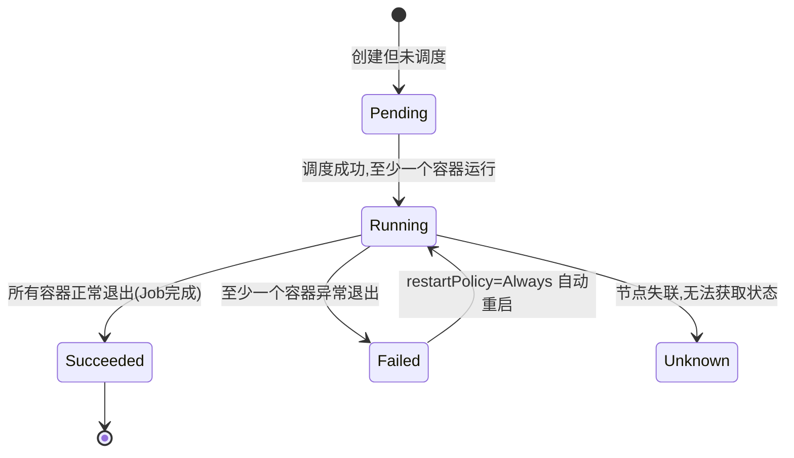
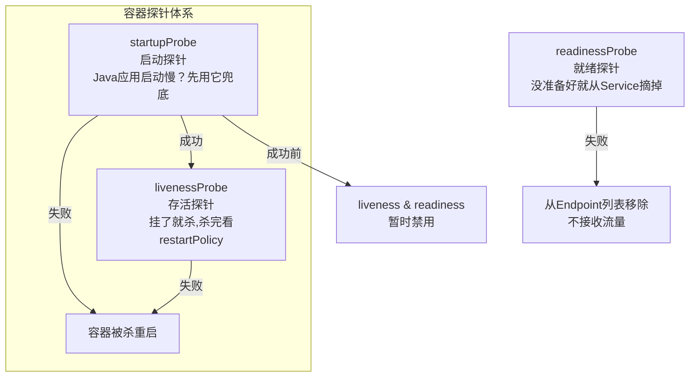
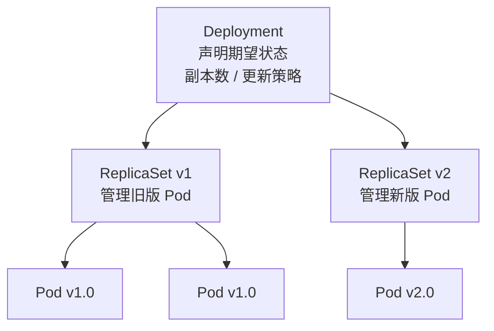
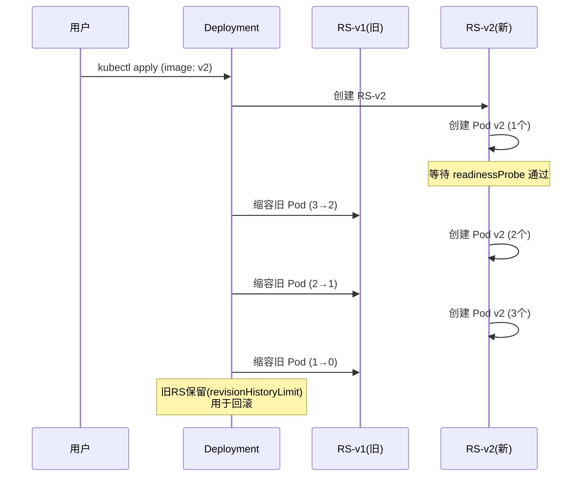
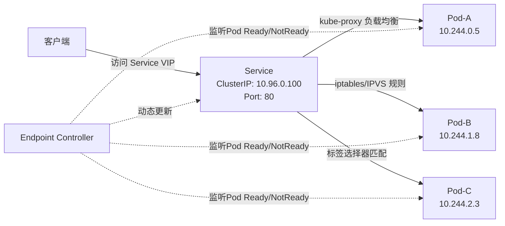
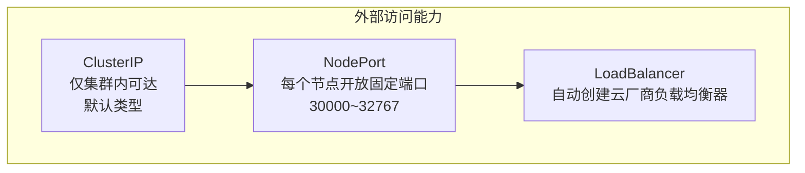
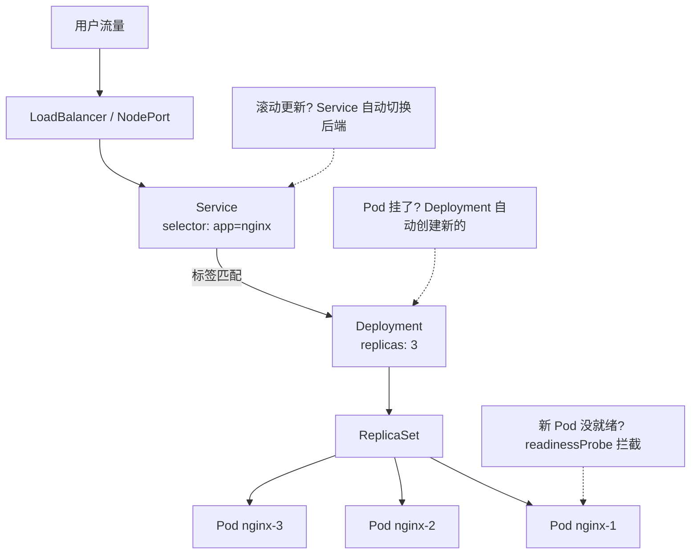

# Kubernetes 核心资源：Pod / Service / Deployment

> 把 K8s 想象成一家快递公司——Pod 是包裹，Deployment 是发货计划（决定发多少个、怎么更新），Service 是快递柜的取件码（固定地址，不管包裹怎么换）。三者搞定 80% 的容器编排工作。

---

## 一、Pod——最小的原子调度单元

Pod 不是容器，而是"装容器的容器"。一个 Pod 内部有一个 pause 基础设施容器持有网络命名空间，其他业务容器加入进来共享同一个 IP 和端口空间——同 Pod 内的容器可以直接 `localhost` 互访。

### 1.1 Pod 生命周期五个阶段



| 阶段 | 含义 | 常见原因 |
|------|------|----------|
| **Pending** | 已被 API Server 接受，但未绑定节点 | 镜像拉取慢 / 资源不足调度不上 |
| **Running** | 已绑定节点，至少一个容器在运行 | 正常状态 |
| **Succeeded** | 所有容器正常退出，不再重启 | Job/CronJob 完成 |
| **Failed** | 至少一个容器非零退出 | OOMKill / 应用 crash |
| **Unknown** | 节点失联 | 网络分区 / kubelet 宕机 |

### 1.2 三种探针（Probes）



- **startupProbe**：专治启动慢的容器（Java 大应用、ML 模型加载）。在它成功之前，liveness 和 readiness 都被暂停——避免刚启动就被判定死亡。
- **livenessProbe**：判断容器是否还活着。失败 → kubelet 杀掉容器 → 根据 `restartPolicy` 决定是否重启。
- **readinessProbe**：判断容器是否准备好接客。失败 → Service 从负载均衡列表中摘掉这个 Pod。

### 1.3 Pod 的资源请求与限制

```yaml
resources:
  requests:          # 调度依据——调度器找"够用"的节点
    cpu: "250m"      # 0.25 核
    memory: "256Mi"
  limits:            # 运行时天花板——超了就 OOMKill 或 CPU 节流
    cpu: "500m"
    memory: "512Mi"
```

> ⚠️ **陷阱**：只设 `limits` 不设 `requests` 会导致调度器无法准确评估节点容量，Pod 可能被放到撑不住的节点上。生产环境务必同时设置两者。

### 1.4 Pod 本质速记

| 特性 | 说明 |
|------|------|
| 最小调度单元 | 调度器调度的不是容器，而是 Pod |
| 网络共享 | 同 Pod 容器共享 IP，localhost 互通 |
| 短暂生命周期 | 死了就换新的，IP 也会变 |
| pause 容器 | 基础设施容器，持有网络命名空间 |
| 重启策略 | Always（默认）、OnFailure、Never |

---

## 二、Deployment——应用管理的指挥官

你几乎不会直接创建 Pod。生产中由 Deployment 管理 Pod 的副本数、滚动更新和回滚。

### 2.1 层级关系



Deployment 不直接管理 Pod，而是通过 ReplicaSet 间接管理。这个额外层级存在的唯一理由就是支持滚动更新——更新时创建新的 ReplicaSet，同时逐步缩容旧的。

### 2.2 滚动更新（RollingUpdate）全流程

假设副本数 3，镜像从 v1 升到 v2：



### 2.3 两个关键参数

```yaml
strategy:
  type: RollingUpdate
  rollingUpdate:
    maxSurge: 1        # 更新时最多多创建几个Pod
    maxUnavailable: 1  # 更新时最多允许几个Pod不可用
```

| 参数 | 含义 | 选型建议 |
|------|------|----------|
| **maxSurge** | 更新期间最多"多出来"的 Pod 数 | 资源充足时设大→更新更快 |
| **maxUnavailable** | 更新期间最多"少掉"的 Pod 数 | 对可用性敏感时设为 0 |

> **maxSurge=0, maxUnavailable=1**：先杀旧再建新，零额外资源开销，但有短暂不可用。
> **maxSurge=1, maxUnavailable=0**：先建新再杀旧，保证始终满副本，但多用一份资源。

### 2.4 回滚

```bash
kubectl rollout history deployment/my-app      # 查看历史版本
kubectl rollout undo deployment/my-app          # 回滚到上一版
kubectl rollout undo deployment/my-app --to-revision=2  # 回滚到指定版本
```

回滚原理：Deployment 保留旧的 ReplicaSet（副本数为 0），回滚时重新启用它即可。

---

## 三、Service——稳定的服务发现入口

Pod 是"朝生暮死"的——滚动更新时 IP 会变，重建后 IP 也会变。客户端不可能硬编码 Pod IP。Service 提供一个**固定的虚拟 IP（VIP）**和 DNS 名称，把流量负载均衡到后端健康的 Pod。

### 3.1 Service 工作原理



核心链路：Service 定义 `selector`（如 `app: my-app`）→ Endpoint Controller 持续监听匹配的 Pod → kube-proxy 在每个节点写入 iptables/IPVS 规则 → 客户端访问 VIP 时被负载均衡到真实 Pod。

### 3.2 四大 Service 类型



| 类型 | 虚拟IP | 访问方式 | 典型场景 |
|------|--------|----------|----------|
| **ClusterIP** | 分配 VIP | `10.96.x.x:80`（集群内） | 微服务间内部通信（默认首选） |
| **NodePort** | 分配 VIP + 固定端口 | `<任意节点IP>:30000~32767` | 开发测试 / 没有 LB 的环境 |
| **LoadBalancer** | 分配 VIP | 云厂商 LB 的公网 IP | 生产环境对外暴露服务 |
| **Headless** | 不分配 VIP | DNS 直接解析到 Pod IP | StatefulSet（MySQL 集群等需要固定网络标识） |

### 3.3 Deployment + Service 协作全景



---

## 四、Deployment vs StatefulSet 对比

| 特性 | Deployment | StatefulSet |
|------|-----------|-------------|
| 适用场景 | 无状态应用（Web API、微服务） | 有状态应用（MySQL、Redis、ZooKeeper） |
| Pod 命名 | 随机后缀 `nginx-5c7d8f9b6-2x4k8` | 有序索引 `mysql-0, mysql-1` |
| 网络标识 | 无稳定 DNS | 稳定 DNS `pod-name.service-name` |
| 存储 | 共享或临时存储 | 每个 Pod 对应独立 PVC |
| 启停顺序 | 并行无序 | 严格顺序 `0→1→2`，反向 `2→1→0` |
| 扩缩容 | 任意并行 | 逐个增减，保证顺序 |

---

## 五、延伸追问

### Q1：Pod 的 restartPolicy 有哪几种？默认是什么？

三种：`Always`（默认，Deployment 使用）、`OnFailure`（Job 使用，失败才重启）、`Never`（一次性调试 Pod）。

### Q2：Deployment 更新时 Pod 是怎么切换的？

新版本创建新的 ReplicaSet → 在新 RS 里创建 Pod → 等待 readinessProbe 通过 → 缩容旧 RS → 重复直到全部替换。`kubectl rollout undo` 本质是重新启用旧的 ReplicaSet。

### Q3：Service 怎么知道 Pod 是否健康？

不直接判断——依赖 **readinessProbe**。Pod 的 readinessProbe 失败 → Endpoint Controller 将其从 Service 的 Endpoint 列表移除 → kube-proxy 不再向其分发流量。这就是"就绪探针决定流量入口"的机制。

### Q4：ClusterIP、NodePort、LoadBalancer 怎么选？

- 集群内部微服务间通信 → **ClusterIP**（默认，不需要公网暴露）
- 开发/测试需要从宿主机访问 → **NodePort**
- 生产环境对外暴露 → **LoadBalancer**（自动创建云厂商 LB）
- 需要固定网络标识（如数据库） → **Headless Service**（ClusterIP: None）

### Q5：requests 和 limits 的区别？

`requests` 是调度依据——调度器据此找"够用"的节点；`limits` 是运行时天花板——超了 memory 触发 OOMKill，超了 CPU 触发节流（throttling）。只设 limits 不设 requests 是常见陷阱，会导致调度不准。

---

## 一句话总结

> **Pod = 最小调度单元（共享网络/存储的容器组），Deployment = Pod 的指挥官（副本数/滚动更新/回滚），Service = 稳定入口（VIP + 负载均衡）。学习重点：Pod 探针机制、Deployment 滚动更新原理（maxSurge/maxUnavailable）、Service 四大类型区别、Deployment vs StatefulSet。**

---

## 相关链接

- 📋 目录：[[00-分布式-系统设计]]
- 📚 学习清单：[[八股文学习清单]]
- 🔗 [[01-Docker与docker-compose部署流程|Docker 基础]] — K8s 运行在容器之上
- 🔗 [[02-微服务架构|微服务架构]] — K8s 是微服务部署的事实标准
- 🔗 [[05-KubernetesGPU调度|K8s GPU 调度]] — GPU 资源扩展
