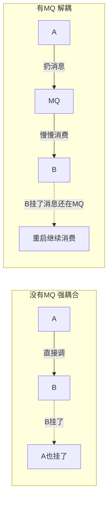
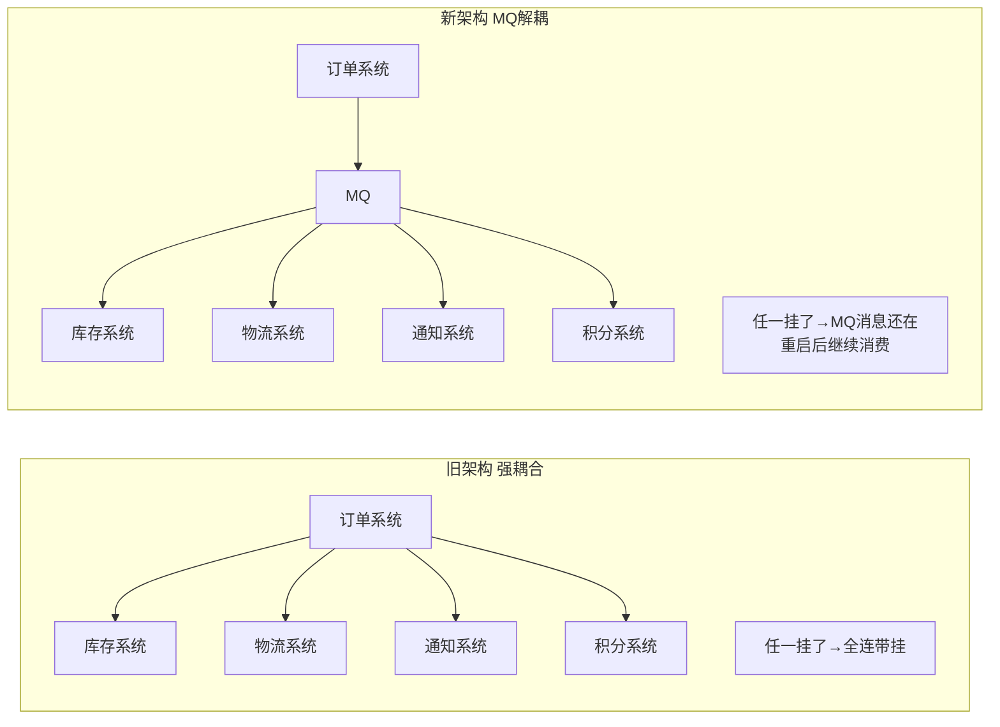
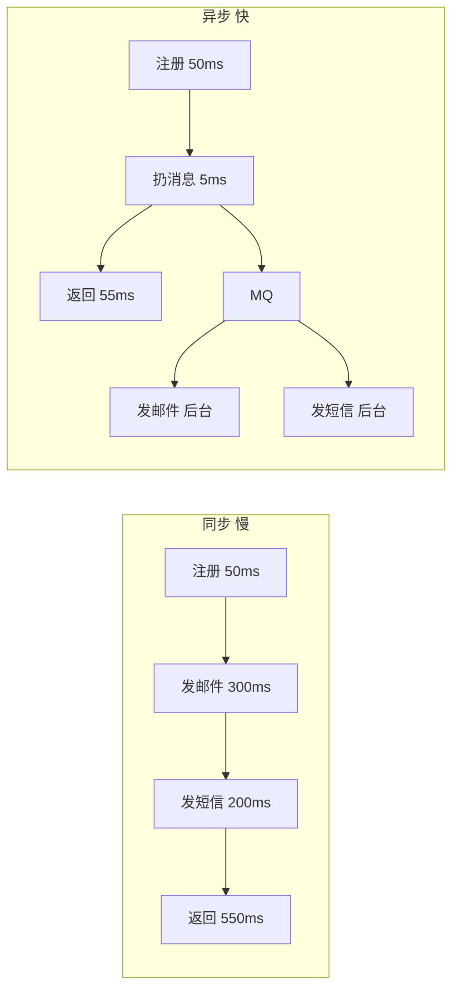
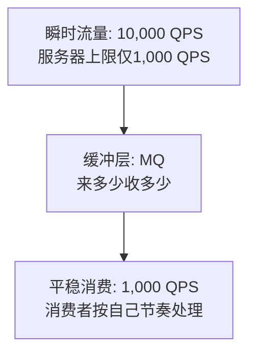
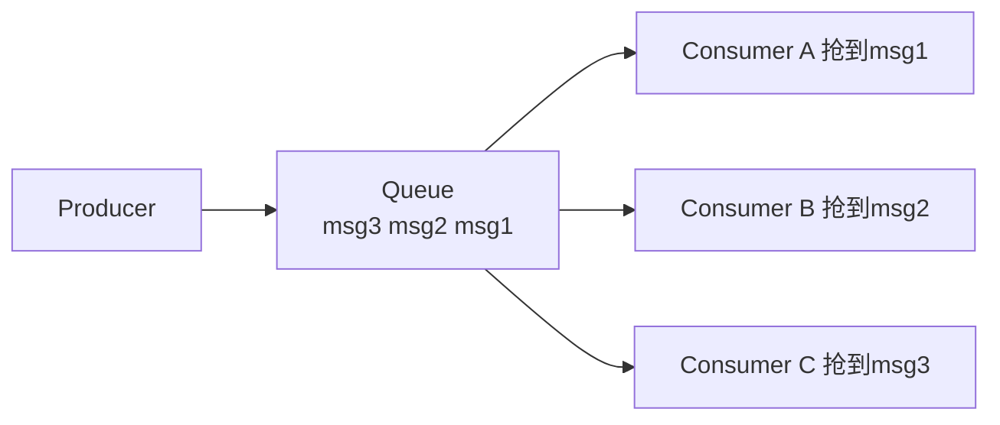
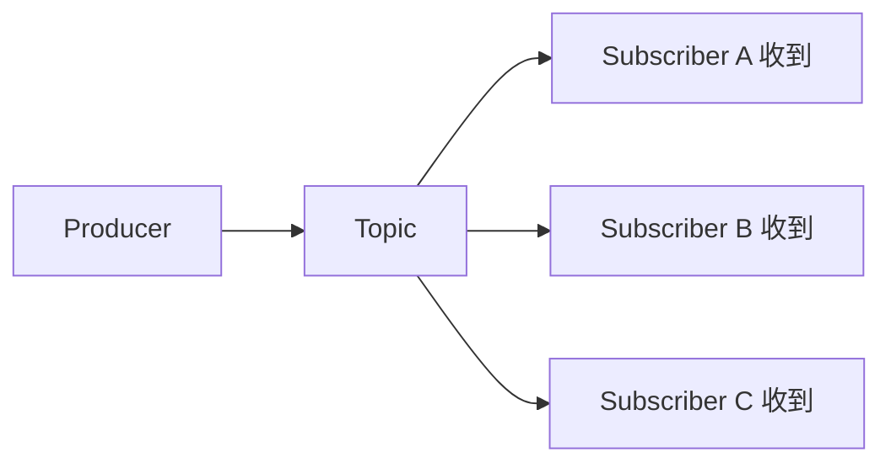
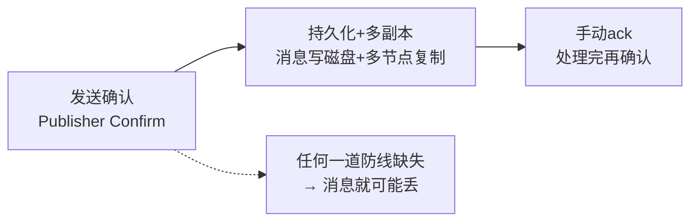

# 消息队列MQ

---

## 一、MQ 是什么

消息队列（Message Queue）就是一个**异步通信的中间人**——生产者把消息扔到队列里就走，消费者自己来取。两边不需要同时在线，不需要直接通信。

---

## 二、MQ 三大核心场景

### 2.1 解耦

系统之间不直接调用，通过 MQ 中转。任何一方挂了不影响另一方。

**一句话**：A 系统不直接调 B，只往 MQ 里扔消息。B 什么时候处理、处理多慢，A 完全不关心。

### 2.2 异步

核心链路走完就返回，非核心链路扔 MQ 异步处理。

> **一句话讲清**："用户只关心注册是否成功，不关心邮件什么时候发。核心链路走完就返回，非核心链路扔 MQ 异步处理。"

### 2.3 削峰填谷

用 MQ 做缓冲池——高峰流量先堆在 MQ 里，消费者按自己的节奏慢慢处理。

> **必背**：**削峰填谷 = MQ 做缓冲池**。高峰堆 MQ，低谷慢慢消。不让流量峰值直接把后端打挂。

---

## 三、两种消息模型

### 3.1 点对点（Queue — 抢单模式）

一条消息只能被**一个**消费者消费。谁抢到算谁的。

适用场景：下单后减库存——只能一个服务处理，不能反复减。

### 3.2 发布/订阅（Topic — 广播模式）

一条消息**所有**订阅者都能收到。

适用场景：价格变了 → 通知 App、通知 Web、发推送给用户——所有渠道都收到。

### 3.3 对比

| 模型 | 消息怎么分 | 类比 | 场景 |
| ------ | ----------- | ------ | ------ |
| 点对点 | 一条消息一人拿 | 抢红包 | 订单处理、任务分发 |
| 发布订阅 | 一条消息人人拿 | 订阅公众号 | 配置变更通知、实时行情推送 |

---

## 四、RabbitMQ vs Kafka vs RocketMQ

### 4.1 一句话选型

- **RabbitMQ**：万级吞吐，功能全面，延迟低 → 适合**业务系统**（注册发邮件、订单通知）
- **Kafka**：百万级吞吐，顺序写磁盘 → 适合**日志收集、流处理、大数据管道**
- **RocketMQ**：十万级吞吐，事务消息强 → 适合**电商/金融**（下单、支付、发货）

### 4.2 详细对比

| 维度 | RabbitMQ | Kafka | RocketMQ |
| ------ | :---: | :---: | :---: |
| **吞吐量** | 万级 | 百万级 | 十万级 |
| **延迟** | 微秒级 | 毫秒级 | 毫秒级 |
| **消息可靠性** | 高 | 高 | 高 |
| **事务消息** | 不好用 | 不支持 | 原生支持 |
| **延迟消息** | 插件支持 | 不支持 | 原生支持（18 个级别） |
| **顺序消息** | 不好保证 | 分区内有序 | 全局有序 |
| **社区生态** | 最成熟 | 大数据标配 | 阿里系为主 |
| **学习成本** | 低 | 中 | 中 |

> **一句话讲清**："选什么取决于场景——做业务系统用 RabbitMQ，做日志/流处理用 Kafka，做电商/金融用 RocketMQ。不要说'只会一种所以选它'。"

### 4.3 RabbitMQ 核心概念

| 概念 | 说明 |
| ------ | ------ |
| **Broker** | RabbitMQ 服务器本体 |
| **Exchange** | 交换机——收 Producer 的消息，按规则路由到 Queue |
| **Queue** | 队列——存消息，Consumer 从这里取 |
| **Binding** | 绑定——Exchange 和 Queue 的路由规则 |
| **Routing Key** | 路由键——Exchange 根据这个决定消息去哪个 Queue |

三种 Exchange 类型：
- **Direct**：精确匹配 Routing Key → `routing_key="order"` 只进 order 队列
- **Fanout**：广播，无视 Key → 所有绑定的 Queue 都收到
- **Topic**：模糊匹配 Key → `routing_key="order.*"` 匹配 order.create、order.cancel

---

## 五、四大经典问题

### 5.1 消息丢失

消息丢失发生在三个环节，每个环节都要防：

| 环节 | 防丢方案 | 说明 |
| ------ | --------- | ------ |
| **发送环节** | Publisher Confirm / acks=all | 生产者确认消息到达 Broker |
| **存储环节** | 持久化 + 多副本 | 消息写磁盘 + 多节点复制 |
| **消费环节** | 手动 ack | 处理完再确认，处理到一半挂了会重发 |

### 5.2 消息重复消费

MQ 大多是"至少一次"投递——ack 超时会重发，消息可能被处理两次。

**解决方案：幂等性**（同一个操作执行一次和一百次，结果一样）

| 方案 | 原理 | 可靠度 |
| ------ | ------ | -------- |
| **数据库唯一键** | `INSERT msg_id` 加唯一索引，重复插入报错 | 最强 |
| **Redis 标记** | `SET msg_id "done" NX`，消费前先查 | 高 |
| **业务天然幂等** | `UPDATE SET money=100 WHERE id=1`，执行多次结果一样 | 看业务 |

> **必背口诀**：接口幂等 = 同一个操作执行一次和一百次，结果一样。MQ 重复消费的本质是"至少一次"投递——要自己保证幂等。

### 5.3 消息乱序

Producer 按 ①→②→③ 发送，但 ② 失败重试 → Consumer 收到 ①→③→②（乱序）。

| MQ | 解决方案 | 代价 |
| ---- | --------- | ------ |
| RabbitMQ | 需要顺序的消息路由到同一队列 | 单消费者处理，并行度低 |
| Kafka | 同一 key 发到同一 partition | 吞吐受限于单 partition |
| RocketMQ | 原生支持全局顺序消息 | 吞吐量大幅下降 |

> **一句话讲清**："能不用顺序消息就不用——顺序消息牺牲吞吐量。大部分业务靠最终一致性解决，不需要严格顺序。"

### 5.4 消息积压

Producer 发太快 + Consumer 处理慢 → MQ 越堆越多。

**排查步骤**：
1. 先看 Consumer 哪里慢了（下游数据库慢？接口超时？）
2. 临时加 Consumer 实例（水平扩展，最快方案）
3. 如果积压量太大（几千万条），写临时程序批量拉消息 → 不做处理 → 先写到另一个队列 → 等积压消掉后补数据

**预防**：设置队列容量上限（满了拒绝新消息）+ 监控积压告警。

---

## 六、踩坑记录

| 坑 | 正确认知 |
| ---- | --------- |
| 以为 MQ 能保证消息不丢 | MQ 不做额外配置的话丢了是正常的！发送确认 + 持久化 + 手动 ack 三件套缺一不可 |
| 以为 MQ 能保证不重复 | 绝大多数 MQ 是"至少一次"投递——重复是必然的，必须自己实现幂等 |
| 以为 MQ 天然保序 | 多分区/多队列 + 重试 = 乱序。需要顺序就别扩分区 |
| 自动 ack 直接干活 | 自动 ack = 收到就确认。消费者处理到一半挂了，消息已"确认"，永远丢了 |
| 所有场景都用 MQ | MQ 不是银弹。加了 MQ = 多一个中间件要维护、多了延迟、多了一致性问题 |
| MQ 异步后数据不一致 | A 写 DB 成功，发 MQ 失败 → B 收不到 → 数据不一致。需要本地消息表或事务消息兜底 |

---

## 七、快速问答

| 问题 | 一句话答案 |
| ------ | ----------- |
| 消息队列是干什么的？ | 解耦异步削峰——服务之间不直接调，通过队列中转 |
| MQ 三大核心场景？ | 解耦（不直接调）、异步（不等结果）、削峰（缓冲池） |
| 点对点和发布订阅区别？ | 点对点一条消息一人拿（抢红包），发布订阅一条消息人人拿（公众号） |
| RabbitMQ 和 Kafka 区别？ | RabbitMQ 万级低延迟适合业务，Kafka 百万级高吞吐适合日志流处理 |
| 消息丢了怎么办？ | 发送确认 + 持久化 + 手动 ack——三道防线覆盖生产→存储→消费 |
| 消息重复消费怎么处理？ | 接口幂等——数据库唯一键去重、Redis 标记、业务天然幂等 |
| 怎么保证消息顺序？ | 需要顺序的消息进同一队列/分区，但会牺牲吞吐量 |
| 消息积压了怎么处理？ | 先看 Consumer 瓶颈 → 加实例水平扩展 → 不行就临时扩容队列 |
| 什么时候不该用 MQ？ | 系统还不够复杂时——多一个中间件多一个故障点 |
| 什么是消息幂等性？ | 同一个消息消费一次和消费十次结果一样——靠唯一键/状态标记保证 |
| 为什么 Kafka 吞吐量高？ | 顺序写磁盘 + 零拷贝 + 批量发送 + 分区并行——每个设计都在追求吞吐 |
| 事务消息是什么？ | RocketMQ 特性——本地事务和消息发送在同一事务中，保证要么都成功要么都失败 |

---

## 相关链接
- [[八股文学习清单]]
- [[00-全局导航|全局导航]]
- 🔗 [[八股文笔记/Redis/13-主从复制全量与增量同步|Redis主从复制]] — MQ消费类似Redis增量同步
- 🔗 [[八股文笔记/操作系统/02-进程间通信IPC7种方式|进程间通信IPC]] — MQ是分布式进程间通信的方案
- 🔗 [[八股文笔记/MySQL/24-主从复制原理|MySQL主从复制]] — 主从复制与MQ的消息分发对比
