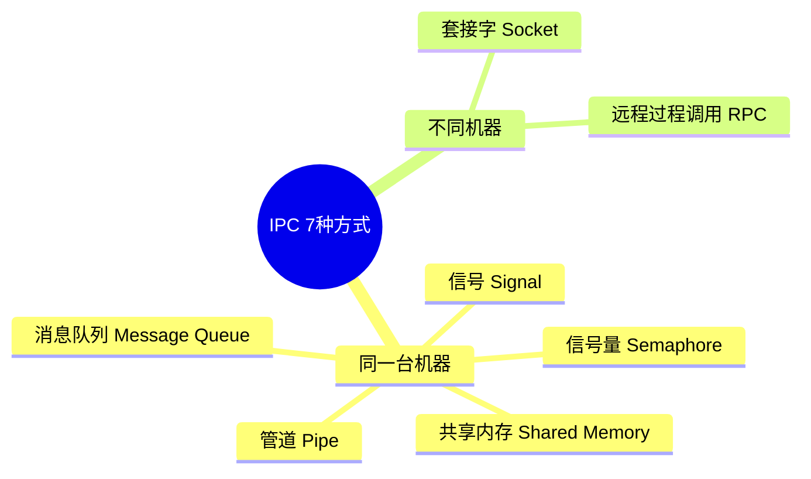

# 进程间通信 IPC 7 种方式

> **一句话**：进程像一个个独立的小岛，IPC 就是岛和岛之间通信的方式——走船、走桥、走飞机、走电话线……

## 一、7 种 IPC 方式——看张全景图再一个个讲



**先记住一个大的分法**：

```text
┌─ 同一台机器上的进程通信（5种）
│   管道、消息队列、共享内存、信号量、信号
│
└─ 不同机器上的进程通信（2种）
    Socket、RPC
```

下面一个一个讲，从最简单最朴素的开始。

### 2. 消息队列（Message Queue）——更规范的"信箱"

#### 为什么需要它？

管道太原始了——就一根水管，水进去什么样出来还是什么样。消息队列加了**格式**和**排队**。

#### 长什么样？

```text
进程A → [消息3][消息2][消息1] → 进程B

         ↑ 内核维护的消息队列
```

消息像快递包裹一样，一个一个排队等着被取走。

#### 一句话总结

> **进程 A 把消息扔进队列，进程 B 从队列里取——就像往信箱里投信**。

#### 生活类比

小区里的快递柜：

- 你（进程A）把快递放进柜子（消息队列）

- 快递员不用等你来拿

- 收件人（进程B）有空了去取

- 每个快递都有单号（有格式）

#### 和管道的区别

| 维度 | 管道 | 消息队列 |
| ------ | ------ | ---------- |
| 格式 | 字节流，无结构 | **有结构**（有类型、有长度） |
| 关系 | 一对一的管道 | **多对多**（多个发多个收） |
| 同步 | 读端不读，写端会阻塞 | 发完就走，**异步** |
| 容量 | 固定缓冲区 | 内核动态管理 |

#### 优缺点

| 优点 | 缺点 |
| ------ | ------ |
| 异步通信（发完不用等） | 大小有限制 |
| 有格式（消息类型区分） | 不适合大量数据 |
| 多个进程可以同时收发 | 需要内核管理 |

**适用场景：** 点对点通信，异步解耦
**类比：** 你寄快递，快递到了放快递柜，收件人自己去拿，不用等着对方签收

### 4. 信号量（Semaphore）——"交通信号灯"

**注意：信号量不传数据！**信号量只管一件事：**同步**。

#### 为什么需要它？

共享内存太快了，但两个进程同时写就会乱套。需要一种机制让它们"排队"。

#### 长什么样？

```text
信号量就像一个计数器：

初始值 = 3  （表示有 3 个资源可用）

进程A 来用： 3 → 2 （P操作，减1）

进程B 来用： 2 → 1 （P操作，减1）

进程C 来用： 1 → 0 （P操作，减1）

进程D 来用： 0 → ❌ 没了，等着！

进程A 用完： 0 → 1 （V操作，加1）→ 叫醒等待的进程D
```

#### 一句话总结

> 一个计数器，控制同时能有多少个进程访问共享资源——就像红绿灯控制车流。

#### 生活类比

厕所坑位：

```text
🚽🚽🚽  ← 3个坑位（信号量 = 3）

来10个要上厕所的人：
前3个人进坑，锁门
第4个人在门口等
第1个人出来，第4个人进去...
```

#### PV 操作（可能会让你说这两个名字）

| 操作 | 全称 | 意思 | 类比 |
| ------ | ------ | ------ | ------ |
| **P操作** | proberen（荷兰语"尝试"） | 资源数减1，没资源就等着 | "我进去了，占一个坑" |
| **V操作** | verhogen（荷兰语"增加"） | 资源数加1，叫醒等待的 | "我出来了，让一个坑" |

```python
# 信号量的使用模式
from threading import Semaphore

# 创建信号量，最多允许3个进程同时访问
sem = Semaphore(3)

def access_shared_resource():
    sem.acquire()    # P操作：拿一个资源，没有就等
    try:
        # 读写共享内存...
        pass
    finally:
        sem.release()  # V操作：释放资源
```

#### 两种信号量

| 类型 | 值 | 作用 | 类比 |
| ------ | ---- | ------ | ------ |
| **二元信号量** | 0 或 1 | 互斥锁，同一时刻只能一个进 | 厕所一个坑 |
| **计数信号量** | 0 ~ N | 允许最多 N 个进程同时访问 | 厕所三个坑 |

**适用场景：** 保护共享资源不被同时写
**类比：** 厕所就3个坑，来10个人，一次只能进3个。不是传数据，是管秩序

### 6. 套接字（Socket）——"万能电话"

#### 为什么需要它？

前面说的 5 种都是**同一台机器**上的进程通信。那不同机器怎么办？Chrome 和百度服务器不在同一台电脑上。

Socket 就是干这个的。

#### 一句话总结

> 两个不同机器上的进程，通过网络互相发数据——就像两个人打电话。

#### 生活类比

电话：

- 你有一部电话（Socket）

- 你知道对方的电话号码（IP + 端口）

- 你拨号（connect）

- 对方接听（accept）

- 你们开始通话（send / recv）

- 聊完挂断（close）

```text
你的手机 ————— 基站 ————— 电信网络 ————— 对方的手机
  ↑                                      ↑
本地 Socket                          远程 Socket
```

**TCP vs UDP 对比：**

| 类型 | 类比 | 特点 |
| :--- | :--- | :--- |
| **TCP** | 打电话 | 先接通，再说，保证对方能听到 |
| **UDP** | 对讲机 | 直接喊，不管对方有没有在听 |

**TCP：**
```text
你："喂？"
对方："听到了"
你："明天8点见"
对方："好的8点见"
→ 确认对方收到了
```

**UDP：**
```text
你拿着对讲机喊："明天8点见！"
不管对方有没有听到，反正你喊了
→ 快，但不保证
```

#### 一个最简单的 TCP Socket 流程

```python
# 服务端
import socket

s = socket.socket()        # 买一部电话
s.bind(('0.0.0.0', 8080))  # 插上电话线（绑定端口）
s.listen(5)                # 等着电话响
conn, addr = s.accept()    # 有人打进来了
data = conn.recv(1024)     # 听对方说什么
conn.send(b'收到')         # 回复

# 客户端
s = socket.socket()
s.connect(('192.168.1.1', 8080))  # 拨号
s.send(b'你好')                  # 说话
data = s.recv(1024)              # 听回复
```

**适用场景：** 不同机器之间的通信（互联网基础）
**类比：** 微信语音通话——你在北京，我在广州

## 二、一张表——横向对比

| 方式 | 速度 | 跨机器 | 传数据 | 同步机制 | 简记 |
| ------ | ------ | -------- | -------- | ---------- | ------ |
| **管道** | 慢 | ❌ | ✅ 字节流 | 内核自动 | 水管 |
| **消息队列** | 中 | ❌ | ✅ 有格式 | 内核管理 | 信箱 |
| **共享内存** | **最快** | ❌ | ✅ 任意 | 自己加锁 | 白板 |
| **信号量** | 快 | ❌ | ❌ | 自带 | 红绿灯 |
| **信号** | 快 | ❌ | ❌ | 异步 | 震动 |
| **Socket** | 中 | ✅ | ✅ 任意 | 协议自带 | 电话 |
| **RPC** | 中 | ✅ | ✅ 任意 | 框架自带 | 点菜 |

## 三、记忆口诀

> **IPC 七兄弟，各有各的活**
> - 管道串数据——两杯一杯水
> - 队列管消息——信箱能排队
> - 共享内存快——白板两人写
> - 信号量管秩序——厕所红绿灯
> - 信号是通知——手机震动了
> - Socket 跨机器——电话千里外
> - RPC 最装逼——远程当本地

---

**总结**：管道传字节流，队列管结构化消息，共享内存速度最快但需要信号量同步，信号是异步通知，Socket 跨机器通信，RPC 是 Socket 的高级封装让你远程调用像本地一样。

## 相关链接

- 📋 目录：[[00-操作系统]]

- 📚 学习清单：[[八股文学习清单]]

- 🔗 [[01-进程vs线程vs协程对比|01 进程vs线程vs协程对比]]
- 🔗 [[03-线程同步锁机制|03 线程同步锁机制]]
- 🔗 [[05-死锁四条件与银行家算法|05 死锁四条件与银行家算法]]
- 🔗 [[八股文笔记/Python/00-Python|Python八股文]]
- 🔗 [[八股文笔记/React-TS-JS/00-React-TS-JS|React-TS-JS八股文]]
- 🔗 [[八股文笔记/MySQL/00-MySQL|MySQL八股文]]

