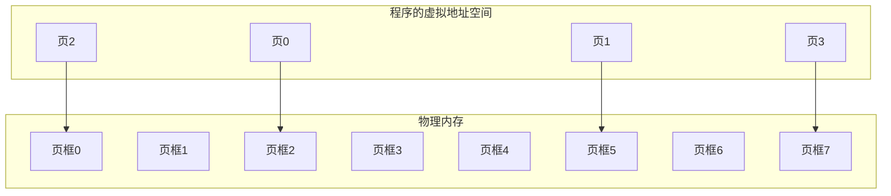

# 分页 vs 分段 vs 段页式

> **一句话**：内存管理要解决"怎么把程序塞进内存"的问题。分页是把内存切成等大的格子（像宿舍），分段是按逻辑切成不等大的块（像户型图），段页式是先分段、段里再分页（组合拳）。

## 一、分页（Paging）——把内存切成格子

### 先解决一个问题

```text
早期操作系统直接把程序加载到内存里跑。

问题：

  - 程序 A 占用 0~1000

  - 程序 B 必须要加载到 1000 以后

  - 如果 A 结束了，B 还没加载完，中间空着一块——内存碎片

解决方案：分页。
```

### 分页的核心思想

```text
把物理内存切成固定大小的"页框"（4KB 一个格子）

把程序的虚拟地址空间也切成同样大小的"页"

程序不用占连续的内存，可以散落在各个格子里。
```



```text
程序以为自己的页 0~3 是连续的内存。

实际物理内存里：页0→框2、页1→框5、页2→框0、页3→框7

——到处散落，但程序感觉不到。
```

### 关键概念：页表

```text
程序访问地址 0x1234：

  CPU 把它拆成：页号 = 1，页内偏移 = 0x234

  查页表：页号 1 对应物理页框 5

  物理地址 = 页框 5 的基地址 + 0x234

  程序根本不知道自己被映射到了页框 5。

  它只感觉"我读了 0x1234，拿到了数据"。
```

### 生活类比

```text
大学宿舍楼：

  每间宿舍大小一样（每个格子 4KB）

  你宿舍在 302（虚拟地址）

  实际分给你的可能是 2 号楼 3 层 2 号房（物理地址）

  你写信给朋友说"我住 302"

  收发室（MMU）查表：302 → 2-3-2

  把信送过去

  你的朋友只知道你住 302，不知道你真实在哪。
```

### 分页的特点

| 维度 | 说明 |
| ------ | ------ |
| 格子大小 | 固定（通常 4KB） |
| 有没有碎片 | 有**内部碎片**——程序最后一项不满 4KB，剩下空间浪费 |
| 保护 | 每页可以设权限（读/写/执行） |
| 目的 | 解决内存碎片、支持虚拟内存、实现隔离 |


## 二、分页 vs 分段——核心区别

| 维度 | 分页 | 分段 |
| ------ | ------ | ------ |
| **切法** | 固定大小（4KB） | 不固定（按逻辑） |
| **谁决定大小** | 硬件（CPU 架构决定） | 程序员/编译器 |
| **是否有碎片** | 内部碎片（一个页没用满） | 外部碎片（段之间空隙） |
| **权限控制** | 每页设权限 | 每段设权限 |
| **共享** | 不方便（共享粒度太小） | 方便（整个代码段共享） |
| **目的** | 解决碎片、实现虚拟内存 | 支持程序逻辑结构 |
| **程序能感知吗** | ❌ 完全透明（不知道在哪一页） | ✅ 能感知 |

```text
核心一句话：

  分页关注"内存怎么用得更高效"——解决碎片

  分段关注"程序结构怎么管理"——解决逻辑隔离
```

## 三、一张表横向对比

| 维度 | 分页 | 分段 | 段页式 |
| ------ | ------ | ------ | -------- |
| 分割粒度 | 固定（4KB） | 不固定 | 分段后段内再分页 |
| 地址结构 | 页号 + 偏移 | 段号 + 偏移 | 段号 + 页号 + 偏移 |
| 查表次数 | 1 次（页表） | 1 次（段表） | 2 次（段表→页表） |
| 是否有碎片 | 内部碎片 | 外部碎片 | 内部碎片 |
| 权限控制 | 每页 | 每段 | 每段 + 每页 |
| 程序感知 | 不感知 | 感知 | 感知 |
| 复杂度 | 低 | 中 | 高 |
| 实际用在哪 | **现代 OS 的主流** | 早期 OS、嵌入式 | 早期 x86 |

## 四、一句话讲清

### Q：分页和分段的区别？

> 分页按固定大小切内存（4KB），目的是高效管理内存、消除外部碎片、支持虚拟内存。程序不感知分页。分段按程序逻辑切（代码段、数据段、栈段），目的是支持程序的逻辑结构和权限隔离。程序能感知段的存在。

### Q：分页的碎片问题？

> 分页只有内部碎片——程序最后一页用不满 4KB，剩下的空间浪费。平均每个程序浪费半个页（约 2KB），但相比分段的外部碎片问题（段之间空出无法利用的空间）要轻得多。

### Q：段页式是怎么工作的？

> 先按逻辑分段，每个段内部再分页。地址翻译分两步：先查段表找到段对应的页表，再查页表找到物理页框。比纯分页多查一次表，但兼具了分段和分页的优点。

### Q：为什么现代操作系统不用段页式了？

> 主要是复杂度的代价不值得。现代操作系统用纯分页 + 虚拟内存就足够了，权限控制通过页表项里的权限位来实现，不需要分段。分段是 x86 架构早期留下来的遗产。

**总结**：分页管效率、分段管逻辑、段页式是组合。实际最爱考的是分页 vs 分段的区别——抓住"固定大小 vs 不固定"和"硬件决定 vs 逻辑决定"这两个维度就行。

## 相关链接

- 📋 目录：[[00-操作系统]]

- 📚 学习清单：[[八股文学习清单]]

- 🔗 [[07-地址翻译从虚拟到物理|07 地址翻译从虚拟到物理]]
- 🔗 [[08-页面置换算法|08 页面置换算法]]
- 🔗 [[12-malloc底层brk与mmap|12 malloc底层brk与mmap]]
- 🔗 [[八股文笔记/Python/00-Python|Python八股文]]
- 🔗 [[八股文笔记/React-TS-JS/00-React-TS-JS|React-TS-JS八股文]]
- 🔗 [[八股文笔记/MySQL/00-MySQL|MySQL八股文]]

