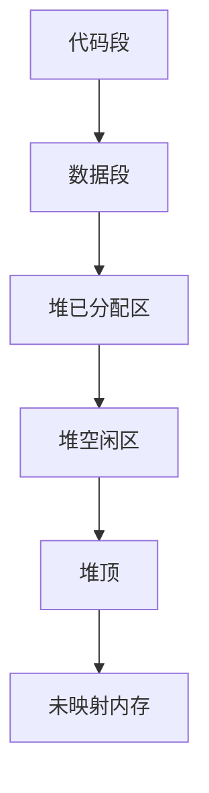
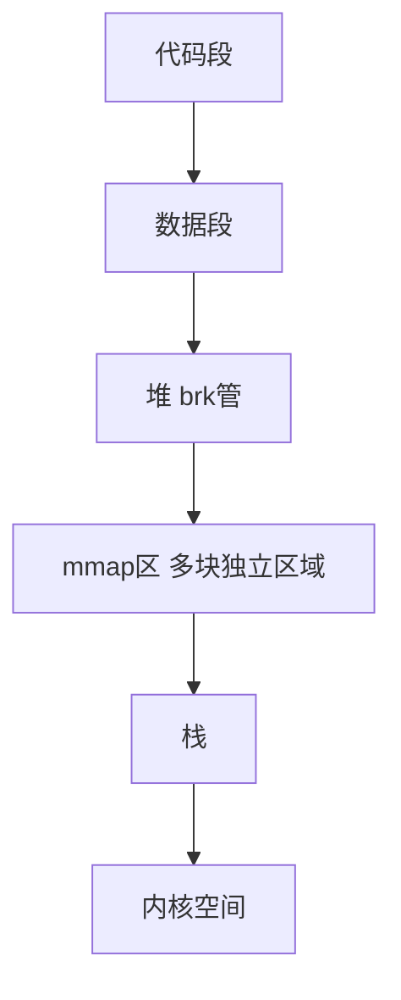

# malloc 底层：brk vs mmap

> **一句话**：你调 `malloc(100)` 申请 100 字节——glibc 不会傻到每次都找内核要。它自己先管着一片内存池，小块的从池里划，大块（>128KB）才找内核单独要。划的方式有两种：**brk**（推堆顶）和 **mmap**（独立开辟）。

## 一、进程的内存长啥样？

```text
你的程序跑起来之后，它在内存里的布局是这样的：
```


```text
好了，你现在知道——堆（Heap）就是你 malloc 拿内存的地方。

堆的顶端叫 program break（程序断点）。

堆的大小 = 当前 program break 的位置 - 堆的起始位置。

类比：堆就像一个可以拉长的大抽屉。

  你拉出多长（program break 推多高），你就有多少空间。
```

## 二、glibc 到底怎么从内核拿内存？

```text
两种方法：brk 和 mmap。是重点内容。
```

### brk——推堆顶



```text
brk 怎么工作的：

堆的顶端有个指针叫 program break。

你需要内存时，把这个指针往上推——推出来的空间就是新的内存。

不需要时，把指针降下来——还给进程。

⚠️ 注意：brk 也是系统调用，也要切内核态。

   但它比 mmap 轻量——它只是在已有的虚拟内存区域（VMA）上调整边界，

   不像 mmap 要创建一个全新的 VMA。

   类比：brk = 把围墙往外挪一挪。mmap = 在旁边另盖一栋房子。
```

```text
brk 的特点：

✅ 快——系统调用里只改一个边界值，工作轻

✅ 连续——分出来的内存都在堆上，地址连着

✅ 小内存友好——碎片可以复用

❌ 释放不干净——中间空了块，堆顶也降不下来

   OS 以为你还占着那块地

❌ 碎片多了堆越来越大——假性内存泄漏
```

### mmap——另起炉灶



```text
mmap 本来是"把文件映射到内存"用的。

但也可以匿名映射——纯粹要一块内存，不和文件挂钩。

你每次 mmap，内核就在你的地址空间里单独开一块新区。

这块区和堆无关，和其他 mmap 区域也无关——各自独立。

当你 free 这块内存时，munmap 直接把它删干净，归还 OS。

就像临时租仓库——用完就退，不占你主店的地方。
```

```text
mmap 的特点：

✅ 释放即归还——free 后 OS 立刻收回，不假性泄漏

✅ 大块友好——几 MB 单独维护，不和堆上的小块掺和

✅ 互不影响——碎片只发生在自己块内，不影响别人

❌ 慢——每次 mmap 都是系统调用，而且内核要建 VMA

❌ 最少一页（4KB）——你只要 1 字节也得给你一整页

❌ 地址不连续——每次映射的位置不一定连着
```

## 三、brk 的碎片问题

```text
场景：你把货架上放了三堆货

堆布局（从低到高）：

  [p1=100B] [p2=100B] [p3=100B] [空闲] ← 堆顶

你取走了 p2（free(p2)）：

  [p1=100B] [空闲100B] [p3=100B] [空闲] ← 堆顶还在原地

  ↑ 堆顶降不了——p3 在 p2 上面挡着

又来一个新客人要 200B：

  找遍空闲块——最大只有 100B（p2 的坑）

  不够 → 只能从堆顶继续推

  [p1=100B] [空闲100B] [p3=100B] [p4=200B] ← 堆顶推上去了

  那个 100B 的空洞就永远留在那了——这叫"碎片"

  堆越来越大，实际利用率越来越低
```

```text
brk 碎片 = 堆里出现了"瑞士奶酪"——到处是洞，但堆顶降不下来。

mmap 没这问题：

  每块 mmap 是独立的一整块，free 了整块消失。

  但每块至少 4KB——小块用 mmap 浪费空间。

  这是空间换干净的交易。
```

**总结**：malloc 底层 = 批零分离。brk 管零售（小内存、快、有瑞士奶酪问题），mmap 管批发（大内存、慢但干净）。128KB 是 glibc 的分界线。

## 相关链接

- 📋 目录：[[00-操作系统]]

- 📚 学习清单：[[八股文学习清单]]

- 🔗 [[07-地址翻译从虚拟到物理|07 地址翻译从虚拟到物理]]
- 🔗 [[09-分页与分段与段页式|09 分页与分段与段页式]]
- 🔗 [[11-抖动与局部性原理|11 抖动与局部性原理]]
- 🔗 [[八股文笔记/Python/00-Python|Python八股文]]
- 🔗 [[八股文笔记/React-TS-JS/00-React-TS-JS|React-TS-JS八股文]]
- 🔗 [[八股文笔记/MySQL/00-MySQL|MySQL八股文]]

