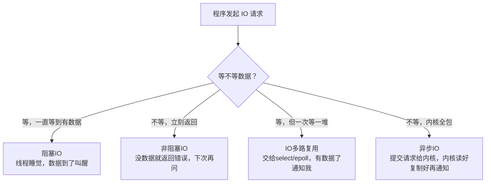
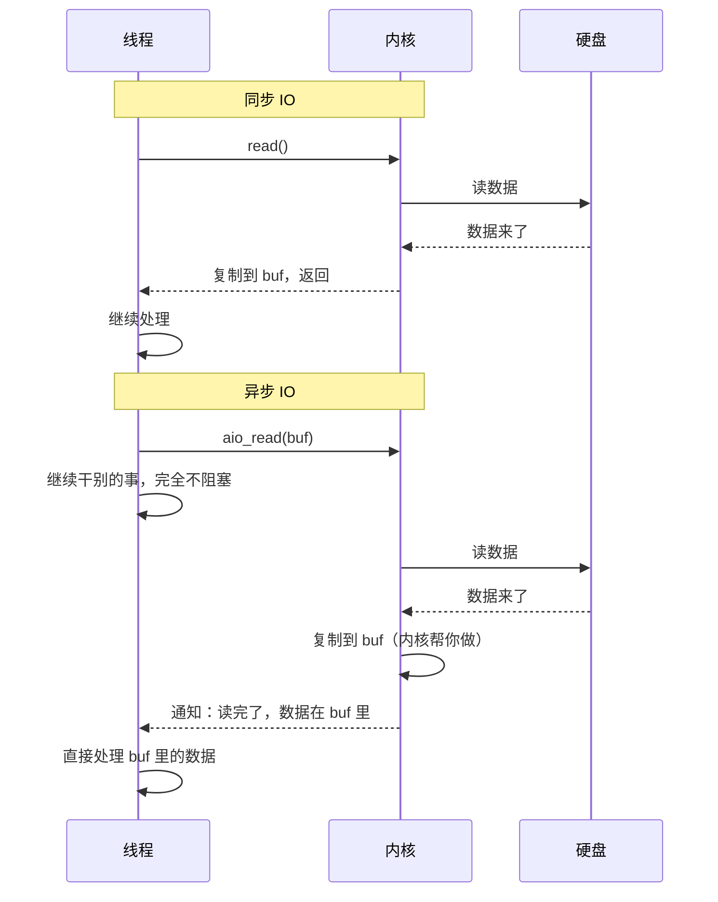

# IO 模型：阻塞 / 非阻塞 / 多路复用 / 异步

> **一句话**：程序要读数据，数据还没到的时候，程序该怎么办？四种 IO 模型就是四种"等数据"的策略。

>

> **先搞清楚"谁在等"**：发起 IO 调用的是线程（`sock.recv()` 在哪个线程里调，就是那个线程在等）。早期注记习惯写"进程"是因为一个进程只有一个线程的时代。以下用**线程**指代"发起 IO 调用的执行实体"。

## 一、四种 IO 模型一览



| 模型 | 等的时候在干嘛 | 谁等的 | 效率 |
| ------ | -------------- | -------- | ------ |
| **阻塞 IO** | 线程睡觉，不占 CPU | 线程自己 | 低 |
| **非阻塞 IO** | 不断问"好了没"，占 CPU | 线程自己 | 中（浪费 CPU） |
| **IO 多路复用** | 一个线程等一堆 IO，哪个好了处理哪个 | 专门的线程 | 高 |
| **异步 IO** | 说一声就不管了，内核做完通知 | 内核 | 最高 |

### 2. 非阻塞 IO——"不断问"但没人这么用

#### 教科书定义

```python
sock.setblocking(False)

while True:

    data = sock.recv(1024)

    if data:

        process(data)

        break

    else:

        # 没数据，过一会儿再问

        time.sleep(0.1)
```

```text
recv() 非阻塞模式：

  → 没数据？立刻返回 EAGAIN

  → 你的程序继续跑，过一会儿再问

  → 有数据了？recv() 返回数据
```

#### 生活类比

```text
你在奶茶店点了一杯奶茶：

阻塞 IO = 站在柜台前干等

非阻塞 = 坐在座位上，每 10 秒去问一次"好了没？"

        大部分时候回答"还没"
```

#### ⚠️ 核心理解：非阻塞 IO 不是独立模型

```text
教科书说非阻塞 IO 的卖点：

  "一个线程可以轮询多个 fd，不用等"

但实际生产没人这么干——自己轮询是在浪费 CPU。

非阻塞的真正角色是给 IO 多路复用（epoll）当**工具人**：

epoll_wait 告诉你"fd3 有数据了"

你去 read(fd3) —— 这部分必须是**非阻塞**的

为什么？因为你以为有 10KB，实际只来了 4KB

  阻塞 read → 读完 4KB 再读 → 卡死

  非阻塞 read → 读完了返回 EAGAIN → 你知道了，等下一轮 epoll 通知

一句话：非阻塞 IO 自己出不了头。

但多路复用的 LT 和 ET 全靠它吃饭。
```

### 4. 异步 IO（Asynchronous IO）——"说一声，内核帮你全搞定" ⭐最高级

#### 和前面三种的本质区别

```text
前面的三种模型 —— 同步 IO：

阻塞 IO：      线程等

非阻塞 IO：    线程问

IO 多路复用：  线程让内核盯着，然后线程等通知

共同点：数据从内核复制到用户 buf 这一步，还是线程自己做的。

异步 IO：

  你告诉内核："帮我读这个文件，数据放到 buf 里，读完了叫我"

  然后你什么都不用管——内核帮你读、帮你复制到 buf

  全部搞定了才通知你
```



#### 生活类比

```text
同步 IO（阻塞/非阻塞/多路复用）：

  你叫外卖（发 IO 请求）

  外卖到了你去门口拿（自己从内核复制数据到 buf）

  外卖在门口，你不去拿它就在门口放着

异步 IO：

  你叫外卖（发 IO 请求）

  外卖到了，外卖小哥直接帮你摆桌上（内核帮你复制到 buf）

  然后叫你："饭好了，直接吃！"

  你从桌上直接开吃（直接读 buf）
```

#### 异步 IO 的实现

```text
Linux：aio_read() / io_uring（最新、最强）

Windows：IOCP

macOS：Kqueue 可以做到类似效果
```

#### 优点 vs 缺点

| 优点 | 缺点 |
| ------ | ------ |
| 效率最高——完全不阻塞线程 | 编程复杂 |
| 一个线程可以发起大量 IO | 调试困难 |
| 内核帮你做了复制的工作 | 有些操作系统支持不好 |

## 二、你在实际项目里用的是哪个

```text
你在 FastAPI 里写的 async/await：

async def read_file():

    data = await aio_read("test.txt")

    # 看起来像是异步 IO

    # 但实际上是 IO 多路复用
```

### Python asyncio 是第几种？

```text
Python asyncio 底层用的是 IO 多路复用（epoll/select）

不是异步 IO。

为什么？

  Python 的 aio_read() 实际上：

  ① 把 fd 交给事件循环（epoll 监控）

  ② 事件循环阻塞在 epoll 上

  ③ epoll 说"有数据了"

  ④ 事件循环把数据从内核复制到 buf

  ⑤ 恢复协程执行

数据复制这一步还是事件循环做的——所以是"同步 IO 多路复用"。
```

```text
真正的异步 IO（io_uring）：

  ① 提交 IO 请求到内核队列

  ② 你的协程继续执行

  ③ 内核自己读数据、自己复制到 buf

  ④ 内核把完成的请求放到完成队列

  ⑤ 你的协程从队列里拿结果
```

## 三、记忆口诀

```text
阻塞 IO 最简单——一个线程一个 IO，并发高了完蛋

非阻塞 IO 来回问——浪费 CPU，写起来麻烦

多路复用 epoll——一个线程监控全部，高并发首选

异步 IO 最牛逼——交给内核全搞定，Linux 用 io_uring
```

---

**总结**：四种 IO 模型的核心区别在"数据没到的时候，线程干嘛"和"数据复制这一步谁做"。阻塞最简单、多路复用最常用（epoll 就是干这个的）、异步 IO 最高级。

## 相关链接

- 📋 目录：[[00-操作系统]]

- 📚 学习清单：[[八股文学习清单]]

- 🔗 [[14-IO多路复用select_poll_epoll|14 IO多路复用select_poll_epoll]]
- 🔗 [[15-epoll详解|15 epoll详解]]
- 🔗 [[16-阻塞与非阻塞与多路复用|16 阻塞与非阻塞与多路复用]]
- 🔗 [[八股文笔记/Python/00-Python|Python八股文]]
- 🔗 [[八股文笔记/React-TS-JS/00-React-TS-JS|React-TS-JS八股文]]
- 🔗 [[八股文笔记/MySQL/00-MySQL|MySQL八股文]]

