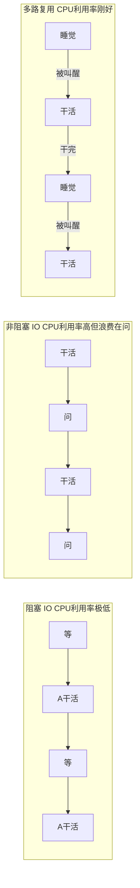

## 先搞懂三个概念——阻塞、非阻塞、多路复用的区别

> 一个可能的问题是："阻塞 IO 和非阻塞 IO 有什么区别？IO 多路复用又是什么？"——三句话 + 一张图说清。

### 三者的核心区别——用"等快递"一次讲透


### 代码层面——三种模式各长什么样

```python
"""

三种 IO 模式用伪代码对比——看完就知道为什么多路复用是最优解。

"""

# ===== 阻塞 IO =====

# 问题：一个线程只能处理一个连接

def server_blocking():

    while True:

        client = accept()          # 卡住！等人连接

        data = recv(client)        # 卡住！等客户端发数据

        send(client, b"ok")        # 可能卡住！

# ===== 非阻塞 IO =====

# 问题：虽然不卡了，但需要不断轮询——白白浪费 CPU

def server_nonblocking():

    clients = []

    while True:

        new_client = accept_nonblocking()  # 不卡！没连接就返回 None

        if new_client:

            clients.append(new_client)

        for c in clients:                   # 要挨个问！

            data = recv_nonblocking(c)      # 不卡！没数据就返回 None

            if data:

                handle(data)

        # CPU 一直在跑这个 while True 循环——即使什么连接都没有

        # → CPU 空转，浪费电

# ===== IO 多路复用 =====

# epoll 帮你盯着所有连接——谁有数据了就通知你，你只处理有数据的

def server_multiplexing():

    epoll = create_epoll()          # 创建一个 epoll 实例（前台）

    server_fd = create_server()

    epoll.add(server_fd, READ)      # 告诉 epoll："帮我盯着 server，有人连就告诉我"

    clients = {}

    while True:

        events = epoll.wait()       # 🔴 卡住！但这里卡住是对的——

                                    #    没有事件时线程睡眠，不浪费 CPU

                                    #    有事件时立即返回——只返回就绪的 fd

        for fd, event in events:    # 只处理就绪的！不用挨个问！

            if fd == server_fd:

                client = accept()           # 有新连接

                epoll.add(client, READ)     # 也交给 epoll 盯着

                clients[client] = True

            else:

                data = recv(fd)             # 有数据到了

                if data:

                    handle(data)

                else:

                    # 客户端断开连接

                    epoll.remove(fd)

                    del clients[fd]
```

### 一张图总结三者的 CPU 利用率



---

## 相关链接

- 📋 目录：[[00-操作系统]]

- 📚 学习清单：[[八股文学习清单]]

- 🔗 [[13-IO模型四种|13 IO模型四种]]
- 🔗 [[14-IO多路复用select_poll_epoll|14 IO多路复用select_poll_epoll]]
- 🔗 [[15-epoll详解|15 epoll详解]]
- 🔗 [[八股文笔记/Python/00-Python|Python八股文]]
- 🔗 [[八股文笔记/React-TS-JS/00-React-TS-JS|React-TS-JS八股文]]
- 🔗 [[八股文笔记/MySQL/00-MySQL|MySQL八股文]]

