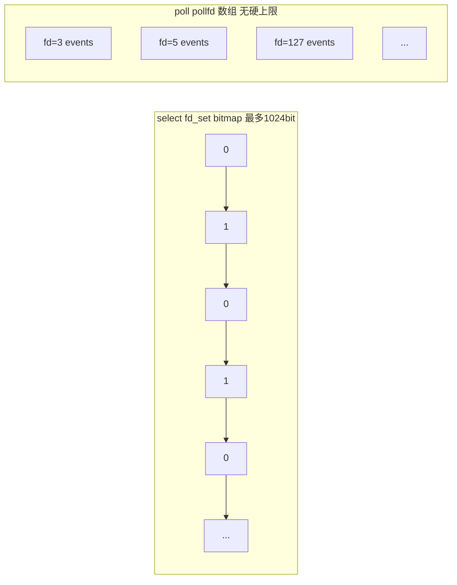

# 18-poll详解
## poll——去掉 1024 上限，但本质没变

### poll 做了什么改进

poll 和 select 几乎一样，只改了一个东西——换了个数据结构。

- **select：** 用 fd_set（固定大小的 bitmap，最大 1024）
- **poll：** 用 pollfd 结构体数组（链表式，没上限）

**改进细节：**
1. 没了 1024 上限——用多少设多少
2. pollfd 结构里 events（输入：我关心什么事件）和 revents（输出：实际发生了什么事件）分开了——不用像 select 那样每次重新填整个集合

### poll 没有改进什么——还是要遍历

poll 的两个"没变"，让它依然不适合大并发场景：

1. 每次调用 poll——内核还是要把整个 pollfd 数组遍历一遍（O(n)）。10000 个连接 → 每次 poll 内核扫 10000 个 → 只有 3 个就绪 → 白扫 9997 个

2. poll 返回后——你还是得遍历整个 pollfd 数组，挨个检查 revents（O(n)）。内核只告诉你"整个数组里有些事情发生了"，不说具体是谁 → 你还是得从头到尾扫一遍

select 和 poll 的本质是一样的——都是"轮询式"的：每次都把所有 fd 交给内核 → 内核全扫一遍 → 返回 → 你再全扫一遍。活跃的 fd 越少，浪费的比例越大。

### select vs poll 速记

| | select | poll |
| :--- | :--- | :--- |
| 数据结构 | fd_set (bitmap) | pollfd 数组 |
| fd 上限 | 1024（默认） | 无上限 |
| 内核扫描方式 | O(n) 遍历 | O(n) 遍历 |
| 返回后定位就绪 fd | O(n) 遍历，用 FD_ISSET | O(n) 遍历，检查 revents |
| 每次需要重传 | 是（fd_set 被修改） | 不需要（events 和 revents 分离） |
| 现状 | 基本被淘汰 | 少量遗留系统在用 |

---

## 相关链接

- 📋 目录：[[00-操作系统]]

- 📚 学习清单：[[八股文学习清单]]

- 🔗 [[14-IO多路复用select_poll_epoll|14 IO多路复用select_poll_epoll]]
- 🔗 [[15-epoll详解|15 epoll详解]]
- 🔗 [[17-select详解|17 select详解]]
- 🔗 [[八股文笔记/Python/00-Python|Python八股文]]
- 🔗 [[八股文笔记/React-TS-JS/00-React-TS-JS|React-TS-JS八股文]]
- 🔗 [[八股文笔记/MySQL/00-MySQL|MySQL八股文]]

